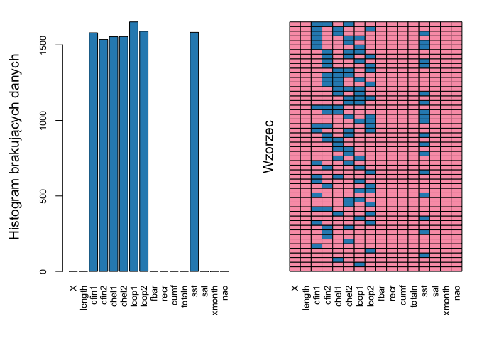
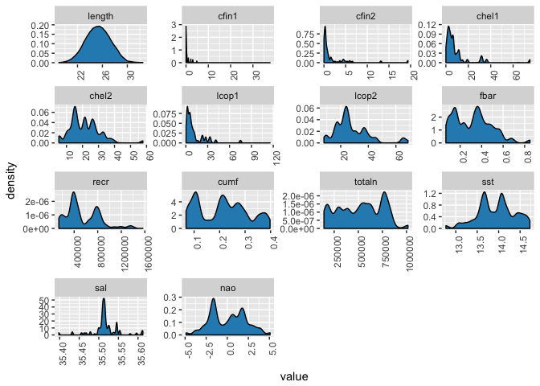
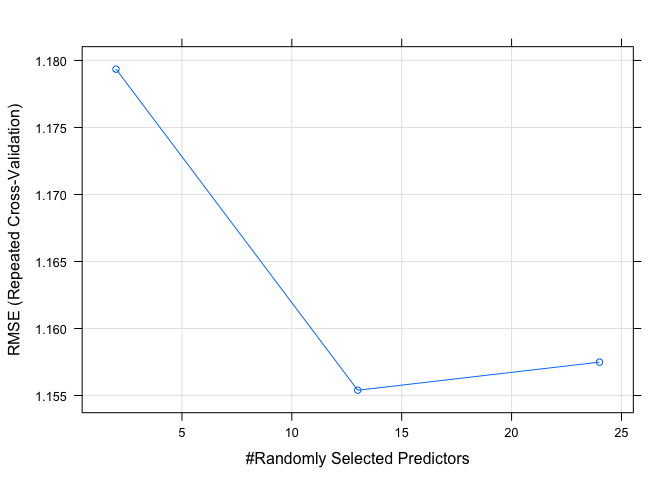
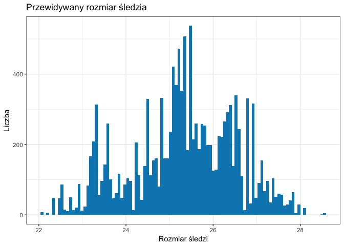
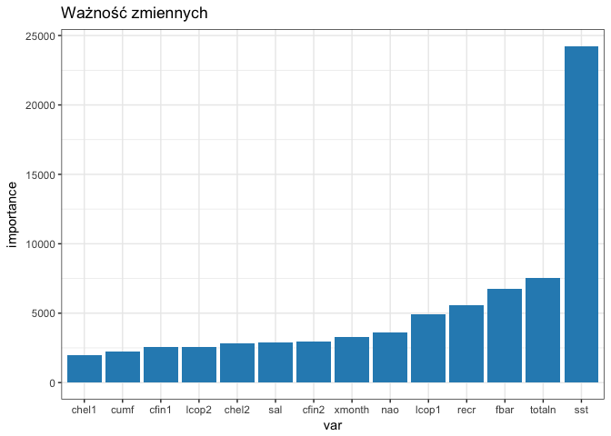
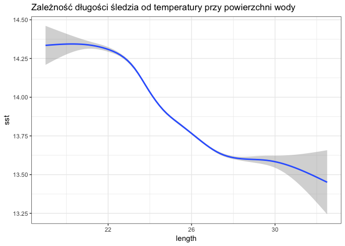
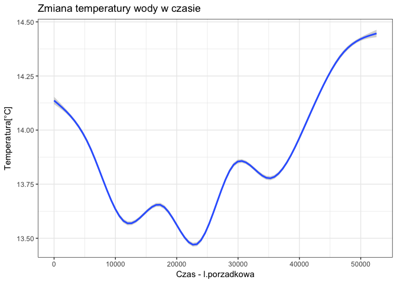
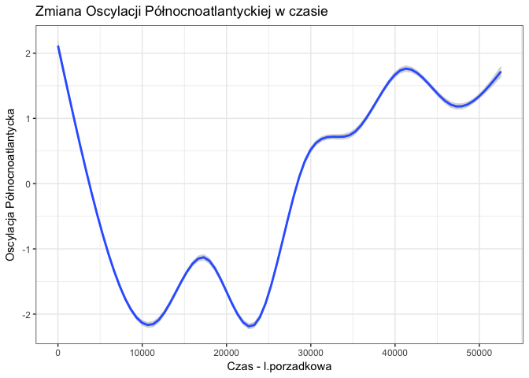

# Herring Analysis
Maciej Tomczyk  
`r format(Sys.time(), '%d %B, %Y')`  


# Cel
Celem projektu jest określenie jakie mogą być główne przyczyny stopniowego zmniejszania się długości śledzi oceanicznych wyławianych w Europie.

Zbiór danych zostanie wczytany z pliku CSV, następnie musi zostać poddany wstępnemu oczyszczaniu.
# Opis zbioru danych
Analiza dotyczy zbióru danych na temat połowu śledzia oceanicznego w Europie. Do analizy zebrano pomiary śledzi i warunków w jakich żyją z ostatnich 60 lat. Dane były pobierane z połowów komercyjnych jednostek. W ramach połowu jednej jednostki losowo wybierano od 50 do 100 sztuk trzyletnich śledzi.

Poniżej znajdują się szczegółowe opisy konkretnych atrybutów:

| Nazwa kolumny |                     Opis                     |             Dodatkowa Informacja            |
|:-------------:|:--------------------------------------------:|:-------------------------------------------:|
|     length    |          długość złowionego śledzia          |                     [cm]                    |
|     cfin1     |             dostępność planktonu             |  [zagęszczenie Calanus finmarchicus gat. 1] |
|     cfin2     |             dostępność planktonu             |  [zagęszczenie Calanus finmarchicus gat. 2] |
|     chel1     |             dostępność planktonu             | [zagęszczenie Calanus helgolandicus gat. 1] |
|     chel2     |             dostępność planktonu             | [zagęszczenie Calanus helgolandicus gat. 2] |
|     lcop1     |             dostępność planktonu             |       [zagęszczenie widłonogów gat. 1]      |
|     lcop2     |             dostępność planktonu             |       [zagęszczenie widłonogów gat. 2]      |
|      fbar     |         natężenie połowów w regionie         |       [ułamek pozostawionego narybku]       |
|      recr     |                roczny narybek                |               [liczba śledzi]               |
|      cumf     |  łączne roczne natężenie połowów w regionie  |       [ułamek pozostawionego narybku]       |
|     totaln    | łączna liczba ryb złowionych w ramach połowu |               [liczba śledzi]               |
|      sst      |       temperatura przy powierzchni wody      |                     [°C]                    |
|      sal      |             poziom zasolenia wody            |                [Knudsen ppt]                |
|     xmonth    |                miesiąc połowu                |               [numer miesiąca]              |
|      nao      |         oscylacja północnoatlantycka         |                     [mb]                    |

# Wykorzystane biblioteki

```r
library(knitr)
library(ggplot2)
library(polycor)
library(heatmaply)
library(tidyr)
library(plotly)
library(VIM)
library(caret)
library(klaR)
library(dplyr)
```

# Powtwarzalne wyniki

```r
set.seed(23)
```

# Oczyszczenie danych
## Wczytanie danych z pliku CSV

```r
raw_data <- read.csv(file= "sledzie.csv", header= TRUE, sep= ",", na.strings= "?")
```

## Podstawowa analiza arybutów

```r
str(raw_data)
```

```
## 'data.frame':	52582 obs. of  16 variables:
##  $ X     : int  0 1 2 3 4 5 6 7 8 9 ...
##  $ length: num  23 22.5 25 25.5 24 22 24 23.5 22.5 22.5 ...
##  $ cfin1 : num  0.0278 0.0278 0.0278 0.0278 0.0278 ...
##  $ cfin2 : num  0.278 0.278 0.278 0.278 0.278 ...
##  $ chel1 : num  2.47 2.47 2.47 2.47 2.47 ...
##  $ chel2 : num  NA 21.4 21.4 21.4 21.4 ...
##  $ lcop1 : num  2.55 2.55 2.55 2.55 2.55 ...
##  $ lcop2 : num  26.4 26.4 26.4 26.4 26.4 ...
##  $ fbar  : num  0.356 0.356 0.356 0.356 0.356 0.356 0.356 0.356 0.356 0.356 ...
##  $ recr  : int  482831 482831 482831 482831 482831 482831 482831 482831 482831 482831 ...
##  $ cumf  : num  0.306 0.306 0.306 0.306 0.306 ...
##  $ totaln: num  267381 267381 267381 267381 267381 ...
##  $ sst   : num  14.3 14.3 14.3 14.3 14.3 ...
##  $ sal   : num  35.5 35.5 35.5 35.5 35.5 ...
##  $ xmonth: int  7 7 7 7 7 7 7 7 7 7 ...
##  $ nao   : num  2.8 2.8 2.8 2.8 2.8 2.8 2.8 2.8 2.8 2.8 ...
```
Zbiór zawiera 52582 rekordów rozmieszczonych w 16 kolumnach (z czego jedna jest kolumną porządkową).

## Zmiana kolumn
Zmienna _xmonth_, która reprezentuje miesiąc połowu powinna zostać zamieniona z ciągłej na kategoryczną, by nie traktować jej jako liczbę. Zmienna _totaln_, która reprezentuje łączną liczbę ryb złowionych, powinna zostać zmieniona na całkowitą.


```r
raw_data <- raw_data %>% 
  mutate(xmonth= as.factor(xmonth), totaln= round(totaln), totaln= as.integer(totaln))
```

## Problem pustych danych

```r
#Puste dane liczbowo na kolumnę
apply(raw_data, 2, function(x){ sum(is.na(x)) })
```

```
##      X length  cfin1  cfin2  chel1  chel2  lcop1  lcop2   fbar   recr 
##      0      0   1581   1536   1555   1556   1653   1591      0      0 
##   cumf totaln    sst    sal xmonth    nao 
##      0      0   1584      0      0      0
```

```r
#Puste dane procentowo na kolumnę
apply(raw_data, 2, function(x){ sum(is.na(x)) / length(x) })
```

```
##          X     length      cfin1      cfin2      chel1      chel2 
## 0.00000000 0.00000000 0.03006732 0.02921152 0.02957286 0.02959188 
##      lcop1      lcop2       fbar       recr       cumf     totaln 
## 0.03143661 0.03025750 0.00000000 0.00000000 0.00000000 0.00000000 
##        sst        sal     xmonth        nao 
## 0.03012438 0.00000000 0.00000000 0.00000000
```

Zbiór zawiera również wartości puste - te pojawiają się głównie w kolumnach z informacją o dostępności planktonu oraz temperaturze przy powierzchni wody.


```r
aggr(raw_data, plot= TRUE, 
     col= c('#fa9fb5', '#2b8cbe'), 
     numbers= TRUE, 
     prop= FALSE, 
     bars= FALSE, 
     labels= names(raw_data), 
     cex.axis= 0.8, 
     ylab=c("Histogram brakujących danych","Wzorzec"))
```

<!-- -->

Jak zobrazowano na wykresie powyżej, rozkład wartości pustych w kolumnach:

* cfin1 - dostępność planktonu -	skupisko Calanus finmarchicus gat. 1
* cfin2 - dostępność planktonu - skupisko Calanus finmarchicus gat. 2
* chel1 - dostępność planktonu - skupisko Calanus helgolandicus gat. 1
* chel2 - dostępność planktonu - skupisko Calanus helgolandicus gat. 2
* lcop1	- dostępność planktonu - skupisko widłonogów gat. 1
* lcop2	- dostępność planktonu - skupisko widłonogów gat. 2
* sst - temperatura przy powierzchni wody	stopnie °C

Usuwając wiersze z wartością NA, utracilibyśby stosunkowo dużo danych - lepszym pomysłem jest zastąpienie wartości brakującej średnią z konkretnego połowu. Bazując na fakcie, iż kolumny totaln, xmonth, nao definiują konkretny połów oraz nie zawierają one żadnych wartości pustych, posłużą one do grupowania. Dane zostały zgrupowane względem połowów, a następnie wartości puste zostały zamienione na średnią z tych połowów.


```r
data <- raw_data %>%
  group_by(totaln, xmonth, nao) %>%
  mutate_each(funs(replace(., which(is.na(.)),
                                mean(., na.rm=TRUE))))
```

## Problem duplikatów

```r
no_x <- data %>% select(-X)
sum(duplicated(no_x))
```

```
## [1] 45694
```

Możemy zaobserwować, iż 45694 rekordów to duplikaty. Pojawiają się one wewnątrz jednego połowu, dlatego usunięcie ich nie wpłynie negatywnie, ani nie sfałszuje danych. Dla uproszczenia grafów oraz dalszych obliczeń, wszystkie duplikaty zostały usunięte, tym samym zbiór danych uszczuplił się do 6888 rekordów.


```r
w_duplicates <- unique(no_x[, 1:15])
w_duplicates <- w_duplicates %>% 
  mutate(X = seq_len(n())) %>% 
  select(X, everything())
```

# Statystyki zbioru danych
## Podstawowa analiza arybutów

```r
str(w_duplicates)
```

```
## Classes 'grouped_df', 'tbl_df', 'tbl' and 'data.frame':	6888 obs. of  16 variables:
##  $ X     : int  1 2 3 4 5 6 7 1 2 3 ...
##  $ length: num  23 22.5 25 25.5 24 22 23.5 22.5 22 24.5 ...
##  $ cfin1 : num  0.0278 0.0278 0.0278 0.0278 0.0278 ...
##  $ cfin2 : num  0.278 0.278 0.278 0.278 0.278 ...
##  $ chel1 : num  2.47 2.47 2.47 2.47 2.47 ...
##  $ chel2 : num  21.4 21.4 21.4 21.4 21.4 ...
##  $ lcop1 : num  2.55 2.55 2.55 2.55 2.55 ...
##  $ lcop2 : num  26.4 26.4 26.4 26.4 26.4 ...
##  $ fbar  : num  0.356 0.356 0.356 0.356 0.356 0.356 0.356 0.356 0.356 0.356 ...
##  $ recr  : num  482831 482831 482831 482831 482831 ...
##  $ cumf  : num  0.306 0.306 0.306 0.306 0.306 ...
##  $ totaln: int  267381 267381 267381 267381 267381 267381 267381 267381 267381 267381 ...
##  $ sst   : num  14.3 14.3 14.3 14.3 14.3 ...
##  $ sal   : num  35.5 35.5 35.5 35.5 35.5 ...
##  $ xmonth: Factor w/ 12 levels "1","2","3","4",..: 7 7 7 7 7 7 7 6 6 6 ...
##  $ nao   : num  2.8 2.8 2.8 2.8 2.8 2.8 2.8 2.8 2.8 2.8 ...
##  - attr(*, "vars")=List of 3
##   ..$ : symbol totaln
##   ..$ : symbol xmonth
##   ..$ : symbol nao
##  - attr(*, "labels")='data.frame':	551 obs. of  3 variables:
##   ..$ totaln: int  144137 144137 144137 144137 144137 144137 144137 144137 144137 147332 ...
##   ..$ xmonth: Factor w/ 12 levels "1","2","3","4",..: 2 3 4 5 6 7 8 9 10 2 ...
##   ..$ nao   : num  0.17 0.17 0.17 0.17 0.17 0.17 0.17 0.17 0.17 2.52 ...
##   ..- attr(*, "vars")=List of 3
##   .. ..$ : symbol totaln
##   .. ..$ : symbol xmonth
##   .. ..$ : symbol nao
##   ..- attr(*, "drop")= logi TRUE
##  - attr(*, "indices")=List of 551
##   ..$ : int  3403 3404 3405 3406 3407 3408 3816 3831 3879 3920 ...
##   ..$ : int  3398 3399 3400 3401 3402
##   ..$ : int  3412 3413 3414 3415 3416 3417 3914 3929 4134 4135 ...
##   ..$ : int  3827 3828 3829 3830 3881 3963 3964 3965 3966 3983
##   ..$ : int  3334 3759 3760 3780 3781 3782 3787 3788 3794 3795 ...
##   ..$ : int  3348 3754 3755 3766 3767 3768 3785 3786 3820 3877
##   ..$ : int  3778 3779 3783 3784 3791 3792 3793 3813 3814 3815 ...
##   ..$ : int  3335 3336 3346 3347 3874 3875 3876 3878 3880
##   ..$ : int  3409 3410 3411 3427 3428 3429 3430
##   ..$ : int  2900 2901 2904 2905 2906 2907 2936 2937
##   ..$ : int  2888 2889 2890 2891 2892 2893 2894 2895 2899 3951 ...
##   ..$ : int  3977 3978
##   ..$ : int  2838 2839 2840 2841 2842 2852 2853 2873 2898 2902 ...
##   ..$ : int  2819 2820 2832 2833 2834 2835 2836 2837 2908 2909 ...
##   ..$ : int  2823 2824 2825 2826 2876 2877 2880 2881 2882 2883 ...
##   ..$ : int  3987 3988 4009 4129 4174
##   ..$ : int  3900 3901 3902 3903 3904 3905 3906
##   ..$ : int  2996 3018 3019 3020 3021 3022 3023 3854 3855 3857 ...
##   ..$ : int  3087 3089 3090 3091 3092
##   ..$ : int  3096 3097 3098 3099 3100 3102 3103 3104 3105 3106 ...
##   ..$ : int  3138 3139 3140 3141 3142 3143 3832 3833 3835 3899
##   ..$ : int  3028 3029 3030 3031 3032 3033 3062 3848 3849 3850
##   ..$ : int  3063 3064 3065 3066 3073 3074 3075 3079 3080 3081 ...
##   ..$ : int  3024 3025 3026 3027 3055 3056 3057 3058 3083 3084 ...
##   ..$ : int  3059 3060 3061 3070 3071 3072 3076 3077 3078 3088 ...
##   ..$ : int  3093 3124 3125 3126 3144 3145 3146 3147 3237 3345 ...
##   ..$ : int  3907 3908 3909 3910 3911 3930 3931 3932 3933 3934 ...
##   ..$ : int  2854 2855 2856 2857 2858 2859 2946 2947
##   ..$ : int  3680 3683 3684
##   ..$ : int  2948 2949 2950 2951 3957 3958 3959 3972
##   ..$ : int  5673 5674 5680 5681 5682 5683
##   ..$ : int  3821 3822 3823 3824 3825 3826 3967 3985
##   ..$ : int  2926 2927 2928 3682 3953 3954 3955 3956 3969 3970
##   ..$ : int  2930 3685 3686 3687 3694 3695 4091 4127
##   ..$ : int 3986
##   ..$ : int  4052 4074 4075 4076 4077
##   ..$ : int  3042 3043 3044 3045 3046 3047 3048 3049 3069
##   ..$ : int  3067 3068 3086
##   ..$ : int  4036 4037
##   ..$ : int  2963 2988 2989 2990 2991 2992 2993 2994 2995 3971 ...
##   ..$ : int  3975 3976 4010 4023 4024
##   ..$ : int  2939 2940 2941 2942 2943 2944 2945 2982 3950 3990
##   ..$ : int  2956 2957 2958 2959 2960 2961 2962 2983
##   ..$ : int  2984 2985 2986 2987 3001 3002 3003 3004 3005 3006
##   ..$ : int  3128 3129 3130 3131 3132 3133 3134 3135 3688 3837 ...
##   ..$ : int  3034 3035 3036 3037 3038 3039 3040 3041 3711 3712 ...
##   ..$ : int  3852 3853 3937 3938 3939 3940 3960 3961
##   ..$ : int  3165 3293 3294 3295 3296 3297 4045 4046 4047 4048
##   ..$ : int  3179 3180 3181 3182 3183 3203 3222 3223 3224 3229 ...
##   ..$ : int  3386 3387 3388 3389 3391 3392 3393 3394 3395
##   ..$ : int  3315 3316 3317 3318 3319 3320 3321 3322 3609
##   ..$ : int  3238 3239 3240 3241 3242 3243 3244 3360 3361 3521 ...
##   ..$ : int  3362 3363 3364 3365 3366 3384 3385 3843 3844 3851 ...
##   ..$ : int  3161 3162 3163 3164 3167 3175 3176 3177 3178 3184 ...
##   ..$ : int  3189 3190 3191 3192 3193 3194 3195 3202 4011 4012
##   ..$ : int  3566 3567 3568 3569 3570 3571 3572 3573
##   ..$ : int  3185 3186 3187 3188 3196 3197 3198 3199 3200 3201 ...
##   ..$ : int  3369 3370 3371 3372 3373 3374 3375 3376 3377 3378 ...
##   ..$ : int  4004 4005 4006 4007 4008 4014
##   ..$ : int  4042 4043 4044 4067 4068 4069 4070 4071 4072
##   ..$ : int  4131 4172 4173 4275
##   ..$ : int  4099 4100 4107 4108 4120 4121 4122 4123 4124 4133
##   ..$ : int  4094 4095 4096 4097 4101 4102 4103 4104 4105 4106 ...
##   ..$ : int  4199 4335 4336 4337 4835 4836 4837 4846 4847
##   ..$ : int  4049 4050 4603 4604 4605 4624 4625 5203 5211 5212 ...
##   ..$ : int  4112 4113 4114 4115 4116 4117 4118 4119 4125 4126 ...
##   ..$ : int  4850 4851 4852 4853 4854 4855 4856 4857 4879
##   ..$ : int  4715 4716 4717 4718 4719 4720 4721 4725 4726 5072
##   ..$ : int  4690 4691 4692 4693 4694 4695 4696 4796 4800
##   ..$ : int  4161 4162 4163 4164 4829 4830 4831 4832 5197 5198 ...
##   ..$ : int  4026 4027 4028
##   ..$ : int  1129 1130 4196 4197 4198
##   ..$ : int  6878 6884 6885 6886
##   ..$ : int  415 416 426 427 428
##   ..$ : int  360 361 362 392 429 629 630 701 702 715 ...
##   ..$ : int  76 77 78 79 85 151 1391 1537
##   ..$ : int  1538 1539 4018 4019 4020 4021 4022 4289 4601 4602
##   ..$ : int  3947 3948 3968 4015 4017 4033 4051 4175 4178 4179 ...
##   ..$ : int  1147 1148 1149 1150 1151 4177
##   ..$ : int  1105 1106 1107 1108 1109 1110 1111 1112 4013 4016
##   ..$ : int  4057 4058 4059 4060 4061 4062 4063 4064 4065 4066
##   ..$ : int  1131 4029 4030 4031 4176 4181 4182
##   ..$ : int  3979 3980 3981 3982 3989
##   ..$ : int  2789 2790 2791 2792 2885 2886 2887 3597 3598
##   ..$ : int  3799 3800 3801 3802 3803 3804 3811 3812
##   ..$ : int  2829 2830 2831 2844 2845 2846 3923 3924 3925 4157 ...
##   ..$ : int  3927 3928 4109 4110 4111 4132
##   ..$ : int  2745 2746 2747 2748 2749 2750 2788 3915 3919 3962 ...
##   ..$ : int  2763 2764 2765 2766 2767 2768 2769 3127 3158 3159 ...
##   ..$ : int  2847 2848 2849 2850 2851 2869 2870 2871 2872 2896 ...
##   ..$ : int  2724 2725 2739 2740 2741 2742 2743 2744 3599
##   ..$ : int  2751 2752 2753 2756 2757
##   ..$ : int  3668 3669 3670 3671 3672 3673 3674 3675 3676
##   ..$ : int  3525 3526 3527 3528 3529 3530 3531 3533 3564 4000 ...
##   ..$ : int  3349 3350 3351 3352 3353 3354 3355 3891 3892 3893 ...
##   ..$ : int  3513 3514 3515 3516 3517 3518 3519 3520
##   ..$ : int  3534 3535 3536 3537 3538 3539 3560 3561 3562 3563 ...
##   ..$ : int  3418 3419 3420 3421 3422 3423 3424 3425 3426 3433 ...
##   ..$ : int  3805 3806 3807 3808 3809 3810 3817 3818 3868 3869
##   .. [list output truncated]
##  - attr(*, "drop")= logi TRUE
##  - attr(*, "group_sizes")= int  11 5 11 10 18 10 14 9 7 8 ...
##  - attr(*, "biggest_group_size")= int 186
```

Zbiór danych po oczyszczaniu zmniejszył się do 6888 wierszy, liczba kolumn pozostała niezmieniona i wynosi 16.
## Analiza arybutów

```r
knitr::kable(summary(w_duplicates))
```

           X              length          cfin1              cfin2             chel1            chel2            lcop1              lcop2             fbar             recr              cumf             totaln             sst             sal            xmonth          nao         
---  ---------------  --------------  -----------------  ----------------  ---------------  ---------------  -----------------  ---------------  ---------------  ----------------  ----------------  ----------------  --------------  --------------  -------------  -----------------
     Min.   :  1.00   Min.   :19.00   Min.   : 0.00000   Min.   : 0.0000   Min.   : 0.000   Min.   : 5.238   Min.   :  0.3074   Min.   : 7.849   Min.   :0.0680   Min.   : 140515   Min.   :0.06833   Min.   : 144137   Min.   :12.77   Min.   :35.40   8      : 879   Min.   :-4.89000 
     1st Qu.:  4.00   1st Qu.:24.00   1st Qu.: 0.02778   1st Qu.: 0.2500   1st Qu.: 2.469   1st Qu.:15.030   1st Qu.:  2.5479   1st Qu.:20.094   1st Qu.:0.1580   1st Qu.: 364794   1st Qu.:0.11008   1st Qu.: 307276   1st Qu.:13.64   1st Qu.:35.51   10     : 879   1st Qu.:-1.69000 
     Median :  7.00   Median :25.50   Median : 0.14158   Median : 0.3714   Median : 4.811   Median :21.435   Median :  5.9167   Median :24.859   Median :0.3320   Median : 459347   Median :0.21476   Median : 539558   Median :13.98   Median :35.51   7      : 747   Median : 0.20000 
     Mean   : 15.72   Mean   :25.32   Mean   : 0.55913   Mean   : 1.7403   Mean   : 8.801   Mean   :21.157   Mean   : 11.3557   Mean   :27.683   Mean   :0.3202   Mean   : 543028   Mean   :0.21417   Mean   : 523418   Mean   :13.94   Mean   :35.52   9      : 680   Mean   : 0.08938 
     3rd Qu.: 12.00   3rd Qu.:26.50   3rd Qu.: 0.36032   3rd Qu.: 1.5701   3rd Qu.: 9.667   3rd Qu.:26.324   3rd Qu.: 12.4959   3rd Qu.:35.153   3rd Qu.:0.4250   3rd Qu.: 774993   3rd Qu.:0.28116   3rd Qu.: 763083   3rd Qu.:14.21   3rd Qu.:35.52   6      : 559   3rd Qu.: 1.80000 
     Max.   :186.00   Max.   :32.50   Max.   :37.66667   Max.   :19.3958   Max.   :75.000   Max.   :57.706   Max.   :115.5833   Max.   :68.736   Max.   :0.8490   Max.   :1565890   Max.   :0.39801   Max.   :1015595   Max.   :14.73   Max.   :35.61   5      : 521   Max.   : 5.08000 
     NA               NA              NA                 NA                NA               NA               NA                 NA               NA               NA                NA                NA                NA              NA              (Other):2623   NA               

## Rozklad wartosci

```r
data_dist <- w_duplicates %>% 
  select(-X) %>% 
  melt

ggplot(data_dist, aes(x= value)) + 
  geom_density(fill= "#2b8cbe") + 
  facet_wrap(~variable, scales= "free") +
  theme(axis.text.x = element_text(angle = 90, hjust = 1))
```

<!-- -->

Zmienne, poza _length_, nie mają rozkładu normalnego.

# Korelacja zmiennych

```r
heatmaply(hetcor(as.data.frame(w_duplicates)), k_col = 2, k_row = 3)
```

<!--html_preserve--><div id="htmlwidget-933954b5d16cf6fad7ff" style="width:672px;height:480px;" class="plotly html-widget"></div>
<script type="application/json" data-for="htmlwidget-933954b5d16cf6fad7ff">{"x":{"data":[{"x":[8.6875,12.0625,null,12.0625,12.0625,null,12.0625,10.5,null,10.5,10.5,null,10.5,10,null,10,10,null,10.5,11,null,11,11,null,12.0625,13.625,null,13.625,13.625,null,13.625,12.5,null,12.5,12.5,null,12.5,12,null,12,12,null,12.5,13,null,13,13,null,13.625,14.75,null,14.75,14.75,null,14.75,14,null,14,14,null,14.75,15.5,null,15.5,15.5,null,15.5,15,null,15,15,null,15.5,16,null,16,16],"y":[3.1316823924042,3.1316823924042,null,3.1316823924042,2.35965199657814,null,2.35965199657814,2.35965199657814,null,2.35965199657814,1.02182900155134,null,1.02182900155134,1.02182900155134,null,1.02182900155134,0,null,1.02182900155134,1.02182900155134,null,1.02182900155134,0,null,2.35965199657814,2.35965199657814,null,2.35965199657814,1.8685794528034,null,1.8685794528034,1.8685794528034,null,1.8685794528034,0.467358355705862,null,0.467358355705862,0.467358355705862,null,0.467358355705862,0,null,0.467358355705862,0.467358355705862,null,0.467358355705862,0,null,1.8685794528034,1.8685794528034,null,1.8685794528034,1.08172542068292,null,1.08172542068292,1.08172542068292,null,1.08172542068292,0,null,1.08172542068292,1.08172542068292,null,1.08172542068292,0.400670640952919,null,0.400670640952919,0.400670640952919,null,0.400670640952919,0,null,0.400670640952919,0.400670640952919,null,0.400670640952919,0],"text":["y: 3.13","y: 3.13",null,"y: 3.13","y: 3.13",null,"y: 2.36","y: 2.36",null,"y: 2.36","y: 2.36",null,"y: 1.02","y: 1.02",null,"y: 1.02","y: 1.02",null,"y: 1.02","y: 1.02",null,"y: 1.02","y: 1.02",null,"y: 2.36","y: 2.36",null,"y: 2.36","y: 2.36",null,"y: 1.87","y: 1.87",null,"y: 1.87","y: 1.87",null,"y: 0.47","y: 0.47",null,"y: 0.47","y: 0.47",null,"y: 0.47","y: 0.47",null,"y: 0.47","y: 0.47",null,"y: 1.87","y: 1.87",null,"y: 1.87","y: 1.87",null,"y: 1.08","y: 1.08",null,"y: 1.08","y: 1.08",null,"y: 1.08","y: 1.08",null,"y: 1.08","y: 1.08",null,"y: 0.4","y: 0.4",null,"y: 0.4","y: 0.4",null,"y: 0.4","y: 0.4",null,"y: 0.4","y: 0.4"],"key":null,"type":"scatter","mode":"lines","name":"(#009681,solid,1)","line":{"width":2.26771653543307,"color":"rgba(0,150,129,1)","dash":"solid"},"hoveron":"points","legendgroup":"(#009681,solid,1)","showlegend":true,"xaxis":"x","yaxis":"y","hoverinfo":"text"},{"x":[8.6875,5.3125,null,5.3125,5.3125,null,5.3125,3.125,null,3.125,3.125,null,3.125,1.75,null,1.75,1.75,null,1.75,1,null,1,1,null,1.75,2.5,null,2.5,2.5,null,2.5,2,null,2,2,null,2.5,3,null,3,3,null,3.125,4.5,null,4.5,4.5,null,4.5,4,null,4,4,null,4.5,5,null,5,5,null,5.3125,7.5,null,7.5,7.5,null,7.5,6.5,null,6.5,6.5,null,6.5,6,null,6,6,null,6.5,7,null,7,7,null,7.5,8.5,null,8.5,8.5,null,8.5,8,null,8,8,null,8.5,9,null,9,9],"y":[3.1316823924042,3.1316823924042,null,3.1316823924042,1.99421268131251,null,1.99421268131251,1.99421268131251,null,1.99421268131251,1.72247275334149,null,1.72247275334149,1.72247275334149,null,1.72247275334149,1.43150666928925,null,1.43150666928925,1.43150666928925,null,1.43150666928925,0,null,1.43150666928925,1.43150666928925,null,1.43150666928925,0.215939500782936,null,0.215939500782936,0.215939500782936,null,0.215939500782936,0,null,0.215939500782936,0.215939500782936,null,0.215939500782936,0,null,1.72247275334149,1.72247275334149,null,1.72247275334149,1.47311249202225,null,1.47311249202225,1.47311249202225,null,1.47311249202225,0,null,1.47311249202225,1.47311249202225,null,1.47311249202225,0,null,1.99421268131251,1.99421268131251,null,1.99421268131251,1.67564496424996,null,1.67564496424996,1.67564496424996,null,1.67564496424996,1.10791956138725,null,1.10791956138725,1.10791956138725,null,1.10791956138725,0,null,1.10791956138725,1.10791956138725,null,1.10791956138725,0,null,1.67564496424996,1.67564496424996,null,1.67564496424996,1.21182018127199,null,1.21182018127199,1.21182018127199,null,1.21182018127199,0,null,1.21182018127199,1.21182018127199,null,1.21182018127199,0],"text":["y: 3.13","y: 3.13",null,"y: 3.13","y: 3.13",null,"y: 1.99","y: 1.99",null,"y: 1.99","y: 1.99",null,"y: 1.72","y: 1.72",null,"y: 1.72","y: 1.72",null,"y: 1.43","y: 1.43",null,"y: 1.43","y: 1.43",null,"y: 1.43","y: 1.43",null,"y: 1.43","y: 1.43",null,"y: 0.22","y: 0.22",null,"y: 0.22","y: 0.22",null,"y: 0.22","y: 0.22",null,"y: 0.22","y: 0.22",null,"y: 1.72","y: 1.72",null,"y: 1.72","y: 1.72",null,"y: 1.47","y: 1.47",null,"y: 1.47","y: 1.47",null,"y: 1.47","y: 1.47",null,"y: 1.47","y: 1.47",null,"y: 1.99","y: 1.99",null,"y: 1.99","y: 1.99",null,"y: 1.68","y: 1.68",null,"y: 1.68","y: 1.68",null,"y: 1.11","y: 1.11",null,"y: 1.11","y: 1.11",null,"y: 1.11","y: 1.11",null,"y: 1.11","y: 1.11",null,"y: 1.68","y: 1.68",null,"y: 1.68","y: 1.68",null,"y: 1.21","y: 1.21",null,"y: 1.21","y: 1.21",null,"y: 1.21","y: 1.21",null,"y: 1.21","y: 1.21"],"key":null,"type":"scatter","mode":"lines","name":"(#CC476B,solid,1)","line":{"width":2.26771653543307,"color":"rgba(204,71,107,1)","dash":"solid"},"hoveron":"points","legendgroup":"(#CC476B,solid,1)","showlegend":true,"xaxis":"x","yaxis":"y","hoverinfo":"text"},{"x":[8.6875,5.3125,3.125,1.75,1,2.5,2,3,4.5,4,5,7.5,6.5,6,7,8.5,8,9,12.0625,10.5,10,11,13.625,12.5,12,13,14.75,14,15.5,15,16],"y":[3.1316823924042,1.99421268131251,1.72247275334149,1.43150666928925,0,0.215939500782936,0,0,1.47311249202225,0,0,1.67564496424996,1.10791956138725,0,0,1.21182018127199,0,0,2.35965199657814,1.02182900155134,0,0,1.8685794528034,0.467358355705862,0,0,1.08172542068292,0,0.400670640952919,0,0],"text":["y: 3.13","y: 1.99","y: 1.72","y: 1.43","y: 0","y: 0.22","y: 0","y: 0","y: 1.47","y: 0","y: 0","y: 1.68","y: 1.11","y: 0","y: 0","y: 1.21","y: 0","y: 0","y: 2.36","y: 1.02","y: 0","y: 0","y: 1.87","y: 0.47","y: 0","y: 0","y: 1.08","y: 0","y: 0.4","y: 0","y: 0"],"key":null,"type":"scatter","mode":"markers","marker":{"autocolorscale":false,"color":"transparent","opacity":1,"size":null,"symbol":null,"line":{"width":1.88976377952756,"color":"transparent"}},"hoveron":"points","name":"(NA,1)","legendgroup":"(NA,1)","showlegend":true,"xaxis":"x","yaxis":"y","hoverinfo":"text"},{"type":"scatter","mode":"markers","marker":{"fillcolor":"rgba(31,119,180,1)","color":"rgba(214,39,40,1)","line":{"color":"transparent"}},"xaxis":"x2","yaxis":"y"},{"x":[1,2,3,4,5,6,7,8,9,10,11,12,13,14,15,16],"y":[1,2,3,4,5,6,7,8,9,10,11,12,13,14,15,16],"z":[[1,0.557228915662651,0.510843373493976,0.425903614457831,0.401204819277108,0.408433734939759,0.483132530120482,0.465060240963855,0.418674698795181,0.396385542168675,0.364457831325301,0.33433734939759,0.33855421686747,0.478313253012048,0.514457831325301,0.522289156626506],[0.557228915662651,1,0.959036144578313,0.510843373493976,0.437951807228916,0.475301204819277,0.56566265060241,0.475903614457831,0.385542168674699,0.25,0.14578313253012,0.428313253012048,0.387951807228916,0.383132530120482,0.489156626506024,0.510843373493976],[0.510843373493976,0.959036144578313,1,0.501807228915663,0.429518072289157,0.451204819277108,0.51566265060241,0.435542168674699,0.36144578313253,0.268674698795181,0.157228915662651,0.460843373493976,0.424096385542169,0.399397590361446,0.524096385542169,0.550602409638554],[0.425903614457831,0.510843373493976,0.501807228915663,1,0.405421686746988,0.412048192771084,0.431927710843374,0.389156626506024,0.362650602409639,0.184939759036145,0.279518072289157,0.503012048192771,0.419879518072289,0.420481927710843,0.410843373493976,0.4],[0.401204819277108,0.437951807228916,0.429518072289157,0.405421686746988,1,0.456024096385542,0.400602409638554,0.416265060240964,0.393373493975904,0.384939759036145,0.389759036144578,0.398192771084337,0.396385542168675,0.398795180722892,0.403012048192771,0.407228915662651],[0.408433734939759,0.475301204819277,0.451204819277108,0.412048192771084,0.456024096385542,1,0.643975903614458,0.383132530120482,0.422289156626506,0.43433734939759,0.260240963855422,0.22289156626506,0.179518072289157,0.293373493975904,0.307228915662651,0.346385542168675],[0.483132530120482,0.56566265060241,0.51566265060241,0.431927710843374,0.400602409638554,0.643975903614458,1,0.641566265060241,0.469277108433735,0.302409638554217,0.185542168674699,0.0801204819277108,0,0.26144578313253,0.225903614457831,0.209036144578313],[0.465060240963855,0.475903614457831,0.435542168674699,0.389156626506024,0.416265060240964,0.383132530120482,0.641566265060241,1,0.549397590361446,0.300602409638554,0.437951807228916,0.23433734939759,0.229518072289157,0.346385542168675,0.374096385542169,0.363855421686747],[0.418674698795181,0.385542168674699,0.36144578313253,0.362650602409639,0.393373493975904,0.422289156626506,0.469277108433735,0.549397590361446,1,0.484939759036145,0.443373493975904,0.376506024096386,0.353614457831325,0.301204819277108,0.297590361445783,0.323493975903614],[0.396385542168675,0.25,0.268674698795181,0.184939759036145,0.384939759036145,0.43433734939759,0.302409638554217,0.300602409638554,0.484939759036145,1,0.675903614457831,0.22710843373494,0.321686746987952,0.275903614457831,0.309638554216867,0.342168674698795],[0.364457831325301,0.14578313253012,0.157228915662651,0.279518072289157,0.389759036144578,0.260240963855422,0.185542168674699,0.437951807228916,0.443373493975904,0.675903614457831,1,0.396385542168675,0.469879518072289,0.404819277108434,0.339759036144578,0.287951807228916],[0.33433734939759,0.428313253012048,0.460843373493976,0.503012048192771,0.398192771084337,0.22289156626506,0.0801204819277108,0.23433734939759,0.376506024096386,0.22710843373494,0.396385542168675,1,0.92289156626506,0.482530120481928,0.426506024096386,0.429518072289157],[0.33855421686747,0.387951807228916,0.424096385542169,0.419879518072289,0.396385542168675,0.179518072289157,0,0.229518072289157,0.353614457831325,0.321686746987952,0.469879518072289,0.92289156626506,1,0.6,0.539759036144578,0.517469879518072],[0.478313253012048,0.383132530120482,0.399397590361446,0.420481927710843,0.398795180722892,0.293373493975904,0.26144578313253,0.346385542168675,0.301204819277108,0.275903614457831,0.404819277108434,0.482530120481928,0.6,1,0.795180722891566,0.593373493975904],[0.514457831325301,0.489156626506024,0.524096385542169,0.410843373493976,0.403012048192771,0.307228915662651,0.225903614457831,0.374096385542169,0.297590361445783,0.309638554216867,0.339759036144578,0.426506024096386,0.539759036144578,0.795180722891566,1,0.931927710843374],[0.522289156626506,0.510843373493976,0.550602409638554,0.4,0.407228915662651,0.346385542168675,0.209036144578313,0.363855421686747,0.323493975903614,0.342168674698795,0.287951807228916,0.429518072289157,0.517469879518072,0.593373493975904,0.931927710843374,1]],"text":[["value: 1<br>column: cfin1<br>row: cfin1","value: 0.26<br>column: lcop1<br>row: cfin1","value: 0.19<br>column: chel1<br>row: cfin1","value: 0.05<br>column: length<br>row: cfin1","value: 0.01<br>column: xmonth<br>row: cfin1","value: 0.02<br>column: X<br>row: cfin1","value: 0.14<br>column: totaln<br>row: cfin1","value: 0.11<br>column: recr<br>row: cfin1","value: 0.04<br>column: sal<br>row: cfin1","value: 0<br>column: sst<br>row: cfin1","value: -0.06<br>column: nao<br>row: cfin1","value: -0.1<br>column: fbar<br>row: cfin1","value: -0.1<br>column: cumf<br>row: cfin1","value: 0.13<br>column: cfin2<br>row: cfin1","value: 0.19<br>column: lcop2<br>row: cfin1","value: 0.21<br>column: chel2<br>row: cfin1"],["value: 0.26<br>column: cfin1<br>row: lcop1","value: 1<br>column: lcop1<br>row: lcop1","value: 0.93<br>column: chel1<br>row: lcop1","value: 0.19<br>column: length<br>row: lcop1","value: 0.07<br>column: xmonth<br>row: lcop1","value: 0.13<br>column: X<br>row: lcop1","value: 0.28<br>column: totaln<br>row: lcop1","value: 0.13<br>column: recr<br>row: lcop1","value: -0.02<br>column: sal<br>row: lcop1","value: -0.24<br>column: sst<br>row: lcop1","value: -0.42<br>column: nao<br>row: lcop1","value: 0.05<br>column: fbar<br>row: lcop1","value: -0.02<br>column: cumf<br>row: lcop1","value: -0.02<br>column: cfin2<br>row: lcop1","value: 0.15<br>column: lcop2<br>row: lcop1","value: 0.19<br>column: chel2<br>row: lcop1"],["value: 0.19<br>column: cfin1<br>row: chel1","value: 0.93<br>column: lcop1<br>row: chel1","value: 1<br>column: chel1<br>row: chel1","value: 0.17<br>column: length<br>row: chel1","value: 0.05<br>column: xmonth<br>row: chel1","value: 0.09<br>column: X<br>row: chel1","value: 0.2<br>column: totaln<br>row: chel1","value: 0.06<br>column: recr<br>row: chel1","value: -0.06<br>column: sal<br>row: chel1","value: -0.21<br>column: sst<br>row: chel1","value: -0.4<br>column: nao<br>row: chel1","value: 0.1<br>column: fbar<br>row: chel1","value: 0.04<br>column: cumf<br>row: chel1","value: 0<br>column: cfin2<br>row: chel1","value: 0.21<br>column: lcop2<br>row: chel1","value: 0.25<br>column: chel2<br>row: chel1"],["value: 0.05<br>column: cfin1<br>row: length","value: 0.19<br>column: lcop1<br>row: length","value: 0.17<br>column: chel1<br>row: length","value: 1<br>column: length<br>row: length","value: 0.01<br>column: xmonth<br>row: length","value: 0.02<br>column: X<br>row: length","value: 0.06<br>column: totaln<br>row: length","value: -0.01<br>column: recr<br>row: length","value: -0.06<br>column: sal<br>row: length","value: -0.35<br>column: sst<br>row: length","value: -0.2<br>column: nao<br>row: length","value: 0.18<br>column: fbar<br>row: length","value: 0.04<br>column: cumf<br>row: length","value: 0.04<br>column: cfin2<br>row: length","value: 0.02<br>column: lcop2<br>row: length","value: 0<br>column: chel2<br>row: length"],["value: 0.01<br>column: cfin1<br>row: xmonth","value: 0.07<br>column: lcop1<br>row: xmonth","value: 0.05<br>column: chel1<br>row: xmonth","value: 0.01<br>column: length<br>row: xmonth","value: 1<br>column: xmonth<br>row: xmonth","value: 0.1<br>column: X<br>row: xmonth","value: 0<br>column: totaln<br>row: xmonth","value: 0.03<br>column: recr<br>row: xmonth","value: -0.01<br>column: sal<br>row: xmonth","value: -0.02<br>column: sst<br>row: xmonth","value: -0.01<br>column: nao<br>row: xmonth","value: 0<br>column: fbar<br>row: xmonth","value: 0<br>column: cumf<br>row: xmonth","value: 0<br>column: cfin2<br>row: xmonth","value: 0.01<br>column: lcop2<br>row: xmonth","value: 0.02<br>column: chel2<br>row: xmonth"],["value: 0.02<br>column: cfin1<br>row: X","value: 0.13<br>column: lcop1<br>row: X","value: 0.09<br>column: chel1<br>row: X","value: 0.02<br>column: length<br>row: X","value: 0.1<br>column: xmonth<br>row: X","value: 1<br>column: X<br>row: X","value: 0.41<br>column: totaln<br>row: X","value: -0.02<br>column: recr<br>row: X","value: 0.04<br>column: sal<br>row: X","value: 0.06<br>column: sst<br>row: X","value: -0.23<br>column: nao<br>row: X","value: -0.29<br>column: fbar<br>row: X","value: -0.36<br>column: cumf<br>row: X","value: -0.17<br>column: cfin2<br>row: X","value: -0.15<br>column: lcop2<br>row: X","value: -0.08<br>column: chel2<br>row: X"],["value: 0.14<br>column: cfin1<br>row: totaln","value: 0.28<br>column: lcop1<br>row: totaln","value: 0.2<br>column: chel1<br>row: totaln","value: 0.06<br>column: length<br>row: totaln","value: 0<br>column: xmonth<br>row: totaln","value: 0.41<br>column: X<br>row: totaln","value: 1<br>column: totaln<br>row: totaln","value: 0.4<br>column: recr<br>row: totaln","value: 0.12<br>column: sal<br>row: totaln","value: -0.16<br>column: sst<br>row: totaln","value: -0.35<br>column: nao<br>row: totaln","value: -0.53<br>column: fbar<br>row: totaln","value: -0.66<br>column: cumf<br>row: totaln","value: -0.23<br>column: cfin2<br>row: totaln","value: -0.28<br>column: lcop2<br>row: totaln","value: -0.31<br>column: chel2<br>row: totaln"],["value: 0.11<br>column: cfin1<br>row: recr","value: 0.13<br>column: lcop1<br>row: recr","value: 0.06<br>column: chel1<br>row: recr","value: -0.01<br>column: length<br>row: recr","value: 0.03<br>column: xmonth<br>row: recr","value: -0.02<br>column: X<br>row: recr","value: 0.4<br>column: totaln<br>row: recr","value: 1<br>column: recr<br>row: recr","value: 0.25<br>column: sal<br>row: recr","value: -0.16<br>column: sst<br>row: recr","value: 0.07<br>column: nao<br>row: recr","value: -0.27<br>column: fbar<br>row: recr","value: -0.28<br>column: cumf<br>row: recr","value: -0.08<br>column: cfin2<br>row: recr","value: -0.04<br>column: lcop2<br>row: recr","value: -0.06<br>column: chel2<br>row: recr"],["value: 0.04<br>column: cfin1<br>row: sal","value: -0.02<br>column: lcop1<br>row: sal","value: -0.06<br>column: chel1<br>row: sal","value: -0.06<br>column: length<br>row: sal","value: -0.01<br>column: xmonth<br>row: sal","value: 0.04<br>column: X<br>row: sal","value: 0.12<br>column: totaln<br>row: sal","value: 0.25<br>column: recr<br>row: sal","value: 1<br>column: sal<br>row: sal","value: 0.14<br>column: sst<br>row: sal","value: 0.08<br>column: nao<br>row: sal","value: -0.04<br>column: fbar<br>row: sal","value: -0.07<br>column: cumf<br>row: sal","value: -0.16<br>column: cfin2<br>row: sal","value: -0.17<br>column: lcop2<br>row: sal","value: -0.12<br>column: chel2<br>row: sal"],["value: 0<br>column: cfin1<br>row: sst","value: -0.24<br>column: lcop1<br>row: sst","value: -0.21<br>column: chel1<br>row: sst","value: -0.35<br>column: length<br>row: sst","value: -0.02<br>column: xmonth<br>row: sst","value: 0.06<br>column: X<br>row: sst","value: -0.16<br>column: totaln<br>row: sst","value: -0.16<br>column: recr<br>row: sst","value: 0.14<br>column: sal<br>row: sst","value: 1<br>column: sst<br>row: sst","value: 0.46<br>column: nao<br>row: sst","value: -0.28<br>column: fbar<br>row: sst","value: -0.13<br>column: cumf<br>row: sst","value: -0.2<br>column: cfin2<br>row: sst","value: -0.15<br>column: lcop2<br>row: sst","value: -0.09<br>column: chel2<br>row: sst"],["value: -0.06<br>column: cfin1<br>row: nao","value: -0.42<br>column: lcop1<br>row: nao","value: -0.4<br>column: chel1<br>row: nao","value: -0.2<br>column: length<br>row: nao","value: -0.01<br>column: xmonth<br>row: nao","value: -0.23<br>column: X<br>row: nao","value: -0.35<br>column: totaln<br>row: nao","value: 0.07<br>column: recr<br>row: nao","value: 0.08<br>column: sal<br>row: nao","value: 0.46<br>column: sst<br>row: nao","value: 1<br>column: nao<br>row: nao","value: 0<br>column: fbar<br>row: nao","value: 0.12<br>column: cumf<br>row: nao","value: 0.01<br>column: cfin2<br>row: nao","value: -0.1<br>column: lcop2<br>row: nao","value: -0.18<br>column: chel2<br>row: nao"],["value: -0.1<br>column: cfin1<br>row: fbar","value: 0.05<br>column: lcop1<br>row: fbar","value: 0.1<br>column: chel1<br>row: fbar","value: 0.18<br>column: length<br>row: fbar","value: 0<br>column: xmonth<br>row: fbar","value: -0.29<br>column: X<br>row: fbar","value: -0.53<br>column: totaln<br>row: fbar","value: -0.27<br>column: recr<br>row: fbar","value: -0.04<br>column: sal<br>row: fbar","value: -0.28<br>column: sst<br>row: fbar","value: 0<br>column: nao<br>row: fbar","value: 1<br>column: fbar<br>row: fbar","value: 0.87<br>column: cumf<br>row: fbar","value: 0.14<br>column: cfin2<br>row: fbar","value: 0.05<br>column: lcop2<br>row: fbar","value: 0.05<br>column: chel2<br>row: fbar"],["value: -0.1<br>column: cfin1<br>row: cumf","value: -0.02<br>column: lcop1<br>row: cumf","value: 0.04<br>column: chel1<br>row: cumf","value: 0.04<br>column: length<br>row: cumf","value: 0<br>column: xmonth<br>row: cumf","value: -0.36<br>column: X<br>row: cumf","value: -0.66<br>column: totaln<br>row: cumf","value: -0.28<br>column: recr<br>row: cumf","value: -0.07<br>column: sal<br>row: cumf","value: -0.13<br>column: sst<br>row: cumf","value: 0.12<br>column: nao<br>row: cumf","value: 0.87<br>column: fbar<br>row: cumf","value: 1<br>column: cumf<br>row: cumf","value: 0.34<br>column: cfin2<br>row: cumf","value: 0.24<br>column: lcop2<br>row: cumf","value: 0.2<br>column: chel2<br>row: cumf"],["value: 0.13<br>column: cfin1<br>row: cfin2","value: -0.02<br>column: lcop1<br>row: cfin2","value: 0<br>column: chel1<br>row: cfin2","value: 0.04<br>column: length<br>row: cfin2","value: 0<br>column: xmonth<br>row: cfin2","value: -0.17<br>column: X<br>row: cfin2","value: -0.23<br>column: totaln<br>row: cfin2","value: -0.08<br>column: recr<br>row: cfin2","value: -0.16<br>column: sal<br>row: cfin2","value: -0.2<br>column: sst<br>row: cfin2","value: 0.01<br>column: nao<br>row: cfin2","value: 0.14<br>column: fbar<br>row: cfin2","value: 0.34<br>column: cumf<br>row: cfin2","value: 1<br>column: cfin2<br>row: cfin2","value: 0.66<br>column: lcop2<br>row: cfin2","value: 0.32<br>column: chel2<br>row: cfin2"],["value: 0.19<br>column: cfin1<br>row: lcop2","value: 0.15<br>column: lcop1<br>row: lcop2","value: 0.21<br>column: chel1<br>row: lcop2","value: 0.02<br>column: length<br>row: lcop2","value: 0.01<br>column: xmonth<br>row: lcop2","value: -0.15<br>column: X<br>row: lcop2","value: -0.28<br>column: totaln<br>row: lcop2","value: -0.04<br>column: recr<br>row: lcop2","value: -0.17<br>column: sal<br>row: lcop2","value: -0.15<br>column: sst<br>row: lcop2","value: -0.1<br>column: nao<br>row: lcop2","value: 0.05<br>column: fbar<br>row: lcop2","value: 0.24<br>column: cumf<br>row: lcop2","value: 0.66<br>column: cfin2<br>row: lcop2","value: 1<br>column: lcop2<br>row: lcop2","value: 0.89<br>column: chel2<br>row: lcop2"],["value: 0.21<br>column: cfin1<br>row: chel2","value: 0.19<br>column: lcop1<br>row: chel2","value: 0.25<br>column: chel1<br>row: chel2","value: 0<br>column: length<br>row: chel2","value: 0.02<br>column: xmonth<br>row: chel2","value: -0.08<br>column: X<br>row: chel2","value: -0.31<br>column: totaln<br>row: chel2","value: -0.06<br>column: recr<br>row: chel2","value: -0.12<br>column: sal<br>row: chel2","value: -0.09<br>column: sst<br>row: chel2","value: -0.18<br>column: nao<br>row: chel2","value: 0.05<br>column: fbar<br>row: chel2","value: 0.2<br>column: cumf<br>row: chel2","value: 0.32<br>column: cfin2<br>row: chel2","value: 0.89<br>column: lcop2<br>row: chel2","value: 1<br>column: chel2<br>row: chel2"]],"colorscale":[[0,"#440154"],[0.0801204819277108,"#481E6F"],[0.14578313253012,"#46337F"],[0.157228915662651,"#453781"],[0.179518072289157,"#433E85"],[0.184939759036145,"#423F85"],[0.185542168674699,"#423F85"],[0.209036144578313,"#404688"],[0.22289156626506,"#3E4A89"],[0.225903614457831,"#3E4B8A"],[0.22710843373494,"#3E4C8A"],[0.229518072289157,"#3D4D8A"],[0.23433734939759,"#3D4E8A"],[0.25,"#3B528B"],[0.260240963855422,"#3A548C"],[0.26144578313253,"#39558C"],[0.268674698795181,"#38578C"],[0.275903614457831,"#38598C"],[0.279518072289157,"#375A8C"],[0.287951807228916,"#365C8D"],[0.293373493975904,"#355E8D"],[0.297590361445783,"#355F8D"],[0.300602409638554,"#34608D"],[0.301204819277108,"#34608D"],[0.302409638554217,"#34608D"],[0.307228915662651,"#34618D"],[0.309638554216867,"#33628D"],[0.321686746987952,"#32658E"],[0.323493975903614,"#32658E"],[0.33433734939759,"#31688E"],[0.33855421686747,"#30698E"],[0.339759036144578,"#306A8E"],[0.342168674698795,"#306A8E"],[0.346385542168675,"#2F6B8E"],[0.353614457831325,"#2E6D8E"],[0.36144578313253,"#2E6F8E"],[0.362650602409639,"#2E6F8E"],[0.363855421686747,"#2D708E"],[0.364457831325301,"#2D708E"],[0.374096385542169,"#2C718E"],[0.376506024096386,"#2C728E"],[0.383132530120482,"#2B748E"],[0.384939759036145,"#2B748E"],[0.385542168674699,"#2B748E"],[0.387951807228916,"#2B758E"],[0.389156626506024,"#2B758E"],[0.389759036144578,"#2B758E"],[0.393373493975904,"#2A768E"],[0.396385542168675,"#2A778E"],[0.398192771084337,"#2A788E"],[0.398795180722892,"#2A788E"],[0.399397590361446,"#2A788E"],[0.4,"#2A788E"],[0.400602409638554,"#2A788E"],[0.401204819277108,"#2A788E"],[0.403012048192771,"#29798E"],[0.404819277108434,"#29798E"],[0.405421686746988,"#29798E"],[0.407228915662651,"#297A8E"],[0.408433734939759,"#297A8E"],[0.410843373493976,"#297B8E"],[0.412048192771084,"#297B8E"],[0.416265060240964,"#287C8E"],[0.418674698795181,"#287D8E"],[0.419879518072289,"#287D8E"],[0.420481927710843,"#287D8E"],[0.422289156626506,"#277E8E"],[0.424096385542169,"#277E8E"],[0.425903614457831,"#277F8E"],[0.426506024096386,"#277F8E"],[0.428313253012048,"#277F8E"],[0.429518072289157,"#27808E"],[0.431927710843374,"#27808E"],[0.43433734939759,"#26818E"],[0.435542168674699,"#26818E"],[0.437951807228916,"#26828E"],[0.443373493975904,"#26828E"],[0.451204819277108,"#25848E"],[0.456024096385542,"#25858E"],[0.460843373493976,"#24878E"],[0.465060240963855,"#23888E"],[0.469277108433735,"#23898E"],[0.469879518072289,"#23898E"],[0.475301204819277,"#238A8D"],[0.475903614457831,"#238A8D"],[0.478313253012048,"#228B8D"],[0.482530120481928,"#228C8D"],[0.483132530120482,"#228C8D"],[0.484939759036145,"#228D8D"],[0.489156626506024,"#218E8D"],[0.501807228915663,"#21918C"],[0.503012048192771,"#21918C"],[0.510843373493976,"#20928C"],[0.514457831325301,"#20938C"],[0.51566265060241,"#20938C"],[0.517469879518072,"#1F948C"],[0.522289156626506,"#1F958B"],[0.524096385542169,"#1F968B"],[0.539759036144578,"#1F9A8A"],[0.549397590361446,"#1E9C89"],[0.550602409638554,"#1E9C89"],[0.557228915662651,"#1F9E89"],[0.56566265060241,"#1FA088"],[0.593373493975904,"#21A685"],[0.6,"#22A884"],[0.641566265060241,"#2DB27D"],[0.643975903614458,"#2DB27D"],[0.675903614457831,"#39B977"],[0.795180722891566,"#77D153"],[0.92289156626506,"#CBE11E"],[0.931927710843374,"#D1E21B"],[0.959036144578313,"#E4E419"],[1,"#FDE725"]],"type":"heatmap","showscale":false,"autocolorscale":false,"showlegend":false,"xaxis":"x","yaxis":"y2","hoverinfo":"text","name":""},{"x":[0.5,16.5],"y":[0.5,16.5],"name":"99_e87eab95f5e0284ddfdbbd9de2923bdf","type":"scatter","mode":"markers","opacity":0,"hoverinfo":"none","showlegend":false,"marker":{"color":[0,1],"colorscale":[[0,"#470E61"],[0.0625000000000001,"#482475"],[0.125,"#453781"],[0.1875,"#3F4889"],[0.25,"#375A8C"],[0.3125,"#30698E"],[0.375,"#2A778E"],[0.4375,"#24868E"],[0.5,"#1F948C"],[0.5625,"#1FA287"],[0.625,"#2CB17E"],[0.6875,"#42BE71"],[0.75,"#62CB5F"],[0.8125,"#86D549"],[0.875,"#AEDC30"],[0.9375,"#D7E219"],[1,"#FDE725"]],"colorbar":{"bgcolor":"rgba(255,255,255,1)","bordercolor":"transparent","borderwidth":1.88976377952756,"thickness":23.04,"title":null,"titlefont":{"color":"rgba(0,0,0,1)","family":"","size":14.6118721461187},"tickmode":"array","ticktext":["-0.5","0.0","0.5","1.0"],"tickvals":[0.0625000000000001,0.375,0.6875,1],"tickfont":{"color":"rgba(0,0,0,1)","family":"","size":11.689497716895},"ticklen":2,"len":0.5}},"xaxis":"x","yaxis":"y2"},{"x":[2.35965199657814,2.35965199657814,null,2.35965199657814,1.8685794528034,null,1.8685794528034,1.8685794528034,null,1.8685794528034,0.467358355705862,null,0.467358355705862,0.467358355705862,null,0.467358355705862,0,null,0.467358355705862,0.467358355705862,null,0.467358355705862,0,null,1.8685794528034,1.8685794528034,null,1.8685794528034,1.08172542068292,null,1.08172542068292,1.08172542068292,null,1.08172542068292,0,null,1.08172542068292,1.08172542068292,null,1.08172542068292,0.400670640952919,null,0.400670640952919,0.400670640952919,null,0.400670640952919,0,null,0.400670640952919,0.400670640952919,null,0.400670640952919,0],"y":[12.0625,13.625,null,13.625,13.625,null,13.625,12.5,null,12.5,12.5,null,12.5,12,null,12,12,null,12.5,13,null,13,13,null,13.625,14.75,null,14.75,14.75,null,14.75,14,null,14,14,null,14.75,15.5,null,15.5,15.5,null,15.5,15,null,15,15,null,15.5,16,null,16,16],"text":["y: 2.36","y: 2.36",null,"y: 2.36","y: 2.36",null,"y: 1.87","y: 1.87",null,"y: 1.87","y: 1.87",null,"y: 0.47","y: 0.47",null,"y: 0.47","y: 0.47",null,"y: 0.47","y: 0.47",null,"y: 0.47","y: 0.47",null,"y: 1.87","y: 1.87",null,"y: 1.87","y: 1.87",null,"y: 1.08","y: 1.08",null,"y: 1.08","y: 1.08",null,"y: 1.08","y: 1.08",null,"y: 1.08","y: 1.08",null,"y: 0.4","y: 0.4",null,"y: 0.4","y: 0.4",null,"y: 0.4","y: 0.4",null,"y: 0.4","y: 0.4"],"key":null,"type":"scatter","mode":"lines","name":"(#0082CE,solid,1)","line":{"width":2.26771653543307,"color":"rgba(0,130,206,1)","dash":"solid"},"hoveron":"points","legendgroup":"(#0082CE,solid,1)","showlegend":true,"xaxis":"x2","yaxis":"y2","hoverinfo":"text"},{"x":[2.35965199657814,2.35965199657814,null,2.35965199657814,1.02182900155134,null,1.02182900155134,1.02182900155134,null,1.02182900155134,0,null,1.02182900155134,1.02182900155134,null,1.02182900155134,0],"y":[12.0625,10.5,null,10.5,10.5,null,10.5,10,null,10,10,null,10.5,11,null,11,11],"text":["y: 2.36","y: 2.36",null,"y: 2.36","y: 2.36",null,"y: 1.02","y: 1.02",null,"y: 1.02","y: 1.02",null,"y: 1.02","y: 1.02",null,"y: 1.02","y: 1.02"],"key":null,"type":"scatter","mode":"lines","name":"(#228B00,solid,1)","line":{"width":2.26771653543307,"color":"rgba(34,139,0,1)","dash":"solid"},"hoveron":"points","legendgroup":"(#228B00,solid,1)","showlegend":true,"xaxis":"x2","yaxis":"y2","hoverinfo":"text"},{"x":[3.1316823924042,3.1316823924042,null,3.1316823924042,1.99421268131251,null,1.99421268131251,1.99421268131251,null,1.99421268131251,1.72247275334149,null,1.72247275334149,1.72247275334149,null,1.72247275334149,1.43150666928925,null,1.43150666928925,1.43150666928925,null,1.43150666928925,0,null,1.43150666928925,1.43150666928925,null,1.43150666928925,0.215939500782936,null,0.215939500782936,0.215939500782936,null,0.215939500782936,0,null,0.215939500782936,0.215939500782936,null,0.215939500782936,0,null,1.72247275334149,1.72247275334149,null,1.72247275334149,1.47311249202225,null,1.47311249202225,1.47311249202225,null,1.47311249202225,0,null,1.47311249202225,1.47311249202225,null,1.47311249202225,0,null,1.99421268131251,1.99421268131251,null,1.99421268131251,1.67564496424996,null,1.67564496424996,1.67564496424996,null,1.67564496424996,1.10791956138725,null,1.10791956138725,1.10791956138725,null,1.10791956138725,0,null,1.10791956138725,1.10791956138725,null,1.10791956138725,0,null,1.67564496424996,1.67564496424996,null,1.67564496424996,1.21182018127199,null,1.21182018127199,1.21182018127199,null,1.21182018127199,0,null,1.21182018127199,1.21182018127199,null,1.21182018127199,0],"y":[8.6875,5.3125,null,5.3125,5.3125,null,5.3125,3.125,null,3.125,3.125,null,3.125,1.75,null,1.75,1.75,null,1.75,1,null,1,1,null,1.75,2.5,null,2.5,2.5,null,2.5,2,null,2,2,null,2.5,3,null,3,3,null,3.125,4.5,null,4.5,4.5,null,4.5,4,null,4,4,null,4.5,5,null,5,5,null,5.3125,7.5,null,7.5,7.5,null,7.5,6.5,null,6.5,6.5,null,6.5,6,null,6,6,null,6.5,7,null,7,7,null,7.5,8.5,null,8.5,8.5,null,8.5,8,null,8,8,null,8.5,9,null,9,9],"text":["y: 3.13","y: 3.13",null,"y: 3.13","y: 3.13",null,"y: 1.99","y: 1.99",null,"y: 1.99","y: 1.99",null,"y: 1.72","y: 1.72",null,"y: 1.72","y: 1.72",null,"y: 1.43","y: 1.43",null,"y: 1.43","y: 1.43",null,"y: 1.43","y: 1.43",null,"y: 1.43","y: 1.43",null,"y: 0.22","y: 0.22",null,"y: 0.22","y: 0.22",null,"y: 0.22","y: 0.22",null,"y: 0.22","y: 0.22",null,"y: 1.72","y: 1.72",null,"y: 1.72","y: 1.72",null,"y: 1.47","y: 1.47",null,"y: 1.47","y: 1.47",null,"y: 1.47","y: 1.47",null,"y: 1.47","y: 1.47",null,"y: 1.99","y: 1.99",null,"y: 1.99","y: 1.99",null,"y: 1.68","y: 1.68",null,"y: 1.68","y: 1.68",null,"y: 1.11","y: 1.11",null,"y: 1.11","y: 1.11",null,"y: 1.11","y: 1.11",null,"y: 1.11","y: 1.11",null,"y: 1.68","y: 1.68",null,"y: 1.68","y: 1.68",null,"y: 1.21","y: 1.21",null,"y: 1.21","y: 1.21",null,"y: 1.21","y: 1.21",null,"y: 1.21","y: 1.21"],"key":null,"type":"scatter","mode":"lines","name":"(#CC476B,solid,1)","line":{"width":2.26771653543307,"color":"rgba(204,71,107,1)","dash":"solid"},"hoveron":"points","legendgroup":"(#CC476B,solid,1)","showlegend":true,"xaxis":"x2","yaxis":"y2","hoverinfo":"text"},{"x":[3.1316823924042,3.1316823924042,null,3.1316823924042,2.35965199657814],"y":[8.6875,12.0625,null,12.0625,12.0625],"text":"y: 3.13","key":null,"type":"scatter","mode":"lines","name":"(black,solid,1)","line":{"width":2.26771653543307,"color":"rgba(0,0,0,1)","dash":"solid"},"hoveron":"points","legendgroup":"(black,solid,1)","showlegend":true,"xaxis":"x2","yaxis":"y2","hoverinfo":"text"},{"x":[3.1316823924042,1.99421268131251,1.72247275334149,1.43150666928925,0,0.215939500782936,0,0,1.47311249202225,0,0,1.67564496424996,1.10791956138725,0,0,1.21182018127199,0,0,2.35965199657814,1.02182900155134,0,0,1.8685794528034,0.467358355705862,0,0,1.08172542068292,0,0.400670640952919,0,0],"y":[8.6875,5.3125,3.125,1.75,1,2.5,2,3,4.5,4,5,7.5,6.5,6,7,8.5,8,9,12.0625,10.5,10,11,13.625,12.5,12,13,14.75,14,15.5,15,16],"text":["y: 3.13","y: 1.99","y: 1.72","y: 1.43","y: 0","y: 0.22","y: 0","y: 0","y: 1.47","y: 0","y: 0","y: 1.68","y: 1.11","y: 0","y: 0","y: 1.21","y: 0","y: 0","y: 2.36","y: 1.02","y: 0","y: 0","y: 1.87","y: 0.47","y: 0","y: 0","y: 1.08","y: 0","y: 0.4","y: 0","y: 0"],"key":null,"type":"scatter","mode":"markers","marker":{"autocolorscale":false,"color":"transparent","opacity":1,"size":null,"symbol":null,"line":{"width":1.88976377952756,"color":"transparent"}},"hoveron":"points","name":"(NA,1)","legendgroup":"(NA,1)","showlegend":true,"xaxis":"x2","yaxis":"y2","hoverinfo":"text"}],"layout":{"xaxis":{"domain":[0,0.8],"type":"linear","autorange":false,"tickmode":"array","range":[0.5,16.5],"ticktext":["cfin1","lcop1","chel1","length","xmonth","X","totaln","recr","sal","sst","nao","fbar","cumf","cfin2","lcop2","chel2"],"tickvals":[1,2,3,4,5,6,7,8,9,10,11,12,13,14,15,16],"ticks":"outside","tickcolor":"rgba(51,51,51,1)","ticklen":3.65296803652968,"tickwidth":0.66417600664176,"showticklabels":true,"tickfont":{"color":"rgba(77,77,77,1)","family":"","size":11.689497716895},"tickangle":-45,"showline":true,"linecolor":"rgba(0,0,0,1)","linewidth":0.66417600664176,"showgrid":false,"gridcolor":null,"gridwidth":0,"zeroline":false,"anchor":"y2","title":"","titlefont":{"color":"rgba(0,0,0,1)","family":"","size":14.6118721461187},"hoverformat":".2f"},"xaxis2":{"domain":[0.8,1],"showticklabels":false,"showgrid":false,"zeroline":false,"anchor":"y2","type":"linear","autorange":false,"tickmode":"array","range":[0,3.1316823924042],"ticktext":["0","1","2","3"],"tickvals":[0,1,2,3],"ticks":"","tickcolor":null,"ticklen":3.65296803652968,"tickwidth":0,"tickfont":{"color":null,"family":null,"size":0},"tickangle":-0,"showline":false,"linecolor":null,"linewidth":0,"gridcolor":null,"gridwidth":0,"title":"","titlefont":{"color":null,"family":null,"size":0},"hoverformat":".2f"},"yaxis2":{"domain":[0,0.8],"type":"linear","autorange":false,"tickmode":"array","range":[0.5,16.5],"ticktext":["cfin1","lcop1","chel1","length","xmonth","X","totaln","recr","sal","sst","nao","fbar","cumf","cfin2","lcop2","chel2"],"tickvals":[1,2,3,4,5,6,7,8,9,10,11,12,13,14,15,16],"ticks":"outside","tickcolor":"rgba(51,51,51,1)","ticklen":3.65296803652968,"tickwidth":0.66417600664176,"showticklabels":true,"tickfont":{"color":"rgba(77,77,77,1)","family":"","size":11.689497716895},"tickangle":-0,"showline":true,"linecolor":"rgba(0,0,0,1)","linewidth":0.66417600664176,"showgrid":false,"gridcolor":null,"gridwidth":0,"zeroline":false,"anchor":"x","title":"","titlefont":{"color":"rgba(0,0,0,1)","family":"","size":14.6118721461187},"hoverformat":".2f"},"yaxis":{"domain":[0.8,1],"showticklabels":false,"showgrid":false,"zeroline":false,"anchor":"x","type":"linear","autorange":false,"tickmode":"array","range":[0,3.1316823924042],"ticktext":["0","1","2","3"],"tickvals":[0,1,2,3],"ticks":"","tickcolor":null,"ticklen":3.65296803652968,"tickwidth":0,"tickfont":{"color":null,"family":null,"size":0},"tickangle":-0,"showline":false,"linecolor":null,"linewidth":0,"gridcolor":null,"gridwidth":0,"title":"","titlefont":{"color":null,"family":null,"size":0},"hoverformat":".2f"},"shapes":[{"type":"rect","fillcolor":null,"line":{"color":null,"width":0,"linetype":[]},"yref":"paper","xref":"paper","x0":0,"x1":0.8,"y0":0.8,"y1":1},{"type":"rect","fillcolor":null,"line":{"color":null,"width":0,"linetype":[]},"yref":"paper","xref":"paper","x0":0,"x1":0.8,"y0":0,"y1":0.8},{"type":"rect","fillcolor":null,"line":{"color":null,"width":0,"linetype":[]},"yref":"paper","xref":"paper","x0":0.8,"x1":1,"y0":0,"y1":0.8}],"margin":{"t":26.2283105022831,"r":7.30593607305936,"b":50,"l":50},"font":{"color":"rgba(0,0,0,1)","family":"","size":14.6118721461187},"showlegend":false,"legend":{"bgcolor":"rgba(255,255,255,1)","bordercolor":"transparent","borderwidth":1.88976377952756,"font":{"color":"rgba(0,0,0,1)","family":"","size":11.689497716895}},"hovermode":"closest","paper_bgcolor":"rgba(255,255,255,1)"},"config":{"modeBarButtonsToAdd":[{"name":"Collaborate","icon":{"width":1000,"ascent":500,"descent":-50,"path":"M487 375c7-10 9-23 5-36l-79-259c-3-12-11-23-22-31-11-8-22-12-35-12l-263 0c-15 0-29 5-43 15-13 10-23 23-28 37-5 13-5 25-1 37 0 0 0 3 1 7 1 5 1 8 1 11 0 2 0 4-1 6 0 3-1 5-1 6 1 2 2 4 3 6 1 2 2 4 4 6 2 3 4 5 5 7 5 7 9 16 13 26 4 10 7 19 9 26 0 2 0 5 0 9-1 4-1 6 0 8 0 2 2 5 4 8 3 3 5 5 5 7 4 6 8 15 12 26 4 11 7 19 7 26 1 1 0 4 0 9-1 4-1 7 0 8 1 2 3 5 6 8 4 4 6 6 6 7 4 5 8 13 13 24 4 11 7 20 7 28 1 1 0 4 0 7-1 3-1 6-1 7 0 2 1 4 3 6 1 1 3 4 5 6 2 3 3 5 5 6 1 2 3 5 4 9 2 3 3 7 5 10 1 3 2 6 4 10 2 4 4 7 6 9 2 3 4 5 7 7 3 2 7 3 11 3 3 0 8 0 13-1l0-1c7 2 12 2 14 2l218 0c14 0 25-5 32-16 8-10 10-23 6-37l-79-259c-7-22-13-37-20-43-7-7-19-10-37-10l-248 0c-5 0-9-2-11-5-2-3-2-7 0-12 4-13 18-20 41-20l264 0c5 0 10 2 16 5 5 3 8 6 10 11l85 282c2 5 2 10 2 17 7-3 13-7 17-13z m-304 0c-1-3-1-5 0-7 1-1 3-2 6-2l174 0c2 0 4 1 7 2 2 2 4 4 5 7l6 18c0 3 0 5-1 7-1 1-3 2-6 2l-173 0c-3 0-5-1-8-2-2-2-4-4-4-7z m-24-73c-1-3-1-5 0-7 2-2 3-2 6-2l174 0c2 0 5 0 7 2 3 2 4 4 5 7l6 18c1 2 0 5-1 6-1 2-3 3-5 3l-174 0c-3 0-5-1-7-3-3-1-4-4-5-6z"},"click":"function(gd) { \n        // is this being viewed in RStudio?\n        if (location.search == '?viewer_pane=1') {\n          alert('To learn about plotly for collaboration, visit:\\n https://cpsievert.github.io/plotly_book/plot-ly-for-collaboration.html');\n        } else {\n          window.open('https://cpsievert.github.io/plotly_book/plot-ly-for-collaboration.html', '_blank');\n        }\n      }"}],"modeBarButtonsToRemove":["sendDataToCloud"]},"source":"A","subplot":true,"base_url":"https://plot.ly"},"evals":["config.modeBarButtonsToAdd.0.click"],"jsHooks":[]}</script><!--/html_preserve-->

Z powodu różnych klas kolumn, np. xmonth jest zmienną kategoryczną, length ciągłą a X porządkową. Została wyliczona heterogeniczna macierz korelacji, metodą _hetcor_ z biblioteki _ploycor_.

# Wykres po czasie

```r
p <- ggplot(w_duplicates, aes(x= X, y= length)) +
  geom_line(alpha= 0.3) +
  geom_smooth(method= "gam", formula= y ~ s(x, k= 100), size= 1) +
  ggtitle("Zmiana rozmiaru złowionego śledzia w czasie")

ggplotly(p)
```

<!--html_preserve--><div id="htmlwidget-ddb36350d8238497f1a0" style="width:672px;height:480px;" class="plotly html-widget"></div>
<script type="application/json" data-for="htmlwidget-ddb36350d8238497f1a0">{"x":{"data":[{"x":[1,1,1,1,1,1,1,1,1,1,1,1,1,1,1,1,1,1,1,1,1,1,1,1,1,1,1,1,1,1,1,1,1,1,1,1,1,1,1,1,1,1,1,1,1,1,1,1,1,1,1,1,1,1,1,1,1,1,1,1,1,1,1,1,1,1,1,1,1,1,1,1,1,1,1,1,1,1,1,1,1,1,1,1,1,1,1,1,1,1,1,1,1,1,1,1,1,1,1,1,1,1,1,1,1,1,1,1,1,1,1,1,1,1,1,1,1,1,1,1,1,1,1,1,1,1,1,1,1,1,1,1,1,1,1,1,1,1,1,1,1,1,1,1,1,1,1,1,1,1,1,1,1,1,1,1,1,1,1,1,1,1,1,1,1,1,1,1,1,1,1,1,1,1,1,1,1,1,1,1,1,1,1,1,1,1,1,1,1,1,1,1,1,1,1,1,1,1,1,1,1,1,1,1,1,1,1,1,1,1,1,1,1,1,1,1,1,1,1,1,1,1,1,1,1,1,1,1,1,1,1,1,1,1,1,1,1,1,1,1,1,1,1,1,1,1,1,1,1,1,1,1,1,1,1,1,1,1,1,1,1,1,1,1,1,1,1,1,1,1,1,1,1,1,1,1,1,1,1,1,1,1,1,1,1,1,1,1,1,1,1,1,1,1,1,1,1,1,1,1,1,1,1,1,1,1,1,1,1,1,1,1,1,1,1,1,1,1,1,1,1,1,1,1,1,1,1,1,1,1,1,1,1,1,1,1,1,1,1,1,1,1,1,1,1,1,1,1,1,1,1,1,1,1,1,1,1,1,1,1,1,1,1,1,1,1,1,1,1,1,1,1,1,1,1,1,1,1,1,1,1,1,1,1,1,1,1,1,1,1,1,1,1,1,1,1,1,1,1,1,1,1,1,1,1,1,1,1,1,1,1,1,1,1,1,1,1,1,1,1,1,1,1,1,1,1,1,1,1,1,1,1,1,1,1,1,1,1,1,1,1,1,1,1,1,1,1,1,1,1,1,1,1,1,1,1,1,1,1,1,1,1,1,1,1,1,1,1,1,1,1,1,1,1,1,1,1,1,1,1,1,1,1,1,1,1,1,1,1,1,1,1,1,1,1,1,1,1,1,1,1,1,1,1,1,1,1,1,1,1,1,1,1,1,1,1,1,1,1,1,1,1,1,1,1,1,1,1,1,1,1,1,1,1,1,1,1,1,1,1,1,1,1,1,1,1,1,1,1,1,1,2,2,2,2,2,2,2,2,2,2,2,2,2,2,2,2,2,2,2,2,2,2,2,2,2,2,2,2,2,2,2,2,2,2,2,2,2,2,2,2,2,2,2,2,2,2,2,2,2,2,2,2,2,2,2,2,2,2,2,2,2,2,2,2,2,2,2,2,2,2,2,2,2,2,2,2,2,2,2,2,2,2,2,2,2,2,2,2,2,2,2,2,2,2,2,2,2,2,2,2,2,2,2,2,2,2,2,2,2,2,2,2,2,2,2,2,2,2,2,2,2,2,2,2,2,2,2,2,2,2,2,2,2,2,2,2,2,2,2,2,2,2,2,2,2,2,2,2,2,2,2,2,2,2,2,2,2,2,2,2,2,2,2,2,2,2,2,2,2,2,2,2,2,2,2,2,2,2,2,2,2,2,2,2,2,2,2,2,2,2,2,2,2,2,2,2,2,2,2,2,2,2,2,2,2,2,2,2,2,2,2,2,2,2,2,2,2,2,2,2,2,2,2,2,2,2,2,2,2,2,2,2,2,2,2,2,2,2,2,2,2,2,2,2,2,2,2,2,2,2,2,2,2,2,2,2,2,2,2,2,2,2,2,2,2,2,2,2,2,2,2,2,2,2,2,2,2,2,2,2,2,2,2,2,2,2,2,2,2,2,2,2,2,2,2,2,2,2,2,2,2,2,2,2,2,2,2,2,2,2,2,2,2,2,2,2,2,2,2,2,2,2,2,2,2,2,2,2,2,2,2,2,2,2,2,2,2,2,2,2,2,2,2,2,2,2,2,2,2,2,2,2,2,2,2,2,2,2,2,2,2,2,2,2,2,2,2,2,2,2,2,2,2,2,2,2,2,2,2,2,2,2,2,2,2,2,2,2,2,2,2,2,2,2,2,2,2,2,2,2,2,2,2,2,2,2,2,2,2,2,2,2,2,2,2,2,2,2,2,2,2,2,2,2,2,2,2,2,2,2,2,2,2,2,2,2,2,2,2,2,2,2,2,2,2,2,2,2,2,2,2,2,2,2,2,2,2,2,2,2,2,2,2,2,2,2,2,2,2,2,2,2,2,2,2,2,2,2,2,2,2,2,2,2,2,2,2,2,2,2,2,2,2,2,2,2,2,2,2,2,2,2,2,2,2,2,2,2,2,2,2,2,2,2,2,2,2,2,2,2,2,2,2,2,2,2,2,2,2,2,2,2,2,2,2,2,2,2,2,2,2,2,2,2,2,2,2,2,2,2,3,3,3,3,3,3,3,3,3,3,3,3,3,3,3,3,3,3,3,3,3,3,3,3,3,3,3,3,3,3,3,3,3,3,3,3,3,3,3,3,3,3,3,3,3,3,3,3,3,3,3,3,3,3,3,3,3,3,3,3,3,3,3,3,3,3,3,3,3,3,3,3,3,3,3,3,3,3,3,3,3,3,3,3,3,3,3,3,3,3,3,3,3,3,3,3,3,3,3,3,3,3,3,3,3,3,3,3,3,3,3,3,3,3,3,3,3,3,3,3,3,3,3,3,3,3,3,3,3,3,3,3,3,3,3,3,3,3,3,3,3,3,3,3,3,3,3,3,3,3,3,3,3,3,3,3,3,3,3,3,3,3,3,3,3,3,3,3,3,3,3,3,3,3,3,3,3,3,3,3,3,3,3,3,3,3,3,3,3,3,3,3,3,3,3,3,3,3,3,3,3,3,3,3,3,3,3,3,3,3,3,3,3,3,3,3,3,3,3,3,3,3,3,3,3,3,3,3,3,3,3,3,3,3,3,3,3,3,3,3,3,3,3,3,3,3,3,3,3,3,3,3,3,3,3,3,3,3,3,3,3,3,3,3,3,3,3,3,3,3,3,3,3,3,3,3,3,3,3,3,3,3,3,3,3,3,3,3,3,3,3,3,3,3,3,3,3,3,3,3,3,3,3,3,3,3,3,3,3,3,3,3,3,3,3,3,3,3,3,3,3,3,3,3,3,3,3,3,3,3,3,3,3,3,3,3,3,3,3,3,3,3,3,3,3,3,3,3,3,3,3,3,3,3,3,3,3,3,3,3,3,3,3,3,3,3,3,3,3,3,3,3,3,3,3,3,3,3,3,3,3,3,3,3,3,3,3,3,3,3,3,3,3,3,3,3,3,3,3,3,3,3,3,3,3,3,3,3,3,3,3,3,3,3,3,3,3,3,3,3,3,3,3,3,3,3,3,3,3,3,3,3,3,3,3,3,3,3,3,3,3,3,3,3,3,3,3,3,3,3,3,3,3,3,3,3,3,3,3,3,3,3,3,3,3,3,3,3,3,3,3,3,3,3,3,3,3,3,3,3,3,3,3,3,3,3,3,3,3,3,3,3,3,3,3,3,3,3,3,3,3,3,3,3,3,3,3,3,3,3,3,3,3,3,3,3,3,3,3,3,3,3,3,3,3,3,3,3,3,3,3,3,3,3,3,3,3,3,3,3,3,3,3,3,3,3,4,4,4,4,4,4,4,4,4,4,4,4,4,4,4,4,4,4,4,4,4,4,4,4,4,4,4,4,4,4,4,4,4,4,4,4,4,4,4,4,4,4,4,4,4,4,4,4,4,4,4,4,4,4,4,4,4,4,4,4,4,4,4,4,4,4,4,4,4,4,4,4,4,4,4,4,4,4,4,4,4,4,4,4,4,4,4,4,4,4,4,4,4,4,4,4,4,4,4,4,4,4,4,4,4,4,4,4,4,4,4,4,4,4,4,4,4,4,4,4,4,4,4,4,4,4,4,4,4,4,4,4,4,4,4,4,4,4,4,4,4,4,4,4,4,4,4,4,4,4,4,4,4,4,4,4,4,4,4,4,4,4,4,4,4,4,4,4,4,4,4,4,4,4,4,4,4,4,4,4,4,4,4,4,4,4,4,4,4,4,4,4,4,4,4,4,4,4,4,4,4,4,4,4,4,4,4,4,4,4,4,4,4,4,4,4,4,4,4,4,4,4,4,4,4,4,4,4,4,4,4,4,4,4,4,4,4,4,4,4,4,4,4,4,4,4,4,4,4,4,4,4,4,4,4,4,4,4,4,4,4,4,4,4,4,4,4,4,4,4,4,4,4,4,4,4,4,4,4,4,4,4,4,4,4,4,4,4,4,4,4,4,4,4,4,4,4,4,4,4,4,4,4,4,4,4,4,4,4,4,4,4,4,4,4,4,4,4,4,4,4,4,4,4,4,4,4,4,4,4,4,4,4,4,4,4,4,4,4,4,4,4,4,4,4,4,4,4,4,4,4,4,4,4,4,4,4,4,4,4,4,4,4,4,4,4,4,4,4,4,4,4,4,4,4,4,4,4,4,4,4,4,4,4,4,4,4,4,4,4,4,4,4,4,4,4,4,4,4,4,4,4,4,4,4,4,4,4,4,4,4,4,4,4,4,4,4,4,4,4,4,4,4,4,4,4,4,4,4,4,4,4,4,4,4,4,4,4,4,4,4,4,4,4,4,4,4,4,4,4,4,4,4,4,4,4,4,4,4,4,4,4,4,4,4,4,4,4,4,4,4,4,4,4,4,4,4,4,4,4,4,4,4,4,4,4,4,4,4,4,4,4,4,4,4,4,4,4,4,4,4,4,4,4,4,4,4,4,4,4,4,4,4,4,4,4,4,4,4,4,4,4,4,4,4,4,4,4,4,4,4,4,4,4,5,5,5,5,5,5,5,5,5,5,5,5,5,5,5,5,5,5,5,5,5,5,5,5,5,5,5,5,5,5,5,5,5,5,5,5,5,5,5,5,5,5,5,5,5,5,5,5,5,5,5,5,5,5,5,5,5,5,5,5,5,5,5,5,5,5,5,5,5,5,5,5,5,5,5,5,5,5,5,5,5,5,5,5,5,5,5,5,5,5,5,5,5,5,5,5,5,5,5,5,5,5,5,5,5,5,5,5,5,5,5,5,5,5,5,5,5,5,5,5,5,5,5,5,5,5,5,5,5,5,5,5,5,5,5,5,5,5,5,5,5,5,5,5,5,5,5,5,5,5,5,5,5,5,5,5,5,5,5,5,5,5,5,5,5,5,5,5,5,5,5,5,5,5,5,5,5,5,5,5,5,5,5,5,5,5,5,5,5,5,5,5,5,5,5,5,5,5,5,5,5,5,5,5,5,5,5,5,5,5,5,5,5,5,5,5,5,5,5,5,5,5,5,5,5,5,5,5,5,5,5,5,5,5,5,5,5,5,5,5,5,5,5,5,5,5,5,5,5,5,5,5,5,5,5,5,5,5,5,5,5,5,5,5,5,5,5,5,5,5,5,5,5,5,5,5,5,5,5,5,5,5,5,5,5,5,5,5,5,5,5,5,5,5,5,5,5,5,5,5,5,5,5,5,5,5,5,5,5,5,5,5,5,5,5,5,5,5,5,5,5,5,5,5,5,5,5,5,5,5,5,5,5,5,5,5,5,5,5,5,5,5,5,5,5,5,5,5,5,5,5,5,5,5,5,5,5,5,5,5,5,5,5,5,5,5,5,5,5,5,5,5,5,5,5,5,5,5,5,5,5,5,5,5,5,5,5,5,5,5,5,5,5,5,5,5,5,5,5,5,5,5,5,5,5,5,5,5,5,5,5,5,5,5,5,5,5,5,5,5,5,5,5,5,5,5,5,5,5,5,5,5,5,5,5,5,5,5,5,5,5,5,5,5,5,5,5,5,5,5,5,5,5,5,5,5,5,5,5,5,5,5,5,5,5,5,5,5,5,5,5,5,5,5,5,5,5,5,5,5,5,5,5,5,5,5,5,5,5,5,5,5,5,5,5,5,5,5,5,5,5,5,5,5,5,5,5,5,5,5,5,5,5,5,5,5,5,5,5,6,6,6,6,6,6,6,6,6,6,6,6,6,6,6,6,6,6,6,6,6,6,6,6,6,6,6,6,6,6,6,6,6,6,6,6,6,6,6,6,6,6,6,6,6,6,6,6,6,6,6,6,6,6,6,6,6,6,6,6,6,6,6,6,6,6,6,6,6,6,6,6,6,6,6,6,6,6,6,6,6,6,6,6,6,6,6,6,6,6,6,6,6,6,6,6,6,6,6,6,6,6,6,6,6,6,6,6,6,6,6,6,6,6,6,6,6,6,6,6,6,6,6,6,6,6,6,6,6,6,6,6,6,6,6,6,6,6,6,6,6,6,6,6,6,6,6,6,6,6,6,6,6,6,6,6,6,6,6,6,6,6,6,6,6,6,6,6,6,6,6,6,6,6,6,6,6,6,6,6,6,6,6,6,6,6,6,6,6,6,6,6,6,6,6,6,6,6,6,6,6,6,6,6,6,6,6,6,6,6,6,6,6,6,6,6,6,6,6,6,6,6,6,6,6,6,6,6,6,6,6,6,6,6,6,6,6,6,6,6,6,6,6,6,6,6,6,6,6,6,6,6,6,6,6,6,6,6,6,6,6,6,6,6,6,6,6,6,6,6,6,6,6,6,6,6,6,6,6,6,6,6,6,6,6,6,6,6,6,6,6,6,6,6,6,6,6,6,6,6,6,6,6,6,6,6,6,6,6,6,6,6,6,6,6,6,6,6,6,6,6,6,6,6,6,6,6,6,6,6,6,6,6,6,6,6,6,6,6,6,6,6,6,6,6,6,6,6,6,6,6,6,6,6,6,6,6,6,6,6,6,6,6,6,6,6,6,6,6,6,6,6,6,6,6,6,6,6,6,6,6,6,6,6,6,6,6,6,6,6,6,6,6,6,6,6,6,6,6,6,6,6,6,6,6,6,6,6,6,6,6,6,6,6,6,6,6,6,6,6,6,6,6,6,6,6,6,6,6,6,6,6,6,6,6,6,6,6,6,6,6,6,6,6,6,6,6,6,6,6,6,6,6,6,6,6,6,6,6,6,6,6,6,6,6,6,6,6,6,6,6,6,6,6,6,6,6,6,6,6,6,6,6,6,6,6,6,6,6,6,6,6,6,6,6,6,6,6,6,6,6,6,7,7,7,7,7,7,7,7,7,7,7,7,7,7,7,7,7,7,7,7,7,7,7,7,7,7,7,7,7,7,7,7,7,7,7,7,7,7,7,7,7,7,7,7,7,7,7,7,7,7,7,7,7,7,7,7,7,7,7,7,7,7,7,7,7,7,7,7,7,7,7,7,7,7,7,7,7,7,7,7,7,7,7,7,7,7,7,7,7,7,7,7,7,7,7,7,7,7,7,7,7,7,7,7,7,7,7,7,7,7,7,7,7,7,7,7,7,7,7,7,7,7,7,7,7,7,7,7,7,7,7,7,7,7,7,7,7,7,7,7,7,7,7,7,7,7,7,7,7,7,7,7,7,7,7,7,7,7,7,7,7,7,7,7,7,7,7,7,7,7,7,7,7,7,7,7,7,7,7,7,7,7,7,7,7,7,7,7,7,7,7,7,7,7,7,7,7,7,7,7,7,7,7,7,7,7,7,7,7,7,7,7,7,7,7,7,7,7,7,7,7,7,7,7,7,7,7,7,7,7,7,7,7,7,7,7,7,7,7,7,7,7,7,7,7,7,7,7,7,7,7,7,7,7,7,7,7,7,7,7,7,7,7,7,7,7,7,7,7,7,7,7,7,7,7,7,7,7,7,7,7,7,7,7,7,7,7,7,7,7,7,7,7,7,7,7,7,7,7,7,7,7,7,7,7,7,7,7,7,7,7,7,7,7,7,7,7,7,7,7,7,7,7,7,7,7,7,7,7,7,7,7,7,7,7,7,7,7,7,7,7,7,7,7,7,7,7,7,7,7,7,7,7,7,7,7,7,7,7,7,7,7,7,7,7,7,7,7,7,7,7,7,7,7,7,7,7,7,7,7,7,7,7,7,7,7,7,7,7,7,7,7,7,7,7,7,7,7,7,7,7,7,7,7,7,7,7,7,7,7,7,7,7,7,7,7,7,7,7,7,7,7,7,7,7,7,7,7,7,7,7,7,7,7,7,7,7,7,7,7,7,7,7,7,7,7,7,7,7,7,7,7,7,7,7,7,7,7,7,7,7,7,7,7,7,7,7,7,7,7,8,8,8,8,8,8,8,8,8,8,8,8,8,8,8,8,8,8,8,8,8,8,8,8,8,8,8,8,8,8,8,8,8,8,8,8,8,8,8,8,8,8,8,8,8,8,8,8,8,8,8,8,8,8,8,8,8,8,8,8,8,8,8,8,8,8,8,8,8,8,8,8,8,8,8,8,8,8,8,8,8,8,8,8,8,8,8,8,8,8,8,8,8,8,8,8,8,8,8,8,8,8,8,8,8,8,8,8,8,8,8,8,8,8,8,8,8,8,8,8,8,8,8,8,8,8,8,8,8,8,8,8,8,8,8,8,8,8,8,8,8,8,8,8,8,8,8,8,8,8,8,8,8,8,8,8,8,8,8,8,8,8,8,8,8,8,8,8,8,8,8,8,8,8,8,8,8,8,8,8,8,8,8,8,8,8,8,8,8,8,8,8,8,8,8,8,8,8,8,8,8,8,8,8,8,8,8,8,8,8,8,8,8,8,8,8,8,8,8,8,8,8,8,8,8,8,8,8,8,8,8,8,8,8,8,8,8,8,8,8,8,8,8,8,8,8,8,8,8,8,8,8,8,8,8,8,8,8,8,8,8,8,8,8,8,8,8,8,8,8,8,8,8,8,8,8,8,8,8,8,8,8,8,8,8,8,8,8,8,8,8,8,8,8,8,8,8,8,8,8,8,8,8,8,8,8,8,8,8,8,8,8,8,8,8,8,8,8,8,8,8,8,8,8,8,8,8,8,8,8,8,8,8,8,8,8,8,8,8,8,8,8,8,8,8,8,8,8,8,8,8,8,8,8,8,8,8,8,8,8,8,8,8,8,8,8,8,8,8,8,8,8,8,8,8,8,8,8,8,8,8,8,8,8,8,8,8,8,8,8,8,8,8,8,8,8,8,8,8,8,8,8,8,8,8,8,8,8,8,8,8,8,8,8,8,8,8,8,8,8,8,8,8,8,8,8,8,8,8,8,8,8,8,8,8,8,8,8,9,9,9,9,9,9,9,9,9,9,9,9,9,9,9,9,9,9,9,9,9,9,9,9,9,9,9,9,9,9,9,9,9,9,9,9,9,9,9,9,9,9,9,9,9,9,9,9,9,9,9,9,9,9,9,9,9,9,9,9,9,9,9,9,9,9,9,9,9,9,9,9,9,9,9,9,9,9,9,9,9,9,9,9,9,9,9,9,9,9,9,9,9,9,9,9,9,9,9,9,9,9,9,9,9,9,9,9,9,9,9,9,9,9,9,9,9,9,9,9,9,9,9,9,9,9,9,9,9,9,9,9,9,9,9,9,9,9,9,9,9,9,9,9,9,9,9,9,9,9,9,9,9,9,9,9,9,9,9,9,9,9,9,9,9,9,9,9,9,9,9,9,9,9,9,9,9,9,9,9,9,9,9,9,9,9,9,9,9,9,9,9,9,9,9,9,9,9,9,9,9,9,9,9,9,9,9,9,9,9,9,9,9,9,9,9,9,9,9,9,9,9,9,9,9,9,9,9,9,9,9,9,9,9,9,9,9,9,9,9,9,9,9,9,9,9,9,9,9,9,9,9,9,9,9,9,9,9,9,9,9,9,9,9,9,9,9,9,9,9,9,9,9,9,9,9,9,9,9,9,9,9,9,9,9,9,9,9,9,9,9,9,9,9,9,9,9,9,9,9,9,9,9,9,9,9,9,9,9,9,9,9,9,9,9,9,9,9,9,9,9,9,9,9,9,9,9,9,9,9,9,9,9,9,9,9,9,9,9,9,9,9,9,9,9,9,9,9,9,9,9,9,9,9,9,9,9,9,9,9,9,9,9,9,9,9,9,9,9,9,9,9,9,10,10,10,10,10,10,10,10,10,10,10,10,10,10,10,10,10,10,10,10,10,10,10,10,10,10,10,10,10,10,10,10,10,10,10,10,10,10,10,10,10,10,10,10,10,10,10,10,10,10,10,10,10,10,10,10,10,10,10,10,10,10,10,10,10,10,10,10,10,10,10,10,10,10,10,10,10,10,10,10,10,10,10,10,10,10,10,10,10,10,10,10,10,10,10,10,10,10,10,10,10,10,10,10,10,10,10,10,10,10,10,10,10,10,10,10,10,10,10,10,10,10,10,10,10,10,10,10,10,10,10,10,10,10,10,10,10,10,10,10,10,10,10,10,10,10,10,10,10,10,10,10,10,10,10,10,10,10,10,10,10,10,10,10,10,10,10,10,10,10,10,10,10,10,10,10,10,10,10,10,10,10,10,10,10,10,10,10,10,10,10,10,10,10,10,10,10,10,10,10,10,10,10,10,10,10,10,10,10,10,10,10,10,10,10,10,10,10,10,10,10,10,10,10,10,10,10,10,10,10,10,10,10,10,10,10,10,10,10,10,10,10,10,10,10,10,10,10,10,10,10,10,10,10,10,10,10,10,10,10,10,10,10,10,10,10,10,10,10,10,10,10,10,10,10,10,10,10,10,10,10,10,10,10,10,10,10,10,10,10,11,11,11,11,11,11,11,11,11,11,11,11,11,11,11,11,11,11,11,11,11,11,11,11,11,11,11,11,11,11,11,11,11,11,11,11,11,11,11,11,11,11,11,11,11,11,11,11,11,11,11,11,11,11,11,11,11,11,11,11,11,11,11,11,11,11,11,11,11,11,11,11,11,11,11,11,11,11,11,11,11,11,11,11,11,11,11,11,11,11,11,11,11,11,11,11,11,11,11,11,11,11,11,11,11,11,11,11,11,11,11,11,11,11,11,11,11,11,11,11,11,11,11,11,11,11,11,11,11,11,11,11,11,11,11,11,11,11,11,11,11,11,11,11,11,11,11,11,11,11,11,11,11,11,11,11,11,11,11,11,11,11,11,11,11,11,11,11,11,11,11,11,11,11,11,11,11,11,11,11,11,11,11,11,11,11,11,11,11,11,11,11,11,11,11,11,11,11,11,11,11,11,11,11,11,11,11,11,11,11,11,11,11,11,11,11,11,11,11,11,11,11,11,11,11,11,11,11,11,11,11,11,11,11,11,11,12,12,12,12,12,12,12,12,12,12,12,12,12,12,12,12,12,12,12,12,12,12,12,12,12,12,12,12,12,12,12,12,12,12,12,12,12,12,12,12,12,12,12,12,12,12,12,12,12,12,12,12,12,12,12,12,12,12,12,12,12,12,12,12,12,12,12,12,12,12,12,12,12,12,12,12,12,12,12,12,12,12,12,12,12,12,12,12,12,12,12,12,12,12,12,12,12,12,12,12,12,12,12,12,12,12,12,12,12,12,12,12,12,12,12,12,12,12,12,12,12,12,12,12,12,12,12,12,12,12,12,12,12,12,12,12,12,12,12,12,12,12,12,12,12,12,12,12,12,12,12,12,12,12,12,12,12,12,12,12,12,12,12,12,12,13,13,13,13,13,13,13,13,13,13,13,13,13,13,13,13,13,13,13,13,13,13,13,13,13,13,13,13,13,13,13,13,13,13,13,13,13,13,13,13,13,13,13,13,13,13,13,13,13,13,13,13,13,13,13,13,13,13,13,13,13,13,13,13,13,13,13,13,13,13,13,13,13,13,13,13,13,13,13,13,13,13,13,13,13,13,13,13,13,13,13,13,13,13,13,13,13,13,13,13,13,13,13,13,13,13,13,13,13,13,13,13,13,14,14,14,14,14,14,14,14,14,14,14,14,14,14,14,14,14,14,14,14,14,14,14,14,14,14,14,14,14,14,14,14,14,14,14,14,14,14,14,14,14,14,14,14,14,14,14,14,14,14,14,14,14,14,14,14,14,14,14,14,14,14,14,14,14,14,14,14,14,14,14,14,14,14,14,14,14,15,15,15,15,15,15,15,15,15,15,15,15,15,15,15,15,15,15,15,15,15,15,15,15,15,15,15,15,15,15,15,15,15,15,15,15,15,15,15,15,15,15,15,15,15,15,15,15,15,15,15,15,15,15,15,15,15,15,15,15,15,15,15,15,16,16,16,16,16,16,16,16,16,16,16,16,16,16,16,16,16,16,16,16,16,16,16,16,16,16,16,16,16,16,16,16,16,16,16,16,16,16,16,16,16,16,16,16,16,16,16,16,16,16,17,17,17,17,17,17,17,17,17,17,17,17,17,17,17,17,17,17,17,17,17,17,17,17,17,17,17,17,17,17,17,17,17,17,17,17,17,17,17,17,17,17,17,18,18,18,18,18,18,18,18,18,18,18,18,18,18,18,18,18,18,18,18,18,18,18,18,18,18,18,18,18,18,18,18,18,18,18,18,18,19,19,19,19,19,19,19,19,19,19,19,19,19,19,19,19,19,19,19,19,19,19,19,19,19,19,19,19,19,19,19,19,19,19,19,20,20,20,20,20,20,20,20,20,20,20,20,20,20,20,20,20,20,20,20,20,20,20,20,20,20,20,20,20,20,20,21,21,21,21,21,21,21,21,21,21,21,21,21,21,21,21,21,21,21,21,21,21,21,21,21,21,21,21,21,21,21,22,22,22,22,22,22,22,22,22,22,22,22,22,22,22,22,22,22,22,22,22,22,22,22,22,22,22,22,22,22,22,23,23,23,23,23,23,23,23,23,23,23,23,23,23,23,23,23,23,23,23,23,23,23,23,23,23,23,23,23,23,24,24,24,24,24,24,24,24,24,24,24,24,24,24,24,24,24,24,24,24,24,24,24,24,24,24,24,24,24,24,25,25,25,25,25,25,25,25,25,25,25,25,25,25,25,25,25,25,25,25,25,25,25,25,25,25,25,25,25,25,26,26,26,26,26,26,26,26,26,26,26,26,26,26,26,26,26,26,26,26,26,26,26,26,26,26,26,26,26,26,27,27,27,27,27,27,27,27,27,27,27,27,27,27,27,27,27,27,27,27,27,27,27,27,27,27,27,27,27,28,28,28,28,28,28,28,28,28,28,28,28,28,28,28,28,28,28,28,28,28,28,28,28,28,28,28,29,29,29,29,29,29,29,29,29,29,29,29,29,29,29,29,29,29,29,29,29,29,29,29,29,29,29,30,30,30,30,30,30,30,30,30,30,30,30,30,30,30,30,30,30,30,30,30,30,30,30,30,30,30,31,31,31,31,31,31,31,31,31,31,31,31,31,31,31,31,31,31,31,31,31,31,31,31,31,31,31,32,32,32,32,32,32,32,32,32,32,32,32,32,32,32,32,32,32,32,32,32,32,32,32,32,32,32,33,33,33,33,33,33,33,33,33,33,33,33,33,33,33,33,33,33,33,33,33,33,33,33,33,34,34,34,34,34,34,34,34,34,34,34,34,34,34,34,34,34,34,34,34,34,34,34,34,34,35,35,35,35,35,35,35,35,35,35,35,35,35,35,35,35,35,35,35,35,35,35,35,35,36,36,36,36,36,36,36,36,36,36,36,36,36,36,36,36,36,36,36,36,36,36,36,37,37,37,37,37,37,37,37,37,37,37,37,37,37,37,37,37,37,37,37,37,37,38,38,38,38,38,38,38,38,38,38,38,38,38,38,38,38,38,38,38,38,38,38,39,39,39,39,39,39,39,39,39,39,39,39,39,39,39,39,39,39,39,39,39,39,40,40,40,40,40,40,40,40,40,40,40,40,40,40,40,40,40,40,40,40,40,40,41,41,41,41,41,41,41,41,41,41,41,41,41,41,41,41,41,41,41,41,42,42,42,42,42,42,42,42,42,42,42,42,42,42,42,42,42,42,42,43,43,43,43,43,43,43,43,43,43,43,43,43,43,43,43,43,43,43,44,44,44,44,44,44,44,44,44,44,44,44,44,44,44,44,44,44,45,45,45,45,45,45,45,45,45,45,45,45,45,45,45,45,45,45,46,46,46,46,46,46,46,46,46,46,46,46,46,46,46,46,46,47,47,47,47,47,47,47,47,47,47,47,47,47,47,47,47,47,48,48,48,48,48,48,48,48,48,48,48,48,48,48,48,48,48,49,49,49,49,49,49,49,49,49,49,49,49,49,49,49,49,49,50,50,50,50,50,50,50,50,50,50,50,50,50,50,50,50,51,51,51,51,51,51,51,51,51,51,51,51,51,51,51,51,52,52,52,52,52,52,52,52,52,52,52,52,52,52,52,52,53,53,53,53,53,53,53,53,53,53,53,53,53,53,53,53,54,54,54,54,54,54,54,54,54,54,54,54,54,54,54,54,55,55,55,55,55,55,55,55,55,55,55,55,55,55,55,55,56,56,56,56,56,56,56,56,56,56,56,56,56,56,57,57,57,57,57,57,57,57,57,57,57,57,57,58,58,58,58,58,58,58,58,58,58,58,58,58,59,59,59,59,59,59,59,59,59,59,59,59,59,60,60,60,60,60,60,60,60,60,60,60,60,61,61,61,61,61,61,61,61,61,61,61,61,62,62,62,62,62,62,62,62,62,62,62,62,63,63,63,63,63,63,63,63,63,63,63,63,64,64,64,64,64,64,64,64,64,64,64,64,65,65,65,65,65,65,65,65,65,65,65,66,66,66,66,66,66,66,66,66,66,66,67,67,67,67,67,67,67,67,67,67,68,68,68,68,68,68,68,68,68,68,69,69,69,69,69,69,69,69,69,70,70,70,70,70,70,70,70,70,71,71,71,71,71,71,71,71,71,72,72,72,72,72,72,72,72,73,73,73,73,73,73,73,73,74,74,74,74,74,74,74,74,75,75,75,75,75,75,75,75,76,76,76,76,76,76,76,76,77,77,77,77,77,77,78,78,78,78,78,78,79,79,79,79,79,80,80,80,80,80,81,81,81,81,81,82,82,82,82,82,83,83,83,83,83,84,84,84,84,84,85,85,85,85,85,86,86,86,86,87,87,87,87,88,88,88,88,89,89,89,89,90,90,90,90,91,91,91,91,92,92,92,92,93,93,93,93,94,94,94,94,95,95,95,95,96,96,96,97,97,97,98,98,99,99,100,100,101,101,102,102,103,103,104,104,105,105,106,106,107,107,108,108,109,109,110,110,111,111,112,112,113,113,114,114,115,115,116,116,117,117,118,118,119,119,120,120,121,121,122,122,123,123,124,124,125,125,126,126,127,127,128,128,129,129,130,130,131,131,132,132,133,133,134,134,135,135,136,136,137,137,138,138,139,139,140,140,141,141,142,142,143,143,144,144,145,145,146,146,147,147,148,148,149,149,150,150,151,151,152,152,153,153,154,154,155,155,156,156,157,157,158,158,159,159,160,160,161,161,162,162,163,163,164,164,165,165,166,166,167,167,168,168,169,170,171,172,173,174,175,176,177,178,179,180,181,182,183,184,185,186],"y":[23,22.5,25,21,23.5,22,22.5,25.5,23,23,27,25,27.5,26,22.5,24.5,23,25.5,26.5,27,26.5,26,25,25,26.5,26.5,24.5,26,25,24.5,26,26,24,24,28,26.5,26,25.5,24,24,26,23.5,24,25,27,26,24,24.5,27,25,23,25,26,26,23.5,25,24.5,26.5,24,25.5,23.5,25.5,27,23,24,24.5,24.5,24.5,23,27.5,26.5,27.5,26,28,27,25,26,26,24.5,25.5,25.5,25,26,28,26.5,26.5,24.5,27,25,27.5,25,24.5,25.5,27.5,25,28,25.5,25.5,27,27.5,27,26.5,26.5,27,26,26,24,25.5,27.5,25.5,26,25.5,25.5,26.5,26.5,27.5,25.5,27.5,26,27,27.5,28,25,25,25.5,27,27,28.5,25,24,25.5,26.5,27,27,26.5,27,28,27,27.5,28,28.5,24.5,28,27,25,28.5,26.5,26,28.5,26,24,25.5,26.5,25.5,28,25,29,27.5,25.5,25.5,28.5,26.5,25.5,28,28.5,27.5,27.5,26,26.5,27,26.5,27.5,29.5,26.5,27,26.5,27,27,24.5,27,26,28.5,27.5,24.5,27,26.5,26,27,27.5,26,28,28,27.5,27.5,28,27.5,27,27,31,28.5,25,27,24.5,27,27.5,25,26.5,27.5,27.5,28.5,29,27,26,25.5,25,23,27,27.5,24.5,27,28,25.5,23,27,27.5,25.5,25.5,28,26,24.5,26.5,27,26,26.5,26,26,28,25,26.5,28.5,26,25.5,26,26,28,23,26.5,25.5,24.5,27,24.5,23,22.5,21,28,26.5,24,24.5,24,24,25,24.5,25,26.5,26,26.5,27,26,26,26,24,23.5,27,26,25.5,26.5,26.5,24.5,26,25.5,23,26,26.5,22.5,25.5,27,24.5,25.5,28,27,24.5,26,25,25,25.5,26.5,26.5,24,25.5,25.5,25.5,26.5,24.5,25.5,24.5,26.5,24.5,25.5,25.5,22.5,26,24.5,25.5,25.5,24.5,27,24.5,25,24.5,25,24.5,22.5,25.5,25,26.5,24.5,26.5,24.5,26,25.5,24.5,25.5,22.5,26,25.5,25,24,25,24,26,26,25,26,25.5,25,24.5,25.5,23.5,25.5,26,25.5,24.5,26,26.5,25.5,26,23.5,23.5,24.5,27,26,24.5,24,24,24.5,27,24,26.5,25.5,24,26,27.5,26.5,26,26,25.5,25.5,26.5,27,25,25.5,26.5,25,26.5,25.5,26.5,23,25,23,24.5,26,26,25.5,24.5,24,26.5,24.5,22.5,25,25.5,22.5,25,26.5,23,24.5,24.5,24.5,25,25,25,25.5,24,25,26,25,24.5,24,25.5,23,25,26,24.5,25,24.5,22.5,23.5,24.5,26,23.5,24.5,24,23,22.5,25.5,24.5,25,27,23.5,24,24.5,22.5,23.5,25,26,24,22,22.5,25,24,26,25.5,23.5,24,24,24.5,25,24,25.5,23,26.5,24,25.5,25.5,24.5,25,25.5,23.5,23.5,25.5,23,24,23,24,22,23.5,24,24,22.5,24.5,23,24,23,25.5,26.5,22.5,24,22,23.5,24,24.5,25.5,23,24.5,24,23.5,23,25,24.5,23.5,23.5,24,24.5,24.5,25,23,24,22.5,24.5,24.5,24,23,25.5,25,24.5,24.5,24,23,23,24.5,25,25.5,25.5,24,25,24.5,23.5,23.5,23.5,22.5,25,24,23.5,24.5,25,24,24,23.5,23,24,23.5,24,23,23,22.5,24.5,23.5,23,24,23.5,24,28,22.5,22,26,23.5,22,24.5,24,23,23.5,22,25.5,26.5,26.5,25,23.5,23,25,25,24.5,25.5,25.5,24.5,26,26.5,28,26,25.5,23.5,27,24,26.5,25.5,25.5,26,26.5,25,24.5,24.5,27,25,25,25,26,23.5,25.5,27,26.5,26,26.5,23.5,26.5,24,25,24.5,23,26,25.5,24,26,24,25,26.5,24,23.5,25,27.5,22.5,23.5,26.5,27,26,28.5,25.5,26.5,27.5,27,26.5,26,26.5,28,23.5,26.5,25.5,25,26,25,26,26,26.5,26,26.5,27.5,26,27.5,26.5,26,27,27.5,26.5,26.5,28,28,26.5,26.5,24.5,27,26,26,27,28,27.5,26.5,27,25.5,26.5,27,25.5,26.5,25,26.5,25.5,25.5,27,26,26.5,27.5,27.5,25.5,27,28,25,27.5,26.5,28,28,27.5,27.5,29,27.5,27,28.5,27,28.5,26.5,28,29,27.5,28,25.5,26,26,27.5,27.5,27,28,28.5,28,28.5,27.5,28,28,28.5,27.5,28.5,27.5,28.5,28.5,27,26,26,30.5,28,26.5,27.5,28.5,26,25.5,28,28,27.5,28,26.5,26.5,26.5,26.5,28.5,28,27.5,26.5,28,26,26.5,27,28,28,28,26,27.5,24,28.5,26.5,26.5,27,28.5,25.5,26.5,26,27.5,28.5,26,26.5,27,25.5,26.5,26,26,25.5,26,21.5,28,26.5,25,26.5,27,27,25,26.5,27,27.5,26.5,26.5,27,27.5,24.5,29,28.5,23.5,27.5,26.5,26.5,26.5,27,25,28.5,24,24.5,24,26.5,25.5,25.5,24.5,19.5,20.5,25,27.5,23,23.5,23.5,26,23,25.5,24.5,27,27,25.5,24,25,25.5,25,23,22.5,26,27,22.5,27.5,25,24,25.5,26,23.5,25,25,25.5,23.5,26.5,25,26.5,27,25,24,27.5,23.5,27,27,26,26.5,23.5,26,25,25,25,26.5,26,26,25,26,23,24.5,25,24,25,25,25,25.5,28.5,26,24,24,26,26,24,26,24,25,23.5,26,25.5,25,26,24.5,24.5,25.5,25,25,25.5,24,25.5,24,26.5,27,25,27,25,26,24,25,26.5,25,25,25.5,26,26,26.5,25,24.5,24,25.5,26,25,25.5,26,24.5,25,26,25.5,26,25,24.5,25.5,23.5,27.5,25.5,27,26,23.5,25.5,28,26.5,26,25,25.5,24.5,24.5,27,27,22,23.5,26,24,23,27,26.5,26,24.5,25.5,23,24,23.5,23,24.5,22.5,23.5,24,23.5,25.5,23.5,26,25,25,24.5,24,23.5,24,24.5,26,24,25.5,23.5,24,25.5,25.5,26,26,25,22.5,22,25.5,23,21.5,22,25,25.5,25.5,25,24,24.5,26,22,24.5,21.5,25.5,24.5,25,24.5,24,23.5,25.5,26.5,24.5,24.5,25,23.5,23.5,25.5,25,22.5,24,22.5,25,23.5,24,23,25,23,25,24,24.5,25.5,26,26.5,22.5,23,23.5,23,23,22,24.5,22,25.5,23.5,24.5,25,25,23.5,25,23,25,22.5,26,25,23.5,24,26,23,23.5,24,25.5,25,24,25,23.5,24,23.5,22.5,25,23.5,23.5,23,22,25.5,22.5,22.5,25.5,23.5,23.5,23.5,24,23.5,24,25,23.5,25,26.5,25,22.5,26.5,24,23.5,23,25,24.5,25,24,22.5,24.5,24.5,24.5,25,24.5,23.5,23.5,24,22,22,24,22.5,22.5,23,24.5,25,25,24.5,23,21,24,26,23.5,23.5,22.5,23.5,25,26,25.5,24.5,21.5,26,24.5,24,23.5,26,24,24,27,24.5,26,25.5,27,27,26,26.5,28,24.5,24.5,23.5,27.5,25,25,23,25.5,25.5,25.5,24,26,26,28,27,25,26,24.5,25.5,26,24,26,25,25,26.5,25,23.5,24.5,28,22.5,24,25.5,24,26,25,26,25.5,27,27.5,25.5,26,23.5,24.5,26.5,27,25,24,27.5,27,27.5,26,25,25.5,25.5,26.5,25.5,25,26,26.5,26,26,28.5,25,25.5,26,26,27,27.5,27,27.5,24.5,26,26.5,24.5,26.5,26,26,26,26,27,26.5,25,26.5,28,26,25.5,28.5,29.5,26.5,28,26.5,28,25,25.5,26.5,25,26.5,26,26.5,28,27,27.5,27,28.5,27,28,27,24.5,26.5,29.5,30,28.5,28.5,27,26.5,27,28.5,28.5,26.5,26.5,28.5,27.5,27,26.5,28,26.5,27.5,25,27.5,28,28,26.5,27.5,25,28,28,27.5,28,27.5,25.5,28.5,27.5,25,26,26.5,30,28.5,28.5,27.5,28.5,25.5,28,27,25.5,27,25.5,27,28.5,31.5,28,26,29,27.5,25.5,26.5,25,27.5,30.5,25.5,29,28,28,25.5,28,27,23.5,27.5,28,26,27,24.5,26.5,25.5,25,26.5,23.5,26.5,24.5,27,24.5,27.5,29,28,25.5,27.5,28,27.5,28.5,27.5,26,26.5,27,27.5,27,28,27.5,26,26.5,25.5,27.5,27.5,23,26,20.5,25,25,20,24.5,28.5,23.5,24,26.5,23,23,24.5,24.5,24.5,25,28.5,27.5,28,27,27,28,24.5,25.5,21,27.5,26,27,27.5,28,25,23.5,24.5,26.5,25,27,23.5,26.5,25.5,23.5,26,28.5,26,25.5,24.5,25.5,24.5,25,25.5,25.5,25,28.5,27,25.5,22,25.5,26,25.5,25,26,24.5,24.5,28,25,26.5,24,26,26,25,27.5,25,25.5,25,25.5,25,22,24.5,24.5,25.5,25,25,26.5,27,23.5,23.5,26.5,24.5,24,26,24.5,25.5,23.5,25,26,23.5,26,26,22,25,25.5,24.5,25,24,25,25,25,26,24,28,24,26,24.5,25.5,26,26.5,24,24.5,23.5,26,25.5,24,25,24.5,25.5,26,24,26,27,26.5,22,24,24.5,26,25.5,22.5,26,26.5,23.5,28,26,22.5,24.5,25.5,25,23.5,25.5,24.5,25.5,23.5,21,23,24,25,23.5,25.5,26,24,25.5,26,25,25.5,25.5,24.5,23,26,25,24.5,25.5,25.5,26.5,26.5,24.5,25,25.5,26,25.5,24.5,23,22.5,25,23.5,19.5,23,26,23,23,26,26,25,22,24,24,24,23,24.5,23.5,23.5,23,24.5,24,24,24.5,24,24,25.5,24.5,23,24.5,24.5,24.5,23,25.5,24,25,25,23.5,25.5,24,22.5,22.5,22.5,25.5,26.5,26,23.5,22,22.5,24,22.5,22.5,24,23,23.5,24,23.5,23.5,24,26.5,24.5,24.5,24.5,23,23,24,24.5,25.5,26.5,22.5,25.5,23,23.5,24,24.5,25.5,24,23,24,23.5,23,24.5,25,24,23.5,24.5,24.5,24,24,22,22.5,24,22,22.5,23.5,24,24.5,23.5,24.5,24,25,24.5,23,24,23.5,23,23.5,24,23,24,23.5,25,23.5,23,23,21.5,22,24,25.5,22,24.5,24,25,27,23.5,25.5,23.5,22.5,22.5,21.5,24,25,24,24,23.5,27,28,24.5,26.5,22,25,24.5,26,27.5,26.5,26,25,27.5,25.5,25,25,25,26,25,25,25.5,25,25,26,24.5,26.5,27,23.5,24,23,24.5,26.5,28.5,24,25.5,25.5,26.5,25,23,25,24.5,24.5,26.5,25.5,23.5,25,24,24,24.5,25,22,22.5,29.5,24.5,29,24.5,25,26.5,27.5,24.5,28.5,25.5,24.5,25,27.5,28,26.5,25,27,25.5,26,26.5,26.5,26.5,27,25,27,25.5,24,28,24.5,27.5,28,28.5,24.5,26.5,25.5,27.5,27,24.5,26.5,26.5,28,28,25,25,27.5,24,27.5,28,26,23.5,26,25,26.5,26.5,25,25,24.5,26,25,26,26.5,25.5,27,27,26.5,27,24.5,28,26,26,26.5,29,25,28,27.5,26.5,28.5,25.5,27,29.5,27,26.5,29.5,27,26.5,28,28.5,26,24,29,28,29,27.5,26.5,27.5,29,26,27,26,27,25.5,26.5,29,27,27,29,27,24.5,25.5,26.5,26.5,28.5,29,25.5,26.5,29,28,28,27.5,29.5,27,27,26,26.5,28,28.5,28.5,27.5,27.5,29.5,27,23.5,26.5,27,27.5,29.5,26.5,27,25.5,28,27,27.5,27,25.5,27.5,26,28.5,25,29,26,24.5,24,28.5,26,26,25.5,27.5,27,28.5,27.5,27,25.5,28.5,27.5,24,26.5,25.5,28.5,27.5,29,31,27,25,24,26,28.5,23.5,25.5,29,24,24,23,29,24.5,25,27.5,22,22.5,24,25,28.5,26,25.5,26.5,26,27.5,25.5,21.5,25.5,23.5,28,25,23.5,26.5,26.5,25,26.5,27.5,25.5,25,25.5,26.5,24.5,24,24,26,26,25,24.5,24.5,26.5,26,26,23.5,27,25,26,27.5,27.5,26,22.5,25.5,26,27,26.5,27.5,26,27,25,24,23.5,23.5,24.5,26.5,24.5,26.5,25.5,28,26,27,23,27,25,23.5,26,25.5,25.5,24,23.5,26,26.5,25,26,26,27.5,25.5,28.5,24,26,25,26.5,26.5,24.5,25.5,26.5,20.5,25.5,26.5,25.5,24.5,27,23.5,24.5,23.5,24.5,26,25.5,25.5,26.5,26.5,24.5,23.5,23.5,25.5,23.5,24.5,26,26,25,25,25.5,26.5,25,27.5,22.5,23.5,25.5,25,24,26,23.5,25.5,25.5,23.5,24,26.5,23.5,25.5,23.5,23.5,26.5,24.5,25,25,26,23.5,22,22,24.5,24,23,24,26,24.5,25,25,23.5,28,23,24,22.5,24,25.5,24,26,25,23.5,24,26.5,24.5,25,25.5,24,21.5,24.5,22,21,23.5,24.5,24,25.5,23,26,23.5,24.5,26.5,22.5,22.5,23.5,24,25.5,25,25,26,21,25.5,22,23,23,24,23.5,25.5,23.5,27,23.5,25.5,23.5,22.5,23,21.5,26,24,26,25,27,23.5,22,22.5,24,23,24.5,23,22.5,24,24.5,24.5,23,24,26,24,24,26,21,24,24.5,21.5,23.5,24,24.5,25.5,25.5,22,23.5,22,23,23.5,23.5,24,25.5,24.5,24,24,22.5,23,23.5,23.5,23.5,25,22.5,25,24.5,25,23,23.5,25,25.5,23,23,23.5,24,25.5,24,25.5,23,22,24.5,25,23,23,21.5,24.5,25,26.5,24,21.5,21.5,25,26,23,23,26,25.5,24,24,22,21.5,25.5,27,22,22,21.5,26,25.5,27,22,25.5,24.5,24,26,25.5,24,28,27,23.5,26,24.5,25.5,27.5,26.5,24,27.5,26,29.5,23.5,28.5,24,26,26.5,22.5,25,23.5,26.5,26.5,24.5,27,27.5,25,25.5,25,25.5,26.5,23.5,26,27,26.5,24.5,27.5,25,25.5,27.5,25,24,23.5,23,27,23.5,26.5,23,27.5,28,26,28,27.5,28.5,26.5,27.5,24,27.5,27.5,25.5,25,27.5,27,27,25.5,27.5,25,29.5,27.5,26,23,27,26.5,24.5,27,26.5,26.5,25,24.5,25.5,25.5,24.5,27,25,28.5,28.5,27.5,30.5,28,29.5,28,28.5,27.5,24,28,25.5,24.5,27,26,25.5,28,27.5,28.5,25.5,28.5,25,26,28.5,26,26,23.5,26,25,27.5,25.5,26,28,25.5,29,25,27.5,28.5,29,28,29,29,27,26.5,27.5,25.5,28,27.5,26.5,26,29,27.5,26,27,26,27,29,25.5,28,26.5,29,26.5,28,29,28,28,27.5,26,25.5,29.5,29.5,27,28.5,28,27.5,27.5,24.5,28.5,26.5,27.5,26.5,24,26.5,25,25.5,27,26.5,25,26,29,25,27,25.5,25.5,29,26.5,26.5,27.5,25.5,26.5,24,26.5,26.5,27,25.5,25,27,28,24.5,27.5,26.5,24,24.5,24,27.5,26,24,26.5,24.5,28,27,28,25,25.5,28,27.5,26.5,29.5,25.5,24,24.5,25.5,26.5,27,26,24.5,24,27.5,23,24.5,27,22,28,25,23,23.5,26.5,23,28,24,26.5,26,28,23.5,27.5,25.5,26.5,24.5,25.5,28,28,25.5,27,27.5,24.5,22.5,24.5,26,25,26,25.5,26.5,24,26,26.5,25,26.5,24,25.5,24.5,24.5,24,27,26,24.5,25,27,23.5,25,23.5,25.5,26.5,26.5,26.5,25,24,26,23.5,24,26,27.5,26.5,26.5,23.5,24,26.5,24,23.5,23.5,24,23,24.5,26,24,24,24.5,25.5,26.5,27,28,27,24.5,23.5,23.5,24.5,25.5,23,27,25,26,23,26,27,26.5,24,23,27.5,24.5,25.5,25,26,27,24,25,23.5,26.5,25.5,25,27.5,24,25,23.5,24.5,24.5,25,26.5,24,26,25,24.5,24,24.5,24.5,24.5,24,25,24,24,24,24.5,24.5,25,26,22,25,22.5,21,21.5,26,24.5,24.5,23.5,24,24,25,23.5,25.5,24,23.5,26.5,24,26.5,23.5,23.5,25.5,24.5,26,25,26,22.5,25.5,23.5,25,24,24.5,23.5,24.5,22,21.5,24,25,23.5,24.5,25,23,23,24,25.5,25,25,23,24,22.5,25,22.5,26,23,25,25,25,22.5,24.5,25,21.5,22.5,26.5,22,27.5,24.5,26.5,25,24,24.5,25,25,24.5,25.5,22,20.5,24.5,21.5,22.5,25.5,22,23.5,24.5,26,23.5,22,21.5,25.5,25.5,24.5,24.5,23,25,22.5,23.5,26.5,23,25.5,25,24,26,25.5,24.5,22.5,22.5,24.5,23,22,25.5,26,21,24,22,23.5,23,23,25,22.5,23,22.5,25,23,24.5,25,21.5,22.5,25.5,22.5,23,23.5,25,25,24,23,22,26,24.5,23.5,22.5,23.5,23.5,21,22,25.5,22,21.5,25,24,23.5,23.5,24.5,25.5,24,27.5,26,24,23.5,21,25.5,24.5,26.5,24,25,25,26.5,25,25.5,23,27,27,28,26.5,24,29,27,25,25.5,25,28,25.5,25,25,23,27,25.5,26,24.5,25.5,25,24,24.5,29.5,23.5,26.5,25.5,24,25.5,23.5,26.5,28.5,26,27.5,25,26,27,26.5,25.5,25.5,27,26.5,26.5,28,26.5,25.5,25.5,26,24.5,26,25.5,24.5,28.5,27.5,24.5,27,26,25.5,28,24,25,28.5,27,28,27.5,26,27,25,26,26.5,25.5,25.5,28.5,27.5,27.5,27,27,26.5,28.5,25.5,25,26,24.5,25,28.5,27,27,26,26.5,27.5,27.5,24.5,27.5,28.5,25.5,26,26.5,24.5,24.5,24.5,28.5,28.5,28.5,26,25.5,26.5,25,26.5,25.5,25,28,28,26,27.5,28.5,28,27.5,27,26.5,27.5,27,25.5,29.5,27,28.5,28,28.5,26.5,23,26,27,28,25,28,23.5,28.5,27.5,29.5,25.5,26.5,24,27.5,27,29.5,27,27,29,26,27.5,29,29,28.5,25.5,23.5,29.5,29,24.5,26.5,26,27,23,29,28.6,28.5,26.5,27.5,25.5,26,27,24,26.5,28.5,25.5,24.5,23.5,25.5,27.5,26.5,27.5,22,29.5,27,26.5,26.5,25,26,28,25.5,26,26,26.5,29,24.5,24.5,28,27.5,26.5,25,28.5,28,28,23,29,27,26,28,23,22.5,27,21.5,25.5,24.5,22.5,28.5,22,26,27,25.5,25,24,27.5,26.5,26.5,28,22,25,25.5,28.5,25.5,23.5,25,24,27.5,25,23,26.5,27.5,24,29,23.5,24,28,24.5,25,26.5,23.5,24.5,24.5,24.5,28.5,24,28,24.5,23,25,28.5,24,25.5,22,25,27,22.5,26,25.5,25.5,27.5,26.5,24.5,26,23.5,22.5,25,26.5,25,24.5,26.5,25.5,24,26.5,23.5,23,26,23,25.5,25,28,27.5,24.5,26,27,25,27,24.5,24,24.5,23,24,24,24.5,26.5,26.5,27,24,26.5,25.5,26.5,22.5,23.5,25,23,26,24,24.5,26.5,27.5,23,27.5,25.5,20.5,23.5,24.5,26,25.5,23,25.5,23,24,24.5,24.5,26.5,27,24,25.5,23.5,27,24,25,26,23.5,22.5,27,25.5,25,27,25,21.5,25,25,23,26,24.5,24.5,22.5,22,25.5,23,27,26.5,23.5,23.5,23.5,26.5,25,23,23,23,23,24,23,22.5,25.5,26.5,25,24,20,26,26.5,21.5,26.5,26.5,25,23,24.5,25,23.5,23,24,21.5,25.5,26,23.5,23,23.5,21.5,24.5,24,26,23.5,23,22,24.5,24.5,24,26,26,24.5,24,26,25.5,24,27.5,21,21.5,25,26.5,25,25.5,22.5,22.5,25,25.5,22,24.5,24.5,27,25,21.5,22.5,23,24,25,23.5,23.5,24.5,23,25,23,24.5,22,21,26,23,22.5,21.5,22.5,22.5,25,23.5,23,21.5,25.5,25.5,23.5,25.5,24.5,24,23,26,22.5,25,23.5,21.5,25,22.5,24.5,22.5,22,20.5,22,24,24.5,22.5,20,20.5,21.5,23.5,25,24.5,23.5,23,24,23,23,22.5,22.5,20.5,24.5,25,21.5,24,28,28,26.5,24,23,28,27.5,27.5,28,23.5,31,28.5,27,27,27.5,26.5,25.5,24.5,25.5,25,26,23.5,29,24.5,27.5,27.5,23,27,24.5,27,27,26.5,25.5,27,26,23,23,23,26,24.5,23.5,27.5,23.5,21.5,23,24.5,26,26,24.5,24.5,27,22.5,24,23,24.5,26,27,23.5,26.5,28,26,28,27.5,24.5,28,27,24.5,27.5,25.5,26.5,25.5,27.5,26.5,25.5,23,23.5,28,25,27,27.5,28,27,26.5,29,26,24,25.5,26,25,26,27,29,26,28,28.5,27.5,26,27,27,25.5,26,24.5,27.5,24,27.5,23,25.5,27.5,31.5,28.5,24.5,26,28,28,27.5,24.5,29,25.5,29.5,25.5,27,28,29,28.5,27,24.5,29.5,29,26,26,25.5,24.5,30,28.5,25.5,26,26,25.5,26,27,28.5,28.5,26,28,30.5,26.5,29,29,27,25.5,26.5,30,25,25.5,26,26,31,26.5,26,23.5,25,30,25.5,29.5,28,28,28.5,28,26,25,24.5,26,25,25,24,26.5,27.5,28,30,29,24.5,26,26,28,28.5,25.5,28,24.5,26,25,28,25,27,27.5,25,28,24,28,28.5,24.5,27,23.5,24.5,25.5,26,25.5,25.5,22.5,22.5,23,23.5,22,27.5,26,21.5,22.5,22,25,23.5,26,27.5,28.5,25.5,27,23,25,23.5,24,22.5,24,25,26,26,26,28,21.5,27,26,26.5,24.5,27.5,25,22.5,25.5,27,23,27,26,26.5,26.5,26.5,24,27,26.5,28.5,23.5,28,23,24.5,23,28.5,23.5,28,25.5,23,24,26.5,28,27,24,23.5,23,27,24,24.5,24.5,25.5,21.5,23,24,25.5,22.5,27.5,27,25,26.5,24,27,27,24,26.5,29.5,25.5,23,23.5,23.5,24,24.5,24,25,27,27.5,27,23,26.5,23.5,23.5,26.5,25,25,24.5,25,26,26.5,25.5,27,23,23,25,24,23,26,24,23.5,24.5,23.5,21.5,25.5,26,22.5,26,25,24,24,23.5,23,24,21.5,23,22,24,23.5,23,25.5,22.5,23,26,23,26,24,26.5,25.5,23,23,24,23,26,23.5,26.5,22,22,21.5,23.5,22.5,24.5,23.5,25.5,25,25.5,23.5,23,25.5,22,25.5,26,24,23.5,22,23,22,22,24.5,23.5,23,26,21.5,21.5,26.5,26.5,24.5,23,22.5,23,23,24,21.5,24.5,24.5,21.5,23,24.5,22,23,24.5,26,26,22,25.5,24.5,22.5,24,22.5,26,26.5,26,22,21.5,23,24.5,23.5,22,24,22.5,22,24.5,25,21.5,23.5,26,22,24,23,21,24.5,22.5,24.5,24.5,22.5,22,23,27,22,22.5,24,22,20.5,22,21,22.5,22.5,22.5,27,22,25,21,22.5,21.5,22.5,27.5,20.5,21.5,25,21.5,23,20.5,24,24.5,20.5,23,21,24,27.5,24.5,27,26.5,28.5,24.5,29.5,28.5,27.5,27,25.5,23,24,23.5,27.5,25.5,24.5,26,24.5,28,26,28,23.5,24.5,23.5,22.5,21.5,27,25.5,24,23.5,24,23.5,27,23,24,21,23.5,24,26.5,25,27,28,23.5,24,25,23.5,25,27,23.5,24.5,27,25,27,24,28.5,24.5,25.5,28,24,24.5,30,26.5,23,24.5,27,25,26,25,25,25.5,24.5,25.5,28,29.5,24.5,29,24.5,25.5,27.5,25.5,25.5,28.5,25,27,24,27.5,28.5,30.5,24.5,30.5,29,27,27,25,25.5,27.5,24,29.5,26.5,28.5,25,24.5,26,28.5,28.5,26,27.5,24,29.5,24.5,26,25,26,27,24.5,25,26,26.5,25,29.5,26.5,26,27.5,29,23.5,26,29,27,29,29,25.5,26.5,26,26.5,28.5,29,28,29,25.5,28.5,24,27.5,26,28.5,25,26,29.5,28.5,27.5,25,25,24.5,26,28,28,24.5,28.5,28,24.5,26,27,25,28,29,25,29,22,25.5,23.5,27,26.5,25,24,28,30,26,28.5,28.5,28.5,27,26,26,25,24.5,25,24.5,29,27.5,27.5,29,25,27,26.5,25.5,24,25,28.5,22,25.5,26,28,22.5,21.5,21,24,28.5,26,26.5,26.5,23.5,29,24,25,23.5,26,27,24.5,24,24.5,24.5,24.5,23.5,27,22,24.5,24,25,24,26.5,23,23.5,28.5,24,26.5,23,23,28,23.5,24,23,24.5,24.5,27,28.5,22,29,28,27.5,27,26,22,23,27.5,25,26,24.5,23,21.5,23.5,24,27.5,25.5,22,25.5,22.5,22.5,23.5,27,24,24,23.5,23.5,25,23,26.5,26,28,26.5,27,23.5,24,22.5,25.5,24,23.5,24,23.5,23.5,23.5,24,27,25.5,24,23,27,27,26.5,23,27.5,23.5,25,24.5,24.5,27,24.5,26,25,26.5,23,26.5,26.5,28,25,22.5,22.5,27.5,25,27,24.5,26.5,25,24.5,23.5,25.5,24.5,22.5,24,22.5,23,22.5,24,23.5,22,26.5,27,23,24.5,26,26,23.5,22.5,23.5,21,23.5,23.5,22,22.5,24,22,21.5,23.5,26,21.5,24.5,23.5,25.5,22,26.5,22.5,22.5,23,20.5,22,21,23,24,22.5,26.5,25,23.5,22,23.5,23,21.5,24,22,24.5,23.5,22.5,25,25,23,23,25,22.5,26,25,21,23,23.5,23,20,23,21.5,24.5,24.5,23,25.5,22.5,21.5,22.5,22.5,22,25,22,22,26,26.5,25.5,22,22.5,26.5,24.5,22,25.5,25.5,21.5,21.5,25.5,21,19.5,23.5,22,21,25,21,20.5,25.5,21.5,21.5,23,20.5,23.5,23.5,27,20,23,23.5,26.5,24,23,24.5,25.5,29.5,26.5,25.5,26.5,26,24.5,26.5,26.5,24,21.5,20,26.5,25.5,26,22.5,24,24.5,23.5,25.5,27,27,26,23.5,25.5,23.5,25.5,23.5,23.5,28,25,28.5,23.5,26,24.5,29,28,24.5,24,28.5,28.5,23.5,27.5,23.5,24,24.5,23.5,23.5,29.5,28.5,23.5,25,28,24,25,25,27.5,26,25,25,25.5,28.5,26.5,27.5,25.5,24.5,25.5,25,24,26.5,28,25.5,24.5,27.5,25.5,24.5,24.5,24.5,25.5,29,24.5,28.5,24,24.5,24,30,29.5,27.5,26.5,25.5,26,29.5,28.5,24.5,23,25,24.5,28.5,29.5,29.5,29.5,27.5,25,25,28,29.5,25.5,27.5,25,24.5,24.5,26,25,25.5,24.5,28.5,30.5,29,28,26,24.5,24,23.5,28.5,24.5,29.5,28,30.5,29,25,24,24,25.5,29,28,26,23,25.5,27,25,30,27,29.5,28.5,25.5,24,25.5,25.5,26,25.5,30.5,28,24.5,28,28.5,28.5,30.5,25,24.5,30,27,25,29,24,25.5,25.5,26,21,23,25,26,21.5,26,31.5,21,27,27,24,25,24.5,26,29,27.5,27,28,24,27,26.5,27,27,27.5,24.5,27.5,28,29.5,23.5,28.5,23.5,26.5,23.5,24,28.5,25,25.5,23.5,24.5,28,23,24,21.5,28,28,24.5,22.5,24,22.5,24,21,23,27,27,23,22,24.5,23.5,23,23,27.5,24,23,26.5,27,27,25.5,24.5,23,28.5,23,27,23,24,25,23,23,22,24.5,26.5,27,27,21.5,23.5,27.5,25,23,24,22.5,26,26.5,22.5,28.5,26.5,24,23.5,25.5,26.5,26.5,24.5,23,23.5,27,27.5,22.5,26,22,26.5,27.5,25,22.5,22,27.5,27.5,27,22,23.5,24,22,26.5,27,19,21,27,22,26.5,21,22.5,25.5,22,21.5,26.5,26,21.5,22.5,22.5,23.5,25.5,25.5,22,22.5,27.5,25,20,26,27.5,22.5,27,26.5,25.5,22.5,23.5,21.5,24.5,27,27,25.5,27,27,26.5,24,27,20.5,28,26,22.5,27,26,25,26,22,25,26,26,22,25.5,26,22.5,21.5,24.5,21,21,25,26.5,23,23,25.5,19.5,20.5,22.5,24.5,21,21,21,23,25.5,28,24,24.5,24,24.5,28,26,23,23,28,26,27,22.5,20.5,25,25,25.5,24,24,22,25,24.5,27.5,24,29,26.5,26.5,24,25,26.5,25,24,21,24,28,23,25,24,28.5,23.5,24,29.5,24,24,23.5,22.5,24,25.5,24,25,22.5,27,25,28.5,25.5,26.5,27.5,24,26.5,29,26.5,23,24,23,28.5,24,29,24.5,28.5,23.5,28,23.5,23,23,24,29.5,25,25.5,30,27.5,29,29,25,25.5,30.5,26.5,26.1,24,29,29.5,30,27,25.5,28,28.5,24.5,29.5,26,23.5,25,26,28.5,31.5,29.5,24,27,26,24,23.5,24.5,23.5,24,30.5,24,30,28.5,23.5,25,22.5,27.5,29.5,26,28.5,25.5,29,25.5,24.5,25,25.5,24,29,24,27,25,24,27.5,23.5,25,24,22.5,29.5,25.5,25,22.5,29.5,24.5,24,22.5,25,25,25.5,20.5,23.5,26,24,25,25.5,24,23,28,28,23,27.5,23.5,23,23,28,23,27.5,28,29,24.5,27.5,27,28,24.5,24,23,24.5,29,27.5,27.5,27.5,23.5,23.5,23,26.5,23.5,24,24.5,23.5,27,24,27.5,24,25.5,27.5,26,27,27.5,23,28,20.5,27.5,25.5,23.5,22.5,28,24,27.5,22.5,21,21,22,22,22,22,25.5,25.5,28,28,22,26.5,23,26.5,22,23,23,27,27.5,21.5,21.5,23.5,21.5,23.5,20.5,22.5,27.5,23,21.5,21.5,25.5,25.5,27.5,21,22.5,25,26,26,26.5,23,26.5,26.5,27,25,27,27.5,26,21.5,22,27,21,26.5,22.5,28.5,26.5,21,20.5,28.5,20,25.5,26.5,25.5,20,27,21.5,21,22.5,25.5,24,24.5,25,21.5,25,24.5,24.5,25,24.5,22.5,28.5,23.5,27.5,28,26,28,28,23.5,26,27,25.5,25,26,22,21,23.5,22.5,24.5,26.5,25.5,26,26.5,25,23,24,27,25.5,26.5,27.5,25.5,28,22.5,27.5,27,24,25,28,23.5,24.5,24.5,23,29,23.5,24.5,28,24.5,26.5,25.5,24,20.5,26,26.5,24,25,27,24.5,24,25.5,22.5,29.5,24,24,26,23.5,23.5,30,23.5,26.5,23.5,23.5,25,23,32,25,25,30,24.5,24.5,29,30,26,25.5,24,25.5,29,25,24,29,29.5,23.5,32.5,27.5,29.5,30,24.5,25.5,31.5,23.5,24,24.5,27,23,22,25,29,25,26.8,25.5,23,24.5,23.5,24,26.5,23,25,22.5,22,25,24,24.5,26.5,23.5,23.5,29,29.5,22,29.5,20.5,24,27,28.5,24.5,27,25,28.5,23.5,26.5,28,29.5,24.5,29.5,29,27.5,22.5,25.5,30,23.5,27.5,27.5,23,29,24.5,24.5,22.5,28,28.5,22,23,25,22,27,26,27,25.5,27.5,22.5,22,27,23,22,23.5,21,28,29,21.5,23.5,24.5,27.5,25.5,23,23,23,25,23,28,27,27,22.5,22,20.5,24.5,21,22.5,26.5,22.5,21,26,21.5,21.5,25,22.5,22,25.5,27,21.5,21.5,25.5,22,27.5,21.5,26,22,22,22.5,28,23.5,20.5,21,26.5,20.5,22,21,20,27,21.5,21,26,21.5,28,21,26,26,28.5,23.5,27.5,27.5,22,26,24.5,20,27.5,26,27.5,25.5,21,28.5,27.5,20.5,26,25,25.5,26,23.5,28.5,26.5,25,27,26,25.5,24,27.5,23,28.5,26,23,22,23.5,22.5,29,23.5,22.5,28.5,27.5,24,29,25,27.5,28,27.5,28.5,28.5,28,28.5,23,23.5,30,26.5,22.5,28.5,24,24,29.5,29,23.5,25.5,29.5,29.5,25,23,24.5,24,26,32,26,24,25,23.5,24,30.5,30.5,21.5,28,22.5,26,22,21.5,22.5,30.5,26,29.5,30.5,24.5,21.5,24.5,23.5,23.5,28.5,30.5,29.5,23,24,23,22.5,21.5,29.5,24.5,20,26,28,24.5,24,29.5,28.5,27.5,28.5,22,22.5,23.5,22,22.5,28.5,28.5,28.5,23,27,23,21,26.5,28,28,28,23,26,24,24,25.5,22,26.5,22.5,29,26,21.5,21.5,21.5,25.5,22,26.5,21,22,22.5,26.5,24.5,20.5,27,21.5,26,27,27,22.5,26,26,25,22,28.5,20,27.5,23.5,24.5,25.5,27,24.5,25,28.5,25,26,25,22,27.5,26.5,25,26.5,25,26.5,26.5,27,25,22,26,27,28.5,28,22,26.5,24.5,27.5,28,29,26,27,25,28,24,31,27.5,28,29,23.5,29,23,24,22,23.5,25,25,27,29.8,29.5,24,29.5,23,30.5,23,22.5,28,21.5,23,25,25.5,31,30,23,25,25,23,21.5,23,29,23.5,29.5,30,30.5,23,32,23.5,22,27,23,29,29.5,23,30,30,23,29,22.5,22.5,22.5,26.5,27,28.5,28.5,27.5,21,23,21,20.5,27.5,19,24,27,21.5,27.5,26.5,21.5,20.5,26.5,23,26.5,26.5,24.5,26.5,25,24.5,23.5,28,26.5,24.5,24.5,23.5,25,27,25,24,22.5,27.5,20,26,22.5,26.5,24.5,23,28,26,25,26.5,29.5,26,27,22.5,25.5,32.5,24.5,28.5,24.5,24.5,30.5,28,22.5,22.5,21.5,21,25,29,24,28.5,24.5,26,23.5,21.5,24,29,23.5,22.5,24.5,22,21,27.5,30,23.5,22,22,23.5,23.5,29,20.5,28.5,29,21.5,26,22,27,25,19.5,29,25.5,27,25.5,24,27,26,26.5,24.5,23.5,22.5,24,25.5,23,24.5,24,26,28,25.5,27.5,32,19.5,24.5,26,26,26,28.5,27,25,26.5,26,29,23.5,24,26,31,27.5,29.5,21.5,22,21,20.5,27,22,29.5,23.5,24,23.5,24,23.5,21.5,23,22.5,28,23,22.5,21.5,28.5,20,29,21.5,22.5,29,28,21,25.5,24,26.5,25.5,25,23,25.5,26,26.5,25.5,26.5,24.5,27.5,24.5,24.5,23.5,22.5,26.5,31,26,25,25.5,29.5,25,26.5,28,26.5,25,24,24.5,29,24.5,22,21.5,22,24.5,20,22,24,22.5,22.5,22,24,21.5,25.5,28.5,21.5,21,27.3,20,28,25,24.5,26.5,22,25.5,24,24.5,27,26,26,23.5,25.5,24,23,23,27.5,26,21.5,27.5,24.5,28,27.5,24.5,25,27,28,24,25,23,27.5,23,24.2,21,22.5,25.5,25,23,22.5,25,23,22.5,26.3,27,25.5,28,26,22.5,30.5,24,25,23.5,26,25,25.5,26,26.5,26.5,23,26.5,25,22.5,25.5,29.5,24.5,26.5,25.5,24.5,27,27,24.5,23,25.5,25.5,24.7,20.5,21.5,25,21.5,28.5,27,27,29,25,25,27.5,25.5,24,24.5,25,28.5,23,25.5,23,24.5,29,24,25.5,30.5,26,28,27,27,26.5,24.5,27.5,28,25.5,29,26,23,23.7,25.5,29,26.5,25,23,23.5,23,26.5,28,25,23,26.5,24.5,25.5,22.5,24.5,25,22.5,27.5,24.5,29,25.5,25.5,28,25,26.5,26,25.5,27.5,28.5,25.5,24,25.3,26.5,24,22.5,24,24.5,27,28.5,25,22,25.5,26,26,27,24,24,25,25,25,29,23.5,24,25.5,26,27.5,28,25.5,23.5,26,25,26.5,25.6,26,24.5,25.5,26.5,27,25.5,27.5,22.5,24.5,26,24,27.5,26,22.5,22,24,24,26.5,27,24,26,28.5,25.5,29.5,26.5,24,24,27.5,26.5,28,23.8,25,25.5,28,25,26.5,24.5,26,27,26.5,26,24.5,22.5,27.5,25,26.5,25.5,24.5,25,24.5,26,27,24,25,27.5,25,23,27,28.5,28.5,23.3,26,25,24.5,25.5,24.5,23.5,23,26.5,23,26,23.5,26.5,25.5,25,25.5,26.5,26.5,25,26,26,27,27,26,27,26,26.5,26.5,27.5,29.5,25.4,25.5,25.5,27,25.5,23,28.5,22.5,24.5,27,25,24.5,28.5,22,22,28,24.5,25,26.5,26.5,23,28,26.5,27,24.5,27,26,27,28.5,24.9,25,26.5,26,27,27,26.5,24,27,27.5,28,23,25.5,28,26.5,23.5,25,25,25.5,26,28,24.5,27.5,24.5,25.5,27,26.5,26.5,26,24,24.8,25.5,25,23,26,26,24.5,27.5,23.5,24,25,24,24.5,24,23,24.5,28,26,25,25,26.5,25.5,25.5,28,26,28.5,27,27.5,25,24.4,26,26,25.5,27,25.5,26,25.5,27.5,24.5,27.5,24.5,26,25.5,27,25.5,27,24,24.5,25,28.5,28,27,24,25,27,25.5,25.8,24.5,25,27,24.5,26,24,26,28.5,23.5,23.5,24,24,25,25.5,26,25.5,26.5,25,27.5,25.5,28.5,28.5,26,28,25,23.5,22.3,26.5,25.5,23.5,25.5,26,27,28,25,23.5,26,27.5,26.5,22,26,26.5,26,24.5,27,26.5,26,28,23.5,27.5,28.5,25.5,26,22.2,25.5,24.5,26.5,24.5,25.5,28,28.5,26,27.5,25.5,25,26,23.5,25,24.5,27.5,26,25.5,25.5,25,23,26.5,25.5,26.5,24.5,26.5,24.3,27,27,23.5,26.5,27.5,22.5,24,23,26.5,26.5,27,27,25.5,24,25.5,26,23.5,27.5,27,24.5,27,25,24.5,25.5,23.5,28.5,25.1,27.5,26,24,27.5,26.5,26.5,25.5,26,24,27.5,23.5,24.5,24.5,23,23.5,24,28.5,27,25.5,24.5,24,29.5,26.5,29.5,26.3,24,26.5,26,26,27,25,23,25.5,24.5,27,24.5,25,23,31,26.5,27.5,27.5,29,28,28,26.5,25,26,27,25.9,25,27.5,24.5,27.5,24.5,24.5,23.5,28.5,23,22,23,24,22.5,22.5,27.5,27,26.5,26,27.5,28,25.5,24.5,27,23.9,27.5,25.5,25,27,24,22.5,27,29,26.5,25,25.5,23.5,23.5,24,23,26,25.5,28.5,27.5,26.5,24,27.5,24.5,23.2,27,25.5,25.5,22.5,24.5,25,23.5,24.5,22.5,24,24.5,24,26,25,25.5,24.5,24.5,31,25.5,24.5,25.5,23.4,26,26,27,23.5,25.5,22.5,25.5,27,23.5,26,24,24.5,25.5,27.5,28,28,24.5,25,25,27.5,28.5,25.7,26,25,25.5,24.5,25.5,23,24,26.5,25.5,25,24,24.5,27,25.5,26,24,27.5,26,26,26.5,27.5,24.1,26,24,24.5,25.5,22.5,26.5,24,25.5,23,25.5,26,28,26.5,26,26.5,25.5,27,28.5,28,24.5,24,27.3,24,28.5,23,29.5,23.5,27.5,27,26,23.5,28,25,26.5,23.5,27,26.5,25.5,25.5,26,26,25.5,22.4,25,24.5,22.5,24,24,25.5,25.5,25,27.5,25.5,25,23,25,26,26,27.5,28,24.5,26.9,24.5,25.5,23.5,23.5,27,21,25.5,24.5,23,24.5,26,24.5,25,27,27.5,22.5,26.5,24.5,23.6,25,26.5,26.5,25,24.5,25,24.5,24.5,24,25,23.5,27.5,27,26,26,26,27,21,24.5,25,26,23.5,26,25,24.5,27,25,26.5,26.5,25.5,27.5,26.5,23.5,25,24,31,26.5,26,25.5,26.5,24.5,24,23,24,24.5,25.5,24.5,26,27.5,27.5,25.5,25.5,25,27,24,23,26,25.5,28.5,26.5,28,25.5,24,26,24.5,25.5,25.5,29,27,26.5,23.5,26,26.5,23.5,25,27.5,25.5,28,25.5,23.5,26,26,27,26,26.5,28.5,24.5,20,23.5,23.5,22,23,26,23,25.5,26.5,27,27.5,24,25.5,27,24,25,27,28,27,27,26.5,25.5,26.5,26,26,23.5,26.5,26.5,28,26,25,24.5,27.5,28.5,25.5,25.5,26.5,23.5,25,22.5,26,27,25.5,27,26.5,27,23.5,27.5,28,27,27,23,27,25.5,23.5,26.5,26.5,27,24.5,25.5,25,25,27.5,28.5,22.5,25.5,23.5,25,25,26,26,27,24.5,26,24,25.5,26,27.5,28,26.5,27,25,26,26.5,24,25.5,25.5,25.5,27,23.5,23,24.5,27,24.5,26.5,27,25.5,28.5,22.5,24.5,25,24.5,25,24,26.5,25.5,27,25,27.5,24,27.5,25,27,26,23,23,23.5,21.5,24,25.5,24.5,25.5,26,25,26.5,24.5,24.5,24,24,24,24.5,23,26,26,25,27,28,28,25.5,25.5,24,27.5,24,27,27,24.5,26.5,22,27.5,25.5,27,26,26.5,26.5,26.5,26,27.5,24,25,27.5,23.5,26.5,26.5,26,26.5,26,26,25.5,27,23,28,27,25,24.5,28.5,26,25,27,23.5,28,23,22.5,24.5,25.5,25.5,24.5,28.5,27.5,24.5,28,26,25,26.5,24.5,26,25,22.5,23.5,27.5,27.5,25,26.5,29.5,23.5,23,24,26.5,25.5,25,27,27,25,25.5,27.5,23.5,23,25,26.5,23.5,27,25.5,24,25,23,25,25,25.5,24.5,23.5,27.5,25,28.5,24,26,24,26,25.5,25,25.5,24.5,23.5,26,24,27,28.5,24.5,24,26.5,23.5,26,26,26,25,26.5,27.5,25.5,24,28,26,23.5,28.5,27,27,25.5,24.5,24,27,26.5,24,22.5,25.5,24,27.5,25,24.5,28,25,25.5,25,25,22.5,27.5,25.5,25.5,26.5,27,26,27,27,24.5,24,24,26.5,25,26,25.5,23,26.5,24.5,23,26,24,25.5,26,26,23,23,27,25,23.5,25,24,24,25,27,23.5,24.5,27.5,24.5,26,22,27.5,25,24.5,22.5,27.5,24.5,23.5,24.5,26.5,23,23.5,27,26,26.5,27,25.5,23,27.5,26,24,27,26,25,25,27,23.5,27.5,25.5,23.5,24,24.5,25,25.5,24.5,27.5,29,28,26,25,25.5,24,25.5,23.5,24.5,26.5,27.5,25,28,27.5,23,27,27,26.5,25,23,25,28,28.5,26,25,27,26,24,23.5,24.5,27.5,27,24,27,24,27.5,27,26.5,28.5,26,26.5,25.5,26.5,27,28,24,24.5,24.5,23,26,22.5,23.5,24.5,26.5,22,26,26,23.5,23.5,28.5,25,23.5,24.5,25.5,23,23.5,25.5,27,25.5,25.5,25,24,25.5,26.5,27,27.5,27,25.5,23,26,26.5,24.5,26,24,23.5,24,25,28.5,26.5,24.5,25,22,24,23.5,24.5,26,24.5,26.5,26.5,24,27,27.5,26.5,27.5,26,28,23.5,25,25.5,26,25,29.5,26.5,26,24.5,27,23.5,23,25,27.5,26.5,28,25,24,24.5,22.5,28,23,24,25.5,26,24.5,28,29,25.5,24,27,23.5,27.5,26,27,26.5,26.5,24.5,24.5,24.5,28.5,26.5,22.5,22,24,25.5,25.5,24.5,23.5,24,29,25,26,27,22.5,24,23,26.5,25,24.5,26,23.5,28.5,24,26.5,22.5,25.5,27,23.5,28,28,25.5,24,26,27,21.5,26.5,25,24.5,22,27.5,25.5,25,26,26,24,25.5,25,24,22.5,23.5,25.5,28,27,29,23,27,26.5,23,28,28,23.5,24.5,24.5,25,25.5,26,27.5,25.5,23,24,25,24,23.5,27.5,26.5,27,26,24.5,26,25.5,23.5,25.5,26,26.5,24.5],"text":["X: 1<br>length: 23","X: 1<br>length: 22.5","X: 1<br>length: 25","X: 1<br>length: 21","X: 1<br>length: 23.5","X: 1<br>length: 22","X: 1<br>length: 22.5","X: 1<br>length: 25.5","X: 1<br>length: 23","X: 1<br>length: 23","X: 1<br>length: 27","X: 1<br>length: 25","X: 1<br>length: 27.5","X: 1<br>length: 26","X: 1<br>length: 22.5","X: 1<br>length: 24.5","X: 1<br>length: 23","X: 1<br>length: 25.5","X: 1<br>length: 26.5","X: 1<br>length: 27","X: 1<br>length: 26.5","X: 1<br>length: 26","X: 1<br>length: 25","X: 1<br>length: 25","X: 1<br>length: 26.5","X: 1<br>length: 26.5","X: 1<br>length: 24.5","X: 1<br>length: 26","X: 1<br>length: 25","X: 1<br>length: 24.5","X: 1<br>length: 26","X: 1<br>length: 26","X: 1<br>length: 24","X: 1<br>length: 24","X: 1<br>length: 28","X: 1<br>length: 26.5","X: 1<br>length: 26","X: 1<br>length: 25.5","X: 1<br>length: 24","X: 1<br>length: 24","X: 1<br>length: 26","X: 1<br>length: 23.5","X: 1<br>length: 24","X: 1<br>length: 25","X: 1<br>length: 27","X: 1<br>length: 26","X: 1<br>length: 24","X: 1<br>length: 24.5","X: 1<br>length: 27","X: 1<br>length: 25","X: 1<br>length: 23","X: 1<br>length: 25","X: 1<br>length: 26","X: 1<br>length: 26","X: 1<br>length: 23.5","X: 1<br>length: 25","X: 1<br>length: 24.5","X: 1<br>length: 26.5","X: 1<br>length: 24","X: 1<br>length: 25.5","X: 1<br>length: 23.5","X: 1<br>length: 25.5","X: 1<br>length: 27","X: 1<br>length: 23","X: 1<br>length: 24","X: 1<br>length: 24.5","X: 1<br>length: 24.5","X: 1<br>length: 24.5","X: 1<br>length: 23","X: 1<br>length: 27.5","X: 1<br>length: 26.5","X: 1<br>length: 27.5","X: 1<br>length: 26","X: 1<br>length: 28","X: 1<br>length: 27","X: 1<br>length: 25","X: 1<br>length: 26","X: 1<br>length: 26","X: 1<br>length: 24.5","X: 1<br>length: 25.5","X: 1<br>length: 25.5","X: 1<br>length: 25","X: 1<br>length: 26","X: 1<br>length: 28","X: 1<br>length: 26.5","X: 1<br>length: 26.5","X: 1<br>length: 24.5","X: 1<br>length: 27","X: 1<br>length: 25","X: 1<br>length: 27.5","X: 1<br>length: 25","X: 1<br>length: 24.5","X: 1<br>length: 25.5","X: 1<br>length: 27.5","X: 1<br>length: 25","X: 1<br>length: 28","X: 1<br>length: 25.5","X: 1<br>length: 25.5","X: 1<br>length: 27","X: 1<br>length: 27.5","X: 1<br>length: 27","X: 1<br>length: 26.5","X: 1<br>length: 26.5","X: 1<br>length: 27","X: 1<br>length: 26","X: 1<br>length: 26","X: 1<br>length: 24","X: 1<br>length: 25.5","X: 1<br>length: 27.5","X: 1<br>length: 25.5","X: 1<br>length: 26","X: 1<br>length: 25.5","X: 1<br>length: 25.5","X: 1<br>length: 26.5","X: 1<br>length: 26.5","X: 1<br>length: 27.5","X: 1<br>length: 25.5","X: 1<br>length: 27.5","X: 1<br>length: 26","X: 1<br>length: 27","X: 1<br>length: 27.5","X: 1<br>length: 28","X: 1<br>length: 25","X: 1<br>length: 25","X: 1<br>length: 25.5","X: 1<br>length: 27","X: 1<br>length: 27","X: 1<br>length: 28.5","X: 1<br>length: 25","X: 1<br>length: 24","X: 1<br>length: 25.5","X: 1<br>length: 26.5","X: 1<br>length: 27","X: 1<br>length: 27","X: 1<br>length: 26.5","X: 1<br>length: 27","X: 1<br>length: 28","X: 1<br>length: 27","X: 1<br>length: 27.5","X: 1<br>length: 28","X: 1<br>length: 28.5","X: 1<br>length: 24.5","X: 1<br>length: 28","X: 1<br>length: 27","X: 1<br>length: 25","X: 1<br>length: 28.5","X: 1<br>length: 26.5","X: 1<br>length: 26","X: 1<br>length: 28.5","X: 1<br>length: 26","X: 1<br>length: 24","X: 1<br>length: 25.5","X: 1<br>length: 26.5","X: 1<br>length: 25.5","X: 1<br>length: 28","X: 1<br>length: 25","X: 1<br>length: 29","X: 1<br>length: 27.5","X: 1<br>length: 25.5","X: 1<br>length: 25.5","X: 1<br>length: 28.5","X: 1<br>length: 26.5","X: 1<br>length: 25.5","X: 1<br>length: 28","X: 1<br>length: 28.5","X: 1<br>length: 27.5","X: 1<br>length: 27.5","X: 1<br>length: 26","X: 1<br>length: 26.5","X: 1<br>length: 27","X: 1<br>length: 26.5","X: 1<br>length: 27.5","X: 1<br>length: 29.5","X: 1<br>length: 26.5","X: 1<br>length: 27","X: 1<br>length: 26.5","X: 1<br>length: 27","X: 1<br>length: 27","X: 1<br>length: 24.5","X: 1<br>length: 27","X: 1<br>length: 26","X: 1<br>length: 28.5","X: 1<br>length: 27.5","X: 1<br>length: 24.5","X: 1<br>length: 27","X: 1<br>length: 26.5","X: 1<br>length: 26","X: 1<br>length: 27","X: 1<br>length: 27.5","X: 1<br>length: 26","X: 1<br>length: 28","X: 1<br>length: 28","X: 1<br>length: 27.5","X: 1<br>length: 27.5","X: 1<br>length: 28","X: 1<br>length: 27.5","X: 1<br>length: 27","X: 1<br>length: 27","X: 1<br>length: 31","X: 1<br>length: 28.5","X: 1<br>length: 25","X: 1<br>length: 27","X: 1<br>length: 24.5","X: 1<br>length: 27","X: 1<br>length: 27.5","X: 1<br>length: 25","X: 1<br>length: 26.5","X: 1<br>length: 27.5","X: 1<br>length: 27.5","X: 1<br>length: 28.5","X: 1<br>length: 29","X: 1<br>length: 27","X: 1<br>length: 26","X: 1<br>length: 25.5","X: 1<br>length: 25","X: 1<br>length: 23","X: 1<br>length: 27","X: 1<br>length: 27.5","X: 1<br>length: 24.5","X: 1<br>length: 27","X: 1<br>length: 28","X: 1<br>length: 25.5","X: 1<br>length: 23","X: 1<br>length: 27","X: 1<br>length: 27.5","X: 1<br>length: 25.5","X: 1<br>length: 25.5","X: 1<br>length: 28","X: 1<br>length: 26","X: 1<br>length: 24.5","X: 1<br>length: 26.5","X: 1<br>length: 27","X: 1<br>length: 26","X: 1<br>length: 26.5","X: 1<br>length: 26","X: 1<br>length: 26","X: 1<br>length: 28","X: 1<br>length: 25","X: 1<br>length: 26.5","X: 1<br>length: 28.5","X: 1<br>length: 26","X: 1<br>length: 25.5","X: 1<br>length: 26","X: 1<br>length: 26","X: 1<br>length: 28","X: 1<br>length: 23","X: 1<br>length: 26.5","X: 1<br>length: 25.5","X: 1<br>length: 24.5","X: 1<br>length: 27","X: 1<br>length: 24.5","X: 1<br>length: 23","X: 1<br>length: 22.5","X: 1<br>length: 21","X: 1<br>length: 28","X: 1<br>length: 26.5","X: 1<br>length: 24","X: 1<br>length: 24.5","X: 1<br>length: 24","X: 1<br>length: 24","X: 1<br>length: 25","X: 1<br>length: 24.5","X: 1<br>length: 25","X: 1<br>length: 26.5","X: 1<br>length: 26","X: 1<br>length: 26.5","X: 1<br>length: 27","X: 1<br>length: 26","X: 1<br>length: 26","X: 1<br>length: 26","X: 1<br>length: 24","X: 1<br>length: 23.5","X: 1<br>length: 27","X: 1<br>length: 26","X: 1<br>length: 25.5","X: 1<br>length: 26.5","X: 1<br>length: 26.5","X: 1<br>length: 24.5","X: 1<br>length: 26","X: 1<br>length: 25.5","X: 1<br>length: 23","X: 1<br>length: 26","X: 1<br>length: 26.5","X: 1<br>length: 22.5","X: 1<br>length: 25.5","X: 1<br>length: 27","X: 1<br>length: 24.5","X: 1<br>length: 25.5","X: 1<br>length: 28","X: 1<br>length: 27","X: 1<br>length: 24.5","X: 1<br>length: 26","X: 1<br>length: 25","X: 1<br>length: 25","X: 1<br>length: 25.5","X: 1<br>length: 26.5","X: 1<br>length: 26.5","X: 1<br>length: 24","X: 1<br>length: 25.5","X: 1<br>length: 25.5","X: 1<br>length: 25.5","X: 1<br>length: 26.5","X: 1<br>length: 24.5","X: 1<br>length: 25.5","X: 1<br>length: 24.5","X: 1<br>length: 26.5","X: 1<br>length: 24.5","X: 1<br>length: 25.5","X: 1<br>length: 25.5","X: 1<br>length: 22.5","X: 1<br>length: 26","X: 1<br>length: 24.5","X: 1<br>length: 25.5","X: 1<br>length: 25.5","X: 1<br>length: 24.5","X: 1<br>length: 27","X: 1<br>length: 24.5","X: 1<br>length: 25","X: 1<br>length: 24.5","X: 1<br>length: 25","X: 1<br>length: 24.5","X: 1<br>length: 22.5","X: 1<br>length: 25.5","X: 1<br>length: 25","X: 1<br>length: 26.5","X: 1<br>length: 24.5","X: 1<br>length: 26.5","X: 1<br>length: 24.5","X: 1<br>length: 26","X: 1<br>length: 25.5","X: 1<br>length: 24.5","X: 1<br>length: 25.5","X: 1<br>length: 22.5","X: 1<br>length: 26","X: 1<br>length: 25.5","X: 1<br>length: 25","X: 1<br>length: 24","X: 1<br>length: 25","X: 1<br>length: 24","X: 1<br>length: 26","X: 1<br>length: 26","X: 1<br>length: 25","X: 1<br>length: 26","X: 1<br>length: 25.5","X: 1<br>length: 25","X: 1<br>length: 24.5","X: 1<br>length: 25.5","X: 1<br>length: 23.5","X: 1<br>length: 25.5","X: 1<br>length: 26","X: 1<br>length: 25.5","X: 1<br>length: 24.5","X: 1<br>length: 26","X: 1<br>length: 26.5","X: 1<br>length: 25.5","X: 1<br>length: 26","X: 1<br>length: 23.5","X: 1<br>length: 23.5","X: 1<br>length: 24.5","X: 1<br>length: 27","X: 1<br>length: 26","X: 1<br>length: 24.5","X: 1<br>length: 24","X: 1<br>length: 24","X: 1<br>length: 24.5","X: 1<br>length: 27","X: 1<br>length: 24","X: 1<br>length: 26.5","X: 1<br>length: 25.5","X: 1<br>length: 24","X: 1<br>length: 26","X: 1<br>length: 27.5","X: 1<br>length: 26.5","X: 1<br>length: 26","X: 1<br>length: 26","X: 1<br>length: 25.5","X: 1<br>length: 25.5","X: 1<br>length: 26.5","X: 1<br>length: 27","X: 1<br>length: 25","X: 1<br>length: 25.5","X: 1<br>length: 26.5","X: 1<br>length: 25","X: 1<br>length: 26.5","X: 1<br>length: 25.5","X: 1<br>length: 26.5","X: 1<br>length: 23","X: 1<br>length: 25","X: 1<br>length: 23","X: 1<br>length: 24.5","X: 1<br>length: 26","X: 1<br>length: 26","X: 1<br>length: 25.5","X: 1<br>length: 24.5","X: 1<br>length: 24","X: 1<br>length: 26.5","X: 1<br>length: 24.5","X: 1<br>length: 22.5","X: 1<br>length: 25","X: 1<br>length: 25.5","X: 1<br>length: 22.5","X: 1<br>length: 25","X: 1<br>length: 26.5","X: 1<br>length: 23","X: 1<br>length: 24.5","X: 1<br>length: 24.5","X: 1<br>length: 24.5","X: 1<br>length: 25","X: 1<br>length: 25","X: 1<br>length: 25","X: 1<br>length: 25.5","X: 1<br>length: 24","X: 1<br>length: 25","X: 1<br>length: 26","X: 1<br>length: 25","X: 1<br>length: 24.5","X: 1<br>length: 24","X: 1<br>length: 25.5","X: 1<br>length: 23","X: 1<br>length: 25","X: 1<br>length: 26","X: 1<br>length: 24.5","X: 1<br>length: 25","X: 1<br>length: 24.5","X: 1<br>length: 22.5","X: 1<br>length: 23.5","X: 1<br>length: 24.5","X: 1<br>length: 26","X: 1<br>length: 23.5","X: 1<br>length: 24.5","X: 1<br>length: 24","X: 1<br>length: 23","X: 1<br>length: 22.5","X: 1<br>length: 25.5","X: 1<br>length: 24.5","X: 1<br>length: 25","X: 1<br>length: 27","X: 1<br>length: 23.5","X: 1<br>length: 24","X: 1<br>length: 24.5","X: 1<br>length: 22.5","X: 1<br>length: 23.5","X: 1<br>length: 25","X: 1<br>length: 26","X: 1<br>length: 24","X: 1<br>length: 22","X: 1<br>length: 22.5","X: 1<br>length: 25","X: 1<br>length: 24","X: 1<br>length: 26","X: 1<br>length: 25.5","X: 1<br>length: 23.5","X: 1<br>length: 24","X: 1<br>length: 24","X: 1<br>length: 24.5","X: 1<br>length: 25","X: 1<br>length: 24","X: 1<br>length: 25.5","X: 1<br>length: 23","X: 1<br>length: 26.5","X: 1<br>length: 24","X: 1<br>length: 25.5","X: 1<br>length: 25.5","X: 1<br>length: 24.5","X: 1<br>length: 25","X: 1<br>length: 25.5","X: 1<br>length: 23.5","X: 1<br>length: 23.5","X: 1<br>length: 25.5","X: 1<br>length: 23","X: 1<br>length: 24","X: 1<br>length: 23","X: 1<br>length: 24","X: 1<br>length: 22","X: 1<br>length: 23.5","X: 1<br>length: 24","X: 1<br>length: 24","X: 1<br>length: 22.5","X: 1<br>length: 24.5","X: 1<br>length: 23","X: 1<br>length: 24","X: 1<br>length: 23","X: 1<br>length: 25.5","X: 1<br>length: 26.5","X: 1<br>length: 22.5","X: 1<br>length: 24","X: 1<br>length: 22","X: 1<br>length: 23.5","X: 1<br>length: 24","X: 1<br>length: 24.5","X: 1<br>length: 25.5","X: 1<br>length: 23","X: 1<br>length: 24.5","X: 1<br>length: 24","X: 1<br>length: 23.5","X: 1<br>length: 23","X: 1<br>length: 25","X: 1<br>length: 24.5","X: 1<br>length: 23.5","X: 1<br>length: 23.5","X: 1<br>length: 24","X: 1<br>length: 24.5","X: 1<br>length: 24.5","X: 1<br>length: 25","X: 1<br>length: 23","X: 1<br>length: 24","X: 1<br>length: 22.5","X: 1<br>length: 24.5","X: 1<br>length: 24.5","X: 1<br>length: 24","X: 1<br>length: 23","X: 1<br>length: 25.5","X: 1<br>length: 25","X: 1<br>length: 24.5","X: 1<br>length: 24.5","X: 1<br>length: 24","X: 1<br>length: 23","X: 1<br>length: 23","X: 1<br>length: 24.5","X: 1<br>length: 25","X: 1<br>length: 25.5","X: 1<br>length: 25.5","X: 1<br>length: 24","X: 1<br>length: 25","X: 1<br>length: 24.5","X: 1<br>length: 23.5","X: 1<br>length: 23.5","X: 1<br>length: 23.5","X: 1<br>length: 22.5","X: 1<br>length: 25","X: 1<br>length: 24","X: 1<br>length: 23.5","X: 1<br>length: 24.5","X: 1<br>length: 25","X: 1<br>length: 24","X: 1<br>length: 24","X: 1<br>length: 23.5","X: 1<br>length: 23","X: 1<br>length: 24","X: 1<br>length: 23.5","X: 1<br>length: 24","X: 1<br>length: 23","X: 1<br>length: 23","X: 1<br>length: 22.5","X: 1<br>length: 24.5","X: 1<br>length: 23.5","X: 1<br>length: 23","X: 1<br>length: 24","X: 1<br>length: 23.5","X: 1<br>length: 24","X: 1<br>length: 28","X: 2<br>length: 22.5","X: 2<br>length: 22","X: 2<br>length: 26","X: 2<br>length: 23.5","X: 2<br>length: 22","X: 2<br>length: 24.5","X: 2<br>length: 24","X: 2<br>length: 23","X: 2<br>length: 23.5","X: 2<br>length: 22","X: 2<br>length: 25.5","X: 2<br>length: 26.5","X: 2<br>length: 26.5","X: 2<br>length: 25","X: 2<br>length: 23.5","X: 2<br>length: 23","X: 2<br>length: 25","X: 2<br>length: 25","X: 2<br>length: 24.5","X: 2<br>length: 25.5","X: 2<br>length: 25.5","X: 2<br>length: 24.5","X: 2<br>length: 26","X: 2<br>length: 26.5","X: 2<br>length: 28","X: 2<br>length: 26","X: 2<br>length: 25.5","X: 2<br>length: 23.5","X: 2<br>length: 27","X: 2<br>length: 24","X: 2<br>length: 26.5","X: 2<br>length: 25.5","X: 2<br>length: 25.5","X: 2<br>length: 26","X: 2<br>length: 26.5","X: 2<br>length: 25","X: 2<br>length: 24.5","X: 2<br>length: 24.5","X: 2<br>length: 27","X: 2<br>length: 25","X: 2<br>length: 25","X: 2<br>length: 25","X: 2<br>length: 26","X: 2<br>length: 23.5","X: 2<br>length: 25.5","X: 2<br>length: 27","X: 2<br>length: 26.5","X: 2<br>length: 26","X: 2<br>length: 26.5","X: 2<br>length: 23.5","X: 2<br>length: 26.5","X: 2<br>length: 24","X: 2<br>length: 25","X: 2<br>length: 24.5","X: 2<br>length: 23","X: 2<br>length: 26","X: 2<br>length: 25.5","X: 2<br>length: 24","X: 2<br>length: 26","X: 2<br>length: 24","X: 2<br>length: 25","X: 2<br>length: 26.5","X: 2<br>length: 24","X: 2<br>length: 23.5","X: 2<br>length: 25","X: 2<br>length: 27.5","X: 2<br>length: 22.5","X: 2<br>length: 23.5","X: 2<br>length: 26.5","X: 2<br>length: 27","X: 2<br>length: 26","X: 2<br>length: 28.5","X: 2<br>length: 25.5","X: 2<br>length: 26.5","X: 2<br>length: 27.5","X: 2<br>length: 27","X: 2<br>length: 26.5","X: 2<br>length: 26","X: 2<br>length: 26.5","X: 2<br>length: 28","X: 2<br>length: 23.5","X: 2<br>length: 26.5","X: 2<br>length: 25.5","X: 2<br>length: 25","X: 2<br>length: 26","X: 2<br>length: 25","X: 2<br>length: 26","X: 2<br>length: 26","X: 2<br>length: 26.5","X: 2<br>length: 26","X: 2<br>length: 26.5","X: 2<br>length: 27.5","X: 2<br>length: 26","X: 2<br>length: 27.5","X: 2<br>length: 26.5","X: 2<br>length: 26","X: 2<br>length: 27","X: 2<br>length: 27.5","X: 2<br>length: 26.5","X: 2<br>length: 26.5","X: 2<br>length: 28","X: 2<br>length: 28","X: 2<br>length: 26.5","X: 2<br>length: 26.5","X: 2<br>length: 24.5","X: 2<br>length: 27","X: 2<br>length: 26","X: 2<br>length: 26","X: 2<br>length: 27","X: 2<br>length: 28","X: 2<br>length: 27.5","X: 2<br>length: 26.5","X: 2<br>length: 27","X: 2<br>length: 25.5","X: 2<br>length: 26.5","X: 2<br>length: 27","X: 2<br>length: 25.5","X: 2<br>length: 26.5","X: 2<br>length: 25","X: 2<br>length: 26.5","X: 2<br>length: 25.5","X: 2<br>length: 25.5","X: 2<br>length: 27","X: 2<br>length: 26","X: 2<br>length: 26.5","X: 2<br>length: 27.5","X: 2<br>length: 27.5","X: 2<br>length: 25.5","X: 2<br>length: 27","X: 2<br>length: 28","X: 2<br>length: 25","X: 2<br>length: 27.5","X: 2<br>length: 26.5","X: 2<br>length: 28","X: 2<br>length: 28","X: 2<br>length: 27.5","X: 2<br>length: 27.5","X: 2<br>length: 29","X: 2<br>length: 27.5","X: 2<br>length: 27","X: 2<br>length: 28.5","X: 2<br>length: 27","X: 2<br>length: 28.5","X: 2<br>length: 26.5","X: 2<br>length: 28","X: 2<br>length: 29","X: 2<br>length: 27.5","X: 2<br>length: 28","X: 2<br>length: 25.5","X: 2<br>length: 26","X: 2<br>length: 26","X: 2<br>length: 27.5","X: 2<br>length: 27.5","X: 2<br>length: 27","X: 2<br>length: 28","X: 2<br>length: 28.5","X: 2<br>length: 28","X: 2<br>length: 28.5","X: 2<br>length: 27.5","X: 2<br>length: 28","X: 2<br>length: 28","X: 2<br>length: 28.5","X: 2<br>length: 27.5","X: 2<br>length: 28.5","X: 2<br>length: 27.5","X: 2<br>length: 28.5","X: 2<br>length: 28.5","X: 2<br>length: 27","X: 2<br>length: 26","X: 2<br>length: 26","X: 2<br>length: 30.5","X: 2<br>length: 28","X: 2<br>length: 26.5","X: 2<br>length: 27.5","X: 2<br>length: 28.5","X: 2<br>length: 26","X: 2<br>length: 25.5","X: 2<br>length: 28","X: 2<br>length: 28","X: 2<br>length: 27.5","X: 2<br>length: 28","X: 2<br>length: 26.5","X: 2<br>length: 26.5","X: 2<br>length: 26.5","X: 2<br>length: 26.5","X: 2<br>length: 28.5","X: 2<br>length: 28","X: 2<br>length: 27.5","X: 2<br>length: 26.5","X: 2<br>length: 28","X: 2<br>length: 26","X: 2<br>length: 26.5","X: 2<br>length: 27","X: 2<br>length: 28","X: 2<br>length: 28","X: 2<br>length: 28","X: 2<br>length: 26","X: 2<br>length: 27.5","X: 2<br>length: 24","X: 2<br>length: 28.5","X: 2<br>length: 26.5","X: 2<br>length: 26.5","X: 2<br>length: 27","X: 2<br>length: 28.5","X: 2<br>length: 25.5","X: 2<br>length: 26.5","X: 2<br>length: 26","X: 2<br>length: 27.5","X: 2<br>length: 28.5","X: 2<br>length: 26","X: 2<br>length: 26.5","X: 2<br>length: 27","X: 2<br>length: 25.5","X: 2<br>length: 26.5","X: 2<br>length: 26","X: 2<br>length: 26","X: 2<br>length: 25.5","X: 2<br>length: 26","X: 2<br>length: 21.5","X: 2<br>length: 28","X: 2<br>length: 26.5","X: 2<br>length: 25","X: 2<br>length: 26.5","X: 2<br>length: 27","X: 2<br>length: 27","X: 2<br>length: 25","X: 2<br>length: 26.5","X: 2<br>length: 27","X: 2<br>length: 27.5","X: 2<br>length: 26.5","X: 2<br>length: 26.5","X: 2<br>length: 27","X: 2<br>length: 27.5","X: 2<br>length: 24.5","X: 2<br>length: 29","X: 2<br>length: 28.5","X: 2<br>length: 23.5","X: 2<br>length: 27.5","X: 2<br>length: 26.5","X: 2<br>length: 26.5","X: 2<br>length: 26.5","X: 2<br>length: 27","X: 2<br>length: 25","X: 2<br>length: 28.5","X: 2<br>length: 24","X: 2<br>length: 24.5","X: 2<br>length: 24","X: 2<br>length: 26.5","X: 2<br>length: 25.5","X: 2<br>length: 25.5","X: 2<br>length: 24.5","X: 2<br>length: 19.5","X: 2<br>length: 20.5","X: 2<br>length: 25","X: 2<br>length: 27.5","X: 2<br>length: 23","X: 2<br>length: 23.5","X: 2<br>length: 23.5","X: 2<br>length: 26","X: 2<br>length: 23","X: 2<br>length: 25.5","X: 2<br>length: 24.5","X: 2<br>length: 27","X: 2<br>length: 27","X: 2<br>length: 25.5","X: 2<br>length: 24","X: 2<br>length: 25","X: 2<br>length: 25.5","X: 2<br>length: 25","X: 2<br>length: 23","X: 2<br>length: 22.5","X: 2<br>length: 26","X: 2<br>length: 27","X: 2<br>length: 22.5","X: 2<br>length: 27.5","X: 2<br>length: 25","X: 2<br>length: 24","X: 2<br>length: 25.5","X: 2<br>length: 26","X: 2<br>length: 23.5","X: 2<br>length: 25","X: 2<br>length: 25","X: 2<br>length: 25.5","X: 2<br>length: 23.5","X: 2<br>length: 26.5","X: 2<br>length: 25","X: 2<br>length: 26.5","X: 2<br>length: 27","X: 2<br>length: 25","X: 2<br>length: 24","X: 2<br>length: 27.5","X: 2<br>length: 23.5","X: 2<br>length: 27","X: 2<br>length: 27","X: 2<br>length: 26","X: 2<br>length: 26.5","X: 2<br>length: 23.5","X: 2<br>length: 26","X: 2<br>length: 25","X: 2<br>length: 25","X: 2<br>length: 25","X: 2<br>length: 26.5","X: 2<br>length: 26","X: 2<br>length: 26","X: 2<br>length: 25","X: 2<br>length: 26","X: 2<br>length: 23","X: 2<br>length: 24.5","X: 2<br>length: 25","X: 2<br>length: 24","X: 2<br>length: 25","X: 2<br>length: 25","X: 2<br>length: 25","X: 2<br>length: 25.5","X: 2<br>length: 28.5","X: 2<br>length: 26","X: 2<br>length: 24","X: 2<br>length: 24","X: 2<br>length: 26","X: 2<br>length: 26","X: 2<br>length: 24","X: 2<br>length: 26","X: 2<br>length: 24","X: 2<br>length: 25","X: 2<br>length: 23.5","X: 2<br>length: 26","X: 2<br>length: 25.5","X: 2<br>length: 25","X: 2<br>length: 26","X: 2<br>length: 24.5","X: 2<br>length: 24.5","X: 2<br>length: 25.5","X: 2<br>length: 25","X: 2<br>length: 25","X: 2<br>length: 25.5","X: 2<br>length: 24","X: 2<br>length: 25.5","X: 2<br>length: 24","X: 2<br>length: 26.5","X: 2<br>length: 27","X: 2<br>length: 25","X: 2<br>length: 27","X: 2<br>length: 25","X: 2<br>length: 26","X: 2<br>length: 24","X: 2<br>length: 25","X: 2<br>length: 26.5","X: 2<br>length: 25","X: 2<br>length: 25","X: 2<br>length: 25.5","X: 2<br>length: 26","X: 2<br>length: 26","X: 2<br>length: 26.5","X: 2<br>length: 25","X: 2<br>length: 24.5","X: 2<br>length: 24","X: 2<br>length: 25.5","X: 2<br>length: 26","X: 2<br>length: 25","X: 2<br>length: 25.5","X: 2<br>length: 26","X: 2<br>length: 24.5","X: 2<br>length: 25","X: 2<br>length: 26","X: 2<br>length: 25.5","X: 2<br>length: 26","X: 2<br>length: 25","X: 2<br>length: 24.5","X: 2<br>length: 25.5","X: 2<br>length: 23.5","X: 2<br>length: 27.5","X: 2<br>length: 25.5","X: 2<br>length: 27","X: 2<br>length: 26","X: 2<br>length: 23.5","X: 2<br>length: 25.5","X: 2<br>length: 28","X: 2<br>length: 26.5","X: 2<br>length: 26","X: 2<br>length: 25","X: 2<br>length: 25.5","X: 2<br>length: 24.5","X: 2<br>length: 24.5","X: 2<br>length: 27","X: 2<br>length: 27","X: 2<br>length: 22","X: 2<br>length: 23.5","X: 2<br>length: 26","X: 2<br>length: 24","X: 2<br>length: 23","X: 2<br>length: 27","X: 2<br>length: 26.5","X: 2<br>length: 26","X: 2<br>length: 24.5","X: 2<br>length: 25.5","X: 2<br>length: 23","X: 2<br>length: 24","X: 2<br>length: 23.5","X: 2<br>length: 23","X: 2<br>length: 24.5","X: 2<br>length: 22.5","X: 2<br>length: 23.5","X: 2<br>length: 24","X: 2<br>length: 23.5","X: 2<br>length: 25.5","X: 2<br>length: 23.5","X: 2<br>length: 26","X: 2<br>length: 25","X: 2<br>length: 25","X: 2<br>length: 24.5","X: 2<br>length: 24","X: 2<br>length: 23.5","X: 2<br>length: 24","X: 2<br>length: 24.5","X: 2<br>length: 26","X: 2<br>length: 24","X: 2<br>length: 25.5","X: 2<br>length: 23.5","X: 2<br>length: 24","X: 2<br>length: 25.5","X: 2<br>length: 25.5","X: 2<br>length: 26","X: 2<br>length: 26","X: 2<br>length: 25","X: 2<br>length: 22.5","X: 2<br>length: 22","X: 2<br>length: 25.5","X: 2<br>length: 23","X: 2<br>length: 21.5","X: 2<br>length: 22","X: 2<br>length: 25","X: 2<br>length: 25.5","X: 2<br>length: 25.5","X: 2<br>length: 25","X: 2<br>length: 24","X: 2<br>length: 24.5","X: 2<br>length: 26","X: 2<br>length: 22","X: 2<br>length: 24.5","X: 2<br>length: 21.5","X: 2<br>length: 25.5","X: 2<br>length: 24.5","X: 2<br>length: 25","X: 2<br>length: 24.5","X: 2<br>length: 24","X: 2<br>length: 23.5","X: 2<br>length: 25.5","X: 2<br>length: 26.5","X: 2<br>length: 24.5","X: 2<br>length: 24.5","X: 2<br>length: 25","X: 2<br>length: 23.5","X: 2<br>length: 23.5","X: 2<br>length: 25.5","X: 2<br>length: 25","X: 2<br>length: 22.5","X: 2<br>length: 24","X: 2<br>length: 22.5","X: 2<br>length: 25","X: 2<br>length: 23.5","X: 2<br>length: 24","X: 2<br>length: 23","X: 2<br>length: 25","X: 2<br>length: 23","X: 2<br>length: 25","X: 2<br>length: 24","X: 2<br>length: 24.5","X: 2<br>length: 25.5","X: 2<br>length: 26","X: 2<br>length: 26.5","X: 2<br>length: 22.5","X: 2<br>length: 23","X: 2<br>length: 23.5","X: 2<br>length: 23","X: 2<br>length: 23","X: 2<br>length: 22","X: 2<br>length: 24.5","X: 2<br>length: 22","X: 2<br>length: 25.5","X: 2<br>length: 23.5","X: 2<br>length: 24.5","X: 2<br>length: 25","X: 2<br>length: 25","X: 2<br>length: 23.5","X: 2<br>length: 25","X: 2<br>length: 23","X: 2<br>length: 25","X: 2<br>length: 22.5","X: 2<br>length: 26","X: 2<br>length: 25","X: 2<br>length: 23.5","X: 2<br>length: 24","X: 2<br>length: 26","X: 2<br>length: 23","X: 2<br>length: 23.5","X: 2<br>length: 24","X: 2<br>length: 25.5","X: 2<br>length: 25","X: 2<br>length: 24","X: 2<br>length: 25","X: 2<br>length: 23.5","X: 2<br>length: 24","X: 2<br>length: 23.5","X: 2<br>length: 22.5","X: 2<br>length: 25","X: 2<br>length: 23.5","X: 2<br>length: 23.5","X: 2<br>length: 23","X: 2<br>length: 22","X: 2<br>length: 25.5","X: 2<br>length: 22.5","X: 2<br>length: 22.5","X: 2<br>length: 25.5","X: 2<br>length: 23.5","X: 2<br>length: 23.5","X: 2<br>length: 23.5","X: 2<br>length: 24","X: 2<br>length: 23.5","X: 2<br>length: 24","X: 2<br>length: 25","X: 2<br>length: 23.5","X: 2<br>length: 25","X: 2<br>length: 26.5","X: 2<br>length: 25","X: 2<br>length: 22.5","X: 2<br>length: 26.5","X: 2<br>length: 24","X: 2<br>length: 23.5","X: 2<br>length: 23","X: 2<br>length: 25","X: 2<br>length: 24.5","X: 2<br>length: 25","X: 2<br>length: 24","X: 2<br>length: 22.5","X: 2<br>length: 24.5","X: 2<br>length: 24.5","X: 2<br>length: 24.5","X: 2<br>length: 25","X: 2<br>length: 24.5","X: 2<br>length: 23.5","X: 2<br>length: 23.5","X: 2<br>length: 24","X: 2<br>length: 22","X: 2<br>length: 22","X: 2<br>length: 24","X: 2<br>length: 22.5","X: 2<br>length: 22.5","X: 2<br>length: 23","X: 2<br>length: 24.5","X: 2<br>length: 25","X: 3<br>length: 25","X: 3<br>length: 24.5","X: 3<br>length: 23","X: 3<br>length: 21","X: 3<br>length: 24","X: 3<br>length: 26","X: 3<br>length: 23.5","X: 3<br>length: 23.5","X: 3<br>length: 22.5","X: 3<br>length: 23.5","X: 3<br>length: 25","X: 3<br>length: 26","X: 3<br>length: 25.5","X: 3<br>length: 24.5","X: 3<br>length: 21.5","X: 3<br>length: 26","X: 3<br>length: 24.5","X: 3<br>length: 24","X: 3<br>length: 23.5","X: 3<br>length: 26","X: 3<br>length: 24","X: 3<br>length: 24","X: 3<br>length: 27","X: 3<br>length: 24.5","X: 3<br>length: 26","X: 3<br>length: 25.5","X: 3<br>length: 27","X: 3<br>length: 27","X: 3<br>length: 26","X: 3<br>length: 26.5","X: 3<br>length: 28","X: 3<br>length: 24.5","X: 3<br>length: 24.5","X: 3<br>length: 23.5","X: 3<br>length: 27.5","X: 3<br>length: 25","X: 3<br>length: 25","X: 3<br>length: 23","X: 3<br>length: 25.5","X: 3<br>length: 25.5","X: 3<br>length: 25.5","X: 3<br>length: 24","X: 3<br>length: 26","X: 3<br>length: 26","X: 3<br>length: 28","X: 3<br>length: 27","X: 3<br>length: 25","X: 3<br>length: 26","X: 3<br>length: 24.5","X: 3<br>length: 25.5","X: 3<br>length: 26","X: 3<br>length: 24","X: 3<br>length: 26","X: 3<br>length: 25","X: 3<br>length: 25","X: 3<br>length: 26.5","X: 3<br>length: 25","X: 3<br>length: 23.5","X: 3<br>length: 24.5","X: 3<br>length: 28","X: 3<br>length: 22.5","X: 3<br>length: 24","X: 3<br>length: 25.5","X: 3<br>length: 24","X: 3<br>length: 26","X: 3<br>length: 25","X: 3<br>length: 26","X: 3<br>length: 25.5","X: 3<br>length: 27","X: 3<br>length: 27.5","X: 3<br>length: 25.5","X: 3<br>length: 26","X: 3<br>length: 23.5","X: 3<br>length: 24.5","X: 3<br>length: 26.5","X: 3<br>length: 27","X: 3<br>length: 25","X: 3<br>length: 24","X: 3<br>length: 27.5","X: 3<br>length: 27","X: 3<br>length: 27.5","X: 3<br>length: 26","X: 3<br>length: 25","X: 3<br>length: 25.5","X: 3<br>length: 25.5","X: 3<br>length: 26.5","X: 3<br>length: 25.5","X: 3<br>length: 25","X: 3<br>length: 26","X: 3<br>length: 26.5","X: 3<br>length: 26","X: 3<br>length: 26","X: 3<br>length: 28.5","X: 3<br>length: 25","X: 3<br>length: 25.5","X: 3<br>length: 26","X: 3<br>length: 26","X: 3<br>length: 27","X: 3<br>length: 27.5","X: 3<br>length: 27","X: 3<br>length: 27.5","X: 3<br>length: 24.5","X: 3<br>length: 26","X: 3<br>length: 26.5","X: 3<br>length: 24.5","X: 3<br>length: 26.5","X: 3<br>length: 26","X: 3<br>length: 26","X: 3<br>length: 26","X: 3<br>length: 26","X: 3<br>length: 27","X: 3<br>length: 26.5","X: 3<br>length: 25","X: 3<br>length: 26.5","X: 3<br>length: 28","X: 3<br>length: 26","X: 3<br>length: 25.5","X: 3<br>length: 28.5","X: 3<br>length: 29.5","X: 3<br>length: 26.5","X: 3<br>length: 28","X: 3<br>length: 26.5","X: 3<br>length: 28","X: 3<br>length: 25","X: 3<br>length: 25.5","X: 3<br>length: 26.5","X: 3<br>length: 25","X: 3<br>length: 26.5","X: 3<br>length: 26","X: 3<br>length: 26.5","X: 3<br>length: 28","X: 3<br>length: 27","X: 3<br>length: 27.5","X: 3<br>length: 27","X: 3<br>length: 28.5","X: 3<br>length: 27","X: 3<br>length: 28","X: 3<br>length: 27","X: 3<br>length: 24.5","X: 3<br>length: 26.5","X: 3<br>length: 29.5","X: 3<br>length: 30","X: 3<br>length: 28.5","X: 3<br>length: 28.5","X: 3<br>length: 27","X: 3<br>length: 26.5","X: 3<br>length: 27","X: 3<br>length: 28.5","X: 3<br>length: 28.5","X: 3<br>length: 26.5","X: 3<br>length: 26.5","X: 3<br>length: 28.5","X: 3<br>length: 27.5","X: 3<br>length: 27","X: 3<br>length: 26.5","X: 3<br>length: 28","X: 3<br>length: 26.5","X: 3<br>length: 27.5","X: 3<br>length: 25","X: 3<br>length: 27.5","X: 3<br>length: 28","X: 3<br>length: 28","X: 3<br>length: 26.5","X: 3<br>length: 27.5","X: 3<br>length: 25","X: 3<br>length: 28","X: 3<br>length: 28","X: 3<br>length: 27.5","X: 3<br>length: 28","X: 3<br>length: 27.5","X: 3<br>length: 25.5","X: 3<br>length: 28.5","X: 3<br>length: 27.5","X: 3<br>length: 25","X: 3<br>length: 26","X: 3<br>length: 26.5","X: 3<br>length: 30","X: 3<br>length: 28.5","X: 3<br>length: 28.5","X: 3<br>length: 27.5","X: 3<br>length: 28.5","X: 3<br>length: 25.5","X: 3<br>length: 28","X: 3<br>length: 27","X: 3<br>length: 25.5","X: 3<br>length: 27","X: 3<br>length: 25.5","X: 3<br>length: 27","X: 3<br>length: 28.5","X: 3<br>length: 31.5","X: 3<br>length: 28","X: 3<br>length: 26","X: 3<br>length: 29","X: 3<br>length: 27.5","X: 3<br>length: 25.5","X: 3<br>length: 26.5","X: 3<br>length: 25","X: 3<br>length: 27.5","X: 3<br>length: 30.5","X: 3<br>length: 25.5","X: 3<br>length: 29","X: 3<br>length: 28","X: 3<br>length: 28","X: 3<br>length: 25.5","X: 3<br>length: 28","X: 3<br>length: 27","X: 3<br>length: 23.5","X: 3<br>length: 27.5","X: 3<br>length: 28","X: 3<br>length: 26","X: 3<br>length: 27","X: 3<br>length: 24.5","X: 3<br>length: 26.5","X: 3<br>length: 25.5","X: 3<br>length: 25","X: 3<br>length: 26.5","X: 3<br>length: 23.5","X: 3<br>length: 26.5","X: 3<br>length: 24.5","X: 3<br>length: 27","X: 3<br>length: 24.5","X: 3<br>length: 27.5","X: 3<br>length: 29","X: 3<br>length: 28","X: 3<br>length: 25.5","X: 3<br>length: 27.5","X: 3<br>length: 28","X: 3<br>length: 27.5","X: 3<br>length: 28.5","X: 3<br>length: 27.5","X: 3<br>length: 26","X: 3<br>length: 26.5","X: 3<br>length: 27","X: 3<br>length: 27.5","X: 3<br>length: 27","X: 3<br>length: 28","X: 3<br>length: 27.5","X: 3<br>length: 26","X: 3<br>length: 26.5","X: 3<br>length: 25.5","X: 3<br>length: 27.5","X: 3<br>length: 27.5","X: 3<br>length: 23","X: 3<br>length: 26","X: 3<br>length: 20.5","X: 3<br>length: 25","X: 3<br>length: 25","X: 3<br>length: 20","X: 3<br>length: 24.5","X: 3<br>length: 28.5","X: 3<br>length: 23.5","X: 3<br>length: 24","X: 3<br>length: 26.5","X: 3<br>length: 23","X: 3<br>length: 23","X: 3<br>length: 24.5","X: 3<br>length: 24.5","X: 3<br>length: 24.5","X: 3<br>length: 25","X: 3<br>length: 28.5","X: 3<br>length: 27.5","X: 3<br>length: 28","X: 3<br>length: 27","X: 3<br>length: 27","X: 3<br>length: 28","X: 3<br>length: 24.5","X: 3<br>length: 25.5","X: 3<br>length: 21","X: 3<br>length: 27.5","X: 3<br>length: 26","X: 3<br>length: 27","X: 3<br>length: 27.5","X: 3<br>length: 28","X: 3<br>length: 25","X: 3<br>length: 23.5","X: 3<br>length: 24.5","X: 3<br>length: 26.5","X: 3<br>length: 25","X: 3<br>length: 27","X: 3<br>length: 23.5","X: 3<br>length: 26.5","X: 3<br>length: 25.5","X: 3<br>length: 23.5","X: 3<br>length: 26","X: 3<br>length: 28.5","X: 3<br>length: 26","X: 3<br>length: 25.5","X: 3<br>length: 24.5","X: 3<br>length: 25.5","X: 3<br>length: 24.5","X: 3<br>length: 25","X: 3<br>length: 25.5","X: 3<br>length: 25.5","X: 3<br>length: 25","X: 3<br>length: 28.5","X: 3<br>length: 27","X: 3<br>length: 25.5","X: 3<br>length: 22","X: 3<br>length: 25.5","X: 3<br>length: 26","X: 3<br>length: 25.5","X: 3<br>length: 25","X: 3<br>length: 26","X: 3<br>length: 24.5","X: 3<br>length: 24.5","X: 3<br>length: 28","X: 3<br>length: 25","X: 3<br>length: 26.5","X: 3<br>length: 24","X: 3<br>length: 26","X: 3<br>length: 26","X: 3<br>length: 25","X: 3<br>length: 27.5","X: 3<br>length: 25","X: 3<br>length: 25.5","X: 3<br>length: 25","X: 3<br>length: 25.5","X: 3<br>length: 25","X: 3<br>length: 22","X: 3<br>length: 24.5","X: 3<br>length: 24.5","X: 3<br>length: 25.5","X: 3<br>length: 25","X: 3<br>length: 25","X: 3<br>length: 26.5","X: 3<br>length: 27","X: 3<br>length: 23.5","X: 3<br>length: 23.5","X: 3<br>length: 26.5","X: 3<br>length: 24.5","X: 3<br>length: 24","X: 3<br>length: 26","X: 3<br>length: 24.5","X: 3<br>length: 25.5","X: 3<br>length: 23.5","X: 3<br>length: 25","X: 3<br>length: 26","X: 3<br>length: 23.5","X: 3<br>length: 26","X: 3<br>length: 26","X: 3<br>length: 22","X: 3<br>length: 25","X: 3<br>length: 25.5","X: 3<br>length: 24.5","X: 3<br>length: 25","X: 3<br>length: 24","X: 3<br>length: 25","X: 3<br>length: 25","X: 3<br>length: 25","X: 3<br>length: 26","X: 3<br>length: 24","X: 3<br>length: 28","X: 3<br>length: 24","X: 3<br>length: 26","X: 3<br>length: 24.5","X: 3<br>length: 25.5","X: 3<br>length: 26","X: 3<br>length: 26.5","X: 3<br>length: 24","X: 3<br>length: 24.5","X: 3<br>length: 23.5","X: 3<br>length: 26","X: 3<br>length: 25.5","X: 3<br>length: 24","X: 3<br>length: 25","X: 3<br>length: 24.5","X: 3<br>length: 25.5","X: 3<br>length: 26","X: 3<br>length: 24","X: 3<br>length: 26","X: 3<br>length: 27","X: 3<br>length: 26.5","X: 3<br>length: 22","X: 3<br>length: 24","X: 3<br>length: 24.5","X: 3<br>length: 26","X: 3<br>length: 25.5","X: 3<br>length: 22.5","X: 3<br>length: 26","X: 3<br>length: 26.5","X: 3<br>length: 23.5","X: 3<br>length: 28","X: 3<br>length: 26","X: 3<br>length: 22.5","X: 3<br>length: 24.5","X: 3<br>length: 25.5","X: 3<br>length: 25","X: 3<br>length: 23.5","X: 3<br>length: 25.5","X: 3<br>length: 24.5","X: 3<br>length: 25.5","X: 3<br>length: 23.5","X: 3<br>length: 21","X: 3<br>length: 23","X: 3<br>length: 24","X: 3<br>length: 25","X: 3<br>length: 23.5","X: 3<br>length: 25.5","X: 3<br>length: 26","X: 3<br>length: 24","X: 3<br>length: 25.5","X: 3<br>length: 26","X: 3<br>length: 25","X: 3<br>length: 25.5","X: 3<br>length: 25.5","X: 3<br>length: 24.5","X: 3<br>length: 23","X: 3<br>length: 26","X: 3<br>length: 25","X: 3<br>length: 24.5","X: 3<br>length: 25.5","X: 3<br>length: 25.5","X: 3<br>length: 26.5","X: 3<br>length: 26.5","X: 3<br>length: 24.5","X: 3<br>length: 25","X: 3<br>length: 25.5","X: 3<br>length: 26","X: 3<br>length: 25.5","X: 3<br>length: 24.5","X: 3<br>length: 23","X: 3<br>length: 22.5","X: 3<br>length: 25","X: 3<br>length: 23.5","X: 3<br>length: 19.5","X: 3<br>length: 23","X: 3<br>length: 26","X: 3<br>length: 23","X: 3<br>length: 23","X: 3<br>length: 26","X: 3<br>length: 26","X: 3<br>length: 25","X: 3<br>length: 22","X: 3<br>length: 24","X: 3<br>length: 24","X: 3<br>length: 24","X: 3<br>length: 23","X: 3<br>length: 24.5","X: 3<br>length: 23.5","X: 3<br>length: 23.5","X: 3<br>length: 23","X: 3<br>length: 24.5","X: 3<br>length: 24","X: 3<br>length: 24","X: 3<br>length: 24.5","X: 3<br>length: 24","X: 3<br>length: 24","X: 3<br>length: 25.5","X: 3<br>length: 24.5","X: 3<br>length: 23","X: 3<br>length: 24.5","X: 3<br>length: 24.5","X: 3<br>length: 24.5","X: 3<br>length: 23","X: 3<br>length: 25.5","X: 3<br>length: 24","X: 3<br>length: 25","X: 3<br>length: 25","X: 3<br>length: 23.5","X: 3<br>length: 25.5","X: 3<br>length: 24","X: 3<br>length: 22.5","X: 3<br>length: 22.5","X: 3<br>length: 22.5","X: 3<br>length: 25.5","X: 3<br>length: 26.5","X: 3<br>length: 26","X: 3<br>length: 23.5","X: 3<br>length: 22","X: 3<br>length: 22.5","X: 3<br>length: 24","X: 3<br>length: 22.5","X: 3<br>length: 22.5","X: 3<br>length: 24","X: 3<br>length: 23","X: 3<br>length: 23.5","X: 3<br>length: 24","X: 3<br>length: 23.5","X: 3<br>length: 23.5","X: 3<br>length: 24","X: 3<br>length: 26.5","X: 3<br>length: 24.5","X: 3<br>length: 24.5","X: 3<br>length: 24.5","X: 3<br>length: 23","X: 3<br>length: 23","X: 3<br>length: 24","X: 3<br>length: 24.5","X: 3<br>length: 25.5","X: 3<br>length: 26.5","X: 3<br>length: 22.5","X: 3<br>length: 25.5","X: 3<br>length: 23","X: 3<br>length: 23.5","X: 3<br>length: 24","X: 3<br>length: 24.5","X: 3<br>length: 25.5","X: 3<br>length: 24","X: 3<br>length: 23","X: 3<br>length: 24","X: 3<br>length: 23.5","X: 3<br>length: 23","X: 3<br>length: 24.5","X: 3<br>length: 25","X: 3<br>length: 24","X: 3<br>length: 23.5","X: 3<br>length: 24.5","X: 3<br>length: 24.5","X: 3<br>length: 24","X: 3<br>length: 24","X: 3<br>length: 22","X: 3<br>length: 22.5","X: 3<br>length: 24","X: 3<br>length: 22","X: 3<br>length: 22.5","X: 3<br>length: 23.5","X: 3<br>length: 24","X: 3<br>length: 24.5","X: 3<br>length: 23.5","X: 3<br>length: 24.5","X: 3<br>length: 24","X: 3<br>length: 25","X: 3<br>length: 24.5","X: 3<br>length: 23","X: 3<br>length: 24","X: 3<br>length: 23.5","X: 3<br>length: 23","X: 3<br>length: 23.5","X: 3<br>length: 24","X: 3<br>length: 23","X: 3<br>length: 24","X: 3<br>length: 23.5","X: 3<br>length: 25","X: 3<br>length: 23.5","X: 3<br>length: 23","X: 3<br>length: 23","X: 3<br>length: 21.5","X: 3<br>length: 22","X: 3<br>length: 24","X: 3<br>length: 25.5","X: 3<br>length: 22","X: 3<br>length: 24.5","X: 3<br>length: 24","X: 3<br>length: 25","X: 3<br>length: 27","X: 3<br>length: 23.5","X: 4<br>length: 25.5","X: 4<br>length: 23.5","X: 4<br>length: 22.5","X: 4<br>length: 22.5","X: 4<br>length: 21.5","X: 4<br>length: 24","X: 4<br>length: 25","X: 4<br>length: 24","X: 4<br>length: 24","X: 4<br>length: 23.5","X: 4<br>length: 27","X: 4<br>length: 28","X: 4<br>length: 24.5","X: 4<br>length: 26.5","X: 4<br>length: 22","X: 4<br>length: 25","X: 4<br>length: 24.5","X: 4<br>length: 26","X: 4<br>length: 27.5","X: 4<br>length: 26.5","X: 4<br>length: 26","X: 4<br>length: 25","X: 4<br>length: 27.5","X: 4<br>length: 25.5","X: 4<br>length: 25","X: 4<br>length: 25","X: 4<br>length: 25","X: 4<br>length: 26","X: 4<br>length: 25","X: 4<br>length: 25","X: 4<br>length: 25.5","X: 4<br>length: 25","X: 4<br>length: 25","X: 4<br>length: 26","X: 4<br>length: 24.5","X: 4<br>length: 26.5","X: 4<br>length: 27","X: 4<br>length: 23.5","X: 4<br>length: 24","X: 4<br>length: 23","X: 4<br>length: 24.5","X: 4<br>length: 26.5","X: 4<br>length: 28.5","X: 4<br>length: 24","X: 4<br>length: 25.5","X: 4<br>length: 25.5","X: 4<br>length: 26.5","X: 4<br>length: 25","X: 4<br>length: 23","X: 4<br>length: 25","X: 4<br>length: 24.5","X: 4<br>length: 24.5","X: 4<br>length: 26.5","X: 4<br>length: 25.5","X: 4<br>length: 23.5","X: 4<br>length: 25","X: 4<br>length: 24","X: 4<br>length: 24","X: 4<br>length: 24.5","X: 4<br>length: 25","X: 4<br>length: 22","X: 4<br>length: 22.5","X: 4<br>length: 29.5","X: 4<br>length: 24.5","X: 4<br>length: 29","X: 4<br>length: 24.5","X: 4<br>length: 25","X: 4<br>length: 26.5","X: 4<br>length: 27.5","X: 4<br>length: 24.5","X: 4<br>length: 28.5","X: 4<br>length: 25.5","X: 4<br>length: 24.5","X: 4<br>length: 25","X: 4<br>length: 27.5","X: 4<br>length: 28","X: 4<br>length: 26.5","X: 4<br>length: 25","X: 4<br>length: 27","X: 4<br>length: 25.5","X: 4<br>length: 26","X: 4<br>length: 26.5","X: 4<br>length: 26.5","X: 4<br>length: 26.5","X: 4<br>length: 27","X: 4<br>length: 25","X: 4<br>length: 27","X: 4<br>length: 25.5","X: 4<br>length: 24","X: 4<br>length: 28","X: 4<br>length: 24.5","X: 4<br>length: 27.5","X: 4<br>length: 28","X: 4<br>length: 28.5","X: 4<br>length: 24.5","X: 4<br>length: 26.5","X: 4<br>length: 25.5","X: 4<br>length: 27.5","X: 4<br>length: 27","X: 4<br>length: 24.5","X: 4<br>length: 26.5","X: 4<br>length: 26.5","X: 4<br>length: 28","X: 4<br>length: 28","X: 4<br>length: 25","X: 4<br>length: 25","X: 4<br>length: 27.5","X: 4<br>length: 24","X: 4<br>length: 27.5","X: 4<br>length: 28","X: 4<br>length: 26","X: 4<br>length: 23.5","X: 4<br>length: 26","X: 4<br>length: 25","X: 4<br>length: 26.5","X: 4<br>length: 26.5","X: 4<br>length: 25","X: 4<br>length: 25","X: 4<br>length: 24.5","X: 4<br>length: 26","X: 4<br>length: 25","X: 4<br>length: 26","X: 4<br>length: 26.5","X: 4<br>length: 25.5","X: 4<br>length: 27","X: 4<br>length: 27","X: 4<br>length: 26.5","X: 4<br>length: 27","X: 4<br>length: 24.5","X: 4<br>length: 28","X: 4<br>length: 26","X: 4<br>length: 26","X: 4<br>length: 26.5","X: 4<br>length: 29","X: 4<br>length: 25","X: 4<br>length: 28","X: 4<br>length: 27.5","X: 4<br>length: 26.5","X: 4<br>length: 28.5","X: 4<br>length: 25.5","X: 4<br>length: 27","X: 4<br>length: 29.5","X: 4<br>length: 27","X: 4<br>length: 26.5","X: 4<br>length: 29.5","X: 4<br>length: 27","X: 4<br>length: 26.5","X: 4<br>length: 28","X: 4<br>length: 28.5","X: 4<br>length: 26","X: 4<br>length: 24","X: 4<br>length: 29","X: 4<br>length: 28","X: 4<br>length: 29","X: 4<br>length: 27.5","X: 4<br>length: 26.5","X: 4<br>length: 27.5","X: 4<br>length: 29","X: 4<br>length: 26","X: 4<br>length: 27","X: 4<br>length: 26","X: 4<br>length: 27","X: 4<br>length: 25.5","X: 4<br>length: 26.5","X: 4<br>length: 29","X: 4<br>length: 27","X: 4<br>length: 27","X: 4<br>length: 29","X: 4<br>length: 27","X: 4<br>length: 24.5","X: 4<br>length: 25.5","X: 4<br>length: 26.5","X: 4<br>length: 26.5","X: 4<br>length: 28.5","X: 4<br>length: 29","X: 4<br>length: 25.5","X: 4<br>length: 26.5","X: 4<br>length: 29","X: 4<br>length: 28","X: 4<br>length: 28","X: 4<br>length: 27.5","X: 4<br>length: 29.5","X: 4<br>length: 27","X: 4<br>length: 27","X: 4<br>length: 26","X: 4<br>length: 26.5","X: 4<br>length: 28","X: 4<br>length: 28.5","X: 4<br>length: 28.5","X: 4<br>length: 27.5","X: 4<br>length: 27.5","X: 4<br>length: 29.5","X: 4<br>length: 27","X: 4<br>length: 23.5","X: 4<br>length: 26.5","X: 4<br>length: 27","X: 4<br>length: 27.5","X: 4<br>length: 29.5","X: 4<br>length: 26.5","X: 4<br>length: 27","X: 4<br>length: 25.5","X: 4<br>length: 28","X: 4<br>length: 27","X: 4<br>length: 27.5","X: 4<br>length: 27","X: 4<br>length: 25.5","X: 4<br>length: 27.5","X: 4<br>length: 26","X: 4<br>length: 28.5","X: 4<br>length: 25","X: 4<br>length: 29","X: 4<br>length: 26","X: 4<br>length: 24.5","X: 4<br>length: 24","X: 4<br>length: 28.5","X: 4<br>length: 26","X: 4<br>length: 26","X: 4<br>length: 25.5","X: 4<br>length: 27.5","X: 4<br>length: 27","X: 4<br>length: 28.5","X: 4<br>length: 27.5","X: 4<br>length: 27","X: 4<br>length: 25.5","X: 4<br>length: 28.5","X: 4<br>length: 27.5","X: 4<br>length: 24","X: 4<br>length: 26.5","X: 4<br>length: 25.5","X: 4<br>length: 28.5","X: 4<br>length: 27.5","X: 4<br>length: 29","X: 4<br>length: 31","X: 4<br>length: 27","X: 4<br>length: 25","X: 4<br>length: 24","X: 4<br>length: 26","X: 4<br>length: 28.5","X: 4<br>length: 23.5","X: 4<br>length: 25.5","X: 4<br>length: 29","X: 4<br>length: 24","X: 4<br>length: 24","X: 4<br>length: 23","X: 4<br>length: 29","X: 4<br>length: 24.5","X: 4<br>length: 25","X: 4<br>length: 27.5","X: 4<br>length: 22","X: 4<br>length: 22.5","X: 4<br>length: 24","X: 4<br>length: 25","X: 4<br>length: 28.5","X: 4<br>length: 26","X: 4<br>length: 25.5","X: 4<br>length: 26.5","X: 4<br>length: 26","X: 4<br>length: 27.5","X: 4<br>length: 25.5","X: 4<br>length: 21.5","X: 4<br>length: 25.5","X: 4<br>length: 23.5","X: 4<br>length: 28","X: 4<br>length: 25","X: 4<br>length: 23.5","X: 4<br>length: 26.5","X: 4<br>length: 26.5","X: 4<br>length: 25","X: 4<br>length: 26.5","X: 4<br>length: 27.5","X: 4<br>length: 25.5","X: 4<br>length: 25","X: 4<br>length: 25.5","X: 4<br>length: 26.5","X: 4<br>length: 24.5","X: 4<br>length: 24","X: 4<br>length: 24","X: 4<br>length: 26","X: 4<br>length: 26","X: 4<br>length: 25","X: 4<br>length: 24.5","X: 4<br>length: 24.5","X: 4<br>length: 26.5","X: 4<br>length: 26","X: 4<br>length: 26","X: 4<br>length: 23.5","X: 4<br>length: 27","X: 4<br>length: 25","X: 4<br>length: 26","X: 4<br>length: 27.5","X: 4<br>length: 27.5","X: 4<br>length: 26","X: 4<br>length: 22.5","X: 4<br>length: 25.5","X: 4<br>length: 26","X: 4<br>length: 27","X: 4<br>length: 26.5","X: 4<br>length: 27.5","X: 4<br>length: 26","X: 4<br>length: 27","X: 4<br>length: 25","X: 4<br>length: 24","X: 4<br>length: 23.5","X: 4<br>length: 23.5","X: 4<br>length: 24.5","X: 4<br>length: 26.5","X: 4<br>length: 24.5","X: 4<br>length: 26.5","X: 4<br>length: 25.5","X: 4<br>length: 28","X: 4<br>length: 26","X: 4<br>length: 27","X: 4<br>length: 23","X: 4<br>length: 27","X: 4<br>length: 25","X: 4<br>length: 23.5","X: 4<br>length: 26","X: 4<br>length: 25.5","X: 4<br>length: 25.5","X: 4<br>length: 24","X: 4<br>length: 23.5","X: 4<br>length: 26","X: 4<br>length: 26.5","X: 4<br>length: 25","X: 4<br>length: 26","X: 4<br>length: 26","X: 4<br>length: 27.5","X: 4<br>length: 25.5","X: 4<br>length: 28.5","X: 4<br>length: 24","X: 4<br>length: 26","X: 4<br>length: 25","X: 4<br>length: 26.5","X: 4<br>length: 26.5","X: 4<br>length: 24.5","X: 4<br>length: 25.5","X: 4<br>length: 26.5","X: 4<br>length: 20.5","X: 4<br>length: 25.5","X: 4<br>length: 26.5","X: 4<br>length: 25.5","X: 4<br>length: 24.5","X: 4<br>length: 27","X: 4<br>length: 23.5","X: 4<br>length: 24.5","X: 4<br>length: 23.5","X: 4<br>length: 24.5","X: 4<br>length: 26","X: 4<br>length: 25.5","X: 4<br>length: 25.5","X: 4<br>length: 26.5","X: 4<br>length: 26.5","X: 4<br>length: 24.5","X: 4<br>length: 23.5","X: 4<br>length: 23.5","X: 4<br>length: 25.5","X: 4<br>length: 23.5","X: 4<br>length: 24.5","X: 4<br>length: 26","X: 4<br>length: 26","X: 4<br>length: 25","X: 4<br>length: 25","X: 4<br>length: 25.5","X: 4<br>length: 26.5","X: 4<br>length: 25","X: 4<br>length: 27.5","X: 4<br>length: 22.5","X: 4<br>length: 23.5","X: 4<br>length: 25.5","X: 4<br>length: 25","X: 4<br>length: 24","X: 4<br>length: 26","X: 4<br>length: 23.5","X: 4<br>length: 25.5","X: 4<br>length: 25.5","X: 4<br>length: 23.5","X: 4<br>length: 24","X: 4<br>length: 26.5","X: 4<br>length: 23.5","X: 4<br>length: 25.5","X: 4<br>length: 23.5","X: 4<br>length: 23.5","X: 4<br>length: 26.5","X: 4<br>length: 24.5","X: 4<br>length: 25","X: 4<br>length: 25","X: 4<br>length: 26","X: 4<br>length: 23.5","X: 4<br>length: 22","X: 4<br>length: 22","X: 4<br>length: 24.5","X: 4<br>length: 24","X: 4<br>length: 23","X: 4<br>length: 24","X: 4<br>length: 26","X: 4<br>length: 24.5","X: 4<br>length: 25","X: 4<br>length: 25","X: 4<br>length: 23.5","X: 4<br>length: 28","X: 4<br>length: 23","X: 4<br>length: 24","X: 4<br>length: 22.5","X: 4<br>length: 24","X: 4<br>length: 25.5","X: 4<br>length: 24","X: 4<br>length: 26","X: 4<br>length: 25","X: 4<br>length: 23.5","X: 4<br>length: 24","X: 4<br>length: 26.5","X: 4<br>length: 24.5","X: 4<br>length: 25","X: 4<br>length: 25.5","X: 4<br>length: 24","X: 4<br>length: 21.5","X: 4<br>length: 24.5","X: 4<br>length: 22","X: 4<br>length: 21","X: 4<br>length: 23.5","X: 4<br>length: 24.5","X: 4<br>length: 24","X: 4<br>length: 25.5","X: 4<br>length: 23","X: 4<br>length: 26","X: 4<br>length: 23.5","X: 4<br>length: 24.5","X: 4<br>length: 26.5","X: 4<br>length: 22.5","X: 4<br>length: 22.5","X: 4<br>length: 23.5","X: 4<br>length: 24","X: 4<br>length: 25.5","X: 4<br>length: 25","X: 4<br>length: 25","X: 4<br>length: 26","X: 4<br>length: 21","X: 4<br>length: 25.5","X: 4<br>length: 22","X: 4<br>length: 23","X: 4<br>length: 23","X: 4<br>length: 24","X: 4<br>length: 23.5","X: 4<br>length: 25.5","X: 4<br>length: 23.5","X: 4<br>length: 27","X: 4<br>length: 23.5","X: 4<br>length: 25.5","X: 4<br>length: 23.5","X: 4<br>length: 22.5","X: 4<br>length: 23","X: 4<br>length: 21.5","X: 4<br>length: 26","X: 4<br>length: 24","X: 4<br>length: 26","X: 4<br>length: 25","X: 4<br>length: 27","X: 4<br>length: 23.5","X: 4<br>length: 22","X: 4<br>length: 22.5","X: 4<br>length: 24","X: 4<br>length: 23","X: 4<br>length: 24.5","X: 4<br>length: 23","X: 4<br>length: 22.5","X: 4<br>length: 24","X: 4<br>length: 24.5","X: 4<br>length: 24.5","X: 4<br>length: 23","X: 4<br>length: 24","X: 4<br>length: 26","X: 4<br>length: 24","X: 4<br>length: 24","X: 4<br>length: 26","X: 4<br>length: 21","X: 4<br>length: 24","X: 4<br>length: 24.5","X: 4<br>length: 21.5","X: 4<br>length: 23.5","X: 4<br>length: 24","X: 4<br>length: 24.5","X: 4<br>length: 25.5","X: 4<br>length: 25.5","X: 4<br>length: 22","X: 4<br>length: 23.5","X: 4<br>length: 22","X: 4<br>length: 23","X: 4<br>length: 23.5","X: 4<br>length: 23.5","X: 4<br>length: 24","X: 4<br>length: 25.5","X: 4<br>length: 24.5","X: 4<br>length: 24","X: 4<br>length: 24","X: 4<br>length: 22.5","X: 4<br>length: 23","X: 4<br>length: 23.5","X: 4<br>length: 23.5","X: 4<br>length: 23.5","X: 4<br>length: 25","X: 4<br>length: 22.5","X: 4<br>length: 25","X: 4<br>length: 24.5","X: 4<br>length: 25","X: 4<br>length: 23","X: 4<br>length: 23.5","X: 4<br>length: 25","X: 4<br>length: 25.5","X: 4<br>length: 23","X: 4<br>length: 23","X: 4<br>length: 23.5","X: 4<br>length: 24","X: 4<br>length: 25.5","X: 4<br>length: 24","X: 4<br>length: 25.5","X: 4<br>length: 23","X: 4<br>length: 22","X: 4<br>length: 24.5","X: 4<br>length: 25","X: 4<br>length: 23","X: 4<br>length: 23","X: 4<br>length: 21.5","X: 4<br>length: 24.5","X: 4<br>length: 25","X: 4<br>length: 26.5","X: 4<br>length: 24","X: 4<br>length: 21.5","X: 4<br>length: 21.5","X: 4<br>length: 25","X: 4<br>length: 26","X: 4<br>length: 23","X: 4<br>length: 23","X: 4<br>length: 26","X: 4<br>length: 25.5","X: 5<br>length: 24","X: 5<br>length: 24","X: 5<br>length: 22","X: 5<br>length: 21.5","X: 5<br>length: 25.5","X: 5<br>length: 27","X: 5<br>length: 22","X: 5<br>length: 22","X: 5<br>length: 21.5","X: 5<br>length: 26","X: 5<br>length: 25.5","X: 5<br>length: 27","X: 5<br>length: 22","X: 5<br>length: 25.5","X: 5<br>length: 24.5","X: 5<br>length: 24","X: 5<br>length: 26","X: 5<br>length: 25.5","X: 5<br>length: 24","X: 5<br>length: 28","X: 5<br>length: 27","X: 5<br>length: 23.5","X: 5<br>length: 26","X: 5<br>length: 24.5","X: 5<br>length: 25.5","X: 5<br>length: 27.5","X: 5<br>length: 26.5","X: 5<br>length: 24","X: 5<br>length: 27.5","X: 5<br>length: 26","X: 5<br>length: 29.5","X: 5<br>length: 23.5","X: 5<br>length: 28.5","X: 5<br>length: 24","X: 5<br>length: 26","X: 5<br>length: 26.5","X: 5<br>length: 22.5","X: 5<br>length: 25","X: 5<br>length: 23.5","X: 5<br>length: 26.5","X: 5<br>length: 26.5","X: 5<br>length: 24.5","X: 5<br>length: 27","X: 5<br>length: 27.5","X: 5<br>length: 25","X: 5<br>length: 25.5","X: 5<br>length: 25","X: 5<br>length: 25.5","X: 5<br>length: 26.5","X: 5<br>length: 23.5","X: 5<br>length: 26","X: 5<br>length: 27","X: 5<br>length: 26.5","X: 5<br>length: 24.5","X: 5<br>length: 27.5","X: 5<br>length: 25","X: 5<br>length: 25.5","X: 5<br>length: 27.5","X: 5<br>length: 25","X: 5<br>length: 24","X: 5<br>length: 23.5","X: 5<br>length: 23","X: 5<br>length: 27","X: 5<br>length: 23.5","X: 5<br>length: 26.5","X: 5<br>length: 23","X: 5<br>length: 27.5","X: 5<br>length: 28","X: 5<br>length: 26","X: 5<br>length: 28","X: 5<br>length: 27.5","X: 5<br>length: 28.5","X: 5<br>length: 26.5","X: 5<br>length: 27.5","X: 5<br>length: 24","X: 5<br>length: 27.5","X: 5<br>length: 27.5","X: 5<br>length: 25.5","X: 5<br>length: 25","X: 5<br>length: 27.5","X: 5<br>length: 27","X: 5<br>length: 27","X: 5<br>length: 25.5","X: 5<br>length: 27.5","X: 5<br>length: 25","X: 5<br>length: 29.5","X: 5<br>length: 27.5","X: 5<br>length: 26","X: 5<br>length: 23","X: 5<br>length: 27","X: 5<br>length: 26.5","X: 5<br>length: 24.5","X: 5<br>length: 27","X: 5<br>length: 26.5","X: 5<br>length: 26.5","X: 5<br>length: 25","X: 5<br>length: 24.5","X: 5<br>length: 25.5","X: 5<br>length: 25.5","X: 5<br>length: 24.5","X: 5<br>length: 27","X: 5<br>length: 25","X: 5<br>length: 28.5","X: 5<br>length: 28.5","X: 5<br>length: 27.5","X: 5<br>length: 30.5","X: 5<br>length: 28","X: 5<br>length: 29.5","X: 5<br>length: 28","X: 5<br>length: 28.5","X: 5<br>length: 27.5","X: 5<br>length: 24","X: 5<br>length: 28","X: 5<br>length: 25.5","X: 5<br>length: 24.5","X: 5<br>length: 27","X: 5<br>length: 26","X: 5<br>length: 25.5","X: 5<br>length: 28","X: 5<br>length: 27.5","X: 5<br>length: 28.5","X: 5<br>length: 25.5","X: 5<br>length: 28.5","X: 5<br>length: 25","X: 5<br>length: 26","X: 5<br>length: 28.5","X: 5<br>length: 26","X: 5<br>length: 26","X: 5<br>length: 23.5","X: 5<br>length: 26","X: 5<br>length: 25","X: 5<br>length: 27.5","X: 5<br>length: 25.5","X: 5<br>length: 26","X: 5<br>length: 28","X: 5<br>length: 25.5","X: 5<br>length: 29","X: 5<br>length: 25","X: 5<br>length: 27.5","X: 5<br>length: 28.5","X: 5<br>length: 29","X: 5<br>length: 28","X: 5<br>length: 29","X: 5<br>length: 29","X: 5<br>length: 27","X: 5<br>length: 26.5","X: 5<br>length: 27.5","X: 5<br>length: 25.5","X: 5<br>length: 28","X: 5<br>length: 27.5","X: 5<br>length: 26.5","X: 5<br>length: 26","X: 5<br>length: 29","X: 5<br>length: 27.5","X: 5<br>length: 26","X: 5<br>length: 27","X: 5<br>length: 26","X: 5<br>length: 27","X: 5<br>length: 29","X: 5<br>length: 25.5","X: 5<br>length: 28","X: 5<br>length: 26.5","X: 5<br>length: 29","X: 5<br>length: 26.5","X: 5<br>length: 28","X: 5<br>length: 29","X: 5<br>length: 28","X: 5<br>length: 28","X: 5<br>length: 27.5","X: 5<br>length: 26","X: 5<br>length: 25.5","X: 5<br>length: 29.5","X: 5<br>length: 29.5","X: 5<br>length: 27","X: 5<br>length: 28.5","X: 5<br>length: 28","X: 5<br>length: 27.5","X: 5<br>length: 27.5","X: 5<br>length: 24.5","X: 5<br>length: 28.5","X: 5<br>length: 26.5","X: 5<br>length: 27.5","X: 5<br>length: 26.5","X: 5<br>length: 24","X: 5<br>length: 26.5","X: 5<br>length: 25","X: 5<br>length: 25.5","X: 5<br>length: 27","X: 5<br>length: 26.5","X: 5<br>length: 25","X: 5<br>length: 26","X: 5<br>length: 29","X: 5<br>length: 25","X: 5<br>length: 27","X: 5<br>length: 25.5","X: 5<br>length: 25.5","X: 5<br>length: 29","X: 5<br>length: 26.5","X: 5<br>length: 26.5","X: 5<br>length: 27.5","X: 5<br>length: 25.5","X: 5<br>length: 26.5","X: 5<br>length: 24","X: 5<br>length: 26.5","X: 5<br>length: 26.5","X: 5<br>length: 27","X: 5<br>length: 25.5","X: 5<br>length: 25","X: 5<br>length: 27","X: 5<br>length: 28","X: 5<br>length: 24.5","X: 5<br>length: 27.5","X: 5<br>length: 26.5","X: 5<br>length: 24","X: 5<br>length: 24.5","X: 5<br>length: 24","X: 5<br>length: 27.5","X: 5<br>length: 26","X: 5<br>length: 24","X: 5<br>length: 26.5","X: 5<br>length: 24.5","X: 5<br>length: 28","X: 5<br>length: 27","X: 5<br>length: 28","X: 5<br>length: 25","X: 5<br>length: 25.5","X: 5<br>length: 28","X: 5<br>length: 27.5","X: 5<br>length: 26.5","X: 5<br>length: 29.5","X: 5<br>length: 25.5","X: 5<br>length: 24","X: 5<br>length: 24.5","X: 5<br>length: 25.5","X: 5<br>length: 26.5","X: 5<br>length: 27","X: 5<br>length: 26","X: 5<br>length: 24.5","X: 5<br>length: 24","X: 5<br>length: 27.5","X: 5<br>length: 23","X: 5<br>length: 24.5","X: 5<br>length: 27","X: 5<br>length: 22","X: 5<br>length: 28","X: 5<br>length: 25","X: 5<br>length: 23","X: 5<br>length: 23.5","X: 5<br>length: 26.5","X: 5<br>length: 23","X: 5<br>length: 28","X: 5<br>length: 24","X: 5<br>length: 26.5","X: 5<br>length: 26","X: 5<br>length: 28","X: 5<br>length: 23.5","X: 5<br>length: 27.5","X: 5<br>length: 25.5","X: 5<br>length: 26.5","X: 5<br>length: 24.5","X: 5<br>length: 25.5","X: 5<br>length: 28","X: 5<br>length: 28","X: 5<br>length: 25.5","X: 5<br>length: 27","X: 5<br>length: 27.5","X: 5<br>length: 24.5","X: 5<br>length: 22.5","X: 5<br>length: 24.5","X: 5<br>length: 26","X: 5<br>length: 25","X: 5<br>length: 26","X: 5<br>length: 25.5","X: 5<br>length: 26.5","X: 5<br>length: 24","X: 5<br>length: 26","X: 5<br>length: 26.5","X: 5<br>length: 25","X: 5<br>length: 26.5","X: 5<br>length: 24","X: 5<br>length: 25.5","X: 5<br>length: 24.5","X: 5<br>length: 24.5","X: 5<br>length: 24","X: 5<br>length: 27","X: 5<br>length: 26","X: 5<br>length: 24.5","X: 5<br>length: 25","X: 5<br>length: 27","X: 5<br>length: 23.5","X: 5<br>length: 25","X: 5<br>length: 23.5","X: 5<br>length: 25.5","X: 5<br>length: 26.5","X: 5<br>length: 26.5","X: 5<br>length: 26.5","X: 5<br>length: 25","X: 5<br>length: 24","X: 5<br>length: 26","X: 5<br>length: 23.5","X: 5<br>length: 24","X: 5<br>length: 26","X: 5<br>length: 27.5","X: 5<br>length: 26.5","X: 5<br>length: 26.5","X: 5<br>length: 23.5","X: 5<br>length: 24","X: 5<br>length: 26.5","X: 5<br>length: 24","X: 5<br>length: 23.5","X: 5<br>length: 23.5","X: 5<br>length: 24","X: 5<br>length: 23","X: 5<br>length: 24.5","X: 5<br>length: 26","X: 5<br>length: 24","X: 5<br>length: 24","X: 5<br>length: 24.5","X: 5<br>length: 25.5","X: 5<br>length: 26.5","X: 5<br>length: 27","X: 5<br>length: 28","X: 5<br>length: 27","X: 5<br>length: 24.5","X: 5<br>length: 23.5","X: 5<br>length: 23.5","X: 5<br>length: 24.5","X: 5<br>length: 25.5","X: 5<br>length: 23","X: 5<br>length: 27","X: 5<br>length: 25","X: 5<br>length: 26","X: 5<br>length: 23","X: 5<br>length: 26","X: 5<br>length: 27","X: 5<br>length: 26.5","X: 5<br>length: 24","X: 5<br>length: 23","X: 5<br>length: 27.5","X: 5<br>length: 24.5","X: 5<br>length: 25.5","X: 5<br>length: 25","X: 5<br>length: 26","X: 5<br>length: 27","X: 5<br>length: 24","X: 5<br>length: 25","X: 5<br>length: 23.5","X: 5<br>length: 26.5","X: 5<br>length: 25.5","X: 5<br>length: 25","X: 5<br>length: 27.5","X: 5<br>length: 24","X: 5<br>length: 25","X: 5<br>length: 23.5","X: 5<br>length: 24.5","X: 5<br>length: 24.5","X: 5<br>length: 25","X: 5<br>length: 26.5","X: 5<br>length: 24","X: 5<br>length: 26","X: 5<br>length: 25","X: 5<br>length: 24.5","X: 5<br>length: 24","X: 5<br>length: 24.5","X: 5<br>length: 24.5","X: 5<br>length: 24.5","X: 5<br>length: 24","X: 5<br>length: 25","X: 5<br>length: 24","X: 5<br>length: 24","X: 5<br>length: 24","X: 5<br>length: 24.5","X: 5<br>length: 24.5","X: 5<br>length: 25","X: 5<br>length: 26","X: 5<br>length: 22","X: 5<br>length: 25","X: 5<br>length: 22.5","X: 5<br>length: 21","X: 5<br>length: 21.5","X: 5<br>length: 26","X: 5<br>length: 24.5","X: 5<br>length: 24.5","X: 5<br>length: 23.5","X: 5<br>length: 24","X: 5<br>length: 24","X: 5<br>length: 25","X: 5<br>length: 23.5","X: 5<br>length: 25.5","X: 5<br>length: 24","X: 5<br>length: 23.5","X: 5<br>length: 26.5","X: 5<br>length: 24","X: 5<br>length: 26.5","X: 5<br>length: 23.5","X: 5<br>length: 23.5","X: 5<br>length: 25.5","X: 5<br>length: 24.5","X: 5<br>length: 26","X: 5<br>length: 25","X: 5<br>length: 26","X: 5<br>length: 22.5","X: 5<br>length: 25.5","X: 5<br>length: 23.5","X: 5<br>length: 25","X: 5<br>length: 24","X: 5<br>length: 24.5","X: 5<br>length: 23.5","X: 5<br>length: 24.5","X: 5<br>length: 22","X: 5<br>length: 21.5","X: 5<br>length: 24","X: 5<br>length: 25","X: 5<br>length: 23.5","X: 5<br>length: 24.5","X: 5<br>length: 25","X: 5<br>length: 23","X: 5<br>length: 23","X: 5<br>length: 24","X: 5<br>length: 25.5","X: 5<br>length: 25","X: 5<br>length: 25","X: 5<br>length: 23","X: 5<br>length: 24","X: 5<br>length: 22.5","X: 5<br>length: 25","X: 5<br>length: 22.5","X: 5<br>length: 26","X: 5<br>length: 23","X: 5<br>length: 25","X: 5<br>length: 25","X: 5<br>length: 25","X: 5<br>length: 22.5","X: 5<br>length: 24.5","X: 5<br>length: 25","X: 5<br>length: 21.5","X: 5<br>length: 22.5","X: 5<br>length: 26.5","X: 5<br>length: 22","X: 5<br>length: 27.5","X: 5<br>length: 24.5","X: 5<br>length: 26.5","X: 5<br>length: 25","X: 5<br>length: 24","X: 5<br>length: 24.5","X: 5<br>length: 25","X: 5<br>length: 25","X: 5<br>length: 24.5","X: 5<br>length: 25.5","X: 5<br>length: 22","X: 5<br>length: 20.5","X: 5<br>length: 24.5","X: 5<br>length: 21.5","X: 5<br>length: 22.5","X: 5<br>length: 25.5","X: 5<br>length: 22","X: 5<br>length: 23.5","X: 5<br>length: 24.5","X: 5<br>length: 26","X: 5<br>length: 23.5","X: 5<br>length: 22","X: 5<br>length: 21.5","X: 5<br>length: 25.5","X: 5<br>length: 25.5","X: 5<br>length: 24.5","X: 5<br>length: 24.5","X: 5<br>length: 23","X: 5<br>length: 25","X: 5<br>length: 22.5","X: 5<br>length: 23.5","X: 5<br>length: 26.5","X: 5<br>length: 23","X: 5<br>length: 25.5","X: 5<br>length: 25","X: 5<br>length: 24","X: 5<br>length: 26","X: 5<br>length: 25.5","X: 5<br>length: 24.5","X: 5<br>length: 22.5","X: 5<br>length: 22.5","X: 5<br>length: 24.5","X: 5<br>length: 23","X: 5<br>length: 22","X: 5<br>length: 25.5","X: 5<br>length: 26","X: 5<br>length: 21","X: 5<br>length: 24","X: 5<br>length: 22","X: 5<br>length: 23.5","X: 5<br>length: 23","X: 5<br>length: 23","X: 5<br>length: 25","X: 5<br>length: 22.5","X: 5<br>length: 23","X: 5<br>length: 22.5","X: 5<br>length: 25","X: 5<br>length: 23","X: 5<br>length: 24.5","X: 5<br>length: 25","X: 5<br>length: 21.5","X: 5<br>length: 22.5","X: 5<br>length: 25.5","X: 5<br>length: 22.5","X: 5<br>length: 23","X: 5<br>length: 23.5","X: 5<br>length: 25","X: 5<br>length: 25","X: 5<br>length: 24","X: 5<br>length: 23","X: 5<br>length: 22","X: 5<br>length: 26","X: 5<br>length: 24.5","X: 5<br>length: 23.5","X: 5<br>length: 22.5","X: 5<br>length: 23.5","X: 5<br>length: 23.5","X: 5<br>length: 21","X: 5<br>length: 22","X: 5<br>length: 25.5","X: 6<br>length: 22","X: 6<br>length: 21.5","X: 6<br>length: 25","X: 6<br>length: 24","X: 6<br>length: 23.5","X: 6<br>length: 23.5","X: 6<br>length: 24.5","X: 6<br>length: 25.5","X: 6<br>length: 24","X: 6<br>length: 27.5","X: 6<br>length: 26","X: 6<br>length: 24","X: 6<br>length: 23.5","X: 6<br>length: 21","X: 6<br>length: 25.5","X: 6<br>length: 24.5","X: 6<br>length: 26.5","X: 6<br>length: 24","X: 6<br>length: 25","X: 6<br>length: 25","X: 6<br>length: 26.5","X: 6<br>length: 25","X: 6<br>length: 25.5","X: 6<br>length: 23","X: 6<br>length: 27","X: 6<br>length: 27","X: 6<br>length: 28","X: 6<br>length: 26.5","X: 6<br>length: 24","X: 6<br>length: 29","X: 6<br>length: 27","X: 6<br>length: 25","X: 6<br>length: 25.5","X: 6<br>length: 25","X: 6<br>length: 28","X: 6<br>length: 25.5","X: 6<br>length: 25","X: 6<br>length: 25","X: 6<br>length: 23","X: 6<br>length: 27","X: 6<br>length: 25.5","X: 6<br>length: 26","X: 6<br>length: 24.5","X: 6<br>length: 25.5","X: 6<br>length: 25","X: 6<br>length: 24","X: 6<br>length: 24.5","X: 6<br>length: 29.5","X: 6<br>length: 23.5","X: 6<br>length: 26.5","X: 6<br>length: 25.5","X: 6<br>length: 24","X: 6<br>length: 25.5","X: 6<br>length: 23.5","X: 6<br>length: 26.5","X: 6<br>length: 28.5","X: 6<br>length: 26","X: 6<br>length: 27.5","X: 6<br>length: 25","X: 6<br>length: 26","X: 6<br>length: 27","X: 6<br>length: 26.5","X: 6<br>length: 25.5","X: 6<br>length: 25.5","X: 6<br>length: 27","X: 6<br>length: 26.5","X: 6<br>length: 26.5","X: 6<br>length: 28","X: 6<br>length: 26.5","X: 6<br>length: 25.5","X: 6<br>length: 25.5","X: 6<br>length: 26","X: 6<br>length: 24.5","X: 6<br>length: 26","X: 6<br>length: 25.5","X: 6<br>length: 24.5","X: 6<br>length: 28.5","X: 6<br>length: 27.5","X: 6<br>length: 24.5","X: 6<br>length: 27","X: 6<br>length: 26","X: 6<br>length: 25.5","X: 6<br>length: 28","X: 6<br>length: 24","X: 6<br>length: 25","X: 6<br>length: 28.5","X: 6<br>length: 27","X: 6<br>length: 28","X: 6<br>length: 27.5","X: 6<br>length: 26","X: 6<br>length: 27","X: 6<br>length: 25","X: 6<br>length: 26","X: 6<br>length: 26.5","X: 6<br>length: 25.5","X: 6<br>length: 25.5","X: 6<br>length: 28.5","X: 6<br>length: 27.5","X: 6<br>length: 27.5","X: 6<br>length: 27","X: 6<br>length: 27","X: 6<br>length: 26.5","X: 6<br>length: 28.5","X: 6<br>length: 25.5","X: 6<br>length: 25","X: 6<br>length: 26","X: 6<br>length: 24.5","X: 6<br>length: 25","X: 6<br>length: 28.5","X: 6<br>length: 27","X: 6<br>length: 27","X: 6<br>length: 26","X: 6<br>length: 26.5","X: 6<br>length: 27.5","X: 6<br>length: 27.5","X: 6<br>length: 24.5","X: 6<br>length: 27.5","X: 6<br>length: 28.5","X: 6<br>length: 25.5","X: 6<br>length: 26","X: 6<br>length: 26.5","X: 6<br>length: 24.5","X: 6<br>length: 24.5","X: 6<br>length: 24.5","X: 6<br>length: 28.5","X: 6<br>length: 28.5","X: 6<br>length: 28.5","X: 6<br>length: 26","X: 6<br>length: 25.5","X: 6<br>length: 26.5","X: 6<br>length: 25","X: 6<br>length: 26.5","X: 6<br>length: 25.5","X: 6<br>length: 25","X: 6<br>length: 28","X: 6<br>length: 28","X: 6<br>length: 26","X: 6<br>length: 27.5","X: 6<br>length: 28.5","X: 6<br>length: 28","X: 6<br>length: 27.5","X: 6<br>length: 27","X: 6<br>length: 26.5","X: 6<br>length: 27.5","X: 6<br>length: 27","X: 6<br>length: 25.5","X: 6<br>length: 29.5","X: 6<br>length: 27","X: 6<br>length: 28.5","X: 6<br>length: 28","X: 6<br>length: 28.5","X: 6<br>length: 26.5","X: 6<br>length: 23","X: 6<br>length: 26","X: 6<br>length: 27","X: 6<br>length: 28","X: 6<br>length: 25","X: 6<br>length: 28","X: 6<br>length: 23.5","X: 6<br>length: 28.5","X: 6<br>length: 27.5","X: 6<br>length: 29.5","X: 6<br>length: 25.5","X: 6<br>length: 26.5","X: 6<br>length: 24","X: 6<br>length: 27.5","X: 6<br>length: 27","X: 6<br>length: 29.5","X: 6<br>length: 27","X: 6<br>length: 27","X: 6<br>length: 29","X: 6<br>length: 26","X: 6<br>length: 27.5","X: 6<br>length: 29","X: 6<br>length: 29","X: 6<br>length: 28.5","X: 6<br>length: 25.5","X: 6<br>length: 23.5","X: 6<br>length: 29.5","X: 6<br>length: 29","X: 6<br>length: 24.5","X: 6<br>length: 26.5","X: 6<br>length: 26","X: 6<br>length: 27","X: 6<br>length: 23","X: 6<br>length: 29","X: 6<br>length: 28.6","X: 6<br>length: 28.5","X: 6<br>length: 26.5","X: 6<br>length: 27.5","X: 6<br>length: 25.5","X: 6<br>length: 26","X: 6<br>length: 27","X: 6<br>length: 24","X: 6<br>length: 26.5","X: 6<br>length: 28.5","X: 6<br>length: 25.5","X: 6<br>length: 24.5","X: 6<br>length: 23.5","X: 6<br>length: 25.5","X: 6<br>length: 27.5","X: 6<br>length: 26.5","X: 6<br>length: 27.5","X: 6<br>length: 22","X: 6<br>length: 29.5","X: 6<br>length: 27","X: 6<br>length: 26.5","X: 6<br>length: 26.5","X: 6<br>length: 25","X: 6<br>length: 26","X: 6<br>length: 28","X: 6<br>length: 25.5","X: 6<br>length: 26","X: 6<br>length: 26","X: 6<br>length: 26.5","X: 6<br>length: 29","X: 6<br>length: 24.5","X: 6<br>length: 24.5","X: 6<br>length: 28","X: 6<br>length: 27.5","X: 6<br>length: 26.5","X: 6<br>length: 25","X: 6<br>length: 28.5","X: 6<br>length: 28","X: 6<br>length: 28","X: 6<br>length: 23","X: 6<br>length: 29","X: 6<br>length: 27","X: 6<br>length: 26","X: 6<br>length: 28","X: 6<br>length: 23","X: 6<br>length: 22.5","X: 6<br>length: 27","X: 6<br>length: 21.5","X: 6<br>length: 25.5","X: 6<br>length: 24.5","X: 6<br>length: 22.5","X: 6<br>length: 28.5","X: 6<br>length: 22","X: 6<br>length: 26","X: 6<br>length: 27","X: 6<br>length: 25.5","X: 6<br>length: 25","X: 6<br>length: 24","X: 6<br>length: 27.5","X: 6<br>length: 26.5","X: 6<br>length: 26.5","X: 6<br>length: 28","X: 6<br>length: 22","X: 6<br>length: 25","X: 6<br>length: 25.5","X: 6<br>length: 28.5","X: 6<br>length: 25.5","X: 6<br>length: 23.5","X: 6<br>length: 25","X: 6<br>length: 24","X: 6<br>length: 27.5","X: 6<br>length: 25","X: 6<br>length: 23","X: 6<br>length: 26.5","X: 6<br>length: 27.5","X: 6<br>length: 24","X: 6<br>length: 29","X: 6<br>length: 23.5","X: 6<br>length: 24","X: 6<br>length: 28","X: 6<br>length: 24.5","X: 6<br>length: 25","X: 6<br>length: 26.5","X: 6<br>length: 23.5","X: 6<br>length: 24.5","X: 6<br>length: 24.5","X: 6<br>length: 24.5","X: 6<br>length: 28.5","X: 6<br>length: 24","X: 6<br>length: 28","X: 6<br>length: 24.5","X: 6<br>length: 23","X: 6<br>length: 25","X: 6<br>length: 28.5","X: 6<br>length: 24","X: 6<br>length: 25.5","X: 6<br>length: 22","X: 6<br>length: 25","X: 6<br>length: 27","X: 6<br>length: 22.5","X: 6<br>length: 26","X: 6<br>length: 25.5","X: 6<br>length: 25.5","X: 6<br>length: 27.5","X: 6<br>length: 26.5","X: 6<br>length: 24.5","X: 6<br>length: 26","X: 6<br>length: 23.5","X: 6<br>length: 22.5","X: 6<br>length: 25","X: 6<br>length: 26.5","X: 6<br>length: 25","X: 6<br>length: 24.5","X: 6<br>length: 26.5","X: 6<br>length: 25.5","X: 6<br>length: 24","X: 6<br>length: 26.5","X: 6<br>length: 23.5","X: 6<br>length: 23","X: 6<br>length: 26","X: 6<br>length: 23","X: 6<br>length: 25.5","X: 6<br>length: 25","X: 6<br>length: 28","X: 6<br>length: 27.5","X: 6<br>length: 24.5","X: 6<br>length: 26","X: 6<br>length: 27","X: 6<br>length: 25","X: 6<br>length: 27","X: 6<br>length: 24.5","X: 6<br>length: 24","X: 6<br>length: 24.5","X: 6<br>length: 23","X: 6<br>length: 24","X: 6<br>length: 24","X: 6<br>length: 24.5","X: 6<br>length: 26.5","X: 6<br>length: 26.5","X: 6<br>length: 27","X: 6<br>length: 24","X: 6<br>length: 26.5","X: 6<br>length: 25.5","X: 6<br>length: 26.5","X: 6<br>length: 22.5","X: 6<br>length: 23.5","X: 6<br>length: 25","X: 6<br>length: 23","X: 6<br>length: 26","X: 6<br>length: 24","X: 6<br>length: 24.5","X: 6<br>length: 26.5","X: 6<br>length: 27.5","X: 6<br>length: 23","X: 6<br>length: 27.5","X: 6<br>length: 25.5","X: 6<br>length: 20.5","X: 6<br>length: 23.5","X: 6<br>length: 24.5","X: 6<br>length: 26","X: 6<br>length: 25.5","X: 6<br>length: 23","X: 6<br>length: 25.5","X: 6<br>length: 23","X: 6<br>length: 24","X: 6<br>length: 24.5","X: 6<br>length: 24.5","X: 6<br>length: 26.5","X: 6<br>length: 27","X: 6<br>length: 24","X: 6<br>length: 25.5","X: 6<br>length: 23.5","X: 6<br>length: 27","X: 6<br>length: 24","X: 6<br>length: 25","X: 6<br>length: 26","X: 6<br>length: 23.5","X: 6<br>length: 22.5","X: 6<br>length: 27","X: 6<br>length: 25.5","X: 6<br>length: 25","X: 6<br>length: 27","X: 6<br>length: 25","X: 6<br>length: 21.5","X: 6<br>length: 25","X: 6<br>length: 25","X: 6<br>length: 23","X: 6<br>length: 26","X: 6<br>length: 24.5","X: 6<br>length: 24.5","X: 6<br>length: 22.5","X: 6<br>length: 22","X: 6<br>length: 25.5","X: 6<br>length: 23","X: 6<br>length: 27","X: 6<br>length: 26.5","X: 6<br>length: 23.5","X: 6<br>length: 23.5","X: 6<br>length: 23.5","X: 6<br>length: 26.5","X: 6<br>length: 25","X: 6<br>length: 23","X: 6<br>length: 23","X: 6<br>length: 23","X: 6<br>length: 23","X: 6<br>length: 24","X: 6<br>length: 23","X: 6<br>length: 22.5","X: 6<br>length: 25.5","X: 6<br>length: 26.5","X: 6<br>length: 25","X: 6<br>length: 24","X: 6<br>length: 20","X: 6<br>length: 26","X: 6<br>length: 26.5","X: 6<br>length: 21.5","X: 6<br>length: 26.5","X: 6<br>length: 26.5","X: 6<br>length: 25","X: 6<br>length: 23","X: 6<br>length: 24.5","X: 6<br>length: 25","X: 6<br>length: 23.5","X: 6<br>length: 23","X: 6<br>length: 24","X: 6<br>length: 21.5","X: 6<br>length: 25.5","X: 6<br>length: 26","X: 6<br>length: 23.5","X: 6<br>length: 23","X: 6<br>length: 23.5","X: 6<br>length: 21.5","X: 6<br>length: 24.5","X: 6<br>length: 24","X: 6<br>length: 26","X: 6<br>length: 23.5","X: 6<br>length: 23","X: 6<br>length: 22","X: 6<br>length: 24.5","X: 6<br>length: 24.5","X: 6<br>length: 24","X: 6<br>length: 26","X: 6<br>length: 26","X: 6<br>length: 24.5","X: 6<br>length: 24","X: 6<br>length: 26","X: 6<br>length: 25.5","X: 6<br>length: 24","X: 6<br>length: 27.5","X: 6<br>length: 21","X: 6<br>length: 21.5","X: 6<br>length: 25","X: 6<br>length: 26.5","X: 6<br>length: 25","X: 6<br>length: 25.5","X: 6<br>length: 22.5","X: 6<br>length: 22.5","X: 6<br>length: 25","X: 6<br>length: 25.5","X: 6<br>length: 22","X: 6<br>length: 24.5","X: 6<br>length: 24.5","X: 6<br>length: 27","X: 6<br>length: 25","X: 6<br>length: 21.5","X: 6<br>length: 22.5","X: 6<br>length: 23","X: 6<br>length: 24","X: 6<br>length: 25","X: 6<br>length: 23.5","X: 6<br>length: 23.5","X: 6<br>length: 24.5","X: 6<br>length: 23","X: 6<br>length: 25","X: 6<br>length: 23","X: 6<br>length: 24.5","X: 6<br>length: 22","X: 6<br>length: 21","X: 6<br>length: 26","X: 6<br>length: 23","X: 6<br>length: 22.5","X: 6<br>length: 21.5","X: 6<br>length: 22.5","X: 6<br>length: 22.5","X: 6<br>length: 25","X: 6<br>length: 23.5","X: 6<br>length: 23","X: 6<br>length: 21.5","X: 6<br>length: 25.5","X: 6<br>length: 25.5","X: 6<br>length: 23.5","X: 6<br>length: 25.5","X: 6<br>length: 24.5","X: 6<br>length: 24","X: 6<br>length: 23","X: 6<br>length: 26","X: 6<br>length: 22.5","X: 6<br>length: 25","X: 6<br>length: 23.5","X: 6<br>length: 21.5","X: 6<br>length: 25","X: 6<br>length: 22.5","X: 6<br>length: 24.5","X: 6<br>length: 22.5","X: 6<br>length: 22","X: 6<br>length: 20.5","X: 6<br>length: 22","X: 6<br>length: 24","X: 6<br>length: 24.5","X: 6<br>length: 22.5","X: 6<br>length: 20","X: 6<br>length: 20.5","X: 6<br>length: 21.5","X: 6<br>length: 23.5","X: 6<br>length: 25","X: 6<br>length: 24.5","X: 7<br>length: 23.5","X: 7<br>length: 23","X: 7<br>length: 24","X: 7<br>length: 23","X: 7<br>length: 23","X: 7<br>length: 22.5","X: 7<br>length: 22.5","X: 7<br>length: 20.5","X: 7<br>length: 24.5","X: 7<br>length: 25","X: 7<br>length: 21.5","X: 7<br>length: 24","X: 7<br>length: 28","X: 7<br>length: 28","X: 7<br>length: 26.5","X: 7<br>length: 24","X: 7<br>length: 23","X: 7<br>length: 28","X: 7<br>length: 27.5","X: 7<br>length: 27.5","X: 7<br>length: 28","X: 7<br>length: 23.5","X: 7<br>length: 31","X: 7<br>length: 28.5","X: 7<br>length: 27","X: 7<br>length: 27","X: 7<br>length: 27.5","X: 7<br>length: 26.5","X: 7<br>length: 25.5","X: 7<br>length: 24.5","X: 7<br>length: 25.5","X: 7<br>length: 25","X: 7<br>length: 26","X: 7<br>length: 23.5","X: 7<br>length: 29","X: 7<br>length: 24.5","X: 7<br>length: 27.5","X: 7<br>length: 27.5","X: 7<br>length: 23","X: 7<br>length: 27","X: 7<br>length: 24.5","X: 7<br>length: 27","X: 7<br>length: 27","X: 7<br>length: 26.5","X: 7<br>length: 25.5","X: 7<br>length: 27","X: 7<br>length: 26","X: 7<br>length: 23","X: 7<br>length: 23","X: 7<br>length: 23","X: 7<br>length: 26","X: 7<br>length: 24.5","X: 7<br>length: 23.5","X: 7<br>length: 27.5","X: 7<br>length: 23.5","X: 7<br>length: 21.5","X: 7<br>length: 23","X: 7<br>length: 24.5","X: 7<br>length: 26","X: 7<br>length: 26","X: 7<br>length: 24.5","X: 7<br>length: 24.5","X: 7<br>length: 27","X: 7<br>length: 22.5","X: 7<br>length: 24","X: 7<br>length: 23","X: 7<br>length: 24.5","X: 7<br>length: 26","X: 7<br>length: 27","X: 7<br>length: 23.5","X: 7<br>length: 26.5","X: 7<br>length: 28","X: 7<br>length: 26","X: 7<br>length: 28","X: 7<br>length: 27.5","X: 7<br>length: 24.5","X: 7<br>length: 28","X: 7<br>length: 27","X: 7<br>length: 24.5","X: 7<br>length: 27.5","X: 7<br>length: 25.5","X: 7<br>length: 26.5","X: 7<br>length: 25.5","X: 7<br>length: 27.5","X: 7<br>length: 26.5","X: 7<br>length: 25.5","X: 7<br>length: 23","X: 7<br>length: 23.5","X: 7<br>length: 28","X: 7<br>length: 25","X: 7<br>length: 27","X: 7<br>length: 27.5","X: 7<br>length: 28","X: 7<br>length: 27","X: 7<br>length: 26.5","X: 7<br>length: 29","X: 7<br>length: 26","X: 7<br>length: 24","X: 7<br>length: 25.5","X: 7<br>length: 26","X: 7<br>length: 25","X: 7<br>length: 26","X: 7<br>length: 27","X: 7<br>length: 29","X: 7<br>length: 26","X: 7<br>length: 28","X: 7<br>length: 28.5","X: 7<br>length: 27.5","X: 7<br>length: 26","X: 7<br>length: 27","X: 7<br>length: 27","X: 7<br>length: 25.5","X: 7<br>length: 26","X: 7<br>length: 24.5","X: 7<br>length: 27.5","X: 7<br>length: 24","X: 7<br>length: 27.5","X: 7<br>length: 23","X: 7<br>length: 25.5","X: 7<br>length: 27.5","X: 7<br>length: 31.5","X: 7<br>length: 28.5","X: 7<br>length: 24.5","X: 7<br>length: 26","X: 7<br>length: 28","X: 7<br>length: 28","X: 7<br>length: 27.5","X: 7<br>length: 24.5","X: 7<br>length: 29","X: 7<br>length: 25.5","X: 7<br>length: 29.5","X: 7<br>length: 25.5","X: 7<br>length: 27","X: 7<br>length: 28","X: 7<br>length: 29","X: 7<br>length: 28.5","X: 7<br>length: 27","X: 7<br>length: 24.5","X: 7<br>length: 29.5","X: 7<br>length: 29","X: 7<br>length: 26","X: 7<br>length: 26","X: 7<br>length: 25.5","X: 7<br>length: 24.5","X: 7<br>length: 30","X: 7<br>length: 28.5","X: 7<br>length: 25.5","X: 7<br>length: 26","X: 7<br>length: 26","X: 7<br>length: 25.5","X: 7<br>length: 26","X: 7<br>length: 27","X: 7<br>length: 28.5","X: 7<br>length: 28.5","X: 7<br>length: 26","X: 7<br>length: 28","X: 7<br>length: 30.5","X: 7<br>length: 26.5","X: 7<br>length: 29","X: 7<br>length: 29","X: 7<br>length: 27","X: 7<br>length: 25.5","X: 7<br>length: 26.5","X: 7<br>length: 30","X: 7<br>length: 25","X: 7<br>length: 25.5","X: 7<br>length: 26","X: 7<br>length: 26","X: 7<br>length: 31","X: 7<br>length: 26.5","X: 7<br>length: 26","X: 7<br>length: 23.5","X: 7<br>length: 25","X: 7<br>length: 30","X: 7<br>length: 25.5","X: 7<br>length: 29.5","X: 7<br>length: 28","X: 7<br>length: 28","X: 7<br>length: 28.5","X: 7<br>length: 28","X: 7<br>length: 26","X: 7<br>length: 25","X: 7<br>length: 24.5","X: 7<br>length: 26","X: 7<br>length: 25","X: 7<br>length: 25","X: 7<br>length: 24","X: 7<br>length: 26.5","X: 7<br>length: 27.5","X: 7<br>length: 28","X: 7<br>length: 30","X: 7<br>length: 29","X: 7<br>length: 24.5","X: 7<br>length: 26","X: 7<br>length: 26","X: 7<br>length: 28","X: 7<br>length: 28.5","X: 7<br>length: 25.5","X: 7<br>length: 28","X: 7<br>length: 24.5","X: 7<br>length: 26","X: 7<br>length: 25","X: 7<br>length: 28","X: 7<br>length: 25","X: 7<br>length: 27","X: 7<br>length: 27.5","X: 7<br>length: 25","X: 7<br>length: 28","X: 7<br>length: 24","X: 7<br>length: 28","X: 7<br>length: 28.5","X: 7<br>length: 24.5","X: 7<br>length: 27","X: 7<br>length: 23.5","X: 7<br>length: 24.5","X: 7<br>length: 25.5","X: 7<br>length: 26","X: 7<br>length: 25.5","X: 7<br>length: 25.5","X: 7<br>length: 22.5","X: 7<br>length: 22.5","X: 7<br>length: 23","X: 7<br>length: 23.5","X: 7<br>length: 22","X: 7<br>length: 27.5","X: 7<br>length: 26","X: 7<br>length: 21.5","X: 7<br>length: 22.5","X: 7<br>length: 22","X: 7<br>length: 25","X: 7<br>length: 23.5","X: 7<br>length: 26","X: 7<br>length: 27.5","X: 7<br>length: 28.5","X: 7<br>length: 25.5","X: 7<br>length: 27","X: 7<br>length: 23","X: 7<br>length: 25","X: 7<br>length: 23.5","X: 7<br>length: 24","X: 7<br>length: 22.5","X: 7<br>length: 24","X: 7<br>length: 25","X: 7<br>length: 26","X: 7<br>length: 26","X: 7<br>length: 26","X: 7<br>length: 28","X: 7<br>length: 21.5","X: 7<br>length: 27","X: 7<br>length: 26","X: 7<br>length: 26.5","X: 7<br>length: 24.5","X: 7<br>length: 27.5","X: 7<br>length: 25","X: 7<br>length: 22.5","X: 7<br>length: 25.5","X: 7<br>length: 27","X: 7<br>length: 23","X: 7<br>length: 27","X: 7<br>length: 26","X: 7<br>length: 26.5","X: 7<br>length: 26.5","X: 7<br>length: 26.5","X: 7<br>length: 24","X: 7<br>length: 27","X: 7<br>length: 26.5","X: 7<br>length: 28.5","X: 7<br>length: 23.5","X: 7<br>length: 28","X: 7<br>length: 23","X: 7<br>length: 24.5","X: 7<br>length: 23","X: 7<br>length: 28.5","X: 7<br>length: 23.5","X: 7<br>length: 28","X: 7<br>length: 25.5","X: 7<br>length: 23","X: 7<br>length: 24","X: 7<br>length: 26.5","X: 7<br>length: 28","X: 7<br>length: 27","X: 7<br>length: 24","X: 7<br>length: 23.5","X: 7<br>length: 23","X: 7<br>length: 27","X: 7<br>length: 24","X: 7<br>length: 24.5","X: 7<br>length: 24.5","X: 7<br>length: 25.5","X: 7<br>length: 21.5","X: 7<br>length: 23","X: 7<br>length: 24","X: 7<br>length: 25.5","X: 7<br>length: 22.5","X: 7<br>length: 27.5","X: 7<br>length: 27","X: 7<br>length: 25","X: 7<br>length: 26.5","X: 7<br>length: 24","X: 7<br>length: 27","X: 7<br>length: 27","X: 7<br>length: 24","X: 7<br>length: 26.5","X: 7<br>length: 29.5","X: 7<br>length: 25.5","X: 7<br>length: 23","X: 7<br>length: 23.5","X: 7<br>length: 23.5","X: 7<br>length: 24","X: 7<br>length: 24.5","X: 7<br>length: 24","X: 7<br>length: 25","X: 7<br>length: 27","X: 7<br>length: 27.5","X: 7<br>length: 27","X: 7<br>length: 23","X: 7<br>length: 26.5","X: 7<br>length: 23.5","X: 7<br>length: 23.5","X: 7<br>length: 26.5","X: 7<br>length: 25","X: 7<br>length: 25","X: 7<br>length: 24.5","X: 7<br>length: 25","X: 7<br>length: 26","X: 7<br>length: 26.5","X: 7<br>length: 25.5","X: 7<br>length: 27","X: 7<br>length: 23","X: 7<br>length: 23","X: 7<br>length: 25","X: 7<br>length: 24","X: 7<br>length: 23","X: 7<br>length: 26","X: 7<br>length: 24","X: 7<br>length: 23.5","X: 7<br>length: 24.5","X: 7<br>length: 23.5","X: 7<br>length: 21.5","X: 7<br>length: 25.5","X: 7<br>length: 26","X: 7<br>length: 22.5","X: 7<br>length: 26","X: 7<br>length: 25","X: 7<br>length: 24","X: 7<br>length: 24","X: 7<br>length: 23.5","X: 7<br>length: 23","X: 7<br>length: 24","X: 7<br>length: 21.5","X: 7<br>length: 23","X: 7<br>length: 22","X: 7<br>length: 24","X: 7<br>length: 23.5","X: 7<br>length: 23","X: 7<br>length: 25.5","X: 7<br>length: 22.5","X: 7<br>length: 23","X: 7<br>length: 26","X: 7<br>length: 23","X: 7<br>length: 26","X: 7<br>length: 24","X: 7<br>length: 26.5","X: 7<br>length: 25.5","X: 7<br>length: 23","X: 7<br>length: 23","X: 7<br>length: 24","X: 7<br>length: 23","X: 7<br>length: 26","X: 7<br>length: 23.5","X: 7<br>length: 26.5","X: 7<br>length: 22","X: 7<br>length: 22","X: 7<br>length: 21.5","X: 7<br>length: 23.5","X: 7<br>length: 22.5","X: 7<br>length: 24.5","X: 7<br>length: 23.5","X: 7<br>length: 25.5","X: 7<br>length: 25","X: 7<br>length: 25.5","X: 7<br>length: 23.5","X: 7<br>length: 23","X: 7<br>length: 25.5","X: 7<br>length: 22","X: 7<br>length: 25.5","X: 7<br>length: 26","X: 7<br>length: 24","X: 7<br>length: 23.5","X: 7<br>length: 22","X: 7<br>length: 23","X: 7<br>length: 22","X: 7<br>length: 22","X: 7<br>length: 24.5","X: 7<br>length: 23.5","X: 7<br>length: 23","X: 7<br>length: 26","X: 7<br>length: 21.5","X: 7<br>length: 21.5","X: 7<br>length: 26.5","X: 7<br>length: 26.5","X: 7<br>length: 24.5","X: 7<br>length: 23","X: 7<br>length: 22.5","X: 7<br>length: 23","X: 7<br>length: 23","X: 7<br>length: 24","X: 7<br>length: 21.5","X: 7<br>length: 24.5","X: 7<br>length: 24.5","X: 7<br>length: 21.5","X: 7<br>length: 23","X: 7<br>length: 24.5","X: 7<br>length: 22","X: 7<br>length: 23","X: 7<br>length: 24.5","X: 7<br>length: 26","X: 7<br>length: 26","X: 7<br>length: 22","X: 7<br>length: 25.5","X: 7<br>length: 24.5","X: 7<br>length: 22.5","X: 7<br>length: 24","X: 7<br>length: 22.5","X: 7<br>length: 26","X: 7<br>length: 26.5","X: 7<br>length: 26","X: 7<br>length: 22","X: 7<br>length: 21.5","X: 7<br>length: 23","X: 7<br>length: 24.5","X: 7<br>length: 23.5","X: 7<br>length: 22","X: 7<br>length: 24","X: 7<br>length: 22.5","X: 7<br>length: 22","X: 7<br>length: 24.5","X: 7<br>length: 25","X: 7<br>length: 21.5","X: 7<br>length: 23.5","X: 7<br>length: 26","X: 7<br>length: 22","X: 7<br>length: 24","X: 7<br>length: 23","X: 7<br>length: 21","X: 7<br>length: 24.5","X: 7<br>length: 22.5","X: 7<br>length: 24.5","X: 7<br>length: 24.5","X: 7<br>length: 22.5","X: 7<br>length: 22","X: 7<br>length: 23","X: 7<br>length: 27","X: 7<br>length: 22","X: 7<br>length: 22.5","X: 7<br>length: 24","X: 7<br>length: 22","X: 7<br>length: 20.5","X: 7<br>length: 22","X: 7<br>length: 21","X: 7<br>length: 22.5","X: 7<br>length: 22.5","X: 7<br>length: 22.5","X: 7<br>length: 27","X: 7<br>length: 22","X: 7<br>length: 25","X: 7<br>length: 21","X: 7<br>length: 22.5","X: 7<br>length: 21.5","X: 7<br>length: 22.5","X: 8<br>length: 27.5","X: 8<br>length: 20.5","X: 8<br>length: 21.5","X: 8<br>length: 25","X: 8<br>length: 21.5","X: 8<br>length: 23","X: 8<br>length: 20.5","X: 8<br>length: 24","X: 8<br>length: 24.5","X: 8<br>length: 20.5","X: 8<br>length: 23","X: 8<br>length: 21","X: 8<br>length: 24","X: 8<br>length: 27.5","X: 8<br>length: 24.5","X: 8<br>length: 27","X: 8<br>length: 26.5","X: 8<br>length: 28.5","X: 8<br>length: 24.5","X: 8<br>length: 29.5","X: 8<br>length: 28.5","X: 8<br>length: 27.5","X: 8<br>length: 27","X: 8<br>length: 25.5","X: 8<br>length: 23","X: 8<br>length: 24","X: 8<br>length: 23.5","X: 8<br>length: 27.5","X: 8<br>length: 25.5","X: 8<br>length: 24.5","X: 8<br>length: 26","X: 8<br>length: 24.5","X: 8<br>length: 28","X: 8<br>length: 26","X: 8<br>length: 28","X: 8<br>length: 23.5","X: 8<br>length: 24.5","X: 8<br>length: 23.5","X: 8<br>length: 22.5","X: 8<br>length: 21.5","X: 8<br>length: 27","X: 8<br>length: 25.5","X: 8<br>length: 24","X: 8<br>length: 23.5","X: 8<br>length: 24","X: 8<br>length: 23.5","X: 8<br>length: 27","X: 8<br>length: 23","X: 8<br>length: 24","X: 8<br>length: 21","X: 8<br>length: 23.5","X: 8<br>length: 24","X: 8<br>length: 26.5","X: 8<br>length: 25","X: 8<br>length: 27","X: 8<br>length: 28","X: 8<br>length: 23.5","X: 8<br>length: 24","X: 8<br>length: 25","X: 8<br>length: 23.5","X: 8<br>length: 25","X: 8<br>length: 27","X: 8<br>length: 23.5","X: 8<br>length: 24.5","X: 8<br>length: 27","X: 8<br>length: 25","X: 8<br>length: 27","X: 8<br>length: 24","X: 8<br>length: 28.5","X: 8<br>length: 24.5","X: 8<br>length: 25.5","X: 8<br>length: 28","X: 8<br>length: 24","X: 8<br>length: 24.5","X: 8<br>length: 30","X: 8<br>length: 26.5","X: 8<br>length: 23","X: 8<br>length: 24.5","X: 8<br>length: 27","X: 8<br>length: 25","X: 8<br>length: 26","X: 8<br>length: 25","X: 8<br>length: 25","X: 8<br>length: 25.5","X: 8<br>length: 24.5","X: 8<br>length: 25.5","X: 8<br>length: 28","X: 8<br>length: 29.5","X: 8<br>length: 24.5","X: 8<br>length: 29","X: 8<br>length: 24.5","X: 8<br>length: 25.5","X: 8<br>length: 27.5","X: 8<br>length: 25.5","X: 8<br>length: 25.5","X: 8<br>length: 28.5","X: 8<br>length: 25","X: 8<br>length: 27","X: 8<br>length: 24","X: 8<br>length: 27.5","X: 8<br>length: 28.5","X: 8<br>length: 30.5","X: 8<br>length: 24.5","X: 8<br>length: 30.5","X: 8<br>length: 29","X: 8<br>length: 27","X: 8<br>length: 27","X: 8<br>length: 25","X: 8<br>length: 25.5","X: 8<br>length: 27.5","X: 8<br>length: 24","X: 8<br>length: 29.5","X: 8<br>length: 26.5","X: 8<br>length: 28.5","X: 8<br>length: 25","X: 8<br>length: 24.5","X: 8<br>length: 26","X: 8<br>length: 28.5","X: 8<br>length: 28.5","X: 8<br>length: 26","X: 8<br>length: 27.5","X: 8<br>length: 24","X: 8<br>length: 29.5","X: 8<br>length: 24.5","X: 8<br>length: 26","X: 8<br>length: 25","X: 8<br>length: 26","X: 8<br>length: 27","X: 8<br>length: 24.5","X: 8<br>length: 25","X: 8<br>length: 26","X: 8<br>length: 26.5","X: 8<br>length: 25","X: 8<br>length: 29.5","X: 8<br>length: 26.5","X: 8<br>length: 26","X: 8<br>length: 27.5","X: 8<br>length: 29","X: 8<br>length: 23.5","X: 8<br>length: 26","X: 8<br>length: 29","X: 8<br>length: 27","X: 8<br>length: 29","X: 8<br>length: 29","X: 8<br>length: 25.5","X: 8<br>length: 26.5","X: 8<br>length: 26","X: 8<br>length: 26.5","X: 8<br>length: 28.5","X: 8<br>length: 29","X: 8<br>length: 28","X: 8<br>length: 29","X: 8<br>length: 25.5","X: 8<br>length: 28.5","X: 8<br>length: 24","X: 8<br>length: 27.5","X: 8<br>length: 26","X: 8<br>length: 28.5","X: 8<br>length: 25","X: 8<br>length: 26","X: 8<br>length: 29.5","X: 8<br>length: 28.5","X: 8<br>length: 27.5","X: 8<br>length: 25","X: 8<br>length: 25","X: 8<br>length: 24.5","X: 8<br>length: 26","X: 8<br>length: 28","X: 8<br>length: 28","X: 8<br>length: 24.5","X: 8<br>length: 28.5","X: 8<br>length: 28","X: 8<br>length: 24.5","X: 8<br>length: 26","X: 8<br>length: 27","X: 8<br>length: 25","X: 8<br>length: 28","X: 8<br>length: 29","X: 8<br>length: 25","X: 8<br>length: 29","X: 8<br>length: 22","X: 8<br>length: 25.5","X: 8<br>length: 23.5","X: 8<br>length: 27","X: 8<br>length: 26.5","X: 8<br>length: 25","X: 8<br>length: 24","X: 8<br>length: 28","X: 8<br>length: 30","X: 8<br>length: 26","X: 8<br>length: 28.5","X: 8<br>length: 28.5","X: 8<br>length: 28.5","X: 8<br>length: 27","X: 8<br>length: 26","X: 8<br>length: 26","X: 8<br>length: 25","X: 8<br>length: 24.5","X: 8<br>length: 25","X: 8<br>length: 24.5","X: 8<br>length: 29","X: 8<br>length: 27.5","X: 8<br>length: 27.5","X: 8<br>length: 29","X: 8<br>length: 25","X: 8<br>length: 27","X: 8<br>length: 26.5","X: 8<br>length: 25.5","X: 8<br>length: 24","X: 8<br>length: 25","X: 8<br>length: 28.5","X: 8<br>length: 22","X: 8<br>length: 25.5","X: 8<br>length: 26","X: 8<br>length: 28","X: 8<br>length: 22.5","X: 8<br>length: 21.5","X: 8<br>length: 21","X: 8<br>length: 24","X: 8<br>length: 28.5","X: 8<br>length: 26","X: 8<br>length: 26.5","X: 8<br>length: 26.5","X: 8<br>length: 23.5","X: 8<br>length: 29","X: 8<br>length: 24","X: 8<br>length: 25","X: 8<br>length: 23.5","X: 8<br>length: 26","X: 8<br>length: 27","X: 8<br>length: 24.5","X: 8<br>length: 24","X: 8<br>length: 24.5","X: 8<br>length: 24.5","X: 8<br>length: 24.5","X: 8<br>length: 23.5","X: 8<br>length: 27","X: 8<br>length: 22","X: 8<br>length: 24.5","X: 8<br>length: 24","X: 8<br>length: 25","X: 8<br>length: 24","X: 8<br>length: 26.5","X: 8<br>length: 23","X: 8<br>length: 23.5","X: 8<br>length: 28.5","X: 8<br>length: 24","X: 8<br>length: 26.5","X: 8<br>length: 23","X: 8<br>length: 23","X: 8<br>length: 28","X: 8<br>length: 23.5","X: 8<br>length: 24","X: 8<br>length: 23","X: 8<br>length: 24.5","X: 8<br>length: 24.5","X: 8<br>length: 27","X: 8<br>length: 28.5","X: 8<br>length: 22","X: 8<br>length: 29","X: 8<br>length: 28","X: 8<br>length: 27.5","X: 8<br>length: 27","X: 8<br>length: 26","X: 8<br>length: 22","X: 8<br>length: 23","X: 8<br>length: 27.5","X: 8<br>length: 25","X: 8<br>length: 26","X: 8<br>length: 24.5","X: 8<br>length: 23","X: 8<br>length: 21.5","X: 8<br>length: 23.5","X: 8<br>length: 24","X: 8<br>length: 27.5","X: 8<br>length: 25.5","X: 8<br>length: 22","X: 8<br>length: 25.5","X: 8<br>length: 22.5","X: 8<br>length: 22.5","X: 8<br>length: 23.5","X: 8<br>length: 27","X: 8<br>length: 24","X: 8<br>length: 24","X: 8<br>length: 23.5","X: 8<br>length: 23.5","X: 8<br>length: 25","X: 8<br>length: 23","X: 8<br>length: 26.5","X: 8<br>length: 26","X: 8<br>length: 28","X: 8<br>length: 26.5","X: 8<br>length: 27","X: 8<br>length: 23.5","X: 8<br>length: 24","X: 8<br>length: 22.5","X: 8<br>length: 25.5","X: 8<br>length: 24","X: 8<br>length: 23.5","X: 8<br>length: 24","X: 8<br>length: 23.5","X: 8<br>length: 23.5","X: 8<br>length: 23.5","X: 8<br>length: 24","X: 8<br>length: 27","X: 8<br>length: 25.5","X: 8<br>length: 24","X: 8<br>length: 23","X: 8<br>length: 27","X: 8<br>length: 27","X: 8<br>length: 26.5","X: 8<br>length: 23","X: 8<br>length: 27.5","X: 8<br>length: 23.5","X: 8<br>length: 25","X: 8<br>length: 24.5","X: 8<br>length: 24.5","X: 8<br>length: 27","X: 8<br>length: 24.5","X: 8<br>length: 26","X: 8<br>length: 25","X: 8<br>length: 26.5","X: 8<br>length: 23","X: 8<br>length: 26.5","X: 8<br>length: 26.5","X: 8<br>length: 28","X: 8<br>length: 25","X: 8<br>length: 22.5","X: 8<br>length: 22.5","X: 8<br>length: 27.5","X: 8<br>length: 25","X: 8<br>length: 27","X: 8<br>length: 24.5","X: 8<br>length: 26.5","X: 8<br>length: 25","X: 8<br>length: 24.5","X: 8<br>length: 23.5","X: 8<br>length: 25.5","X: 8<br>length: 24.5","X: 8<br>length: 22.5","X: 8<br>length: 24","X: 8<br>length: 22.5","X: 8<br>length: 23","X: 8<br>length: 22.5","X: 8<br>length: 24","X: 8<br>length: 23.5","X: 8<br>length: 22","X: 8<br>length: 26.5","X: 8<br>length: 27","X: 8<br>length: 23","X: 8<br>length: 24.5","X: 8<br>length: 26","X: 8<br>length: 26","X: 8<br>length: 23.5","X: 8<br>length: 22.5","X: 8<br>length: 23.5","X: 8<br>length: 21","X: 8<br>length: 23.5","X: 8<br>length: 23.5","X: 8<br>length: 22","X: 8<br>length: 22.5","X: 8<br>length: 24","X: 8<br>length: 22","X: 8<br>length: 21.5","X: 8<br>length: 23.5","X: 8<br>length: 26","X: 8<br>length: 21.5","X: 8<br>length: 24.5","X: 8<br>length: 23.5","X: 8<br>length: 25.5","X: 8<br>length: 22","X: 8<br>length: 26.5","X: 8<br>length: 22.5","X: 8<br>length: 22.5","X: 8<br>length: 23","X: 8<br>length: 20.5","X: 8<br>length: 22","X: 8<br>length: 21","X: 8<br>length: 23","X: 8<br>length: 24","X: 8<br>length: 22.5","X: 8<br>length: 26.5","X: 8<br>length: 25","X: 8<br>length: 23.5","X: 8<br>length: 22","X: 8<br>length: 23.5","X: 8<br>length: 23","X: 8<br>length: 21.5","X: 8<br>length: 24","X: 8<br>length: 22","X: 8<br>length: 24.5","X: 8<br>length: 23.5","X: 8<br>length: 22.5","X: 8<br>length: 25","X: 8<br>length: 25","X: 8<br>length: 23","X: 8<br>length: 23","X: 8<br>length: 25","X: 8<br>length: 22.5","X: 8<br>length: 26","X: 8<br>length: 25","X: 8<br>length: 21","X: 8<br>length: 23","X: 8<br>length: 23.5","X: 8<br>length: 23","X: 8<br>length: 20","X: 8<br>length: 23","X: 8<br>length: 21.5","X: 8<br>length: 24.5","X: 8<br>length: 24.5","X: 8<br>length: 23","X: 8<br>length: 25.5","X: 8<br>length: 22.5","X: 8<br>length: 21.5","X: 8<br>length: 22.5","X: 8<br>length: 22.5","X: 8<br>length: 22","X: 8<br>length: 25","X: 8<br>length: 22","X: 8<br>length: 22","X: 8<br>length: 26","X: 8<br>length: 26.5","X: 8<br>length: 25.5","X: 8<br>length: 22","X: 8<br>length: 22.5","X: 8<br>length: 26.5","X: 8<br>length: 24.5","X: 8<br>length: 22","X: 8<br>length: 25.5","X: 8<br>length: 25.5","X: 8<br>length: 21.5","X: 8<br>length: 21.5","X: 8<br>length: 25.5","X: 8<br>length: 21","X: 8<br>length: 19.5","X: 8<br>length: 23.5","X: 8<br>length: 22","X: 8<br>length: 21","X: 9<br>length: 25","X: 9<br>length: 21","X: 9<br>length: 20.5","X: 9<br>length: 25.5","X: 9<br>length: 21.5","X: 9<br>length: 21.5","X: 9<br>length: 23","X: 9<br>length: 20.5","X: 9<br>length: 23.5","X: 9<br>length: 23.5","X: 9<br>length: 27","X: 9<br>length: 20","X: 9<br>length: 23","X: 9<br>length: 23.5","X: 9<br>length: 26.5","X: 9<br>length: 24","X: 9<br>length: 23","X: 9<br>length: 24.5","X: 9<br>length: 25.5","X: 9<br>length: 29.5","X: 9<br>length: 26.5","X: 9<br>length: 25.5","X: 9<br>length: 26.5","X: 9<br>length: 26","X: 9<br>length: 24.5","X: 9<br>length: 26.5","X: 9<br>length: 26.5","X: 9<br>length: 24","X: 9<br>length: 21.5","X: 9<br>length: 20","X: 9<br>length: 26.5","X: 9<br>length: 25.5","X: 9<br>length: 26","X: 9<br>length: 22.5","X: 9<br>length: 24","X: 9<br>length: 24.5","X: 9<br>length: 23.5","X: 9<br>length: 25.5","X: 9<br>length: 27","X: 9<br>length: 27","X: 9<br>length: 26","X: 9<br>length: 23.5","X: 9<br>length: 25.5","X: 9<br>length: 23.5","X: 9<br>length: 25.5","X: 9<br>length: 23.5","X: 9<br>length: 23.5","X: 9<br>length: 28","X: 9<br>length: 25","X: 9<br>length: 28.5","X: 9<br>length: 23.5","X: 9<br>length: 26","X: 9<br>length: 24.5","X: 9<br>length: 29","X: 9<br>length: 28","X: 9<br>length: 24.5","X: 9<br>length: 24","X: 9<br>length: 28.5","X: 9<br>length: 28.5","X: 9<br>length: 23.5","X: 9<br>length: 27.5","X: 9<br>length: 23.5","X: 9<br>length: 24","X: 9<br>length: 24.5","X: 9<br>length: 23.5","X: 9<br>length: 23.5","X: 9<br>length: 29.5","X: 9<br>length: 28.5","X: 9<br>length: 23.5","X: 9<br>length: 25","X: 9<br>length: 28","X: 9<br>length: 24","X: 9<br>length: 25","X: 9<br>length: 25","X: 9<br>length: 27.5","X: 9<br>length: 26","X: 9<br>length: 25","X: 9<br>length: 25","X: 9<br>length: 25.5","X: 9<br>length: 28.5","X: 9<br>length: 26.5","X: 9<br>length: 27.5","X: 9<br>length: 25.5","X: 9<br>length: 24.5","X: 9<br>length: 25.5","X: 9<br>length: 25","X: 9<br>length: 24","X: 9<br>length: 26.5","X: 9<br>length: 28","X: 9<br>length: 25.5","X: 9<br>length: 24.5","X: 9<br>length: 27.5","X: 9<br>length: 25.5","X: 9<br>length: 24.5","X: 9<br>length: 24.5","X: 9<br>length: 24.5","X: 9<br>length: 25.5","X: 9<br>length: 29","X: 9<br>length: 24.5","X: 9<br>length: 28.5","X: 9<br>length: 24","X: 9<br>length: 24.5","X: 9<br>length: 24","X: 9<br>length: 30","X: 9<br>length: 29.5","X: 9<br>length: 27.5","X: 9<br>length: 26.5","X: 9<br>length: 25.5","X: 9<br>length: 26","X: 9<br>length: 29.5","X: 9<br>length: 28.5","X: 9<br>length: 24.5","X: 9<br>length: 23","X: 9<br>length: 25","X: 9<br>length: 24.5","X: 9<br>length: 28.5","X: 9<br>length: 29.5","X: 9<br>length: 29.5","X: 9<br>length: 29.5","X: 9<br>length: 27.5","X: 9<br>length: 25","X: 9<br>length: 25","X: 9<br>length: 28","X: 9<br>length: 29.5","X: 9<br>length: 25.5","X: 9<br>length: 27.5","X: 9<br>length: 25","X: 9<br>length: 24.5","X: 9<br>length: 24.5","X: 9<br>length: 26","X: 9<br>length: 25","X: 9<br>length: 25.5","X: 9<br>length: 24.5","X: 9<br>length: 28.5","X: 9<br>length: 30.5","X: 9<br>length: 29","X: 9<br>length: 28","X: 9<br>length: 26","X: 9<br>length: 24.5","X: 9<br>length: 24","X: 9<br>length: 23.5","X: 9<br>length: 28.5","X: 9<br>length: 24.5","X: 9<br>length: 29.5","X: 9<br>length: 28","X: 9<br>length: 30.5","X: 9<br>length: 29","X: 9<br>length: 25","X: 9<br>length: 24","X: 9<br>length: 24","X: 9<br>length: 25.5","X: 9<br>length: 29","X: 9<br>length: 28","X: 9<br>length: 26","X: 9<br>length: 23","X: 9<br>length: 25.5","X: 9<br>length: 27","X: 9<br>length: 25","X: 9<br>length: 30","X: 9<br>length: 27","X: 9<br>length: 29.5","X: 9<br>length: 28.5","X: 9<br>length: 25.5","X: 9<br>length: 24","X: 9<br>length: 25.5","X: 9<br>length: 25.5","X: 9<br>length: 26","X: 9<br>length: 25.5","X: 9<br>length: 30.5","X: 9<br>length: 28","X: 9<br>length: 24.5","X: 9<br>length: 28","X: 9<br>length: 28.5","X: 9<br>length: 28.5","X: 9<br>length: 30.5","X: 9<br>length: 25","X: 9<br>length: 24.5","X: 9<br>length: 30","X: 9<br>length: 27","X: 9<br>length: 25","X: 9<br>length: 29","X: 9<br>length: 24","X: 9<br>length: 25.5","X: 9<br>length: 25.5","X: 9<br>length: 26","X: 9<br>length: 21","X: 9<br>length: 23","X: 9<br>length: 25","X: 9<br>length: 26","X: 9<br>length: 21.5","X: 9<br>length: 26","X: 9<br>length: 31.5","X: 9<br>length: 21","X: 9<br>length: 27","X: 9<br>length: 27","X: 9<br>length: 24","X: 9<br>length: 25","X: 9<br>length: 24.5","X: 9<br>length: 26","X: 9<br>length: 29","X: 9<br>length: 27.5","X: 9<br>length: 27","X: 9<br>length: 28","X: 9<br>length: 24","X: 9<br>length: 27","X: 9<br>length: 26.5","X: 9<br>length: 27","X: 9<br>length: 27","X: 9<br>length: 27.5","X: 9<br>length: 24.5","X: 9<br>length: 27.5","X: 9<br>length: 28","X: 9<br>length: 29.5","X: 9<br>length: 23.5","X: 9<br>length: 28.5","X: 9<br>length: 23.5","X: 9<br>length: 26.5","X: 9<br>length: 23.5","X: 9<br>length: 24","X: 9<br>length: 28.5","X: 9<br>length: 25","X: 9<br>length: 25.5","X: 9<br>length: 23.5","X: 9<br>length: 24.5","X: 9<br>length: 28","X: 9<br>length: 23","X: 9<br>length: 24","X: 9<br>length: 21.5","X: 9<br>length: 28","X: 9<br>length: 28","X: 9<br>length: 24.5","X: 9<br>length: 22.5","X: 9<br>length: 24","X: 9<br>length: 22.5","X: 9<br>length: 24","X: 9<br>length: 21","X: 9<br>length: 23","X: 9<br>length: 27","X: 9<br>length: 27","X: 9<br>length: 23","X: 9<br>length: 22","X: 9<br>length: 24.5","X: 9<br>length: 23.5","X: 9<br>length: 23","X: 9<br>length: 23","X: 9<br>length: 27.5","X: 9<br>length: 24","X: 9<br>length: 23","X: 9<br>length: 26.5","X: 9<br>length: 27","X: 9<br>length: 27","X: 9<br>length: 25.5","X: 9<br>length: 24.5","X: 9<br>length: 23","X: 9<br>length: 28.5","X: 9<br>length: 23","X: 9<br>length: 27","X: 9<br>length: 23","X: 9<br>length: 24","X: 9<br>length: 25","X: 9<br>length: 23","X: 9<br>length: 23","X: 9<br>length: 22","X: 9<br>length: 24.5","X: 9<br>length: 26.5","X: 9<br>length: 27","X: 9<br>length: 27","X: 9<br>length: 21.5","X: 9<br>length: 23.5","X: 9<br>length: 27.5","X: 9<br>length: 25","X: 9<br>length: 23","X: 9<br>length: 24","X: 9<br>length: 22.5","X: 9<br>length: 26","X: 9<br>length: 26.5","X: 9<br>length: 22.5","X: 9<br>length: 28.5","X: 9<br>length: 26.5","X: 9<br>length: 24","X: 9<br>length: 23.5","X: 9<br>length: 25.5","X: 9<br>length: 26.5","X: 9<br>length: 26.5","X: 9<br>length: 24.5","X: 9<br>length: 23","X: 9<br>length: 23.5","X: 9<br>length: 27","X: 9<br>length: 27.5","X: 9<br>length: 22.5","X: 9<br>length: 26","X: 9<br>length: 22","X: 9<br>length: 26.5","X: 9<br>length: 27.5","X: 9<br>length: 25","X: 9<br>length: 22.5","X: 9<br>length: 22","X: 9<br>length: 27.5","X: 9<br>length: 27.5","X: 9<br>length: 27","X: 9<br>length: 22","X: 9<br>length: 23.5","X: 9<br>length: 24","X: 9<br>length: 22","X: 9<br>length: 26.5","X: 9<br>length: 27","X: 9<br>length: 19","X: 9<br>length: 21","X: 9<br>length: 27","X: 9<br>length: 22","X: 9<br>length: 26.5","X: 9<br>length: 21","X: 9<br>length: 22.5","X: 9<br>length: 25.5","X: 9<br>length: 22","X: 9<br>length: 21.5","X: 9<br>length: 26.5","X: 9<br>length: 26","X: 9<br>length: 21.5","X: 9<br>length: 22.5","X: 9<br>length: 22.5","X: 9<br>length: 23.5","X: 9<br>length: 25.5","X: 9<br>length: 25.5","X: 9<br>length: 22","X: 9<br>length: 22.5","X: 9<br>length: 27.5","X: 9<br>length: 25","X: 9<br>length: 20","X: 9<br>length: 26","X: 9<br>length: 27.5","X: 9<br>length: 22.5","X: 9<br>length: 27","X: 9<br>length: 26.5","X: 9<br>length: 25.5","X: 9<br>length: 22.5","X: 9<br>length: 23.5","X: 9<br>length: 21.5","X: 9<br>length: 24.5","X: 9<br>length: 27","X: 9<br>length: 27","X: 9<br>length: 25.5","X: 9<br>length: 27","X: 9<br>length: 27","X: 9<br>length: 26.5","X: 9<br>length: 24","X: 9<br>length: 27","X: 9<br>length: 20.5","X: 9<br>length: 28","X: 9<br>length: 26","X: 9<br>length: 22.5","X: 9<br>length: 27","X: 9<br>length: 26","X: 9<br>length: 25","X: 9<br>length: 26","X: 9<br>length: 22","X: 9<br>length: 25","X: 9<br>length: 26","X: 9<br>length: 26","X: 9<br>length: 22","X: 9<br>length: 25.5","X: 9<br>length: 26","X: 9<br>length: 22.5","X: 9<br>length: 21.5","X: 9<br>length: 24.5","X: 9<br>length: 21","X: 9<br>length: 21","X: 9<br>length: 25","X: 9<br>length: 26.5","X: 9<br>length: 23","X: 9<br>length: 23","X: 9<br>length: 25.5","X: 9<br>length: 19.5","X: 10<br>length: 20.5","X: 10<br>length: 22.5","X: 10<br>length: 24.5","X: 10<br>length: 21","X: 10<br>length: 21","X: 10<br>length: 21","X: 10<br>length: 23","X: 10<br>length: 25.5","X: 10<br>length: 28","X: 10<br>length: 24","X: 10<br>length: 24.5","X: 10<br>length: 24","X: 10<br>length: 24.5","X: 10<br>length: 28","X: 10<br>length: 26","X: 10<br>length: 23","X: 10<br>length: 23","X: 10<br>length: 28","X: 10<br>length: 26","X: 10<br>length: 27","X: 10<br>length: 22.5","X: 10<br>length: 20.5","X: 10<br>length: 25","X: 10<br>length: 25","X: 10<br>length: 25.5","X: 10<br>length: 24","X: 10<br>length: 24","X: 10<br>length: 22","X: 10<br>length: 25","X: 10<br>length: 24.5","X: 10<br>length: 27.5","X: 10<br>length: 24","X: 10<br>length: 29","X: 10<br>length: 26.5","X: 10<br>length: 26.5","X: 10<br>length: 24","X: 10<br>length: 25","X: 10<br>length: 26.5","X: 10<br>length: 25","X: 10<br>length: 24","X: 10<br>length: 21","X: 10<br>length: 24","X: 10<br>length: 28","X: 10<br>length: 23","X: 10<br>length: 25","X: 10<br>length: 24","X: 10<br>length: 28.5","X: 10<br>length: 23.5","X: 10<br>length: 24","X: 10<br>length: 29.5","X: 10<br>length: 24","X: 10<br>length: 24","X: 10<br>length: 23.5","X: 10<br>length: 22.5","X: 10<br>length: 24","X: 10<br>length: 25.5","X: 10<br>length: 24","X: 10<br>length: 25","X: 10<br>length: 22.5","X: 10<br>length: 27","X: 10<br>length: 25","X: 10<br>length: 28.5","X: 10<br>length: 25.5","X: 10<br>length: 26.5","X: 10<br>length: 27.5","X: 10<br>length: 24","X: 10<br>length: 26.5","X: 10<br>length: 29","X: 10<br>length: 26.5","X: 10<br>length: 23","X: 10<br>length: 24","X: 10<br>length: 23","X: 10<br>length: 28.5","X: 10<br>length: 24","X: 10<br>length: 29","X: 10<br>length: 24.5","X: 10<br>length: 28.5","X: 10<br>length: 23.5","X: 10<br>length: 28","X: 10<br>length: 23.5","X: 10<br>length: 23","X: 10<br>length: 23","X: 10<br>length: 24","X: 10<br>length: 29.5","X: 10<br>length: 25","X: 10<br>length: 25.5","X: 10<br>length: 30","X: 10<br>length: 27.5","X: 10<br>length: 29","X: 10<br>length: 29","X: 10<br>length: 25","X: 10<br>length: 25.5","X: 10<br>length: 30.5","X: 10<br>length: 26.5","X: 10<br>length: 26.1","X: 10<br>length: 24","X: 10<br>length: 29","X: 10<br>length: 29.5","X: 10<br>length: 30","X: 10<br>length: 27","X: 10<br>length: 25.5","X: 10<br>length: 28","X: 10<br>length: 28.5","X: 10<br>length: 24.5","X: 10<br>length: 29.5","X: 10<br>length: 26","X: 10<br>length: 23.5","X: 10<br>length: 25","X: 10<br>length: 26","X: 10<br>length: 28.5","X: 10<br>length: 31.5","X: 10<br>length: 29.5","X: 10<br>length: 24","X: 10<br>length: 27","X: 10<br>length: 26","X: 10<br>length: 24","X: 10<br>length: 23.5","X: 10<br>length: 24.5","X: 10<br>length: 23.5","X: 10<br>length: 24","X: 10<br>length: 30.5","X: 10<br>length: 24","X: 10<br>length: 30","X: 10<br>length: 28.5","X: 10<br>length: 23.5","X: 10<br>length: 25","X: 10<br>length: 22.5","X: 10<br>length: 27.5","X: 10<br>length: 29.5","X: 10<br>length: 26","X: 10<br>length: 28.5","X: 10<br>length: 25.5","X: 10<br>length: 29","X: 10<br>length: 25.5","X: 10<br>length: 24.5","X: 10<br>length: 25","X: 10<br>length: 25.5","X: 10<br>length: 24","X: 10<br>length: 29","X: 10<br>length: 24","X: 10<br>length: 27","X: 10<br>length: 25","X: 10<br>length: 24","X: 10<br>length: 27.5","X: 10<br>length: 23.5","X: 10<br>length: 25","X: 10<br>length: 24","X: 10<br>length: 22.5","X: 10<br>length: 29.5","X: 10<br>length: 25.5","X: 10<br>length: 25","X: 10<br>length: 22.5","X: 10<br>length: 29.5","X: 10<br>length: 24.5","X: 10<br>length: 24","X: 10<br>length: 22.5","X: 10<br>length: 25","X: 10<br>length: 25","X: 10<br>length: 25.5","X: 10<br>length: 20.5","X: 10<br>length: 23.5","X: 10<br>length: 26","X: 10<br>length: 24","X: 10<br>length: 25","X: 10<br>length: 25.5","X: 10<br>length: 24","X: 10<br>length: 23","X: 10<br>length: 28","X: 10<br>length: 28","X: 10<br>length: 23","X: 10<br>length: 27.5","X: 10<br>length: 23.5","X: 10<br>length: 23","X: 10<br>length: 23","X: 10<br>length: 28","X: 10<br>length: 23","X: 10<br>length: 27.5","X: 10<br>length: 28","X: 10<br>length: 29","X: 10<br>length: 24.5","X: 10<br>length: 27.5","X: 10<br>length: 27","X: 10<br>length: 28","X: 10<br>length: 24.5","X: 10<br>length: 24","X: 10<br>length: 23","X: 10<br>length: 24.5","X: 10<br>length: 29","X: 10<br>length: 27.5","X: 10<br>length: 27.5","X: 10<br>length: 27.5","X: 10<br>length: 23.5","X: 10<br>length: 23.5","X: 10<br>length: 23","X: 10<br>length: 26.5","X: 10<br>length: 23.5","X: 10<br>length: 24","X: 10<br>length: 24.5","X: 10<br>length: 23.5","X: 10<br>length: 27","X: 10<br>length: 24","X: 10<br>length: 27.5","X: 10<br>length: 24","X: 10<br>length: 25.5","X: 10<br>length: 27.5","X: 10<br>length: 26","X: 10<br>length: 27","X: 10<br>length: 27.5","X: 10<br>length: 23","X: 10<br>length: 28","X: 10<br>length: 20.5","X: 10<br>length: 27.5","X: 10<br>length: 25.5","X: 10<br>length: 23.5","X: 10<br>length: 22.5","X: 10<br>length: 28","X: 10<br>length: 24","X: 10<br>length: 27.5","X: 10<br>length: 22.5","X: 10<br>length: 21","X: 10<br>length: 21","X: 10<br>length: 22","X: 10<br>length: 22","X: 10<br>length: 22","X: 10<br>length: 22","X: 10<br>length: 25.5","X: 10<br>length: 25.5","X: 10<br>length: 28","X: 10<br>length: 28","X: 10<br>length: 22","X: 10<br>length: 26.5","X: 10<br>length: 23","X: 10<br>length: 26.5","X: 10<br>length: 22","X: 10<br>length: 23","X: 10<br>length: 23","X: 10<br>length: 27","X: 10<br>length: 27.5","X: 10<br>length: 21.5","X: 10<br>length: 21.5","X: 10<br>length: 23.5","X: 10<br>length: 21.5","X: 10<br>length: 23.5","X: 10<br>length: 20.5","X: 10<br>length: 22.5","X: 10<br>length: 27.5","X: 10<br>length: 23","X: 10<br>length: 21.5","X: 10<br>length: 21.5","X: 10<br>length: 25.5","X: 10<br>length: 25.5","X: 10<br>length: 27.5","X: 10<br>length: 21","X: 10<br>length: 22.5","X: 10<br>length: 25","X: 10<br>length: 26","X: 10<br>length: 26","X: 10<br>length: 26.5","X: 10<br>length: 23","X: 10<br>length: 26.5","X: 10<br>length: 26.5","X: 10<br>length: 27","X: 10<br>length: 25","X: 10<br>length: 27","X: 10<br>length: 27.5","X: 10<br>length: 26","X: 10<br>length: 21.5","X: 10<br>length: 22","X: 10<br>length: 27","X: 10<br>length: 21","X: 10<br>length: 26.5","X: 10<br>length: 22.5","X: 10<br>length: 28.5","X: 10<br>length: 26.5","X: 10<br>length: 21","X: 10<br>length: 20.5","X: 10<br>length: 28.5","X: 10<br>length: 20","X: 10<br>length: 25.5","X: 10<br>length: 26.5","X: 10<br>length: 25.5","X: 10<br>length: 20","X: 10<br>length: 27","X: 10<br>length: 21.5","X: 10<br>length: 21","X: 10<br>length: 22.5","X: 10<br>length: 25.5","X: 10<br>length: 24","X: 10<br>length: 24.5","X: 10<br>length: 25","X: 11<br>length: 21.5","X: 11<br>length: 25","X: 11<br>length: 24.5","X: 11<br>length: 24.5","X: 11<br>length: 25","X: 11<br>length: 24.5","X: 11<br>length: 22.5","X: 11<br>length: 28.5","X: 11<br>length: 23.5","X: 11<br>length: 27.5","X: 11<br>length: 28","X: 11<br>length: 26","X: 11<br>length: 28","X: 11<br>length: 28","X: 11<br>length: 23.5","X: 11<br>length: 26","X: 11<br>length: 27","X: 11<br>length: 25.5","X: 11<br>length: 25","X: 11<br>length: 26","X: 11<br>length: 22","X: 11<br>length: 21","X: 11<br>length: 23.5","X: 11<br>length: 22.5","X: 11<br>length: 24.5","X: 11<br>length: 26.5","X: 11<br>length: 25.5","X: 11<br>length: 26","X: 11<br>length: 26.5","X: 11<br>length: 25","X: 11<br>length: 23","X: 11<br>length: 24","X: 11<br>length: 27","X: 11<br>length: 25.5","X: 11<br>length: 26.5","X: 11<br>length: 27.5","X: 11<br>length: 25.5","X: 11<br>length: 28","X: 11<br>length: 22.5","X: 11<br>length: 27.5","X: 11<br>length: 27","X: 11<br>length: 24","X: 11<br>length: 25","X: 11<br>length: 28","X: 11<br>length: 23.5","X: 11<br>length: 24.5","X: 11<br>length: 24.5","X: 11<br>length: 23","X: 11<br>length: 29","X: 11<br>length: 23.5","X: 11<br>length: 24.5","X: 11<br>length: 28","X: 11<br>length: 24.5","X: 11<br>length: 26.5","X: 11<br>length: 25.5","X: 11<br>length: 24","X: 11<br>length: 20.5","X: 11<br>length: 26","X: 11<br>length: 26.5","X: 11<br>length: 24","X: 11<br>length: 25","X: 11<br>length: 27","X: 11<br>length: 24.5","X: 11<br>length: 24","X: 11<br>length: 25.5","X: 11<br>length: 22.5","X: 11<br>length: 29.5","X: 11<br>length: 24","X: 11<br>length: 24","X: 11<br>length: 26","X: 11<br>length: 23.5","X: 11<br>length: 23.5","X: 11<br>length: 30","X: 11<br>length: 23.5","X: 11<br>length: 26.5","X: 11<br>length: 23.5","X: 11<br>length: 23.5","X: 11<br>length: 25","X: 11<br>length: 23","X: 11<br>length: 32","X: 11<br>length: 25","X: 11<br>length: 25","X: 11<br>length: 30","X: 11<br>length: 24.5","X: 11<br>length: 24.5","X: 11<br>length: 29","X: 11<br>length: 30","X: 11<br>length: 26","X: 11<br>length: 25.5","X: 11<br>length: 24","X: 11<br>length: 25.5","X: 11<br>length: 29","X: 11<br>length: 25","X: 11<br>length: 24","X: 11<br>length: 29","X: 11<br>length: 29.5","X: 11<br>length: 23.5","X: 11<br>length: 32.5","X: 11<br>length: 27.5","X: 11<br>length: 29.5","X: 11<br>length: 30","X: 11<br>length: 24.5","X: 11<br>length: 25.5","X: 11<br>length: 31.5","X: 11<br>length: 23.5","X: 11<br>length: 24","X: 11<br>length: 24.5","X: 11<br>length: 27","X: 11<br>length: 23","X: 11<br>length: 22","X: 11<br>length: 25","X: 11<br>length: 29","X: 11<br>length: 25","X: 11<br>length: 26.8","X: 11<br>length: 25.5","X: 11<br>length: 23","X: 11<br>length: 24.5","X: 11<br>length: 23.5","X: 11<br>length: 24","X: 11<br>length: 26.5","X: 11<br>length: 23","X: 11<br>length: 25","X: 11<br>length: 22.5","X: 11<br>length: 22","X: 11<br>length: 25","X: 11<br>length: 24","X: 11<br>length: 24.5","X: 11<br>length: 26.5","X: 11<br>length: 23.5","X: 11<br>length: 23.5","X: 11<br>length: 29","X: 11<br>length: 29.5","X: 11<br>length: 22","X: 11<br>length: 29.5","X: 11<br>length: 20.5","X: 11<br>length: 24","X: 11<br>length: 27","X: 11<br>length: 28.5","X: 11<br>length: 24.5","X: 11<br>length: 27","X: 11<br>length: 25","X: 11<br>length: 28.5","X: 11<br>length: 23.5","X: 11<br>length: 26.5","X: 11<br>length: 28","X: 11<br>length: 29.5","X: 11<br>length: 24.5","X: 11<br>length: 29.5","X: 11<br>length: 29","X: 11<br>length: 27.5","X: 11<br>length: 22.5","X: 11<br>length: 25.5","X: 11<br>length: 30","X: 11<br>length: 23.5","X: 11<br>length: 27.5","X: 11<br>length: 27.5","X: 11<br>length: 23","X: 11<br>length: 29","X: 11<br>length: 24.5","X: 11<br>length: 24.5","X: 11<br>length: 22.5","X: 11<br>length: 28","X: 11<br>length: 28.5","X: 11<br>length: 22","X: 11<br>length: 23","X: 11<br>length: 25","X: 11<br>length: 22","X: 11<br>length: 27","X: 11<br>length: 26","X: 11<br>length: 27","X: 11<br>length: 25.5","X: 11<br>length: 27.5","X: 11<br>length: 22.5","X: 11<br>length: 22","X: 11<br>length: 27","X: 11<br>length: 23","X: 11<br>length: 22","X: 11<br>length: 23.5","X: 11<br>length: 21","X: 11<br>length: 28","X: 11<br>length: 29","X: 11<br>length: 21.5","X: 11<br>length: 23.5","X: 11<br>length: 24.5","X: 11<br>length: 27.5","X: 11<br>length: 25.5","X: 11<br>length: 23","X: 11<br>length: 23","X: 11<br>length: 23","X: 11<br>length: 25","X: 11<br>length: 23","X: 11<br>length: 28","X: 11<br>length: 27","X: 11<br>length: 27","X: 11<br>length: 22.5","X: 11<br>length: 22","X: 11<br>length: 20.5","X: 11<br>length: 24.5","X: 11<br>length: 21","X: 11<br>length: 22.5","X: 11<br>length: 26.5","X: 11<br>length: 22.5","X: 11<br>length: 21","X: 11<br>length: 26","X: 11<br>length: 21.5","X: 11<br>length: 21.5","X: 11<br>length: 25","X: 11<br>length: 22.5","X: 11<br>length: 22","X: 11<br>length: 25.5","X: 11<br>length: 27","X: 11<br>length: 21.5","X: 11<br>length: 21.5","X: 11<br>length: 25.5","X: 11<br>length: 22","X: 11<br>length: 27.5","X: 11<br>length: 21.5","X: 11<br>length: 26","X: 11<br>length: 22","X: 11<br>length: 22","X: 11<br>length: 22.5","X: 11<br>length: 28","X: 11<br>length: 23.5","X: 11<br>length: 20.5","X: 11<br>length: 21","X: 11<br>length: 26.5","X: 11<br>length: 20.5","X: 11<br>length: 22","X: 11<br>length: 21","X: 11<br>length: 20","X: 11<br>length: 27","X: 11<br>length: 21.5","X: 11<br>length: 21","X: 11<br>length: 26","X: 11<br>length: 21.5","X: 11<br>length: 28","X: 12<br>length: 21","X: 12<br>length: 26","X: 12<br>length: 26","X: 12<br>length: 28.5","X: 12<br>length: 23.5","X: 12<br>length: 27.5","X: 12<br>length: 27.5","X: 12<br>length: 22","X: 12<br>length: 26","X: 12<br>length: 24.5","X: 12<br>length: 20","X: 12<br>length: 27.5","X: 12<br>length: 26","X: 12<br>length: 27.5","X: 12<br>length: 25.5","X: 12<br>length: 21","X: 12<br>length: 28.5","X: 12<br>length: 27.5","X: 12<br>length: 20.5","X: 12<br>length: 26","X: 12<br>length: 25","X: 12<br>length: 25.5","X: 12<br>length: 26","X: 12<br>length: 23.5","X: 12<br>length: 28.5","X: 12<br>length: 26.5","X: 12<br>length: 25","X: 12<br>length: 27","X: 12<br>length: 26","X: 12<br>length: 25.5","X: 12<br>length: 24","X: 12<br>length: 27.5","X: 12<br>length: 23","X: 12<br>length: 28.5","X: 12<br>length: 26","X: 12<br>length: 23","X: 12<br>length: 22","X: 12<br>length: 23.5","X: 12<br>length: 22.5","X: 12<br>length: 29","X: 12<br>length: 23.5","X: 12<br>length: 22.5","X: 12<br>length: 28.5","X: 12<br>length: 27.5","X: 12<br>length: 24","X: 12<br>length: 29","X: 12<br>length: 25","X: 12<br>length: 27.5","X: 12<br>length: 28","X: 12<br>length: 27.5","X: 12<br>length: 28.5","X: 12<br>length: 28.5","X: 12<br>length: 28","X: 12<br>length: 28.5","X: 12<br>length: 23","X: 12<br>length: 23.5","X: 12<br>length: 30","X: 12<br>length: 26.5","X: 12<br>length: 22.5","X: 12<br>length: 28.5","X: 12<br>length: 24","X: 12<br>length: 24","X: 12<br>length: 29.5","X: 12<br>length: 29","X: 12<br>length: 23.5","X: 12<br>length: 25.5","X: 12<br>length: 29.5","X: 12<br>length: 29.5","X: 12<br>length: 25","X: 12<br>length: 23","X: 12<br>length: 24.5","X: 12<br>length: 24","X: 12<br>length: 26","X: 12<br>length: 32","X: 12<br>length: 26","X: 12<br>length: 24","X: 12<br>length: 25","X: 12<br>length: 23.5","X: 12<br>length: 24","X: 12<br>length: 30.5","X: 12<br>length: 30.5","X: 12<br>length: 21.5","X: 12<br>length: 28","X: 12<br>length: 22.5","X: 12<br>length: 26","X: 12<br>length: 22","X: 12<br>length: 21.5","X: 12<br>length: 22.5","X: 12<br>length: 30.5","X: 12<br>length: 26","X: 12<br>length: 29.5","X: 12<br>length: 30.5","X: 12<br>length: 24.5","X: 12<br>length: 21.5","X: 12<br>length: 24.5","X: 12<br>length: 23.5","X: 12<br>length: 23.5","X: 12<br>length: 28.5","X: 12<br>length: 30.5","X: 12<br>length: 29.5","X: 12<br>length: 23","X: 12<br>length: 24","X: 12<br>length: 23","X: 12<br>length: 22.5","X: 12<br>length: 21.5","X: 12<br>length: 29.5","X: 12<br>length: 24.5","X: 12<br>length: 20","X: 12<br>length: 26","X: 12<br>length: 28","X: 12<br>length: 24.5","X: 12<br>length: 24","X: 12<br>length: 29.5","X: 12<br>length: 28.5","X: 12<br>length: 27.5","X: 12<br>length: 28.5","X: 12<br>length: 22","X: 12<br>length: 22.5","X: 12<br>length: 23.5","X: 12<br>length: 22","X: 12<br>length: 22.5","X: 12<br>length: 28.5","X: 12<br>length: 28.5","X: 12<br>length: 28.5","X: 12<br>length: 23","X: 12<br>length: 27","X: 12<br>length: 23","X: 12<br>length: 21","X: 12<br>length: 26.5","X: 12<br>length: 28","X: 12<br>length: 28","X: 12<br>length: 28","X: 12<br>length: 23","X: 12<br>length: 26","X: 12<br>length: 24","X: 12<br>length: 24","X: 12<br>length: 25.5","X: 12<br>length: 22","X: 12<br>length: 26.5","X: 12<br>length: 22.5","X: 12<br>length: 29","X: 12<br>length: 26","X: 12<br>length: 21.5","X: 12<br>length: 21.5","X: 12<br>length: 21.5","X: 12<br>length: 25.5","X: 12<br>length: 22","X: 12<br>length: 26.5","X: 12<br>length: 21","X: 12<br>length: 22","X: 12<br>length: 22.5","X: 12<br>length: 26.5","X: 12<br>length: 24.5","X: 12<br>length: 20.5","X: 12<br>length: 27","X: 12<br>length: 21.5","X: 12<br>length: 26","X: 12<br>length: 27","X: 12<br>length: 27","X: 12<br>length: 22.5","X: 12<br>length: 26","X: 12<br>length: 26","X: 12<br>length: 25","X: 12<br>length: 22","X: 12<br>length: 28.5","X: 13<br>length: 20","X: 13<br>length: 27.5","X: 13<br>length: 23.5","X: 13<br>length: 24.5","X: 13<br>length: 25.5","X: 13<br>length: 27","X: 13<br>length: 24.5","X: 13<br>length: 25","X: 13<br>length: 28.5","X: 13<br>length: 25","X: 13<br>length: 26","X: 13<br>length: 25","X: 13<br>length: 22","X: 13<br>length: 27.5","X: 13<br>length: 26.5","X: 13<br>length: 25","X: 13<br>length: 26.5","X: 13<br>length: 25","X: 13<br>length: 26.5","X: 13<br>length: 26.5","X: 13<br>length: 27","X: 13<br>length: 25","X: 13<br>length: 22","X: 13<br>length: 26","X: 13<br>length: 27","X: 13<br>length: 28.5","X: 13<br>length: 28","X: 13<br>length: 22","X: 13<br>length: 26.5","X: 13<br>length: 24.5","X: 13<br>length: 27.5","X: 13<br>length: 28","X: 13<br>length: 29","X: 13<br>length: 26","X: 13<br>length: 27","X: 13<br>length: 25","X: 13<br>length: 28","X: 13<br>length: 24","X: 13<br>length: 31","X: 13<br>length: 27.5","X: 13<br>length: 28","X: 13<br>length: 29","X: 13<br>length: 23.5","X: 13<br>length: 29","X: 13<br>length: 23","X: 13<br>length: 24","X: 13<br>length: 22","X: 13<br>length: 23.5","X: 13<br>length: 25","X: 13<br>length: 25","X: 13<br>length: 27","X: 13<br>length: 29.8","X: 13<br>length: 29.5","X: 13<br>length: 24","X: 13<br>length: 29.5","X: 13<br>length: 23","X: 13<br>length: 30.5","X: 13<br>length: 23","X: 13<br>length: 22.5","X: 13<br>length: 28","X: 13<br>length: 21.5","X: 13<br>length: 23","X: 13<br>length: 25","X: 13<br>length: 25.5","X: 13<br>length: 31","X: 13<br>length: 30","X: 13<br>length: 23","X: 13<br>length: 25","X: 13<br>length: 25","X: 13<br>length: 23","X: 13<br>length: 21.5","X: 13<br>length: 23","X: 13<br>length: 29","X: 13<br>length: 23.5","X: 13<br>length: 29.5","X: 13<br>length: 30","X: 13<br>length: 30.5","X: 13<br>length: 23","X: 13<br>length: 32","X: 13<br>length: 23.5","X: 13<br>length: 22","X: 13<br>length: 27","X: 13<br>length: 23","X: 13<br>length: 29","X: 13<br>length: 29.5","X: 13<br>length: 23","X: 13<br>length: 30","X: 13<br>length: 30","X: 13<br>length: 23","X: 13<br>length: 29","X: 13<br>length: 22.5","X: 13<br>length: 22.5","X: 13<br>length: 22.5","X: 13<br>length: 26.5","X: 13<br>length: 27","X: 13<br>length: 28.5","X: 13<br>length: 28.5","X: 13<br>length: 27.5","X: 13<br>length: 21","X: 13<br>length: 23","X: 13<br>length: 21","X: 13<br>length: 20.5","X: 13<br>length: 27.5","X: 13<br>length: 19","X: 13<br>length: 24","X: 13<br>length: 27","X: 13<br>length: 21.5","X: 13<br>length: 27.5","X: 13<br>length: 26.5","X: 13<br>length: 21.5","X: 13<br>length: 20.5","X: 13<br>length: 26.5","X: 13<br>length: 23","X: 14<br>length: 26.5","X: 14<br>length: 26.5","X: 14<br>length: 24.5","X: 14<br>length: 26.5","X: 14<br>length: 25","X: 14<br>length: 24.5","X: 14<br>length: 23.5","X: 14<br>length: 28","X: 14<br>length: 26.5","X: 14<br>length: 24.5","X: 14<br>length: 24.5","X: 14<br>length: 23.5","X: 14<br>length: 25","X: 14<br>length: 27","X: 14<br>length: 25","X: 14<br>length: 24","X: 14<br>length: 22.5","X: 14<br>length: 27.5","X: 14<br>length: 20","X: 14<br>length: 26","X: 14<br>length: 22.5","X: 14<br>length: 26.5","X: 14<br>length: 24.5","X: 14<br>length: 23","X: 14<br>length: 28","X: 14<br>length: 26","X: 14<br>length: 25","X: 14<br>length: 26.5","X: 14<br>length: 29.5","X: 14<br>length: 26","X: 14<br>length: 27","X: 14<br>length: 22.5","X: 14<br>length: 25.5","X: 14<br>length: 32.5","X: 14<br>length: 24.5","X: 14<br>length: 28.5","X: 14<br>length: 24.5","X: 14<br>length: 24.5","X: 14<br>length: 30.5","X: 14<br>length: 28","X: 14<br>length: 22.5","X: 14<br>length: 22.5","X: 14<br>length: 21.5","X: 14<br>length: 21","X: 14<br>length: 25","X: 14<br>length: 29","X: 14<br>length: 24","X: 14<br>length: 28.5","X: 14<br>length: 24.5","X: 14<br>length: 26","X: 14<br>length: 23.5","X: 14<br>length: 21.5","X: 14<br>length: 24","X: 14<br>length: 29","X: 14<br>length: 23.5","X: 14<br>length: 22.5","X: 14<br>length: 24.5","X: 14<br>length: 22","X: 14<br>length: 21","X: 14<br>length: 27.5","X: 14<br>length: 30","X: 14<br>length: 23.5","X: 14<br>length: 22","X: 14<br>length: 22","X: 14<br>length: 23.5","X: 14<br>length: 23.5","X: 14<br>length: 29","X: 14<br>length: 20.5","X: 14<br>length: 28.5","X: 14<br>length: 29","X: 14<br>length: 21.5","X: 14<br>length: 26","X: 14<br>length: 22","X: 14<br>length: 27","X: 14<br>length: 25","X: 14<br>length: 19.5","X: 14<br>length: 29","X: 15<br>length: 25.5","X: 15<br>length: 27","X: 15<br>length: 25.5","X: 15<br>length: 24","X: 15<br>length: 27","X: 15<br>length: 26","X: 15<br>length: 26.5","X: 15<br>length: 24.5","X: 15<br>length: 23.5","X: 15<br>length: 22.5","X: 15<br>length: 24","X: 15<br>length: 25.5","X: 15<br>length: 23","X: 15<br>length: 24.5","X: 15<br>length: 24","X: 15<br>length: 26","X: 15<br>length: 28","X: 15<br>length: 25.5","X: 15<br>length: 27.5","X: 15<br>length: 32","X: 15<br>length: 19.5","X: 15<br>length: 24.5","X: 15<br>length: 26","X: 15<br>length: 26","X: 15<br>length: 26","X: 15<br>length: 28.5","X: 15<br>length: 27","X: 15<br>length: 25","X: 15<br>length: 26.5","X: 15<br>length: 26","X: 15<br>length: 29","X: 15<br>length: 23.5","X: 15<br>length: 24","X: 15<br>length: 26","X: 15<br>length: 31","X: 15<br>length: 27.5","X: 15<br>length: 29.5","X: 15<br>length: 21.5","X: 15<br>length: 22","X: 15<br>length: 21","X: 15<br>length: 20.5","X: 15<br>length: 27","X: 15<br>length: 22","X: 15<br>length: 29.5","X: 15<br>length: 23.5","X: 15<br>length: 24","X: 15<br>length: 23.5","X: 15<br>length: 24","X: 15<br>length: 23.5","X: 15<br>length: 21.5","X: 15<br>length: 23","X: 15<br>length: 22.5","X: 15<br>length: 28","X: 15<br>length: 23","X: 15<br>length: 22.5","X: 15<br>length: 21.5","X: 15<br>length: 28.5","X: 15<br>length: 20","X: 15<br>length: 29","X: 15<br>length: 21.5","X: 15<br>length: 22.5","X: 15<br>length: 29","X: 15<br>length: 28","X: 15<br>length: 21","X: 16<br>length: 25.5","X: 16<br>length: 24","X: 16<br>length: 26.5","X: 16<br>length: 25.5","X: 16<br>length: 25","X: 16<br>length: 23","X: 16<br>length: 25.5","X: 16<br>length: 26","X: 16<br>length: 26.5","X: 16<br>length: 25.5","X: 16<br>length: 26.5","X: 16<br>length: 24.5","X: 16<br>length: 27.5","X: 16<br>length: 24.5","X: 16<br>length: 24.5","X: 16<br>length: 23.5","X: 16<br>length: 22.5","X: 16<br>length: 26.5","X: 16<br>length: 31","X: 16<br>length: 26","X: 16<br>length: 25","X: 16<br>length: 25.5","X: 16<br>length: 29.5","X: 16<br>length: 25","X: 16<br>length: 26.5","X: 16<br>length: 28","X: 16<br>length: 26.5","X: 16<br>length: 25","X: 16<br>length: 24","X: 16<br>length: 24.5","X: 16<br>length: 29","X: 16<br>length: 24.5","X: 16<br>length: 22","X: 16<br>length: 21.5","X: 16<br>length: 22","X: 16<br>length: 24.5","X: 16<br>length: 20","X: 16<br>length: 22","X: 16<br>length: 24","X: 16<br>length: 22.5","X: 16<br>length: 22.5","X: 16<br>length: 22","X: 16<br>length: 24","X: 16<br>length: 21.5","X: 16<br>length: 25.5","X: 16<br>length: 28.5","X: 16<br>length: 21.5","X: 16<br>length: 21","X: 16<br>length: 27.3","X: 16<br>length: 20","X: 17<br>length: 28","X: 17<br>length: 25","X: 17<br>length: 24.5","X: 17<br>length: 26.5","X: 17<br>length: 22","X: 17<br>length: 25.5","X: 17<br>length: 24","X: 17<br>length: 24.5","X: 17<br>length: 27","X: 17<br>length: 26","X: 17<br>length: 26","X: 17<br>length: 23.5","X: 17<br>length: 25.5","X: 17<br>length: 24","X: 17<br>length: 23","X: 17<br>length: 23","X: 17<br>length: 27.5","X: 17<br>length: 26","X: 17<br>length: 21.5","X: 17<br>length: 27.5","X: 17<br>length: 24.5","X: 17<br>length: 28","X: 17<br>length: 27.5","X: 17<br>length: 24.5","X: 17<br>length: 25","X: 17<br>length: 27","X: 17<br>length: 28","X: 17<br>length: 24","X: 17<br>length: 25","X: 17<br>length: 23","X: 17<br>length: 27.5","X: 17<br>length: 23","X: 17<br>length: 24.2","X: 17<br>length: 21","X: 17<br>length: 22.5","X: 17<br>length: 25.5","X: 17<br>length: 25","X: 17<br>length: 23","X: 17<br>length: 22.5","X: 17<br>length: 25","X: 17<br>length: 23","X: 17<br>length: 22.5","X: 17<br>length: 26.3","X: 18<br>length: 27","X: 18<br>length: 25.5","X: 18<br>length: 28","X: 18<br>length: 26","X: 18<br>length: 22.5","X: 18<br>length: 30.5","X: 18<br>length: 24","X: 18<br>length: 25","X: 18<br>length: 23.5","X: 18<br>length: 26","X: 18<br>length: 25","X: 18<br>length: 25.5","X: 18<br>length: 26","X: 18<br>length: 26.5","X: 18<br>length: 26.5","X: 18<br>length: 23","X: 18<br>length: 26.5","X: 18<br>length: 25","X: 18<br>length: 22.5","X: 18<br>length: 25.5","X: 18<br>length: 29.5","X: 18<br>length: 24.5","X: 18<br>length: 26.5","X: 18<br>length: 25.5","X: 18<br>length: 24.5","X: 18<br>length: 27","X: 18<br>length: 27","X: 18<br>length: 24.5","X: 18<br>length: 23","X: 18<br>length: 25.5","X: 18<br>length: 25.5","X: 18<br>length: 24.7","X: 18<br>length: 20.5","X: 18<br>length: 21.5","X: 18<br>length: 25","X: 18<br>length: 21.5","X: 18<br>length: 28.5","X: 19<br>length: 27","X: 19<br>length: 27","X: 19<br>length: 29","X: 19<br>length: 25","X: 19<br>length: 25","X: 19<br>length: 27.5","X: 19<br>length: 25.5","X: 19<br>length: 24","X: 19<br>length: 24.5","X: 19<br>length: 25","X: 19<br>length: 28.5","X: 19<br>length: 23","X: 19<br>length: 25.5","X: 19<br>length: 23","X: 19<br>length: 24.5","X: 19<br>length: 29","X: 19<br>length: 24","X: 19<br>length: 25.5","X: 19<br>length: 30.5","X: 19<br>length: 26","X: 19<br>length: 28","X: 19<br>length: 27","X: 19<br>length: 27","X: 19<br>length: 26.5","X: 19<br>length: 24.5","X: 19<br>length: 27.5","X: 19<br>length: 28","X: 19<br>length: 25.5","X: 19<br>length: 29","X: 19<br>length: 26","X: 19<br>length: 23","X: 19<br>length: 23.7","X: 19<br>length: 25.5","X: 19<br>length: 29","X: 19<br>length: 26.5","X: 20<br>length: 25","X: 20<br>length: 23","X: 20<br>length: 23.5","X: 20<br>length: 23","X: 20<br>length: 26.5","X: 20<br>length: 28","X: 20<br>length: 25","X: 20<br>length: 23","X: 20<br>length: 26.5","X: 20<br>length: 24.5","X: 20<br>length: 25.5","X: 20<br>length: 22.5","X: 20<br>length: 24.5","X: 20<br>length: 25","X: 20<br>length: 22.5","X: 20<br>length: 27.5","X: 20<br>length: 24.5","X: 20<br>length: 29","X: 20<br>length: 25.5","X: 20<br>length: 25.5","X: 20<br>length: 28","X: 20<br>length: 25","X: 20<br>length: 26.5","X: 20<br>length: 26","X: 20<br>length: 25.5","X: 20<br>length: 27.5","X: 20<br>length: 28.5","X: 20<br>length: 25.5","X: 20<br>length: 24","X: 20<br>length: 25.3","X: 20<br>length: 26.5","X: 21<br>length: 24","X: 21<br>length: 22.5","X: 21<br>length: 24","X: 21<br>length: 24.5","X: 21<br>length: 27","X: 21<br>length: 28.5","X: 21<br>length: 25","X: 21<br>length: 22","X: 21<br>length: 25.5","X: 21<br>length: 26","X: 21<br>length: 26","X: 21<br>length: 27","X: 21<br>length: 24","X: 21<br>length: 24","X: 21<br>length: 25","X: 21<br>length: 25","X: 21<br>length: 25","X: 21<br>length: 29","X: 21<br>length: 23.5","X: 21<br>length: 24","X: 21<br>length: 25.5","X: 21<br>length: 26","X: 21<br>length: 27.5","X: 21<br>length: 28","X: 21<br>length: 25.5","X: 21<br>length: 23.5","X: 21<br>length: 26","X: 21<br>length: 25","X: 21<br>length: 26.5","X: 21<br>length: 25.6","X: 21<br>length: 26","X: 22<br>length: 24.5","X: 22<br>length: 25.5","X: 22<br>length: 26.5","X: 22<br>length: 27","X: 22<br>length: 25.5","X: 22<br>length: 27.5","X: 22<br>length: 22.5","X: 22<br>length: 24.5","X: 22<br>length: 26","X: 22<br>length: 24","X: 22<br>length: 27.5","X: 22<br>length: 26","X: 22<br>length: 22.5","X: 22<br>length: 22","X: 22<br>length: 24","X: 22<br>length: 24","X: 22<br>length: 26.5","X: 22<br>length: 27","X: 22<br>length: 24","X: 22<br>length: 26","X: 22<br>length: 28.5","X: 22<br>length: 25.5","X: 22<br>length: 29.5","X: 22<br>length: 26.5","X: 22<br>length: 24","X: 22<br>length: 24","X: 22<br>length: 27.5","X: 22<br>length: 26.5","X: 22<br>length: 28","X: 22<br>length: 23.8","X: 22<br>length: 25","X: 23<br>length: 25.5","X: 23<br>length: 28","X: 23<br>length: 25","X: 23<br>length: 26.5","X: 23<br>length: 24.5","X: 23<br>length: 26","X: 23<br>length: 27","X: 23<br>length: 26.5","X: 23<br>length: 26","X: 23<br>length: 24.5","X: 23<br>length: 22.5","X: 23<br>length: 27.5","X: 23<br>length: 25","X: 23<br>length: 26.5","X: 23<br>length: 25.5","X: 23<br>length: 24.5","X: 23<br>length: 25","X: 23<br>length: 24.5","X: 23<br>length: 26","X: 23<br>length: 27","X: 23<br>length: 24","X: 23<br>length: 25","X: 23<br>length: 27.5","X: 23<br>length: 25","X: 23<br>length: 23","X: 23<br>length: 27","X: 23<br>length: 28.5","X: 23<br>length: 28.5","X: 23<br>length: 23.3","X: 23<br>length: 26","X: 24<br>length: 25","X: 24<br>length: 24.5","X: 24<br>length: 25.5","X: 24<br>length: 24.5","X: 24<br>length: 23.5","X: 24<br>length: 23","X: 24<br>length: 26.5","X: 24<br>length: 23","X: 24<br>length: 26","X: 24<br>length: 23.5","X: 24<br>length: 26.5","X: 24<br>length: 25.5","X: 24<br>length: 25","X: 24<br>length: 25.5","X: 24<br>length: 26.5","X: 24<br>length: 26.5","X: 24<br>length: 25","X: 24<br>length: 26","X: 24<br>length: 26","X: 24<br>length: 27","X: 24<br>length: 27","X: 24<br>length: 26","X: 24<br>length: 27","X: 24<br>length: 26","X: 24<br>length: 26.5","X: 24<br>length: 26.5","X: 24<br>length: 27.5","X: 24<br>length: 29.5","X: 24<br>length: 25.4","X: 24<br>length: 25.5","X: 25<br>length: 25.5","X: 25<br>length: 27","X: 25<br>length: 25.5","X: 25<br>length: 23","X: 25<br>length: 28.5","X: 25<br>length: 22.5","X: 25<br>length: 24.5","X: 25<br>length: 27","X: 25<br>length: 25","X: 25<br>length: 24.5","X: 25<br>length: 28.5","X: 25<br>length: 22","X: 25<br>length: 22","X: 25<br>length: 28","X: 25<br>length: 24.5","X: 25<br>length: 25","X: 25<br>length: 26.5","X: 25<br>length: 26.5","X: 25<br>length: 23","X: 25<br>length: 28","X: 25<br>length: 26.5","X: 25<br>length: 27","X: 25<br>length: 24.5","X: 25<br>length: 27","X: 25<br>length: 26","X: 25<br>length: 27","X: 25<br>length: 28.5","X: 25<br>length: 24.9","X: 25<br>length: 25","X: 25<br>length: 26.5","X: 26<br>length: 26","X: 26<br>length: 27","X: 26<br>length: 27","X: 26<br>length: 26.5","X: 26<br>length: 24","X: 26<br>length: 27","X: 26<br>length: 27.5","X: 26<br>length: 28","X: 26<br>length: 23","X: 26<br>length: 25.5","X: 26<br>length: 28","X: 26<br>length: 26.5","X: 26<br>length: 23.5","X: 26<br>length: 25","X: 26<br>length: 25","X: 26<br>length: 25.5","X: 26<br>length: 26","X: 26<br>length: 28","X: 26<br>length: 24.5","X: 26<br>length: 27.5","X: 26<br>length: 24.5","X: 26<br>length: 25.5","X: 26<br>length: 27","X: 26<br>length: 26.5","X: 26<br>length: 26.5","X: 26<br>length: 26","X: 26<br>length: 24","X: 26<br>length: 24.8","X: 26<br>length: 25.5","X: 26<br>length: 25","X: 27<br>length: 23","X: 27<br>length: 26","X: 27<br>length: 26","X: 27<br>length: 24.5","X: 27<br>length: 27.5","X: 27<br>length: 23.5","X: 27<br>length: 24","X: 27<br>length: 25","X: 27<br>length: 24","X: 27<br>length: 24.5","X: 27<br>length: 24","X: 27<br>length: 23","X: 27<br>length: 24.5","X: 27<br>length: 28","X: 27<br>length: 26","X: 27<br>length: 25","X: 27<br>length: 25","X: 27<br>length: 26.5","X: 27<br>length: 25.5","X: 27<br>length: 25.5","X: 27<br>length: 28","X: 27<br>length: 26","X: 27<br>length: 28.5","X: 27<br>length: 27","X: 27<br>length: 27.5","X: 27<br>length: 25","X: 27<br>length: 24.4","X: 27<br>length: 26","X: 27<br>length: 26","X: 28<br>length: 25.5","X: 28<br>length: 27","X: 28<br>length: 25.5","X: 28<br>length: 26","X: 28<br>length: 25.5","X: 28<br>length: 27.5","X: 28<br>length: 24.5","X: 28<br>length: 27.5","X: 28<br>length: 24.5","X: 28<br>length: 26","X: 28<br>length: 25.5","X: 28<br>length: 27","X: 28<br>length: 25.5","X: 28<br>length: 27","X: 28<br>length: 24","X: 28<br>length: 24.5","X: 28<br>length: 25","X: 28<br>length: 28.5","X: 28<br>length: 28","X: 28<br>length: 27","X: 28<br>length: 24","X: 28<br>length: 25","X: 28<br>length: 27","X: 28<br>length: 25.5","X: 28<br>length: 25.8","X: 28<br>length: 24.5","X: 28<br>length: 25","X: 29<br>length: 27","X: 29<br>length: 24.5","X: 29<br>length: 26","X: 29<br>length: 24","X: 29<br>length: 26","X: 29<br>length: 28.5","X: 29<br>length: 23.5","X: 29<br>length: 23.5","X: 29<br>length: 24","X: 29<br>length: 24","X: 29<br>length: 25","X: 29<br>length: 25.5","X: 29<br>length: 26","X: 29<br>length: 25.5","X: 29<br>length: 26.5","X: 29<br>length: 25","X: 29<br>length: 27.5","X: 29<br>length: 25.5","X: 29<br>length: 28.5","X: 29<br>length: 28.5","X: 29<br>length: 26","X: 29<br>length: 28","X: 29<br>length: 25","X: 29<br>length: 23.5","X: 29<br>length: 22.3","X: 29<br>length: 26.5","X: 29<br>length: 25.5","X: 30<br>length: 23.5","X: 30<br>length: 25.5","X: 30<br>length: 26","X: 30<br>length: 27","X: 30<br>length: 28","X: 30<br>length: 25","X: 30<br>length: 23.5","X: 30<br>length: 26","X: 30<br>length: 27.5","X: 30<br>length: 26.5","X: 30<br>length: 22","X: 30<br>length: 26","X: 30<br>length: 26.5","X: 30<br>length: 26","X: 30<br>length: 24.5","X: 30<br>length: 27","X: 30<br>length: 26.5","X: 30<br>length: 26","X: 30<br>length: 28","X: 30<br>length: 23.5","X: 30<br>length: 27.5","X: 30<br>length: 28.5","X: 30<br>length: 25.5","X: 30<br>length: 26","X: 30<br>length: 22.2","X: 30<br>length: 25.5","X: 30<br>length: 24.5","X: 31<br>length: 26.5","X: 31<br>length: 24.5","X: 31<br>length: 25.5","X: 31<br>length: 28","X: 31<br>length: 28.5","X: 31<br>length: 26","X: 31<br>length: 27.5","X: 31<br>length: 25.5","X: 31<br>length: 25","X: 31<br>length: 26","X: 31<br>length: 23.5","X: 31<br>length: 25","X: 31<br>length: 24.5","X: 31<br>length: 27.5","X: 31<br>length: 26","X: 31<br>length: 25.5","X: 31<br>length: 25.5","X: 31<br>length: 25","X: 31<br>length: 23","X: 31<br>length: 26.5","X: 31<br>length: 25.5","X: 31<br>length: 26.5","X: 31<br>length: 24.5","X: 31<br>length: 26.5","X: 31<br>length: 24.3","X: 31<br>length: 27","X: 31<br>length: 27","X: 32<br>length: 23.5","X: 32<br>length: 26.5","X: 32<br>length: 27.5","X: 32<br>length: 22.5","X: 32<br>length: 24","X: 32<br>length: 23","X: 32<br>length: 26.5","X: 32<br>length: 26.5","X: 32<br>length: 27","X: 32<br>length: 27","X: 32<br>length: 25.5","X: 32<br>length: 24","X: 32<br>length: 25.5","X: 32<br>length: 26","X: 32<br>length: 23.5","X: 32<br>length: 27.5","X: 32<br>length: 27","X: 32<br>length: 24.5","X: 32<br>length: 27","X: 32<br>length: 25","X: 32<br>length: 24.5","X: 32<br>length: 25.5","X: 32<br>length: 23.5","X: 32<br>length: 28.5","X: 32<br>length: 25.1","X: 32<br>length: 27.5","X: 32<br>length: 26","X: 33<br>length: 24","X: 33<br>length: 27.5","X: 33<br>length: 26.5","X: 33<br>length: 26.5","X: 33<br>length: 25.5","X: 33<br>length: 26","X: 33<br>length: 24","X: 33<br>length: 27.5","X: 33<br>length: 23.5","X: 33<br>length: 24.5","X: 33<br>length: 24.5","X: 33<br>length: 23","X: 33<br>length: 23.5","X: 33<br>length: 24","X: 33<br>length: 28.5","X: 33<br>length: 27","X: 33<br>length: 25.5","X: 33<br>length: 24.5","X: 33<br>length: 24","X: 33<br>length: 29.5","X: 33<br>length: 26.5","X: 33<br>length: 29.5","X: 33<br>length: 26.3","X: 33<br>length: 24","X: 33<br>length: 26.5","X: 34<br>length: 26","X: 34<br>length: 26","X: 34<br>length: 27","X: 34<br>length: 25","X: 34<br>length: 23","X: 34<br>length: 25.5","X: 34<br>length: 24.5","X: 34<br>length: 27","X: 34<br>length: 24.5","X: 34<br>length: 25","X: 34<br>length: 23","X: 34<br>length: 31","X: 34<br>length: 26.5","X: 34<br>length: 27.5","X: 34<br>length: 27.5","X: 34<br>length: 29","X: 34<br>length: 28","X: 34<br>length: 28","X: 34<br>length: 26.5","X: 34<br>length: 25","X: 34<br>length: 26","X: 34<br>length: 27","X: 34<br>length: 25.9","X: 34<br>length: 25","X: 34<br>length: 27.5","X: 35<br>length: 24.5","X: 35<br>length: 27.5","X: 35<br>length: 24.5","X: 35<br>length: 24.5","X: 35<br>length: 23.5","X: 35<br>length: 28.5","X: 35<br>length: 23","X: 35<br>length: 22","X: 35<br>length: 23","X: 35<br>length: 24","X: 35<br>length: 22.5","X: 35<br>length: 22.5","X: 35<br>length: 27.5","X: 35<br>length: 27","X: 35<br>length: 26.5","X: 35<br>length: 26","X: 35<br>length: 27.5","X: 35<br>length: 28","X: 35<br>length: 25.5","X: 35<br>length: 24.5","X: 35<br>length: 27","X: 35<br>length: 23.9","X: 35<br>length: 27.5","X: 35<br>length: 25.5","X: 36<br>length: 25","X: 36<br>length: 27","X: 36<br>length: 24","X: 36<br>length: 22.5","X: 36<br>length: 27","X: 36<br>length: 29","X: 36<br>length: 26.5","X: 36<br>length: 25","X: 36<br>length: 25.5","X: 36<br>length: 23.5","X: 36<br>length: 23.5","X: 36<br>length: 24","X: 36<br>length: 23","X: 36<br>length: 26","X: 36<br>length: 25.5","X: 36<br>length: 28.5","X: 36<br>length: 27.5","X: 36<br>length: 26.5","X: 36<br>length: 24","X: 36<br>length: 27.5","X: 36<br>length: 24.5","X: 36<br>length: 23.2","X: 36<br>length: 27","X: 37<br>length: 25.5","X: 37<br>length: 25.5","X: 37<br>length: 22.5","X: 37<br>length: 24.5","X: 37<br>length: 25","X: 37<br>length: 23.5","X: 37<br>length: 24.5","X: 37<br>length: 22.5","X: 37<br>length: 24","X: 37<br>length: 24.5","X: 37<br>length: 24","X: 37<br>length: 26","X: 37<br>length: 25","X: 37<br>length: 25.5","X: 37<br>length: 24.5","X: 37<br>length: 24.5","X: 37<br>length: 31","X: 37<br>length: 25.5","X: 37<br>length: 24.5","X: 37<br>length: 25.5","X: 37<br>length: 23.4","X: 37<br>length: 26","X: 38<br>length: 26","X: 38<br>length: 27","X: 38<br>length: 23.5","X: 38<br>length: 25.5","X: 38<br>length: 22.5","X: 38<br>length: 25.5","X: 38<br>length: 27","X: 38<br>length: 23.5","X: 38<br>length: 26","X: 38<br>length: 24","X: 38<br>length: 24.5","X: 38<br>length: 25.5","X: 38<br>length: 27.5","X: 38<br>length: 28","X: 38<br>length: 28","X: 38<br>length: 24.5","X: 38<br>length: 25","X: 38<br>length: 25","X: 38<br>length: 27.5","X: 38<br>length: 28.5","X: 38<br>length: 25.7","X: 38<br>length: 26","X: 39<br>length: 25","X: 39<br>length: 25.5","X: 39<br>length: 24.5","X: 39<br>length: 25.5","X: 39<br>length: 23","X: 39<br>length: 24","X: 39<br>length: 26.5","X: 39<br>length: 25.5","X: 39<br>length: 25","X: 39<br>length: 24","X: 39<br>length: 24.5","X: 39<br>length: 27","X: 39<br>length: 25.5","X: 39<br>length: 26","X: 39<br>length: 24","X: 39<br>length: 27.5","X: 39<br>length: 26","X: 39<br>length: 26","X: 39<br>length: 26.5","X: 39<br>length: 27.5","X: 39<br>length: 24.1","X: 39<br>length: 26","X: 40<br>length: 24","X: 40<br>length: 24.5","X: 40<br>length: 25.5","X: 40<br>length: 22.5","X: 40<br>length: 26.5","X: 40<br>length: 24","X: 40<br>length: 25.5","X: 40<br>length: 23","X: 40<br>length: 25.5","X: 40<br>length: 26","X: 40<br>length: 28","X: 40<br>length: 26.5","X: 40<br>length: 26","X: 40<br>length: 26.5","X: 40<br>length: 25.5","X: 40<br>length: 27","X: 40<br>length: 28.5","X: 40<br>length: 28","X: 40<br>length: 24.5","X: 40<br>length: 24","X: 40<br>length: 27.3","X: 40<br>length: 24","X: 41<br>length: 28.5","X: 41<br>length: 23","X: 41<br>length: 29.5","X: 41<br>length: 23.5","X: 41<br>length: 27.5","X: 41<br>length: 27","X: 41<br>length: 26","X: 41<br>length: 23.5","X: 41<br>length: 28","X: 41<br>length: 25","X: 41<br>length: 26.5","X: 41<br>length: 23.5","X: 41<br>length: 27","X: 41<br>length: 26.5","X: 41<br>length: 25.5","X: 41<br>length: 25.5","X: 41<br>length: 26","X: 41<br>length: 26","X: 41<br>length: 25.5","X: 41<br>length: 22.4","X: 42<br>length: 25","X: 42<br>length: 24.5","X: 42<br>length: 22.5","X: 42<br>length: 24","X: 42<br>length: 24","X: 42<br>length: 25.5","X: 42<br>length: 25.5","X: 42<br>length: 25","X: 42<br>length: 27.5","X: 42<br>length: 25.5","X: 42<br>length: 25","X: 42<br>length: 23","X: 42<br>length: 25","X: 42<br>length: 26","X: 42<br>length: 26","X: 42<br>length: 27.5","X: 42<br>length: 28","X: 42<br>length: 24.5","X: 42<br>length: 26.9","X: 43<br>length: 24.5","X: 43<br>length: 25.5","X: 43<br>length: 23.5","X: 43<br>length: 23.5","X: 43<br>length: 27","X: 43<br>length: 21","X: 43<br>length: 25.5","X: 43<br>length: 24.5","X: 43<br>length: 23","X: 43<br>length: 24.5","X: 43<br>length: 26","X: 43<br>length: 24.5","X: 43<br>length: 25","X: 43<br>length: 27","X: 43<br>length: 27.5","X: 43<br>length: 22.5","X: 43<br>length: 26.5","X: 43<br>length: 24.5","X: 43<br>length: 23.6","X: 44<br>length: 25","X: 44<br>length: 26.5","X: 44<br>length: 26.5","X: 44<br>length: 25","X: 44<br>length: 24.5","X: 44<br>length: 25","X: 44<br>length: 24.5","X: 44<br>length: 24.5","X: 44<br>length: 24","X: 44<br>length: 25","X: 44<br>length: 23.5","X: 44<br>length: 27.5","X: 44<br>length: 27","X: 44<br>length: 26","X: 44<br>length: 26","X: 44<br>length: 26","X: 44<br>length: 27","X: 44<br>length: 21","X: 45<br>length: 24.5","X: 45<br>length: 25","X: 45<br>length: 26","X: 45<br>length: 23.5","X: 45<br>length: 26","X: 45<br>length: 25","X: 45<br>length: 24.5","X: 45<br>length: 27","X: 45<br>length: 25","X: 45<br>length: 26.5","X: 45<br>length: 26.5","X: 45<br>length: 25.5","X: 45<br>length: 27.5","X: 45<br>length: 26.5","X: 45<br>length: 23.5","X: 45<br>length: 25","X: 45<br>length: 24","X: 45<br>length: 31","X: 46<br>length: 26.5","X: 46<br>length: 26","X: 46<br>length: 25.5","X: 46<br>length: 26.5","X: 46<br>length: 24.5","X: 46<br>length: 24","X: 46<br>length: 23","X: 46<br>length: 24","X: 46<br>length: 24.5","X: 46<br>length: 25.5","X: 46<br>length: 24.5","X: 46<br>length: 26","X: 46<br>length: 27.5","X: 46<br>length: 27.5","X: 46<br>length: 25.5","X: 46<br>length: 25.5","X: 46<br>length: 25","X: 47<br>length: 27","X: 47<br>length: 24","X: 47<br>length: 23","X: 47<br>length: 26","X: 47<br>length: 25.5","X: 47<br>length: 28.5","X: 47<br>length: 26.5","X: 47<br>length: 28","X: 47<br>length: 25.5","X: 47<br>length: 24","X: 47<br>length: 26","X: 47<br>length: 24.5","X: 47<br>length: 25.5","X: 47<br>length: 25.5","X: 47<br>length: 29","X: 47<br>length: 27","X: 47<br>length: 26.5","X: 48<br>length: 23.5","X: 48<br>length: 26","X: 48<br>length: 26.5","X: 48<br>length: 23.5","X: 48<br>length: 25","X: 48<br>length: 27.5","X: 48<br>length: 25.5","X: 48<br>length: 28","X: 48<br>length: 25.5","X: 48<br>length: 23.5","X: 48<br>length: 26","X: 48<br>length: 26","X: 48<br>length: 27","X: 48<br>length: 26","X: 48<br>length: 26.5","X: 48<br>length: 28.5","X: 48<br>length: 24.5","X: 49<br>length: 20","X: 49<br>length: 23.5","X: 49<br>length: 23.5","X: 49<br>length: 22","X: 49<br>length: 23","X: 49<br>length: 26","X: 49<br>length: 23","X: 49<br>length: 25.5","X: 49<br>length: 26.5","X: 49<br>length: 27","X: 49<br>length: 27.5","X: 49<br>length: 24","X: 49<br>length: 25.5","X: 49<br>length: 27","X: 49<br>length: 24","X: 49<br>length: 25","X: 49<br>length: 27","X: 50<br>length: 28","X: 50<br>length: 27","X: 50<br>length: 27","X: 50<br>length: 26.5","X: 50<br>length: 25.5","X: 50<br>length: 26.5","X: 50<br>length: 26","X: 50<br>length: 26","X: 50<br>length: 23.5","X: 50<br>length: 26.5","X: 50<br>length: 26.5","X: 50<br>length: 28","X: 50<br>length: 26","X: 50<br>length: 25","X: 50<br>length: 24.5","X: 50<br>length: 27.5","X: 51<br>length: 28.5","X: 51<br>length: 25.5","X: 51<br>length: 25.5","X: 51<br>length: 26.5","X: 51<br>length: 23.5","X: 51<br>length: 25","X: 51<br>length: 22.5","X: 51<br>length: 26","X: 51<br>length: 27","X: 51<br>length: 25.5","X: 51<br>length: 27","X: 51<br>length: 26.5","X: 51<br>length: 27","X: 51<br>length: 23.5","X: 51<br>length: 27.5","X: 51<br>length: 28","X: 52<br>length: 27","X: 52<br>length: 27","X: 52<br>length: 23","X: 52<br>length: 27","X: 52<br>length: 25.5","X: 52<br>length: 23.5","X: 52<br>length: 26.5","X: 52<br>length: 26.5","X: 52<br>length: 27","X: 52<br>length: 24.5","X: 52<br>length: 25.5","X: 52<br>length: 25","X: 52<br>length: 25","X: 52<br>length: 27.5","X: 52<br>length: 28.5","X: 52<br>length: 22.5","X: 53<br>length: 25.5","X: 53<br>length: 23.5","X: 53<br>length: 25","X: 53<br>length: 25","X: 53<br>length: 26","X: 53<br>length: 26","X: 53<br>length: 27","X: 53<br>length: 24.5","X: 53<br>length: 26","X: 53<br>length: 24","X: 53<br>length: 25.5","X: 53<br>length: 26","X: 53<br>length: 27.5","X: 53<br>length: 28","X: 53<br>length: 26.5","X: 53<br>length: 27","X: 54<br>length: 25","X: 54<br>length: 26","X: 54<br>length: 26.5","X: 54<br>length: 24","X: 54<br>length: 25.5","X: 54<br>length: 25.5","X: 54<br>length: 25.5","X: 54<br>length: 27","X: 54<br>length: 23.5","X: 54<br>length: 23","X: 54<br>length: 24.5","X: 54<br>length: 27","X: 54<br>length: 24.5","X: 54<br>length: 26.5","X: 54<br>length: 27","X: 54<br>length: 25.5","X: 55<br>length: 28.5","X: 55<br>length: 22.5","X: 55<br>length: 24.5","X: 55<br>length: 25","X: 55<br>length: 24.5","X: 55<br>length: 25","X: 55<br>length: 24","X: 55<br>length: 26.5","X: 55<br>length: 25.5","X: 55<br>length: 27","X: 55<br>length: 25","X: 55<br>length: 27.5","X: 55<br>length: 24","X: 55<br>length: 27.5","X: 55<br>length: 25","X: 55<br>length: 27","X: 56<br>length: 26","X: 56<br>length: 23","X: 56<br>length: 23","X: 56<br>length: 23.5","X: 56<br>length: 21.5","X: 56<br>length: 24","X: 56<br>length: 25.5","X: 56<br>length: 24.5","X: 56<br>length: 25.5","X: 56<br>length: 26","X: 56<br>length: 25","X: 56<br>length: 26.5","X: 56<br>length: 24.5","X: 56<br>length: 24.5","X: 57<br>length: 24","X: 57<br>length: 24","X: 57<br>length: 24","X: 57<br>length: 24.5","X: 57<br>length: 23","X: 57<br>length: 26","X: 57<br>length: 26","X: 57<br>length: 25","X: 57<br>length: 27","X: 57<br>length: 28","X: 57<br>length: 28","X: 57<br>length: 25.5","X: 57<br>length: 25.5","X: 58<br>length: 24","X: 58<br>length: 27.5","X: 58<br>length: 24","X: 58<br>length: 27","X: 58<br>length: 27","X: 58<br>length: 24.5","X: 58<br>length: 26.5","X: 58<br>length: 22","X: 58<br>length: 27.5","X: 58<br>length: 25.5","X: 58<br>length: 27","X: 58<br>length: 26","X: 58<br>length: 26.5","X: 59<br>length: 26.5","X: 59<br>length: 26.5","X: 59<br>length: 26","X: 59<br>length: 27.5","X: 59<br>length: 24","X: 59<br>length: 25","X: 59<br>length: 27.5","X: 59<br>length: 23.5","X: 59<br>length: 26.5","X: 59<br>length: 26.5","X: 59<br>length: 26","X: 59<br>length: 26.5","X: 59<br>length: 26","X: 60<br>length: 26","X: 60<br>length: 25.5","X: 60<br>length: 27","X: 60<br>length: 23","X: 60<br>length: 28","X: 60<br>length: 27","X: 60<br>length: 25","X: 60<br>length: 24.5","X: 60<br>length: 28.5","X: 60<br>length: 26","X: 60<br>length: 25","X: 60<br>length: 27","X: 61<br>length: 23.5","X: 61<br>length: 28","X: 61<br>length: 23","X: 61<br>length: 22.5","X: 61<br>length: 24.5","X: 61<br>length: 25.5","X: 61<br>length: 25.5","X: 61<br>length: 24.5","X: 61<br>length: 28.5","X: 61<br>length: 27.5","X: 61<br>length: 24.5","X: 61<br>length: 28","X: 62<br>length: 26","X: 62<br>length: 25","X: 62<br>length: 26.5","X: 62<br>length: 24.5","X: 62<br>length: 26","X: 62<br>length: 25","X: 62<br>length: 22.5","X: 62<br>length: 23.5","X: 62<br>length: 27.5","X: 62<br>length: 27.5","X: 62<br>length: 25","X: 62<br>length: 26.5","X: 63<br>length: 29.5","X: 63<br>length: 23.5","X: 63<br>length: 23","X: 63<br>length: 24","X: 63<br>length: 26.5","X: 63<br>length: 25.5","X: 63<br>length: 25","X: 63<br>length: 27","X: 63<br>length: 27","X: 63<br>length: 25","X: 63<br>length: 25.5","X: 63<br>length: 27.5","X: 64<br>length: 23.5","X: 64<br>length: 23","X: 64<br>length: 25","X: 64<br>length: 26.5","X: 64<br>length: 23.5","X: 64<br>length: 27","X: 64<br>length: 25.5","X: 64<br>length: 24","X: 64<br>length: 25","X: 64<br>length: 23","X: 64<br>length: 25","X: 64<br>length: 25","X: 65<br>length: 25.5","X: 65<br>length: 24.5","X: 65<br>length: 23.5","X: 65<br>length: 27.5","X: 65<br>length: 25","X: 65<br>length: 28.5","X: 65<br>length: 24","X: 65<br>length: 26","X: 65<br>length: 24","X: 65<br>length: 26","X: 65<br>length: 25.5","X: 66<br>length: 25","X: 66<br>length: 25.5","X: 66<br>length: 24.5","X: 66<br>length: 23.5","X: 66<br>length: 26","X: 66<br>length: 24","X: 66<br>length: 27","X: 66<br>length: 28.5","X: 66<br>length: 24.5","X: 66<br>length: 24","X: 66<br>length: 26.5","X: 67<br>length: 23.5","X: 67<br>length: 26","X: 67<br>length: 26","X: 67<br>length: 26","X: 67<br>length: 25","X: 67<br>length: 26.5","X: 67<br>length: 27.5","X: 67<br>length: 25.5","X: 67<br>length: 24","X: 67<br>length: 28","X: 68<br>length: 26","X: 68<br>length: 23.5","X: 68<br>length: 28.5","X: 68<br>length: 27","X: 68<br>length: 27","X: 68<br>length: 25.5","X: 68<br>length: 24.5","X: 68<br>length: 24","X: 68<br>length: 27","X: 68<br>length: 26.5","X: 69<br>length: 24","X: 69<br>length: 22.5","X: 69<br>length: 25.5","X: 69<br>length: 24","X: 69<br>length: 27.5","X: 69<br>length: 25","X: 69<br>length: 24.5","X: 69<br>length: 28","X: 69<br>length: 25","X: 70<br>length: 25.5","X: 70<br>length: 25","X: 70<br>length: 25","X: 70<br>length: 22.5","X: 70<br>length: 27.5","X: 70<br>length: 25.5","X: 70<br>length: 25.5","X: 70<br>length: 26.5","X: 70<br>length: 27","X: 71<br>length: 26","X: 71<br>length: 27","X: 71<br>length: 27","X: 71<br>length: 24.5","X: 71<br>length: 24","X: 71<br>length: 24","X: 71<br>length: 26.5","X: 71<br>length: 25","X: 71<br>length: 26","X: 72<br>length: 25.5","X: 72<br>length: 23","X: 72<br>length: 26.5","X: 72<br>length: 24.5","X: 72<br>length: 23","X: 72<br>length: 26","X: 72<br>length: 24","X: 72<br>length: 25.5","X: 73<br>length: 26","X: 73<br>length: 26","X: 73<br>length: 23","X: 73<br>length: 23","X: 73<br>length: 27","X: 73<br>length: 25","X: 73<br>length: 23.5","X: 73<br>length: 25","X: 74<br>length: 24","X: 74<br>length: 24","X: 74<br>length: 25","X: 74<br>length: 27","X: 74<br>length: 23.5","X: 74<br>length: 24.5","X: 74<br>length: 27.5","X: 74<br>length: 24.5","X: 75<br>length: 26","X: 75<br>length: 22","X: 75<br>length: 27.5","X: 75<br>length: 25","X: 75<br>length: 24.5","X: 75<br>length: 22.5","X: 75<br>length: 27.5","X: 75<br>length: 24.5","X: 76<br>length: 23.5","X: 76<br>length: 24.5","X: 76<br>length: 26.5","X: 76<br>length: 23","X: 76<br>length: 23.5","X: 76<br>length: 27","X: 76<br>length: 26","X: 76<br>length: 26.5","X: 77<br>length: 27","X: 77<br>length: 25.5","X: 77<br>length: 23","X: 77<br>length: 27.5","X: 77<br>length: 26","X: 77<br>length: 24","X: 78<br>length: 27","X: 78<br>length: 26","X: 78<br>length: 25","X: 78<br>length: 25","X: 78<br>length: 27","X: 78<br>length: 23.5","X: 79<br>length: 27.5","X: 79<br>length: 25.5","X: 79<br>length: 23.5","X: 79<br>length: 24","X: 79<br>length: 24.5","X: 80<br>length: 25","X: 80<br>length: 25.5","X: 80<br>length: 24.5","X: 80<br>length: 27.5","X: 80<br>length: 29","X: 81<br>length: 28","X: 81<br>length: 26","X: 81<br>length: 25","X: 81<br>length: 25.5","X: 81<br>length: 24","X: 82<br>length: 25.5","X: 82<br>length: 23.5","X: 82<br>length: 24.5","X: 82<br>length: 26.5","X: 82<br>length: 27.5","X: 83<br>length: 25","X: 83<br>length: 28","X: 83<br>length: 27.5","X: 83<br>length: 23","X: 83<br>length: 27","X: 84<br>length: 27","X: 84<br>length: 26.5","X: 84<br>length: 25","X: 84<br>length: 23","X: 84<br>length: 25","X: 85<br>length: 28","X: 85<br>length: 28.5","X: 85<br>length: 26","X: 85<br>length: 25","X: 85<br>length: 27","X: 86<br>length: 26","X: 86<br>length: 24","X: 86<br>length: 23.5","X: 86<br>length: 24.5","X: 87<br>length: 27.5","X: 87<br>length: 27","X: 87<br>length: 24","X: 87<br>length: 27","X: 88<br>length: 24","X: 88<br>length: 27.5","X: 88<br>length: 27","X: 88<br>length: 26.5","X: 89<br>length: 28.5","X: 89<br>length: 26","X: 89<br>length: 26.5","X: 89<br>length: 25.5","X: 90<br>length: 26.5","X: 90<br>length: 27","X: 90<br>length: 28","X: 90<br>length: 24","X: 91<br>length: 24.5","X: 91<br>length: 24.5","X: 91<br>length: 23","X: 91<br>length: 26","X: 92<br>length: 22.5","X: 92<br>length: 23.5","X: 92<br>length: 24.5","X: 92<br>length: 26.5","X: 93<br>length: 22","X: 93<br>length: 26","X: 93<br>length: 26","X: 93<br>length: 23.5","X: 94<br>length: 23.5","X: 94<br>length: 28.5","X: 94<br>length: 25","X: 94<br>length: 23.5","X: 95<br>length: 24.5","X: 95<br>length: 25.5","X: 95<br>length: 23","X: 95<br>length: 23.5","X: 96<br>length: 25.5","X: 96<br>length: 27","X: 96<br>length: 25.5","X: 97<br>length: 25.5","X: 97<br>length: 25","X: 97<br>length: 24","X: 98<br>length: 25.5","X: 98<br>length: 26.5","X: 99<br>length: 27","X: 99<br>length: 27.5","X: 100<br>length: 27","X: 100<br>length: 25.5","X: 101<br>length: 23","X: 101<br>length: 26","X: 102<br>length: 26.5","X: 102<br>length: 24.5","X: 103<br>length: 26","X: 103<br>length: 24","X: 104<br>length: 23.5","X: 104<br>length: 24","X: 105<br>length: 25","X: 105<br>length: 28.5","X: 106<br>length: 26.5","X: 106<br>length: 24.5","X: 107<br>length: 25","X: 107<br>length: 22","X: 108<br>length: 24","X: 108<br>length: 23.5","X: 109<br>length: 24.5","X: 109<br>length: 26","X: 110<br>length: 24.5","X: 110<br>length: 26.5","X: 111<br>length: 26.5","X: 111<br>length: 24","X: 112<br>length: 27","X: 112<br>length: 27.5","X: 113<br>length: 26.5","X: 113<br>length: 27.5","X: 114<br>length: 26","X: 114<br>length: 28","X: 115<br>length: 23.5","X: 115<br>length: 25","X: 116<br>length: 25.5","X: 116<br>length: 26","X: 117<br>length: 25","X: 117<br>length: 29.5","X: 118<br>length: 26.5","X: 118<br>length: 26","X: 119<br>length: 24.5","X: 119<br>length: 27","X: 120<br>length: 23.5","X: 120<br>length: 23","X: 121<br>length: 25","X: 121<br>length: 27.5","X: 122<br>length: 26.5","X: 122<br>length: 28","X: 123<br>length: 25","X: 123<br>length: 24","X: 124<br>length: 24.5","X: 124<br>length: 22.5","X: 125<br>length: 28","X: 125<br>length: 23","X: 126<br>length: 24","X: 126<br>length: 25.5","X: 127<br>length: 26","X: 127<br>length: 24.5","X: 128<br>length: 28","X: 128<br>length: 29","X: 129<br>length: 25.5","X: 129<br>length: 24","X: 130<br>length: 27","X: 130<br>length: 23.5","X: 131<br>length: 27.5","X: 131<br>length: 26","X: 132<br>length: 27","X: 132<br>length: 26.5","X: 133<br>length: 26.5","X: 133<br>length: 24.5","X: 134<br>length: 24.5","X: 134<br>length: 24.5","X: 135<br>length: 28.5","X: 135<br>length: 26.5","X: 136<br>length: 22.5","X: 136<br>length: 22","X: 137<br>length: 24","X: 137<br>length: 25.5","X: 138<br>length: 25.5","X: 138<br>length: 24.5","X: 139<br>length: 23.5","X: 139<br>length: 24","X: 140<br>length: 29","X: 140<br>length: 25","X: 141<br>length: 26","X: 141<br>length: 27","X: 142<br>length: 22.5","X: 142<br>length: 24","X: 143<br>length: 23","X: 143<br>length: 26.5","X: 144<br>length: 25","X: 144<br>length: 24.5","X: 145<br>length: 26","X: 145<br>length: 23.5","X: 146<br>length: 28.5","X: 146<br>length: 24","X: 147<br>length: 26.5","X: 147<br>length: 22.5","X: 148<br>length: 25.5","X: 148<br>length: 27","X: 149<br>length: 23.5","X: 149<br>length: 28","X: 150<br>length: 28","X: 150<br>length: 25.5","X: 151<br>length: 24","X: 151<br>length: 26","X: 152<br>length: 27","X: 152<br>length: 21.5","X: 153<br>length: 26.5","X: 153<br>length: 25","X: 154<br>length: 24.5","X: 154<br>length: 22","X: 155<br>length: 27.5","X: 155<br>length: 25.5","X: 156<br>length: 25","X: 156<br>length: 26","X: 157<br>length: 26","X: 157<br>length: 24","X: 158<br>length: 25.5","X: 158<br>length: 25","X: 159<br>length: 24","X: 159<br>length: 22.5","X: 160<br>length: 23.5","X: 160<br>length: 25.5","X: 161<br>length: 28","X: 161<br>length: 27","X: 162<br>length: 29","X: 162<br>length: 23","X: 163<br>length: 27","X: 163<br>length: 26.5","X: 164<br>length: 23","X: 164<br>length: 28","X: 165<br>length: 28","X: 165<br>length: 23.5","X: 166<br>length: 24.5","X: 166<br>length: 24.5","X: 167<br>length: 25","X: 167<br>length: 25.5","X: 168<br>length: 26","X: 168<br>length: 27.5","X: 169<br>length: 25.5","X: 170<br>length: 23","X: 171<br>length: 24","X: 172<br>length: 25","X: 173<br>length: 24","X: 174<br>length: 23.5","X: 175<br>length: 27.5","X: 176<br>length: 26.5","X: 177<br>length: 27","X: 178<br>length: 26","X: 179<br>length: 24.5","X: 180<br>length: 26","X: 181<br>length: 25.5","X: 182<br>length: 23.5","X: 183<br>length: 25.5","X: 184<br>length: 26","X: 185<br>length: 26.5","X: 186<br>length: 24.5"],"key":null,"type":"scatter","mode":"lines","name":"","line":{"width":1.88976377952756,"color":"rgba(0,0,0,0.3)","dash":"solid"},"hoveron":"points","showlegend":false,"xaxis":"x","yaxis":"y","hoverinfo":"text"},{"x":[1,3.34177215189873,5.68354430379747,8.0253164556962,10.3670886075949,12.7088607594937,15.0506329113924,17.3924050632911,19.7341772151899,22.0759493670886,24.4177215189873,26.7594936708861,29.1012658227848,31.4430379746835,33.7848101265823,36.126582278481,38.4683544303797,40.8101265822785,43.1518987341772,45.4936708860759,47.8354430379747,50.1772151898734,52.5189873417722,54.8607594936709,57.2025316455696,59.5443037974684,61.8860759493671,64.2278481012658,66.5696202531646,68.9113924050633,71.253164556962,73.5949367088608,75.9367088607595,78.2784810126582,80.620253164557,82.9620253164557,85.3037974683544,87.6455696202532,89.9873417721519,92.3291139240506,94.6708860759494,97.0126582278481,99.3544303797468,101.696202531646,104.037974683544,106.379746835443,108.721518987342,111.063291139241,113.405063291139,115.746835443038,118.088607594937,120.430379746835,122.772151898734,125.113924050633,127.455696202532,129.79746835443,132.139240506329,134.481012658228,136.822784810127,139.164556962025,141.506329113924,143.848101265823,146.189873417722,148.53164556962,150.873417721519,153.215189873418,155.556962025316,157.898734177215,160.240506329114,162.582278481013,164.924050632911,167.26582278481,169.607594936709,171.949367088608,174.291139240506,176.632911392405,178.974683544304,181.316455696203,183.658227848101,186],"y":[25.3650572589748,25.3193345964,25.2727216875128,25.2359816879081,25.2225628768431,25.2336718035208,25.2645278383929,25.3138925775549,25.3750861486088,25.4375802710691,25.4937827435542,25.538225843373,25.5685265524348,25.5846545387809,25.5884488738051,25.5833598333873,25.574558817107,25.5652826036088,25.5574827997774,25.5523839630649,25.5482102444996,25.5429099095379,25.5349452373948,25.524167296362,25.5119824277504,25.4985059485788,25.4832052240195,25.4674405701941,25.4528634588717,25.4401008527668,25.4302332017148,25.4247800713415,25.4243900758957,25.4278174617182,25.4327687410045,25.4370660341157,25.4392403352082,25.4387013418369,25.4358112173142,25.4322414175889,25.4302420179807,25.4305187152828,25.4325803976692,25.4359571119352,25.4407666412725,25.4469096110816,25.4539825395228,25.4609214702456,25.4659572868818,25.4678401323399,25.4662394534345,25.461306307312,25.4536169234061,25.4436791456468,25.431839943038,25.4178917048562,25.4021369551736,25.3854591744129,25.3693198081242,25.3550724737512,25.3432160912348,25.3340725193687,25.327767537579,25.3238533898361,25.321899567706,25.3219635749739,25.324186342309,25.328282123155,25.3339292131988,25.3402802127685,25.3465272452117,25.3527227100268,25.3590861702146,25.3659878580014,25.3735558816674,25.3813787682696,25.38900725381,25.3964887871795,25.4039732991555,25.4114304602952],"text":["X: 1<br>length: 25.37","X: 3.34<br>length: 25.32","X: 5.68<br>length: 25.27","X: 8.03<br>length: 25.24","X: 10.37<br>length: 25.22","X: 12.71<br>length: 25.23","X: 15.05<br>length: 25.26","X: 17.39<br>length: 25.31","X: 19.73<br>length: 25.38","X: 22.08<br>length: 25.44","X: 24.42<br>length: 25.49","X: 26.76<br>length: 25.54","X: 29.1<br>length: 25.57","X: 31.44<br>length: 25.58","X: 33.78<br>length: 25.59","X: 36.13<br>length: 25.58","X: 38.47<br>length: 25.57","X: 40.81<br>length: 25.57","X: 43.15<br>length: 25.56","X: 45.49<br>length: 25.55","X: 47.84<br>length: 25.55","X: 50.18<br>length: 25.54","X: 52.52<br>length: 25.53","X: 54.86<br>length: 25.52","X: 57.2<br>length: 25.51","X: 59.54<br>length: 25.5","X: 61.89<br>length: 25.48","X: 64.23<br>length: 25.47","X: 66.57<br>length: 25.45","X: 68.91<br>length: 25.44","X: 71.25<br>length: 25.43","X: 73.59<br>length: 25.42","X: 75.94<br>length: 25.42","X: 78.28<br>length: 25.43","X: 80.62<br>length: 25.43","X: 82.96<br>length: 25.44","X: 85.3<br>length: 25.44","X: 87.65<br>length: 25.44","X: 89.99<br>length: 25.44","X: 92.33<br>length: 25.43","X: 94.67<br>length: 25.43","X: 97.01<br>length: 25.43","X: 99.35<br>length: 25.43","X: 101.7<br>length: 25.44","X: 104.04<br>length: 25.44","X: 106.38<br>length: 25.45","X: 108.72<br>length: 25.45","X: 111.06<br>length: 25.46","X: 113.41<br>length: 25.47","X: 115.75<br>length: 25.47","X: 118.09<br>length: 25.47","X: 120.43<br>length: 25.46","X: 122.77<br>length: 25.45","X: 125.11<br>length: 25.44","X: 127.46<br>length: 25.43","X: 129.8<br>length: 25.42","X: 132.14<br>length: 25.4","X: 134.48<br>length: 25.39","X: 136.82<br>length: 25.37","X: 139.16<br>length: 25.36","X: 141.51<br>length: 25.34","X: 143.85<br>length: 25.33","X: 146.19<br>length: 25.33","X: 148.53<br>length: 25.32","X: 150.87<br>length: 25.32","X: 153.22<br>length: 25.32","X: 155.56<br>length: 25.32","X: 157.9<br>length: 25.33","X: 160.24<br>length: 25.33","X: 162.58<br>length: 25.34","X: 164.92<br>length: 25.35","X: 167.27<br>length: 25.35","X: 169.61<br>length: 25.36","X: 171.95<br>length: 25.37","X: 174.29<br>length: 25.37","X: 176.63<br>length: 25.38","X: 178.97<br>length: 25.39","X: 181.32<br>length: 25.4","X: 183.66<br>length: 25.4","X: 186<br>length: 25.41"],"key":null,"type":"scatter","mode":"lines","name":"fitted values","line":{"width":3.77952755905512,"color":"rgba(51,102,255,1)","dash":"solid"},"hoveron":"points","showlegend":false,"xaxis":"x","yaxis":"y","hoverinfo":"text"},{"x":[1,3.34177215189873,5.68354430379747,8.0253164556962,10.3670886075949,12.7088607594937,15.0506329113924,17.3924050632911,19.7341772151899,22.0759493670886,24.4177215189873,26.7594936708861,29.1012658227848,31.4430379746835,33.7848101265823,36.126582278481,38.4683544303797,40.8101265822785,43.1518987341772,45.4936708860759,47.8354430379747,50.1772151898734,52.5189873417722,54.8607594936709,57.2025316455696,59.5443037974684,61.8860759493671,64.2278481012658,66.5696202531646,68.9113924050633,71.253164556962,73.5949367088608,75.9367088607595,78.2784810126582,80.620253164557,82.9620253164557,85.3037974683544,87.6455696202532,89.9873417721519,92.3291139240506,94.6708860759494,97.0126582278481,99.3544303797468,101.696202531646,104.037974683544,106.379746835443,108.721518987342,111.063291139241,113.405063291139,115.746835443038,118.088607594937,120.430379746835,122.772151898734,125.113924050633,127.455696202532,129.79746835443,132.139240506329,134.481012658228,136.822784810127,139.164556962025,141.506329113924,143.848101265823,146.189873417722,148.53164556962,150.873417721519,153.215189873418,155.556962025316,157.898734177215,160.240506329114,162.582278481013,164.924050632911,167.26582278481,169.607594936709,171.949367088608,174.291139240506,176.632911392405,178.974683544304,181.316455696203,183.658227848101,186,186,186,183.658227848101,181.316455696203,178.974683544304,176.632911392405,174.291139240506,171.949367088608,169.607594936709,167.26582278481,164.924050632911,162.582278481013,160.240506329114,157.898734177215,155.556962025316,153.215189873418,150.873417721519,148.53164556962,146.189873417722,143.848101265823,141.506329113924,139.164556962025,136.822784810127,134.481012658228,132.139240506329,129.79746835443,127.455696202532,125.113924050633,122.772151898734,120.430379746835,118.088607594937,115.746835443038,113.405063291139,111.063291139241,108.721518987342,106.379746835443,104.037974683544,101.696202531646,99.3544303797468,97.0126582278481,94.6708860759494,92.3291139240506,89.9873417721519,87.6455696202532,85.3037974683544,82.9620253164557,80.620253164557,78.2784810126582,75.9367088607595,73.5949367088608,71.253164556962,68.9113924050633,66.5696202531646,64.2278481012658,61.8860759493671,59.5443037974684,57.2025316455696,54.8607594936709,52.5189873417722,50.1772151898734,47.8354430379747,45.4936708860759,43.1518987341772,40.8101265822785,38.4683544303797,36.126582278481,33.7848101265823,31.4430379746835,29.1012658227848,26.7594936708861,24.4177215189873,22.0759493670886,19.7341772151899,17.3924050632911,15.0506329113924,12.7088607594937,10.3670886075949,8.0253164556962,5.68354430379747,3.34177215189873,1,1],"y":[25.2654098137241,25.2534761615329,25.2124001653451,25.1689784541334,25.1435604664758,25.1388856393287,25.1527053963688,25.1863773387166,25.23461248076,25.2871756810299,25.3360297722205,25.3749378184598,25.4007812902861,25.4129497367325,25.4128606256061,25.4037747193509,25.3908305243138,25.3772871505391,25.3651837732361,25.3558367388095,25.3474705647505,25.3379359786644,25.3255327796915,25.3099422630422,25.2924877489067,25.2732805354705,25.2517378995318,25.2291132199704,25.2069452719682,25.1858188964825,25.1668337046479,25.1515518522165,25.1407044223816,25.1332110720511,25.1269989941705,25.1200178364722,25.1108149254991,25.0987825711909,25.0842688584678,25.0689435071684,25.0551387908158,25.0438078526466,25.0348601322058,25.0282010157183,25.024180155836,25.0227909757283,25.0236100007764,25.0254823539169,25.0265032311443,25.0252593948151,25.021254344905,25.0144798442086,25.00536344138,24.9942866953036,24.9814903582351,24.9666786230337,24.9500900465213,24.9325600958875,24.9155126063496,24.9002759883678,24.8873228919355,24.8769359665118,24.8691796963778,24.8634965659788,24.859271988466,24.8562759858844,24.8542119194964,24.8521682722366,24.8489798090976,24.8427146911574,24.8312636828641,24.8132365454328,24.7873832999963,24.7526828792425,24.7079421669502,24.651591616487,24.582323165653,24.4997099506697,24.4038459235175,24.2950775070302,24.2950775070302,26.5277834135601,26.4041006747936,26.2932676236892,26.1956913419669,26.1111659200521,26.0391695963846,25.9792928367603,25.930789040433,25.8922088746209,25.8617908075592,25.8378457343796,25.8188786173,25.8043959740733,25.7941607651215,25.7876511640633,25.784527146946,25.7842102136935,25.7863553787803,25.7912090722255,25.7991092905341,25.8098689591345,25.8231270098988,25.8383582529384,25.8541838638259,25.8691047866787,25.8821895278409,25.89307159599,25.9018704054322,25.9081327704153,25.9112245619641,25.9104208698647,25.9054113426194,25.8963605865743,25.8843550782693,25.871028246435,25.8573531267091,25.8437132081521,25.8303006631326,25.817229577919,25.8053452451456,25.7955393280093,25.7873535761606,25.778620112483,25.7676657449174,25.7541142317592,25.7385384878385,25.7224238513854,25.7080757294098,25.6980082904665,25.6936326987816,25.6943828090511,25.6987816457753,25.7057679204178,25.7146725485072,25.7237313616871,25.7314771065941,25.7383923296818,25.744357695098,25.7478838404114,25.7489499242488,25.7489311873203,25.7497818263187,25.7532780566785,25.7582871099002,25.7629449474238,25.7640371220042,25.7563593408292,25.7362718145835,25.7015138682862,25.6515357148878,25.5879848611083,25.5155598164577,25.4414078163932,25.3763502804169,25.328457967713,25.3015652872105,25.3029849216827,25.3330432096805,25.3851930312671,25.4647047042256,25.2654098137241],"text":["X: 1<br>length: 25.37","X: 3.34<br>length: 25.32","X: 5.68<br>length: 25.27","X: 8.03<br>length: 25.24","X: 10.37<br>length: 25.22","X: 12.71<br>length: 25.23","X: 15.05<br>length: 25.26","X: 17.39<br>length: 25.31","X: 19.73<br>length: 25.38","X: 22.08<br>length: 25.44","X: 24.42<br>length: 25.49","X: 26.76<br>length: 25.54","X: 29.1<br>length: 25.57","X: 31.44<br>length: 25.58","X: 33.78<br>length: 25.59","X: 36.13<br>length: 25.58","X: 38.47<br>length: 25.57","X: 40.81<br>length: 25.57","X: 43.15<br>length: 25.56","X: 45.49<br>length: 25.55","X: 47.84<br>length: 25.55","X: 50.18<br>length: 25.54","X: 52.52<br>length: 25.53","X: 54.86<br>length: 25.52","X: 57.2<br>length: 25.51","X: 59.54<br>length: 25.5","X: 61.89<br>length: 25.48","X: 64.23<br>length: 25.47","X: 66.57<br>length: 25.45","X: 68.91<br>length: 25.44","X: 71.25<br>length: 25.43","X: 73.59<br>length: 25.42","X: 75.94<br>length: 25.42","X: 78.28<br>length: 25.43","X: 80.62<br>length: 25.43","X: 82.96<br>length: 25.44","X: 85.3<br>length: 25.44","X: 87.65<br>length: 25.44","X: 89.99<br>length: 25.44","X: 92.33<br>length: 25.43","X: 94.67<br>length: 25.43","X: 97.01<br>length: 25.43","X: 99.35<br>length: 25.43","X: 101.7<br>length: 25.44","X: 104.04<br>length: 25.44","X: 106.38<br>length: 25.45","X: 108.72<br>length: 25.45","X: 111.06<br>length: 25.46","X: 113.41<br>length: 25.47","X: 115.75<br>length: 25.47","X: 118.09<br>length: 25.47","X: 120.43<br>length: 25.46","X: 122.77<br>length: 25.45","X: 125.11<br>length: 25.44","X: 127.46<br>length: 25.43","X: 129.8<br>length: 25.42","X: 132.14<br>length: 25.4","X: 134.48<br>length: 25.39","X: 136.82<br>length: 25.37","X: 139.16<br>length: 25.36","X: 141.51<br>length: 25.34","X: 143.85<br>length: 25.33","X: 146.19<br>length: 25.33","X: 148.53<br>length: 25.32","X: 150.87<br>length: 25.32","X: 153.22<br>length: 25.32","X: 155.56<br>length: 25.32","X: 157.9<br>length: 25.33","X: 160.24<br>length: 25.33","X: 162.58<br>length: 25.34","X: 164.92<br>length: 25.35","X: 167.27<br>length: 25.35","X: 169.61<br>length: 25.36","X: 171.95<br>length: 25.37","X: 174.29<br>length: 25.37","X: 176.63<br>length: 25.38","X: 178.97<br>length: 25.39","X: 181.32<br>length: 25.4","X: 183.66<br>length: 25.4","X: 186<br>length: 25.41","X: 186<br>length: 25.41","X: 186<br>length: 25.41","X: 183.66<br>length: 25.4","X: 181.32<br>length: 25.4","X: 178.97<br>length: 25.39","X: 176.63<br>length: 25.38","X: 174.29<br>length: 25.37","X: 171.95<br>length: 25.37","X: 169.61<br>length: 25.36","X: 167.27<br>length: 25.35","X: 164.92<br>length: 25.35","X: 162.58<br>length: 25.34","X: 160.24<br>length: 25.33","X: 157.9<br>length: 25.33","X: 155.56<br>length: 25.32","X: 153.22<br>length: 25.32","X: 150.87<br>length: 25.32","X: 148.53<br>length: 25.32","X: 146.19<br>length: 25.33","X: 143.85<br>length: 25.33","X: 141.51<br>length: 25.34","X: 139.16<br>length: 25.36","X: 136.82<br>length: 25.37","X: 134.48<br>length: 25.39","X: 132.14<br>length: 25.4","X: 129.8<br>length: 25.42","X: 127.46<br>length: 25.43","X: 125.11<br>length: 25.44","X: 122.77<br>length: 25.45","X: 120.43<br>length: 25.46","X: 118.09<br>length: 25.47","X: 115.75<br>length: 25.47","X: 113.41<br>length: 25.47","X: 111.06<br>length: 25.46","X: 108.72<br>length: 25.45","X: 106.38<br>length: 25.45","X: 104.04<br>length: 25.44","X: 101.7<br>length: 25.44","X: 99.35<br>length: 25.43","X: 97.01<br>length: 25.43","X: 94.67<br>length: 25.43","X: 92.33<br>length: 25.43","X: 89.99<br>length: 25.44","X: 87.65<br>length: 25.44","X: 85.3<br>length: 25.44","X: 82.96<br>length: 25.44","X: 80.62<br>length: 25.43","X: 78.28<br>length: 25.43","X: 75.94<br>length: 25.42","X: 73.59<br>length: 25.42","X: 71.25<br>length: 25.43","X: 68.91<br>length: 25.44","X: 66.57<br>length: 25.45","X: 64.23<br>length: 25.47","X: 61.89<br>length: 25.48","X: 59.54<br>length: 25.5","X: 57.2<br>length: 25.51","X: 54.86<br>length: 25.52","X: 52.52<br>length: 25.53","X: 50.18<br>length: 25.54","X: 47.84<br>length: 25.55","X: 45.49<br>length: 25.55","X: 43.15<br>length: 25.56","X: 40.81<br>length: 25.57","X: 38.47<br>length: 25.57","X: 36.13<br>length: 25.58","X: 33.78<br>length: 25.59","X: 31.44<br>length: 25.58","X: 29.1<br>length: 25.57","X: 26.76<br>length: 25.54","X: 24.42<br>length: 25.49","X: 22.08<br>length: 25.44","X: 19.73<br>length: 25.38","X: 17.39<br>length: 25.31","X: 15.05<br>length: 25.26","X: 12.71<br>length: 25.23","X: 10.37<br>length: 25.22","X: 8.03<br>length: 25.24","X: 5.68<br>length: 25.27","X: 3.34<br>length: 25.32","X: 1<br>length: 25.37","X: 1<br>length: 25.37"],"key":null,"type":"scatter","mode":"lines","line":{"width":3.77952755905512,"color":"transparent","dash":"solid"},"fill":"toself","fillcolor":"rgba(153,153,153,0.4)","hoveron":"points","hoverinfo":"x+y","showlegend":false,"xaxis":"x","yaxis":"y","name":""}],"layout":{"margin":{"t":43.7625570776256,"r":7.30593607305936,"b":40.1826484018265,"l":37.2602739726027},"plot_bgcolor":"rgba(235,235,235,1)","paper_bgcolor":"rgba(255,255,255,1)","font":{"color":"rgba(0,0,0,1)","family":"","size":14.6118721461187},"title":"Zmiana rozmiaru złowionego śledzia w czasie","titlefont":{"color":"rgba(0,0,0,1)","family":"","size":17.5342465753425},"xaxis":{"domain":[0,1],"type":"linear","autorange":false,"tickmode":"array","range":[-8.25,195.25],"ticktext":["0","50","100","150"],"tickvals":[0,50,100,150],"ticks":"outside","tickcolor":"rgba(51,51,51,1)","ticklen":3.65296803652968,"tickwidth":0.66417600664176,"showticklabels":true,"tickfont":{"color":"rgba(77,77,77,1)","family":"","size":11.689497716895},"tickangle":-0,"showline":false,"linecolor":null,"linewidth":0,"showgrid":true,"gridcolor":"rgba(255,255,255,1)","gridwidth":0.66417600664176,"zeroline":false,"anchor":"y","title":"X","titlefont":{"color":"rgba(0,0,0,1)","family":"","size":14.6118721461187},"hoverformat":".2f"},"yaxis":{"domain":[0,1],"type":"linear","autorange":false,"tickmode":"array","range":[18.325,33.175],"ticktext":["22","26","30"],"tickvals":[22,26,30],"ticks":"outside","tickcolor":"rgba(51,51,51,1)","ticklen":3.65296803652968,"tickwidth":0.66417600664176,"showticklabels":true,"tickfont":{"color":"rgba(77,77,77,1)","family":"","size":11.689497716895},"tickangle":-0,"showline":false,"linecolor":null,"linewidth":0,"showgrid":true,"gridcolor":"rgba(255,255,255,1)","gridwidth":0.66417600664176,"zeroline":false,"anchor":"x","title":"length","titlefont":{"color":"rgba(0,0,0,1)","family":"","size":14.6118721461187},"hoverformat":".2f"},"shapes":[{"type":"rect","fillcolor":null,"line":{"color":null,"width":0,"linetype":[]},"yref":"paper","xref":"paper","x0":0,"x1":1,"y0":0,"y1":1}],"showlegend":false,"legend":{"bgcolor":"rgba(255,255,255,1)","bordercolor":"transparent","borderwidth":1.88976377952756,"font":{"color":"rgba(0,0,0,1)","family":"","size":11.689497716895}},"hovermode":"closest"},"source":"A","config":{"modeBarButtonsToAdd":[{"name":"Collaborate","icon":{"width":1000,"ascent":500,"descent":-50,"path":"M487 375c7-10 9-23 5-36l-79-259c-3-12-11-23-22-31-11-8-22-12-35-12l-263 0c-15 0-29 5-43 15-13 10-23 23-28 37-5 13-5 25-1 37 0 0 0 3 1 7 1 5 1 8 1 11 0 2 0 4-1 6 0 3-1 5-1 6 1 2 2 4 3 6 1 2 2 4 4 6 2 3 4 5 5 7 5 7 9 16 13 26 4 10 7 19 9 26 0 2 0 5 0 9-1 4-1 6 0 8 0 2 2 5 4 8 3 3 5 5 5 7 4 6 8 15 12 26 4 11 7 19 7 26 1 1 0 4 0 9-1 4-1 7 0 8 1 2 3 5 6 8 4 4 6 6 6 7 4 5 8 13 13 24 4 11 7 20 7 28 1 1 0 4 0 7-1 3-1 6-1 7 0 2 1 4 3 6 1 1 3 4 5 6 2 3 3 5 5 6 1 2 3 5 4 9 2 3 3 7 5 10 1 3 2 6 4 10 2 4 4 7 6 9 2 3 4 5 7 7 3 2 7 3 11 3 3 0 8 0 13-1l0-1c7 2 12 2 14 2l218 0c14 0 25-5 32-16 8-10 10-23 6-37l-79-259c-7-22-13-37-20-43-7-7-19-10-37-10l-248 0c-5 0-9-2-11-5-2-3-2-7 0-12 4-13 18-20 41-20l264 0c5 0 10 2 16 5 5 3 8 6 10 11l85 282c2 5 2 10 2 17 7-3 13-7 17-13z m-304 0c-1-3-1-5 0-7 1-1 3-2 6-2l174 0c2 0 4 1 7 2 2 2 4 4 5 7l6 18c0 3 0 5-1 7-1 1-3 2-6 2l-173 0c-3 0-5-1-8-2-2-2-4-4-4-7z m-24-73c-1-3-1-5 0-7 2-2 3-2 6-2l174 0c2 0 5 0 7 2 3 2 4 4 5 7l6 18c1 2 0 5-1 6-1 2-3 3-5 3l-174 0c-3 0-5-1-7-3-3-1-4-4-5-6z"},"click":"function(gd) { \n        // is this being viewed in RStudio?\n        if (location.search == '?viewer_pane=1') {\n          alert('To learn about plotly for collaboration, visit:\\n https://cpsievert.github.io/plotly_book/plot-ly-for-collaboration.html');\n        } else {\n          window.open('https://cpsievert.github.io/plotly_book/plot-ly-for-collaboration.html', '_blank');\n        }\n      }"}],"modeBarButtonsToRemove":["sendDataToCloud"]},"base_url":"https://plot.ly"},"evals":["config.modeBarButtonsToAdd.0.click"],"jsHooks":[]}</script><!--/html_preserve-->

Jako, że dane zostały uporządkowane chronologicznie, długość śledzia w czasie prezentowany jest przy użyciu liczby porządkowej X. Z powodu ilości danych, który znacznie obniża czytelność wykresu, została zastosowana metoda _smooth_, która pozwoli na odkrycie ogólnego wzorca. Użycie wygładzenia liniowego, nie byłoby dostatecznie odpowiednie dla zebranego zestawu danych, dlatego został użyty uogólniony model addytywny _gam_.

Największa korelacja dotyczy par opisujących planktony, lcop1 i chel1 oraz lcop2 i chel2. Duży współczynnik korelacji pomiędzy cumf oraz totaln, przez co możemy wnioskować, iż wraz ze wzrostem łącznej liczby ryb złowionych w połowie rośnie natężenie połowów. Co więcej możemy zaobreswować korelację pomiędzy cumf oraz fbar - łączne roczne natężenie połowów było wysokie tak samo jak ich intensywność.

# Regresor
Regresor ma za zadanie przewidzieć rozmiary śledzia w kolejnych połowach.
Dane zostały podzielone na dwa zbiory: uczący i testowy, z czego 75% całego zbioru zostało potraktowane jako uczące. Uczenie odbyło się przy użyciu metody _Repeated Cross-Validation_, z powodu niewielkich różnic wartości w zbiorze zastosowano liczbę powtórzeń na poziomie 5 z liczbą powtórzen 2. Model jest tworzony w opariu o model klasyfikacyjny _Random Forrest_.


```r
fit <- lm(length ~ ., data = no_x)

# Miara R^2
summary(fit)$r.squared 
```

```
## [1] 0.3315561
```

```r
# Błąd średnio-kwadratowy
rmse <- function(num) sqrt(sum(num^2)/length(num))
rmse(fit$residuals)
```

```
## [1] 1.351338
```

```r
inTraining <- 
    createDataPartition(
        y = no_x$length,
        p = 0.75,
        list = FALSE)

training <- no_x[ inTraining,]
testing  <- no_x[-inTraining,]

ctrl <- trainControl(
    method = "repeatedcv",
    number = 2,
    repeats = 5)

fit <- train(length ~ .,
             data = training,
             method = "rf",
             trControl = ctrl,
             ntree = 2)
```

```
## Loading required package: randomForest
```

```
## randomForest 4.6-12
```

```
## Type rfNews() to see new features/changes/bug fixes.
```

```
## 
## Attaching package: 'randomForest'
```

```
## The following object is masked from 'package:dplyr':
## 
##     combine
```

```
## The following object is masked from 'package:ggplot2':
## 
##     margin
```

```r
fit
```

```
## Random Forest 
## 
## 39438 samples
##    14 predictor
## 
## No pre-processing
## Resampling: Cross-Validated (2 fold, repeated 5 times) 
## Summary of sample sizes: 19719, 19719, 19720, 19718, 19718, 19720, ... 
## Resampling results across tuning parameters:
## 
##   mtry  RMSE      Rsquared 
##    2    1.179349  0.4903080
##   13    1.155392  0.5115404
##   24    1.157489  0.5099190
## 
## RMSE was used to select the optimal model using  the smallest value.
## The final value used for the model was mtry = 13.
```

```r
plot(fit)
```

<!-- -->

```r
rfClasses <- predict(fit, newdata = testing)
summary(rfClasses)
```

```
##    Min. 1st Qu.  Median    Mean 3rd Qu.    Max. 
##   22.09   24.56   25.35   25.31   26.24   28.57
```

```r
df<-data.frame(rfClasses)
ggplot(df, aes_string(x = rfClasses)) + 
  geom_histogram(bins= 100, fill= "#0087BD")  + 
  ggtitle("Przewidywany rozmiar śledzia") + 
  theme_bw() + 
  labs(x= "Rozmiar śledzi", y="Liczba")
```

<!-- -->

# Analiza waznosci atrybutów

```r
fit_rf <- randomForest(length ~ ., no_x)
fit_rf
```

```
## 
## Call:
##  randomForest(formula = length ~ ., data = no_x) 
##                Type of random forest: regression
##                      Number of trees: 500
## No. of variables tried at each split: 4
## 
##           Mean of squared residuals: 1.319012
##                     % Var explained: 51.72
```

```r
importance_df <- importance(fit_rf)
importance_df <- data.frame(var = rownames(importance_df), importance = importance_df[, 1])
importance_df$var <- factor(importance_df$var, levels = importance_df[order(importance_df$importance), "var"])

ggplot(importance_df, aes(x = var, y = importance)) +
  geom_bar(stat = "identity", fill = "#2b8cbe") + 
  ggtitle("Ważność zmiennych") + 
  theme_bw()
```

<!-- -->


```r
ggplot(data, aes(x = length, y = sst)) + 
  geom_smooth() + 
  ggtitle("Zależność długości śledzia od temperatury przy powierzchni wody") + 
  theme_bw()
```

```
## `geom_smooth()` using method = 'gam'
```

<!-- -->

Jak możemy zaobserwować na powyższym wykresie, długość śledzia maleje wraz ze wzrostem temperatury przy powierzchni wody.


```r
ggplot(data, aes(X, sst)) + 
  geom_smooth() + 
  theme_bw() + 
  ggtitle("Zmiana temperatury wody w czasie") + 
  labs(x= "Czas - l.porzadkowa", y="Temperatura[°C]")
```

```
## `geom_smooth()` using method = 'gam'
```

<!-- -->

Natomiast temperatura rosła przez ostatnie lata, co spowodowało znaczne obniżenie długości wyławianych śledzi.


```r
ggplot(data, aes(X, nao)) + 
  geom_smooth() + 
  theme_bw() + 
  ggtitle("Zmiana Oscylacji Północnoatlantyckiej w czasie") + 
  labs(x= "Czas - l.porzadkowa", y="Oscylacja Północnoatlantycka")
```

```
## `geom_smooth()` using method = 'gam'
```

<!-- -->

# Podsumowanie
Konkludując powyższe informacje, możemy postawić diagnozę problemu - w ostatnich latach znacznie wzrosła temperatura przy powierzchni wody, co negatywnie wpłynęło na długość wyławianego śledzia. Wpływ na to ma również zmiana oscylacji północnoatlantyckiej - jest to zjawisko związane z globalną cyrkulacją powietrza i wody oceanicznej, ujawnia się poprzez fluktuacje takich parametrów, jak ciśnienie, temperatura, prędkość wiatru, ilość opadów. 
